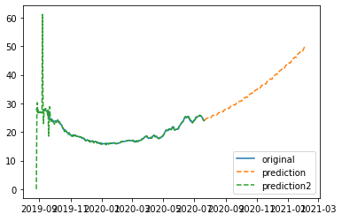
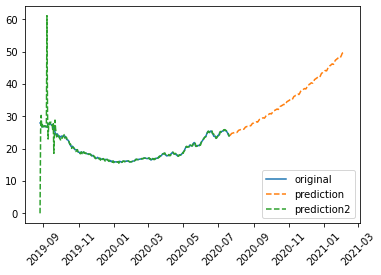
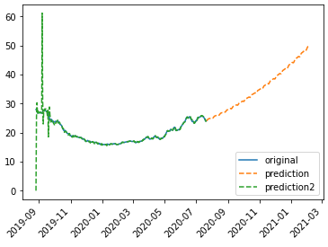
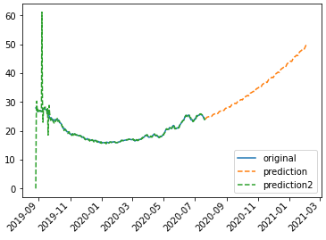
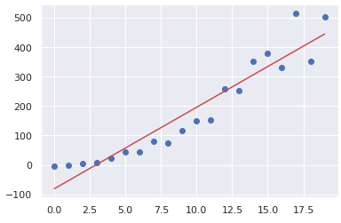
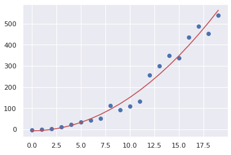
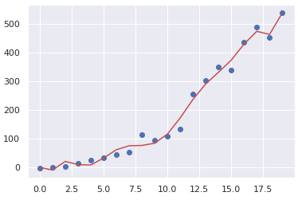
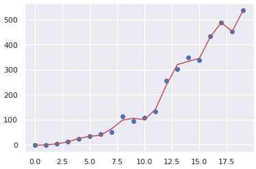

# 100 Days Of Code - 学習ログ

## 2020年10月分

### 1日目: 2020年10月1日（木）

**今日の進捗**: 

JavaScriptでのアップロード機能の実装について。

- JavaScriptでローカルの画像をアップロードし、canvas上に表示するプログラムを作成。HTMLとJavaScriptなので、PlayCode上にて仮実装。
- [参考元URL](https://www.tam-tam.co.jp/tipsnote/javascript/post13538.html)では、画像ファイルであれば受け付けていたが、ここではPNGのみを対象とした。`type.match()`の対象を、`image/png`とするとPNGに限定できる。
- もともとの仕様では画像がアップロードされた場合のみcanvasの更新を行っていたため、対象外のファイルがアップロードされた場合は、過去にアップロードされたデータや子要素が画面に残り続ける。それを解消するため、PNG以外がアップロードされた場合は一度canvasを削除する仕様とした。また、同様にダウンロード用URLが存在する場合は子要素から削除する。

**思ったこと**: 

- PlayCodeは特定のボタンを押すと、ソースのフォーマットを行ってくれる。その際、アロー関数に引数がある場合は**かっこを外す**（引数がない場合はかっこを省略できないので、そのまま残る）。「挙動は一緒なんだから、文字は少ない方がいいでしょ」という判断なのかもしれないが、個人的にはまだアロー関数に慣れてないので、あんまり省略されると混乱する。
- アロー関数ではかっこだけでなく、1行で記述する場合は波かっこまで省略可能なので、ぱっと見の可読性に難があって割と混乱しがち。
- どっちがいいかはともかくとして、「どっちでも読める」程度には慣れたい。

**リンク** 

1. [File APIとCanvasでローカルの画像をアップロード→加工→ダウンロードする](https://www.tam-tam.co.jp/tipsnote/javascript/post13538.html)
1. [ソースのgist](https://gist.github.com/ysko909/0f14a71c5604ded658e3a4f8fb837e6d)

### 2日目: 2020年10月2日（金）

**今日の進捗**: 

Pythonでのnumpy利用時のエラー調査。

- Pythonで`numpy.poly1d()`を使った回帰線の描画がコケた。具体的には、エラーにならず描画されないという感じ。
- 原因は`numpy.poly1d()`で渡したデータ群に欠損値があったこと。欠損値が存在している場合、エラーなどのリアクションをせず、ただ描画しないらしい。
- ちなみに何が欠損していたかというと、標準偏差を格納していた列の値の数データが欠損。理由は、標準偏差を算出する元のデータが1件しか存在しなかったため、「標準偏差を算出できないよ」と欠損していた。
- `dropna(subset=['col_name', 'col_name2'])`で欠損値を削除したデータを、`numpy.poly1d()`に渡して事なきを得た。

**思ったこと**: 

- エラーメッセージなんかのリアクションがないのに、望んだ結果が出力されないってのが一番困る。今回は、`numpy.poly1d()`の結果が`[nan, nan, nan, nan]`になってるのを`print`デバッグして見つけた。今回は手っ取り早く`print`したけど、vscodeのデバッグ機能を使ったデバッグもやっておこう。
- 入力のデータから欠損値を`drop`するのはもちろんありだが、「入力値が有限数か？（無限やNaNではないか）」を確認する方法もある。

```python
>>> import math
>>> hoge = [0, math.inf, 1.1, -0.35323432, -math.inf, float('nan')]
>>> list(map(lambda x: math.isfinite(x), hoge))
[True, False, True, True, False, False]
```

- `math.isfinite()`を利用すると、引数が有理数か否かを判断できる。このとき、`map()`でラムダ式を書き、イテレータの要素すべてに対し処理を行うと、要素が有理数か否かをブール値で返すので、これに基づき処理対象を決める方法もある。

```python
idx = np.isfinite(x) & np.isfinite(y)
ab = np.polyfit(x[idx], y[idx], 1)
```

- 考えてみたら当たり前だが、**標準偏差は算出元のデータが1つしかないなら算出できない**。複数のデータのうち、ばらつきがどれだけあるかを見る数値なのだから、当たり前だなー。

**リンク**

1. [matplotlibで描画した散布図に線形回帰直線を追加する方法](https://ja.stackoverflow.com/questions/38755/matplotlib%E3%81%A7%E6%8F%8F%E7%94%BB%E3%81%97%E3%81%9F%E6%95%A3%E5%B8%83%E5%9B%B3%E3%81%AB%E7%B7%9A%E5%BD%A2%E5%9B%9E%E5%B8%B0%E7%9B%B4%E7%B7%9A%E3%82%92%E8%BF%BD%E5%8A%A0%E3%81%99%E3%82%8B%E6%96%B9%E6%B3%95)
2. [numpy.polyfit doesn't handle NaN values](https://stackoverflow.com/questions/28647172/numpy-polyfit-doesnt-handle-nan-values)

### 3日目: 2020年10月4日（日）

**今日の進捗**: 

JavaScriptで、p5.jsを使ったボタンの生成方法について。

- p5.jsによるボタンの生成。`createButton()`を使うと、動的にボタンを生成できる。

```javascript
let button;

function setup() {
    createCanvas(400, 300);
    button = createButton('hoge');
    background(50);
}

function draw() {

}
```

- 上記のコードでは、実行するとCanvas外にボタンが1つ生成される。なお、これだけだと押してもボタンに挙動が設定されていないため、動作はしない。

```javascript
let button;

const drawRect = () => {
  fill(random(255));
  rect(random() * width, random() * height, random(width), random(height));
}

function setup(){
  createCanvas(400, 300);
  
  button = createButton('draw rectangle');
  button.mousePressed(drawRect);
}

function draw(){
  
}

```

- ボタンに挙動を設定するには、生成したボタンにアクションすべきイベントと挙動を指定する必要がある。上記のコードだと、`button.mousePressed(drawRect);`がその部分に当たる。

```javascript
let buttonDraw, buttonDel;

const drawRect = () => {
  fill(random(255));
  rect(random() * width, random() * height, random(width), random(height));
}

const clearCanvas = () => {
  background(255);
}

function setup(){
  createCanvas(400, 300);
  background(255);
  
  buttonDraw = createButton('draw rectangle');
  buttonDraw.mousePressed(drawRect);
  
  buttonDel = createButton('delete');
  buttonDel.mouseOver(clearCanvas);
}

function draw(){
  
}

```

- ボタンは複数生成が可能で、もちろんそれぞれについてアクションすべきイベントや機能を個別に設定できる。

**思ったこと**: 

- HTMLに書かなくてもJS側で動的に生成できるのは、編集する資産を一本化できるので便利。
- ボタン以外にもスライダーなんかも同じように生成できるので、基本的にJS側でオブジェクトを生成するように記述して、HTMLと往復しなくてもいいようなコーディングスタイルにしよう。

**リンク**

1. [12_1：コントロール要素 Creative Coding p5.js](https://himco.jp/2019/03/25/12_1%EF%BC%9A%E3%82%B3%E3%83%B3%E3%83%88%E3%83%AD%E3%83%BC%E3%83%AB%E8%A6%81%E7%B4%A0-creative-coding-javascrip/)

### 4日目: 2020年10月5日（月）

**今日の進捗**: 

Pythonのソートについてまとめ。

- Pythonでリストをソートする書き方を、DataFrameのソートと混同するのでメモ。

```python
>>> hoge = ['foo', 'bar', 'baz']
>>> sorted(hoge)
['bar', 'baz', 'foo']
>>> hoge
['foo', 'bar', 'baz']
>>> hoge.sort()
>>> hoge
['bar', 'baz', 'foo']
```

- Pythonでリストをソートする場合、`sorted()`と`sort()`の2通りがある。違いは新しいリストを返す（`sorted()`）か、もとのリストを変える（`sort()`）かという点。どちらがいいかは、ケースバイケースだと思う。とりあえず`sorted()`を覚えておけばタプルや文字列にも使える（ただし、リストを返すので変換が必要）から、潰しがきくこっちだろうか。

```python
>>> fuga = 'hogefugapiyo'
>>> sorted(fuga)
['a', 'e', 'f', 'g', 'g', 'h', 'i', 'o', 'o', 'p', 'u', 'y']
>>> ''.join(sorted(fuga))
'aefgghioopuy'
>>> piyo = ('foo', 'bar', 'baz')
>>> sorted(piyo)
['bar', 'baz', 'foo']
>>> tuple(sorted(piyo))
('bar', 'baz', 'foo')
>>> sorted(piyo, reverse=True)
['foo', 'baz', 'bar']
>>> tuple(sorted(piyo, reverse=True))
('foo', 'baz', 'bar')
```

- 文字列に対し`sorted()`を実行すると、リストで結果が返ってくるので`join()`を使って連結する。この際、空文字`''`を使って連結すれば単純な文字列に変換できるし、カンマやハイフンなどで連結することも可能。
- タプルに対し`sorted()`を実行すると、こちらもリストで結果が返ってくるので、`tuple()`を使ってタプルに変換する。
- なお、`sorted()`の引数に`reverse=True`を指定すると降順になる。

ちなみに、DataFrameやSeriesをソートするのは`sort_values()`。`sort_index()`は行や列のインデックスでソートする。

**思ったこと**: 

- こういうメソッドなり関数って、使ってないとどうしてもよく使う方に引っ張られるので気を付けたい。まぁ、この程度のミスなら実行時に「そんなメソッドないよ」ってエラーにしてくれるから、下手に実行されちゃって誤った処理をやっちゃうっていう危険性がないだけいいか。
- `sorted()`は関数なので引数にリストを指定するし、`sort()`は対象のリストに対するメソッドなので`リスト.sort()`の形で記述するから、ここでも差別化はできるかな。関数だから戻り値そのものは元のリストに関係ないし、メソッドだからソート対象のリストを直接変更するよ、と考えればわかりやすいかも。
- 調べりゃ出てくるんだけど、頭の中に入ってるのが一番早いよねぇ、そりゃ。

**リンク**

1. [Pythonでリストをソートするsortとsortedの違い](https://note.nkmk.me/python-list-sort-sorted/)
1. [pandas.DataFrame, Seriesをソートするsort_values, sort_index](https://note.nkmk.me/python-pandas-sort-values-sort-index/)

### 5日目: 2020年10月6日（火）

**今日の進捗**: 

Pythonのミュータブルとイミュータブルについてまとめ。

- Pythonのミュータブルとイミュータブルの違いについて。
  - ミュータブルとは変更が可能なデータ型のことを指す。リスト、タプルなんかが代表例。
  - イミュータブルとは変更が不可能なデータ型のことを指す。int、float、strなどが代表例。
- イミュータブルとは変更不可という意味だが、**変数に対する代入操作で変更不可という意味ではない**ので注意が必要。

```python
>>> a = 1
>>> a = 2
>>> a += 3
>>> a
5
>>> type(a)
<class 'int'>
```

- 上記のように、変数`a`はintなのでイミュータブルであるが、変数に対する操作で格納する値は変更されている。じゃあ何がイミュータブルなんだというと、**同一のidを指し示したままの変更は不可**という意味である。

```python
>>> a = 1
>>> id(a)
139825682166016
>>> a = 2
>>> id(a)
139825682166048
>>> a += 3
>>> a
5
>>> id(a)
139825682166144
>>> type(a)
<class 'int'>
```

- `id()`関数は[オブジェクトの識別子](https://docs.python.org/ja/3/library/functions.html#id)を返す。
- 上記の通り、見た目は変数`a`のみ登場しているのに、その識別子はそれぞれ異なっている。これは、変数`a`がその都度異なるオブジェクトを、その都度参照しているだけであることを示している。

```python
>>> a = 1
>>> b = 2
>>> c = 3
>>> hoge = [a, b, c]
>>> for h in hoge:
...   print(h + 1)
... 
2
3
4
>>> for h in hoge:
...   h = h + 2
...   print(h)
... 
3
4
5
>>> hoge
[1, 2, 3]
>>> a
1
```

- 上記は、イミュータブルなオブジェクトをミュータブルなリストの要素にした。要素に対し加算した場合、出力される結果そのものは加算された結果だが、肝心の要素側に変化はない。
- この加算された結果も新しいオブジェクトとして生成されており、変数`h`はそれらのオブジェクトを順に参照しているだけに過ぎない。よって、`for`のロープが終わったあとで`h`を参照すると、5のオブジェクトを指し示している。
- これらのことから、`for`で利用される変数`h`は新しい変数として作成され、リストの要素を順に参照する。それらの値に何かしらの処理を行った場合、それぞれが新しいオブジェクトとして生成され、そのオブジェクトを変数`h`が参照するような仕組み。
- よって、上記のようなfor文によるリストの各要素への処理を実行した場合、リストの要素そのものが変更されるわけではない。また、各要素を参照した変数（ここで言うと`h`）はループを抜けたあとだと、最後の要素に対する処理を実行した後の値（ここでは3 + 2の処理結果である5）を保持している。

```python
>>> a = 1
>>> b = 2
>>> c = 3
>>> hoge = [a, b, c]
>>> id(hoge)
4432487280
>>> for h in hoge:
...   print('{}: {}'.format(h, id(h)))
... 
1: 4430876432
2: 4430876464
3: 4430876496
>>> for h in hoge:
...   h = h + 2
...   print('{}: {}'.format(h, id(h)))
... 
3: 4430876496
4: 4430876528
5: 4430876560
>>> hoge
[1, 2, 3]
>>> for h in hoge:
...   print('{}: {}'.format(h, id(h)))
... 
1: 4430876432
2: 4430876464
3: 4430876496
>>> d = 4
>>> hoge.append(d)
>>> hoge
[1, 2, 3, 4]
>>> id(hoge)
4432487280
>>> for h in hoge:
...   print('{}: {}'.format(h, id(h)))
... 
1: 4430876432
2: 4430876464
3: 4430876496
4: 4430876528
```

- `id()`関数を使って、リストと要素の識別子を参照してみた。
- 要素に対し加算した場合、加算結果はリスト内の要素とは別のオブジェクトを参照していることが、識別子が異なることからわかる。
- もともとのリストが参照する先は変更されていないため、リストの要素は加算処理の前後で変わらない。
- よって、「リストが持つ要素に変更は加えたくないが、何かしらの処理を要素に対して行いたい」という場合は、上記のコードで実現できる。

```python
>>> fuga = [1, 2, 3]
>>> id(fuga)
4548215664
>>> for f in fuga:
...   print('{}: {}'.format(f, id(f)))
...   f += 2
...   print('{}: {}'.format(f, id(f)))
... 
1: 4546588432
3: 4546588496
2: 4546588464
4: 4546588528
3: 4546588496
5: 4546588560
>>> id(fuga)
4548215664
>>> 
```

- ちなみに、リストの要素に変数ではなく直接int型の値を格納しても、挙動は一緒。
- [このページ](http://pythontutor.com/visualize.html)でPythonを書くと、そのオブジェクトをグラフィカルに表示してくれる。見た目でわかりやすいので、オブジェクト絡みで挙動を見てみたいときは使ってみるといいかもしれない。

**思ったこと**: 

- 理屈は理屈で、やっぱり自分で動作確認のためのコードを書くのが一番の早道だと思う。
- まさに「例示は理解の試金石」ってやつか。

**リンク**

1. [オブジェクト、値、および型](https://docs.python.org/ja/3/reference/datamodel.html)
1. [pythontutor](http://pythontutor.com/visualize.html)

### 6日目: 2020年10月7日（水）

**今日の進捗**: 

Pythonで時系列データのテストデータを作成する方法についてまとめ。

- pandasとnumpyを使って時系列データのテストデータを作る方法。
- `date_range()`を使って月次や日次のデータを作る。そのデータをインデックスにして、DataFrameを生成するとテスト用の時系列データが生成できる。

```python
>>> import pandas as pd
>>> dates = pd.date_range('2020/1/1', '2020/3/31', freq='D')
>>> len(dates)
91
>>> import numpy as np
>>> df = pd.DataFrame(np.arange(len(dates) * 3).reshape(len(dates), 3), columns=['hoge', 'fuga', 'piyo'], index=dates)
>>> df.head()
            hoge  fuga  piyo
2020-01-01     0     1     2
2020-01-02     3     4     5
2020-01-03     6     7     8
2020-01-04     9    10    11
2020-01-05    12    13    14
>>> 
```

- インデックスには、生成した日付の連続値を設定する。項目列側には、`np.arange(len(dates) * 3)`で生成した`91 * 3`個のデータを、各列にそれぞれハマるように`reshape()`して格納する。列名は適当に設定。これだけで、日次のデータ群が生成できる。

```python
>>> pd.date_range('2020/1/1', '2020/1/2', freq='H')
DatetimeIndex(['2020-01-01 00:00:00', '2020-01-01 01:00:00',
               '2020-01-01 02:00:00', '2020-01-01 03:00:00',
               '2020-01-01 04:00:00', '2020-01-01 05:00:00',
               ...
               '2020-01-01 20:00:00', '2020-01-01 21:00:00',
               '2020-01-01 22:00:00', '2020-01-01 23:00:00',
               '2020-01-02 00:00:00'],
              dtype='datetime64[ns]', freq='H')
>>> pd.date_range('2020/1/1 00:00:00', '2020/1/1 01:00:00', freq='min')
DatetimeIndex(['2020-01-01 00:00:00', '2020-01-01 00:01:00',
               '2020-01-01 00:02:00', '2020-01-01 00:03:00',
               '2020-01-01 00:04:00', '2020-01-01 00:05:00',
               '2020-01-01 00:06:00', '2020-01-01 00:07:00',
                ...
               '2020-01-01 00:54:00', '2020-01-01 00:55:00',
               '2020-01-01 00:56:00', '2020-01-01 00:57:00',
               '2020-01-01 00:58:00', '2020-01-01 00:59:00',
               '2020-01-01 01:00:00'],
              dtype='datetime64[ns]', freq='T')
>>> pd.date_range('2020/1/1', '2020/3/31', freq='M')
DatetimeIndex(['2020-01-31', '2020-02-29', '2020-03-31'], dtype='datetime64[ns]', freq='M')
```

- `freq`に指定可能な値はいろいろあるが、注意が必要なのは`M`でこれは**月次**を表す。分ではないので注意。分ごとのデータを生成した場合は、`min`か`T`を指定する。

- ちなみに、上記で使っている`reshape()`は、配列の形状を変更するのに利用する。

```python
>>> np.arange(12)
array([ 0,  1,  2,  3,  4,  5,  6,  7,  8,  9, 10, 11])
>>> np.arange(12).reshape(4, 3)
array([[ 0,  1,  2],
       [ 3,  4,  5],
       [ 6,  7,  8],
       [ 9, 10, 11]])
>>> np.arange(12).reshape(2, 6)
array([[ 0,  1,  2,  3,  4,  5],
       [ 6,  7,  8,  9, 10, 11]])
>>> np.arange(12).reshape(1, 12)
array([[ 0,  1,  2,  3,  4,  5,  6,  7,  8,  9, 10, 11]])
>>> np.arange(12).reshape(12, 1)
array([[ 0],
       [ 1],
       [ 2],
       [ 3],
       [ 4],
       [ 5],
       [ 6],
       [ 7],
       [ 8],
       [ 9],
       [10],
       [11]])
```

- もともとの形状（ここでは1次元の12要素）から変更できるなら、どんな形状にでも変更できる。

```python
>>> np.range(12).reshape(3, 3)
Traceback (most recent call last):
  File "<stdin>", line 1, in <module>
  File "/usr/local/lib/python3.8/site-packages/numpy/__init__.py", line 214, in __getattr__
    raise AttributeError("module {!r} has no attribute "
AttributeError: module 'numpy' has no attribute 'range'
```

- 上記のように、もともとの形状と変更先の形状で要素数が異なる（もともとの要素数は12だが、`reshape()`で指定しているのは`3, 3`の9で一致しない）場合はエラーになる。

**思ったこと**: 

- テストデータが必要なときってちょこちょこあるので、こういうコードはgistなどに上げておいてすぐ利用できるようにしておきたい。
- 分の指定が`M`だと、Month（月）が重複しちゃうってのはわかる。だから`min`があるんだなって理解はとりあえずできるしわかりやすい。それはそうと、`T`って何だろうね。minuteの語尾かな・・・。

**リンク**

1. [pandasの時系列データにおける頻度（引数freq）の指定方法](https://note.nkmk.me/python-pandas-time-series-freq/)
1. [pandas.DataFrameの構造とその作成方法](https://note.nkmk.me/python-pandas-dataframe-values-columns-index/)
1. [pandas で日時の連続値を生成し、インデックスに使う](http://ailaby.com/date_range/)

### 7日目: 2020年10月8日（木）

**今日の進捗**: 

Pythonでランダムな文字列を生成する方法について。

- Pythonでランダムな文字列を生成するプログラム。

```python
import random, string

def get_random_string(length=8, uppercase=True, lowercase=True, digits=True):
    seed_string = ''

    if uppercase:
        seed_string += string.ascii_uppercase
    if lowercase:
        seed_string += string.ascii_lowercase
    if digits:
        seed_string += string.digits
    
    if len(seed_string) > 0:
        result = ''.join([random.choice(seed_string) for i in range(length)])
    else:
        result = ''

    return result
```

- 内容は簡単で、引数により指定された内容で文字列を一度生成して、その文字列から指定された回数分1文字ランダムで抽出する。

```python
>>> import string
>>> string.ascii_lowercase
'abcdefghijklmnopqrstuvwxyz'
>>> string.ascii_uppercase
'ABCDEFGHIJKLMNOPQRSTUVWXYZ'
>>> string.digits
'0123456789'
```

- `string`で始まる部分は、**文字列定数**と呼ばれている定数で、それぞれ大文字や小文字が格納されている。これらの定数を連結して抽出元の文字列を生成している。

```python
>>> get_random_string()
'2TsENwLT'
>>> get_random_string(length=100, uppercase=True, lowercase=False, digits=True)
'0LMQ5Z28CHRQUGYMLHVVQX4VJZFZZXR4OBO13AZNCN6RQ4CTLHGVOS26UH6BKSF5EQ1ZJC6MQDQO53R92JEXSQNLWVMWCUELXQ66'
```

- 実行するときは、引数を一切指定しなければ大文字小文字と数字で8文字分生成する。
- 大文字や小文字、数字の出力を抑制したい場合は`False`を指定すればいい。文字列長はデフォルトでは8文字。
- すべての文字を出力対象にしない場合は、文字列長の長さにかかわらず空文字を返す。

----

昨日の時系列データについて補足。というか機能の追加。

- 時系列データのテストデータ作成時に、各列に格納するデータは適当な値をnumpyで生成していた。が、あれだときっちり比例の関係になってしてしまうため、折れ線グラフなどに利用するには少し味気ない。
- そこで、生成したデータにランダムな値による乗算処理を行って、値に変化をつけることにする。

```python
>>> import pandas as pd
>>> import numpy as np
>>> dates = pd.date_range('2020/1/1', '2020/3/31', freq='D')
>>> COL_NUM = 3
>>> input_data = np.arange(len(dates) * COL_NUM)
>>> import random
>>> input_data = list(map(lambda x: x * round(random.random(), 2), input_data))
>>> df = pd.DataFrame(np.array(input_data).reshape(len(dates), COL_NUM), index=dates, columns=['foo', 'bar', 'baz'])
>>> df.head()
             foo    bar    baz
2020-01-01  0.00   0.87   0.38
2020-01-02  1.08   2.68   1.75
2020-01-03  0.96   3.15   4.24
2020-01-04  2.88   9.80   7.92
2020-01-05  2.52  12.74  12.46
>>> 
```

- `map()`関数で指定したリストの要素xに対し、`x * round(random.random(), 2)`という乗算処理を行う。この処理はすべての要素それぞれで`random.random()`が実行されるため、要素それぞれに乗算される値はすべて異なる。

```python
>>> np.array([1, 1, 1]) * round(random.random(), 2)
array([0.16, 0.16, 0.16])
```

- なお、numpy.ndarray形式の配列に乗算処理をする場合は、すべての要素に**同一の値**で乗算される。毎回異なる値を乗算したい場合、この計算方法は使えない。逆に同じ値で計算したい場合は、見た目にもわかりやすいこの方法がオススメ。

```python
>>> list(map(lambda x: x * round(random.random(), 2), [1, 1, 1]))
[0.53, 0.1, 0.05]
>>> list(map(lambda x: x * round(random.random(), 2), np.array([1, 1, 1])))
[0.3, 0.17, 0.27]
>>> map(lambda x: x * round(random.random(), 2), [1, 1, 1])
<map object at 0x7f2a2c4152b0>
```

- 異なる値で計算したい場合は、前述のように`map()`関数を使うことになる。この場合はnumpy.ndarrayであるかリストであるかは関係なく、同じ挙動をする。
- なお、`map()`関数の戻り値はリストなどではなく[mapオブジェクト](https://note.nkmk.me/python-map-list-iterator/)というもの。イテレータなのでfor文などで利用できるが、リストと異なりそれ単体で内容を確認できるものではない。よって、上記の例では`list()`を使ってリストに変換している。

```python
>>> [1, 2, 3] * 3
[1, 2, 3, 1, 2, 3, 1, 2, 3]
```

- ちなみに、リストに対し直接乗算処理を行うと**要素数が増える**。要素に対し計算処理が実行されるわけではないので、注意が必要。

**思ったこと**: 

- 「こういうツールとか関数欲しいなー」と思ったときに、パッと作れるくらいには慣れよう。
- 文字列定数があるおかげで、わざわざ自分で抽出元の文字列を書かなくていいのは楽。
- `random.random()`は、テストデータなんだけど「実データっぽい値」にする場合に利用する。ただし、利用するなら`import random`が必要になるので忘れないように。

**リンク**

1. [pythonでランダム文字列の生成](https://hacknote.jp/archives/52068/)
1. [string --- 一般的な文字列操作](https://docs.python.org/ja/3/library/string.html)
1. [NumPy配列ndarrayとPython標準のリストを相互に変換](https://note.nkmk.me/python-numpy-list/)
1. [Python3のmapはリストではなくイテレータを返す](https://note.nkmk.me/python-map-list-iterator/)


### 8日目: 2020年10月9日（金）

**今日の進捗**: 

リスト内包表記の記述方法についてまとめ。

```python
[変数に行う処理 for 変数 in リストなどのイテレータ]
```

- リスト内包表記は、何かしらの処理を実行しつつ新しいリストを生成した場合に用いる。

```python
>>> [i * 3 for i in range(1, 5)]
[3, 6, 9, 12]
>>> hoge = []
>>> for i in range(1, 5):
...   hoge.append(i * 3)
... 
>>> hoge
[3, 6, 9, 12]
```

- 例として、3の倍数でリストを作成する方法を考えると上記のように記述できる。ループのもとになるイテレータは既存のものでもいいし、`range()`で生成したものでもいい。
- `append()`を利用して要素を追加する方法より、記述量が少なくて可読性がよい。表記方法も、角かっこで囲ってあって「リストが出力される」と直感的に理解しやすい。ループ部分もまんまfor文なので、こちらも理解しやすい。

```python
>>> hoge = 'foobarbaz'
>>> hoge.count('o')
2
>>> [hoge.count(s) for s in ['o', 'ba', 'oo']]
[2, 2, 1]
```

- 次の例は、ある文字列において含まれているであろう文字をリストにして、それぞれがいくつ含まれているか個数をリストで返すコード。
- `string.count()`は引数に指定された文字や文字列が、元の文字列の中で何回出現するかをカウントするメソッド。

```python
[変数に行う処理 for 変数 in イテレータ if 条件式]
```

- 処理を行う要素について任意の条件を付与したい場合は、上記のようなifがついかリスト内包表記を用いる。

```python
>>> [i ** 2 for i in range(10) if i % 2 == 0]
[0, 4, 16, 36, 64]
```

- 例として、偶数のみ2乗するリスト内包表記を書いてみた。要素のうち、2の余剰がゼロになる（偶数）という条件が成立する要素のみ対象とする、という条件を`if`部分に記述することで、処理対象の要素を限定できる。

**思ったこと**: 

- リスト内包表記はチューリング完全らしいので、やる気になればワンライナーでいろいろ（LISP実装まで）できるらしいが、いくらなんでも可読性がアレ過ぎるので用法用量を守って正しくお使いください案件。

**リンク**

1. [Pythonリスト内包表記の使い方](https://note.nkmk.me/python-list-comprehension/)
1. [リスト内包表記の活用と悪用](https://qiita.com/KTakahiro1729/items/c9cb757473de50652374)

### 9日目: 2020年10月10日（土）

**今日の進捗**: 

Pythonでpandas.DataFrameに対し統計量を取得する`describe()`を実行するときの注意点について。

- ゼロを含んだDataFrameで`describe()`を実行したい場合、**ケースによっては**一度ゼロを除外する方がいい。
- ゼロが意味を持つデータならいいが、意味を持たない（欠損値と変わらない）ようなデータの場合、ゼロを含んだ状態で統計量を出すと、本来の意味とは異なる統計量が出てきてしまう。とくに最小値が必ずゼロになってしまうため、標準偏差もゼロを含んだ場合と含まない場合で差が出てくる。

```python
df.describe()
df[df > 0.0].describe()
```

- `df`がゼロを含むデータであった場合、1行目と2行目の結果は異なる。
- `df[df > 0.0]`の場合、ゼロはデータとして抽出されないためNaNになる。`describe()`は**NaNを無視する**ため、2行目は1行目のゼロを含んだ結果と異なる結果を出力する。

----

Pythonでラムダ式に複数の引数を設定する方法について。

- 単純に引数設定の際に複数の設定を記述すればいい。
- `def`による関数宣言を同様に、引数の初期設定が可能。

```python
>>> hoge = lambda a, b=2: a * b
>>> hoge(1)
2
>>> hoge(1, 3)
3
>>> hoge()
Traceback (most recent call last):
  File "<stdin>", line 1, in <module>
TypeError: <lambda>() missing 1 required positional argument: 'a'
>>> hoge(b=100, a=4)
400
>>> 
```

- 上記の場合、引数bに2が初期設定されているため、引数aだけ指定してやれば実行可能。引数が指定されなければエラーになるのも、`def`による関数宣言と同じ。

----

p5.jsの勉強。

なお、p5.jsの環境はCodepenでp5.jsのライブラリを参照する設定すればいい。

- p5.jsの基本中の基本。

```javascript
const W = 800;
const H = 600;

function setup(){
  createCanvas(W, H);
  
  background(255);
}

function draw(){
  ellipse(60, 60, width / 10, height / 10);
}
```

- p5.jsは`setup()`が1度だけ実行され、次に`draw()`が繰り返し実行されるという状態の遷移で動作する。
- `setup()`はその名前の通り、初期設定などで用いる。そして`setup()`内で宣言された変数は、他の関数からはアクセスできないとある。まぁ、少なくとも`let`とか使ってればJSの仕様上大丈夫だろう。
- `draw()`は自動的に繰り返し実行される。初期設定以外の実際の描画処理はこの関数の中に記述する。
- 上記の場合、`setup()`でCanvasが生成される。Canvasのサイズは`const`で宣言した。その後、Canvasを指定した背景色で塗りつぶす。0が真っ黒、255が真っ白。要は色指定でよくある、RGBの値で指定すればいい。
- `background()`は背景に利用する色を設定する。デフォルトは**透明**。
- 実際の描画処理は`draw()`で実行される。ここでは`ellipse()`を実行して円を描画している。
- `ellipse(x座標, y座標, 横幅, 高さ)`で描画する円を設定する。
- `draw()`関数の中で`width`と記述すると、Canvasの横のサイズを取得できる。同様に`height`と記述すると、Canvasの高さを取得できる。ここでは取得した縦横の10分の1のサイズの楕円を描画した。
- 上記のコードで一応簡単だがp5.jsの挙動がわかると思う。ただし、現状のコードでは**ちょっとした問題がある**。

```javascript
const W = 800;
const H = 600;
let position = 0;

function setup(){
  createCanvas(W, H);
  
  background(255);
}

function draw(){
  
  ellipse(60 + position, 60 + position, width / 10, height / 10);
  
  position += 2;
}
```

- 今度のコードは、楕円を描画する位置を少しずつズラしている。
- 実行してみるとわかるが、**1度描画された楕円がその後もCanvas上に残り続ける**。これが目的の描画なら問題ないが、「楕円が斜めに**移動する**」挙動を実現したい場合は、過去に描画されたシェイプは残らない方が望ましい。その仕様を満たすには、**Canvasの内容をクリア**する必要がある。

```javascript
const W = 800;
const H = 600;
let position = 0;

function setup(){
  createCanvas(W, H);
}

function draw(){
  background(255);
  
  ellipse(60 + position, 60 + position, width / 10, height / 10);
  
  position += 2;
}
```

- 背景色を設定する`background()`関数を、`setup()`関数から`draw()`関数の冒頭に移動した。これにより、`draw()`関数が実行されると、まず最初に**Canvasの内容が設定された色でリセットされる**。その後、楕円が描画される。この挙動により、楕円が斜めに移動しているように見える。
- `background()`関数は多くの場合、`draw()`関数の冒頭でCanvasの内容をリセットするのに用いられる。`setup()`関数内で利用される場合は、背景色の設定が1度でいいか、アニメーションの開始フレームの背景色を設定する場合に利用される。
- デフォルトのカラー空間は、各値が0から255の範囲のRGB。HSLでも指定が可能らしい。
- 第2引数はアルファ値で、省略可能。アルファの範囲はデフォルトで0から255。

----

マウスに追随するシェイプをp5.jsで実装する。

```javascript
const W = 800;
const H = 600;

function setup(){
  createCanvas(W, H);
}

function draw(){
  ellipse(mouseX, mouseY, width / 10, height / 10);  
}
```

- マウスカーソルを適当に動かすと、カーソルに合わせて楕円が描画される。ゴリゴリ動かすとどんどん楕円が描画される。
- `mouseX`と`mouseY`でマウスカーソルのX座標とY座標を取得できる。PCのマウス入力でなくスマートフォンなどのタッチ入力である場合は、**直近にタッチされた位置のX座標およびY座標を保持**する。

```javascript
  console.log('mouseX: ' + mouseX);
  console.log('mouseY: ' + mouseY);
```

- 上記のコードを記述することで、`mouseX`と`mouseY`の座標を出力できる。見るとわかるが、Canvasの左上を`(0, 0)`とした値で出力される。
- `draw()`関数内に`background()`がないので、シェイプが残り続けるのはさっきと同様。

```javascript
const W = 800;
const H = 600;

function setup(){
  createCanvas(W, H);
}

function draw(){
  if (mouseIsPressed) {
    fill(0);
  }
  else{
    fill(255);
  }
  
  ellipse(mouseX, mouseY, width / 10, height / 10);
  
}
```

- マウスがクリックされているか否かを判断するのは、`mouseIsPressed`を参照する。Trueであればクリック状態にある。
- `fill()`関数はシェイプの塗りつぶす色を設定する。1度設定すると、以降に描画されるすべてのシェイプに影響する。色の設定はデフォルトのカラー空間だと、0から255の範囲のRGB。引数1つで設定する場合はグレースケールになる。
- グレースケール指定の第2引数、カラー設定の第4引数はアルファ値で省略可能。アルファの範囲も、他と同様デフォルトで0から255。

**思ったこと**: 

- 統計量算出において、ゼロに意味がある場合とない場合で、出力結果が意味するところが変わってくる。算出前にデータ内容を確認して「ゼロを含むことに意味があるか、またはないか」を考慮することが必要。
- p5.jsおもしろいなー。とりあえずマウスに追随してシェイプを描画するのくらいはやってみたい・・・と思ってやってみたけど、これだけのコード量でこれができるのは楽でおもしおい。

**リンク**

1. [pandasのdescribeで各列の要約統計量（平均、標準偏差など）を取得](https://note.nkmk.me/python-pandas-describe/)
1. [Pythonのlambda（ラムダ式、無名関数）の使い方](https://note.nkmk.me/python-lambda-usage/)
1. [p5.js Get Started](https://p5js.org/get-started/)
1. [p5.js スピード入門](https://himco.jp/category/p5-js-%e3%82%b9%e3%83%94%e3%83%bc%e3%83%89-%e5%85%a5%e9%96%80/)

### 10日目: 2020年10月11日（日）

**今日の進捗**: 

Pythonでラムダ式を書く際の注意点について。

- ラムダ式を記述する際、任意の名前を付けるのはPEP8的にご法度なので、PEP8に準拠したLintではエラーになる。

```python
>>> tetens = lambda x: 6.11 * (10 ** (7.5 * x / (x + 237.3)))
>>> tetens(20)
23.389356843099335
```

- ここではラムダ式に`tetens`という名前をつけ、実行する際も`tetens(引数)`という記述方法で実行している。PEP8からすると、この書き方をするくらいなら「`def`で関数宣言しろよ」ということらしい。まぁ気持ちはわかる。

----

p5.jsでのシェイプ描画処理について。

- 線の描画は`line()`関数を利用する。

```javascript
W = 800;
H = 600;

function setup(){
  createCanvas(W, H);
}

function draw(){
  background(255);
  
  line(20, 20, 100, 100);
  line(110, 110, 200, 200);
  
}
```

- `line()`関数は引数に「始点のX座標、始点のY座標、終点のX座標、終点のY座標」を指定する。
- `strokeWeight()`で任意の数字を指定することで、描画する線の太さを指定できる。デフォルトの太さは1。

```javascript
  line(20, 20, 100, 100);
  strokeWeight(10);
  line(110, 110, 200, 200);
```

- 線の太さ設定は`strokeWeight()`で数字を指定すればいいが、上記のような書き方をすると最初の`line()`関数で描画した線も含めて**すべてのシェイプが太さ10に設定されてしまう**。

```javascript
  strokeWeight(1);
  line(20, 20, 100, 100);
  strokeWeight(10);
  line(110, 110, 200, 200);
```

- 各シェイプで異なる太さを設定したい場合は、**シェイプ描画の直前で太さを明記しておく**（たとえデフォルトの1であっても）ことが重要。

----

- 四角の描画は`quad()`関数を利用する。ここで言う「四角」とは正方形や長方形とは異なり、角の部分は直角じゃなくても構わない。なお、これ以降は`setup()`関数や`draw()`関数の一部を省略する（線の描画のときと同じコードなので）。

```javascript
  fill(255, 0, 0);
  strokeWeight(2);
  quad(200, 20, 300, 30, 310, 100, 210, 110);
```

- `quad()`関数は「x1, y1, x2, y2, x3, y3, x4, y4」でそれぞれ座標を指定する。
- 指定された極座標で四角を描画するため、指定の座標によってはひねったような形の四角（三角を2つ並べたような形）を描画することも可能。

----

- 三角の描画は`triangle()`関数を利用する。

```javascript
//draw triangle
  fill(0, 255, 0);
  triangle(380, 20, 440, 100, 320, 100);
```

- `triangle()`関数は「x1, y1, x2, y2, x3, y3」で座標を指定する。

----

- 長方形の描画は`rect()`関数を利用する。

```javascript
  fill(0, 0, 255);
  rect(460, 20, 100, 100);
  
  fill(20, 200, 100);
  rect(610, 20, 100, 100, 15);
```

- `rect()`関数は他のシェイプを描画する関数と異なっていて、引数が「左上のx座標、左上のy座標、幅、高さ」になっている。角の座標を個別に指定しなくていいので、単純に正方形または長方形を描画するなら`rect()`関数を利用したほうが楽。
- 第5引数以降は、角に丸みをつけるのに利用する。左上、右上、右下、左下の順でそれぞれの角の丸みを指定できる。途中で省略した場合は、直前で指定された値を引き継ぐ。上記の例だと、左上の丸みを15に指定しているので、他の角も同様に15で指定したことになる。

**思ったこと**: 

- Lintではエラーになるものの、インタプリタ形式で記述する際は簡単な関数ならむしろ`def`を書きたくないので、名前のついたラムダ式は割と便利な印象がある。まぁ動作の確認するのにちょっとだけ利用するってならいいかもしれないけど、ちゃんと書かなきゃいけないような場合はやめようね、という話。
- まぁ大抵の場合はLintにしたがっておけばいいよね、という気がしている。
- p5.jsに限らず、実際にシェイプを描画する場合は三角や四角よりは曲線だったりノイズだったりと、より複雑なシェイプを描画しがちだしその方が見た目はいいのだけど、やっぱり基本は抑えておくべきだよね、ってことでしっかり覚えよう。
- ただし、任意の座標で四角を描画する`quad()`関数は、「単純になんでもいいからシェイプを描画したい」場合には不適。それぞれの角を毎回指定しないといけない（まぁ何かしらの計算結果を渡せばいいかもしれないが）ので、「とりあえず」のニーズに対応するなら「左上と幅・高さの指定だけでいい」`rect()`関数の方が楽、ということになる。

**リンク**

1. [Pythonのlambda（ラムダ式、無名関数）の使い方](https://note.nkmk.me/python-lambda-usage/)
1. [2_3：p5.js 線、四角形、三角形、長方形を描く](https://himco.jp/2019/02/08/2_3%ef%bc%9ap5-js-%e7%b7%9a%e3%80%81%e5%9b%9b%e8%a7%92%e5%bd%a2%e3%80%81%e4%b8%89%e8%a7%92%e5%bd%a2%e3%80%81%e9%95%b7%e6%96%b9%e5%bd%a2%e3%82%92%e6%8f%8f%e3%81%8f/)

### 11日目: 2020年10月12日（月）

**今日の進捗**: 

pandasのDataFrameで、既存列の値を利用して新しい列を新規追加する方法について。

- DataFrameの既存列に格納されている値を使用して、何らかの計算を行って結果を新しい列に格納したい。その場合は、`DataFrame.apply()`を使ってラムダ式を`axis=1`のオプションとともに実行することで実現できる。

```python
>>> import pandas as pd
>>> import numpy as np
>>> import random
>>> input_data = np.arange(30)
>>> input_data = map(lambda x: x * round(random.random(), 1), input_data)
>>> input_data = list(input_data)
>>> len(input_data)
30
>>> df = pd.DataFrame(np.array(input_data).reshape(10, 3), columns=['foo', 'bar', 'baz'])
>>> df.head()
   foo  bar  baz
0  0.0  0.9  1.6
1  2.1  3.6  2.0
2  5.4  0.0  0.8
3  2.7  9.0  6.6
4  1.2  3.9  9.8
>>> df['hoge'] = df.apply(lambda x: x['foo'] + x['bar'] + x['baz'], axis=1)
>>> df.head()
   foo  bar  baz  hoge
0  0.0  0.9  1.6   2.5
1  2.1  3.6  2.0   7.7
2  5.4  0.0  0.8   6.2
3  2.7  9.0  6.6  18.3
4  1.2  3.9  9.8  14.9
```

- テストデータは、numpyとrandomを使って任意の値を用意する。
- `df.apply(lambda x: x['foo'] + x['bar'] + x['baz'], axis=1)`とすることで、既存列（`axis=1`のオプションで、処理対象が行であると指定している。指定しないか、`axis=0`の場合は列が対象になる）の値を使って、ラムダ式に記述した処理を**全行に対し**行う、という意味になる。
- つまり、ラムダ式の引数xには**各行が1つずつ入力**され、各行の項目列である**fooとbarとbazの値を加算しろ**、という処理になる。
- この結果はSeries形式で返ってくるので、任意の名前を付けて新規列として既存のDataFrameに追加が可能。

```python
>>> df.apply(lambda x: max(x))
foo     27.0
bar     17.6
baz     20.8
hoge    47.7
dtype: float64
```

- ちなみに`axis=1`を指定しない場合は、処理の対象が列になる。つまり、ラムダ式の引数xに**各列が1つずつ入力**される。ここの挙動が上記と異なるところ。
- 上記では`max()`を使って、各列における最大値を取得している。処理対象を列であるため、各列における最大値が出力されている。

----

matplotlibで描画したグラフに、補助線を追加する方法について。

- matplotlibで描画したグラフに、説明のためなどで補助線を描画したい場合は、水平線なら`hlines()`、垂直線なら`vlines()`を利用する。

```python
sns.lineplot(x=df.index, y=sensor_df['saturation'])
plt.hlines(y=3, xmin=df.index[0], xmax=df.index[-1], linestyles='--', colors='red')
plt.hlines(y=6, xmin=df.index[0], xmax=df.index[-1], linestyles='--', colors='red')
plt.show()
```

- もちろん、複数の線を出力することも可能。単純に描画したい数だけ、コードを書いてやればいい。

----

matplotlibで描画したグラフのX軸とY軸の幅を調査する方法について。

- matplotlibでグラフを描画した際、グラフのX軸とY軸がそれぞれどのくらいのレンジ（幅）で描画されているかを調べたい場合は、`xlim()`と`ylim()`を実行する。

```python
sns.lineplot(x=df.index, y=df['hoge'])
print(plt.xlim())
print(plt.ylim())
plt.show()
```

```console
(18107.05, 18479.95)
(1.0695084678691622, 12.550942168141958)
```

- グラフを描画する際、とくに指定しなければmatplotlibが自動で、指定されたデータの最大値および最小値が十分に収まるような、適当な幅をX軸とY軸に設定しグラフを出力する。
- この際、X軸とY軸の出力幅を変えたければ`xlim(x軸の最小値, x軸の最大値)`や`ylim(y軸の最小値, y軸の最大値)`といった指定を行う。
- ところが、日付などを出力の軸にしていえる場合、その最大値や最小値の具体的な数値がわからない場合がある。データ上の最大値や最小値を参照してもよいが、たとえば「出力したグラフに補助線を引きたい」という場合、補助線を引きたい座標の**具体的な数値**を指定しなければならない。日付はあくまでも**見た目のラベルであって座標ではない**ので、日付指定による補助線の座標指定はできない。
- その場合、描画されているグラフのX軸とY軸の最大値と最小値の具体的な数値を取得し、その数字に則って座標を決めることで補助線の座標を指定できる。

```python
import matplotlib.patches as patches

sns.lineplot(x=df.index, y=df['hoge'])
e = patches.Rectangle(xy=(18105, 3) , width=18470, height=3, ec='#523245', fill=True, alpha=0.3, color='r')
ax = plt.axes()
ax.add_patch(e)
plt.show()
```

- 上記では、取得した座標に則って四角を`Rectangle()`関数で描画し、グラフに出力している。

**思ったこと**: 

- 特徴量エンジニアリングなどで、既存列の値を用いて何かしらの処理を行い新規列を作成するのはよくやる手法なので覚えておきたい。
- `axis`の指定はいつもどっちがどっちだっけ、となりがち。大抵の場合デフォルトは`axis=0`で、**各列に対し処理を行う**。特徴量エンジニアリングは行ごとに一定の処理を行うので、`axis=1`を指定して**各行に対し処理を行う**。
- ちなみに長方形以外のシェイプも描画することも可能。グラフ上のある領域について塗りつぶしたい場合や一部分を強調したい場合などは、利用するといいかもしれない。

- 上記とは関係ないが、jupyter notebookをHTML化するとグラフがSVG化される。これをPNGか適当な画像ファイルにして、ダウンロードできないものか。

**リンク**

1. [pandas.DataFrame.apply](https://pandas.pydata.org/pandas-docs/stable/reference/api/pandas.DataFrame.apply.html)
1. [Pandasで複数の列を値をもとに、新しい列を任意の関数で定義する方法](https://blog.shikoan.com/pandas-newcolumn-lambda/)
1. [Matplotlib で水平線と垂直線をプロットする方法](https://www.delftstack.com/ja/howto/matplotlib/how-to-plot-horizontal-and-vertical-line-in-matplotlib/)
1. [Matplotlibで円や長方形などの図形を描画](https://note.nkmk.me/python-matplotlib-patches-circle-rectangle/)

### 12日目: 2020年10月13日（火）

**今日の進捗**: 


- Party Parrotって言うのか、[お前](https://cultofthepartyparrot.com/)。そしてGitHubにリポジトリまであるのか、[お前](https://github.com/jmhobbs/cultofthepartyparrot.com)。

----

pandasl.DataFrameで差分を取る方法について。

- DataFrameのデータにおいて、データ間の差分を取得したい場合は`diff()`を使う。

```python
>>> quit()
root@25d8182164be:/workspaces/env_2020# python
Python 3.8.5 (default, Aug  4 2020, 16:24:08) 
[GCC 8.3.0] on linux
Type "help", "copyright", "credits" or "license" for more information.
>>> import pandas as pd
>>> import io
>>> s = '''a,b,c
... 1,2,3
... 1,3,5
... 3,6,9
... 9,8,7
... 10,0,1
... '''
>>> df = pd.read_csv(io.StringIO(s))
>>> df
    a  b  c
0   1  2  3
1   1  3  5
2   3  6  9
3   9  8  7
4  10  0  1
>>> df.diff()
     a    b    c
0  NaN  NaN  NaN
1  0.0  1.0  2.0
2  2.0  3.0  4.0
3  6.0  2.0 -2.0
4  1.0 -8.0 -6.0
```

- 引数なしでは、行ごとに「1行前のデータと比較して、差分を各項目列ごとに取得」する。結果の1行目は全項目がNaNになっているが、これは「0行目との比較はできない」ため。

```python
>>> df.diff(2)
     a    b    c
0  NaN  NaN  NaN
1  NaN  NaN  NaN
2  2.0  4.0  6.0
3  8.0  5.0  2.0
4  7.0 -6.0 -8.0
>>> df.diff(3)
     a    b    c
0  NaN  NaN  NaN
1  NaN  NaN  NaN
2  NaN  NaN  NaN
3  8.0  6.0  4.0
4  9.0 -3.0 -4.0
>>> df.diff(-2)
     a    b    c
0 -2.0 -4.0 -6.0
1 -8.0 -5.0 -2.0
2 -7.0  6.0  8.0
3  NaN  NaN  NaN
4  NaN  NaN  NaN
>>> df.diff(-1)
     a    b    c
0  0.0 -1.0 -2.0
1 -2.0 -3.0 -4.0
2 -6.0 -2.0  2.0
3 -1.0  8.0  6.0
4  NaN  NaN  NaN
```

- 引数`periods`を指定すると、何行前のデータと差分を取るか指定できる。`2`であれば、2行前のデータを差分を取る。デフォルトでは1行前と差分を取る。

```python
>>> df.diff(axis=1)
    a     b    c
0 NaN   1.0  1.0
1 NaN   2.0  2.0
2 NaN   3.0  3.0
3 NaN  -1.0 -1.0
4 NaN -10.0  1.0
>>> df.diff(axis=0)
     a    b    c
0  NaN  NaN  NaN
1  0.0  1.0  2.0
2  2.0  3.0  4.0
3  6.0  2.0 -2.0
4  1.0 -8.0 -6.0
```
- 引数`axis`を指定すると、差分を取る方向を指定できる。デフォルトは0で、行方向に差分を取る。`axis=1`とすると、列方向に差分を取る。

- 変化率を取得したい場合は`pct_change()`を使う。

```python
>>> df.pct_change()
          a         b         c
0       NaN       NaN       NaN
1  0.000000  0.500000  0.666667
2  2.000000  1.000000  0.800000
3  2.000000  0.333333 -0.222222
4  0.111111 -1.000000 -0.857143
```

- `diff()`とは異なるのは出力が差分ではなく変化率である点だけで、使い方は`diff()`と一緒。

```python
>>> df.pct_change(2)
          a         b         c
0       NaN       NaN       NaN
1       NaN       NaN       NaN
2  2.000000  2.000000  2.000000
3  8.000000  1.666667  0.400000
4  2.333333 -1.000000 -0.888889
>>> df.pct_change(-1)
          a         b         c
0  0.000000 -0.333333 -0.400000
1 -0.666667 -0.500000 -0.444444
2 -0.666667 -0.250000  0.285714
3 -0.100000       inf  6.000000
4       NaN       NaN       NaN
```

- 引数`periods`の設定方法も一緒。マイナスが利用できるところも同じ。

```python
>>> df.pct_change(axis=1)
    a         b         c
0 NaN  1.000000  0.500000
1 NaN  2.000000  0.666667
2 NaN  1.000000  0.500000
3 NaN -0.111111 -0.125000
4 NaN -1.000000       inf
>>> df.pct_change(axis=0)
          a         b         c
0       NaN       NaN       NaN
1  0.000000  0.500000  0.666667
2  2.000000  1.000000  0.800000
3  2.000000  0.333333 -0.222222
4  0.111111 -1.000000 -0.857143
```

- 引数`axis`の設定方法も一緒。

**思ったこと**: 

- Party Parrot、何かに使いたい（何
- データの差分を取る機能って、案外使うシチュエーションがなかったりするので、使わないと忘れそう。データ的に使えそうなら積極的に使ってみよう。時系列データなんかは、逆にこれ使うの前提になるんじゃない？

**リンク**

1. [Clut of the Party Parrot](https://cultofthepartyparrot.com/)
1. [pandasで行・列の差分・変化率を取得するdiff, pct_change](https://note.nkmk.me/python-pandas-diff-pct-change/)

### 13日目: 2020年10月14日（水）

**今日の進捗**: 

pandas.DataFrameにおける欠損値の除去方法について。

- DataFrameの欠損値を含む行を削除する場合は`dropna()`を利用する。

```python
>>> import pandas as pd
>>> import io
>>> s = '''a,b,c
... 1,,3
... 4,5,6
... 7,8,
... ,,
... ,14,15
... '''
>>> df = pd.read_csv(io.StringIO(s))
>>> df
     a     b     c
0  1.0   NaN   3.0
1  4.0   5.0   6.0
2  7.0   8.0   NaN
3  NaN   NaN   NaN
4  NaN  14.0  15.0
>>> df.dropna()
     a    b    c
1  4.0  5.0  6.0
```

- 引数なしで実行した場合は、欠損値を1つでも含む行すべてを削除する。

```python
>>> df.dropna(how='all')
     a     b     c
0  1.0   NaN   3.0
1  4.0   5.0   6.0
2  7.0   8.0   NaN
4  NaN  14.0  15.0
```

- 引数`how`にallを指定した場合は、項目列すべてが欠損している行を削除する。

```python
>>> df.dropna(how='any')
     a    b    c
1  4.0  5.0  6.0
```

- 引数`how`に`any`を指定した場合は、欠損値を1つ以上含む行すべてを削除する。引数なしの場合と同じ挙動。

```python
>>> df.dropna(subset=['b'])
     a     b     c
1  4.0   5.0   6.0
2  7.0   8.0   NaN
4  NaN  14.0  15.0
>>> df.dropna(subset=['a', 'b'])
     a    b    c
1  4.0  5.0  6.0
2  7.0  8.0  NaN
>>> df.dropna(subset=['a', 'b'], how='all')
     a     b     c
0  1.0   NaN   3.0
1  4.0   5.0   6.0
2  7.0   8.0   NaN
4  NaN  14.0  15.0
>>> 
```

- 特定の項目列を対象として欠損値の有無を判断した場合は、引数`subset`に項目名をリスト形式で指定する。この場合、指定された列の**いずれかに欠損値が含まれている**行を削除する。
- 引数`subset`は引数`how`と両立でき、`subset`で項目列を指定しつつ`how`でallを指定すると指定された列の**すべてに欠損値が含まれている**行を削除する。

----

p5.jsのシステム変数について。

- システム変数とは、ここでは「p5.jsが独自かつ自動的に値を設定・保持する変数」のことを指す。システム変数と同じ名前の変数をプログラマーが作成してはいけない。

```javascript
const W = 800;
const H = 600;

function setup(){
  createCanvas(W, H);
}

function draw(){
  background(255);
  
  const TEXT_SIZE = 30;
  textSize(TEXT_SIZE);
  fill(0);
  text('width: ' + width, 10, TEXT_SIZE);
  text('height: ' + height, 10, TEXT_SIZE * 2);
  text('mouseX: ' + mouseX, 10, TEXT_SIZE * 3);
  text('mouseY: ' + mouseY, 10, TEXT_SIZE * 4);
  text('frameCount: ' + frameCount, 10, TEXT_SIZE * 5);
  text('deltaTime: ' + deltaTime, 10, TEXT_SIZE * 6);
  text('focused: ' + focused, 10, TEXT_SIZE * 7);
  text('windowWidth: ' + windowWidth, 10, TEXT_SIZE * 8);
  text('windowHeight: ' + windowHeight, 10, TEXT_SIZE * 9);
  text('getURL(): ' + getURL(), 10, TEXT_SIZE * 10);
  text('movedX: ' + movedX, 10, TEXT_SIZE * 11);
  text('movedY: ' + movedY, 10, TEXT_SIZE * 12);
  text('mosueButton: ' + mouseButton, 10, TEXT_SIZE * 13);
  text('mouseIsPressed: ' + mouseIsPressed, 10, TEXT_SIZE * 14);
  text('touched: ' + touches, 10, TEXT_SIZE * 15);
  
    
}
```

- `width`：Canvasの幅。`createCanvas()`で指定した幅が格納され、デフォルトは100。
- `height`：Canvasの高さ。`createCanvas()`で指定した高さが格納され、デフォルトは100。
- `mouseX`：マウスカーソルの水平方向の座標。
- `mouseY`：マウスカーソルの垂直方向の座標。
- `frameCount`：プログラム開始以降、表示されたフレームの数が格納される。FPSが高いほど、早く増加する。
- `deltaTime`：n番目のフレームとn+1番目のフレームの間の時間差が、ミリ秒単位で格納されている。
- `forcusd`：p5.jsの動作しているウィンドウがアクティブかどうか。
- `windowWidth`：p5.jsが動作しているウィンドウ自体の幅。Canvasのサイズとは別。
- `windowHeight`：p5.jsが動作しているウィンドウ自体の高さ。Canvasのサイズとは別。
- `getURL`：p5.jsが動作しているURLを取得する。これは正確に言うとシステム変数ではなく関数。
- `movedX`：マウスカーソルが移動したとき、水平方向の移動量を出力する。移動していなければ0。
- `movedY`：マウスカーソルが移動したとき、垂直方向の移動量を出力する。移動していなければ0。
- `mouseButton`：マウスのボタンが押されたとき、LEFT・CENTER・RIGHTのいずれかを出力する。ちなみに、ボタンから指を離してもここの表示は変わらない。これは「最後に押されたボタン」を保持し続けるため。そのため、初期状態だと空っぽ。一度でもボタンが押されたら、その情報はそのまま保持される。
- `mouseIsPressed`：マウスのボタンが押されているか否かを出力する。押されていなければFalse、押し続けている間はずっとTrueになる。
- `touched`：スマートフォンやタブレットのように、マウスポインタでなくタッチ操作するようなデバイスはこの配列に格納された座標を利用する。

----

seaborn利用時の描画調整について。

- `heatmap()`における`annot`などの文字出力において、フォントのサイズを指定する方法は、`seaborn.set(font_scale=N)`として設定する。

```python
import seaborn as sns

sns.set(font_scale=3)
```

- デフォルト設定は1。`font_scale`は、**どのくらい拡大あるいは縮小するか**というスケールの設定なので小数の設定も可能。

- グラフの描画サイズ設定は、おなじみの`pyplot.figure(figsize=(X, Y))`で設定する。

```python
import matplotlib.pyplot as plt

plt.figure(figsize=(9, 6))
sns.heatmap(df_diff.corr(), annot=True)
```

- この設定方法は`heatmap()`以外にも使える。

----

**思ったこと**: 

- 個人的には、欠損値の除外より補完するほうがシチュエーションとして多いと思うが、手法として必ず必要なものなので忘れないようにまとめておく。
- システム変数は、難しいことを考えなくても値の取得が可能（一部は設定も可能）なので、動的に変化させたい場合などは積極的に利用したい。とくに、単純に`mouseX``mouseY`とだけ書いておけば、マウスや最終タッチの位置を取得してくれる変数はとても便利。インタラクティブな描画には必須だと思う。

**リンク**

1. [pandasで欠損値NaNを除外（削除）・置換（穴埋め）・抽出](https://note.nkmk.me/python-pandas-nan-dropna-fillna/)
1. [P5.js 日本語リファレンス](https://qiita.com/bit0101/items/91818244dc26c767a0fe)
1. [3_1：p5.js 変数](https://himco.jp/2019/02/09/3_1%ef%bc%9a%e5%a4%89%e6%95%b0/)
1. [How to make seaborn.heatmap larger (normal size)?](https://stackoverflow.com/questions/41519991/how-to-make-seaborn-heatmap-larger-normal-size)
1. [Auto adjust font size in seaborn heatmap](https://stackoverflow.com/questions/33104322/auto-adjust-font-size-in-seaborn-heatmap) 
1. [p5js：スマホのブラウザ上でmouseX,mouseYが使えない問題と解決法](http://zawaworks.hatenablog.com/entry/2018/01/14/012327)

### 14日目: 2020年10月15日（木）

**今日の進捗**: 

DataFrameの列名にプレフィックス（接頭辞）あるいはサフィックス（接尾辞）を追加する方法について。

- 列名にプレフィックス（接尾辞）を追加する場合は、`prefix()`を利用する。
- 列名にサフィックス（接尾辞）を追加する場合は、`suffix()`を利用する。

```python
>>> import pandas as pd
>>> import io
>>> s = '''a,b,c
... 1,2,3
... 4,5,6
... 7,8,9
... '''
>>> df = pd.read_csv(io.StringIO(s))
>>> df
   a  b  c
0  1  2  3
1  4  5  6
2  7  8  9
>>> df.add_prefix('hoge')
   hogea  hogeb  hogec
0      1      2      3
1      4      5      6
2      7      8      9
>>> df.add_suffix('foo')
   afoo  bfoo  cfoo
0     1     2     3
1     4     5     6
2     7     8     9
>>> df.add_prefix('fuga_')
   fuga_a  fuga_b  fuga_c
0       1       2       3
1       4       5       6
2       7       8       9
>>> df.add_suffix('_bar')
   a_bar  b_bar  c_bar
0      1      2      3
1      4      5      6
2      7      8      9
```

- どちらも指定された文字列をすべての列名に付与する。

```python
>>> df['b'].add_prefix('piyo_')
piyo_0    2
piyo_1    5
piyo_2    8
Name: b, dtype: int64
>>> df['a'].add_suffix('_baz')
0_baz    1
1_baz    4
2_baz    7
Name: a, dtype: int64
```

- 任意の1列のみ、プレフィックスやサフィックスを追加しようとして上記のように記述するのは**間違い**。結果を見るとわかるが、列名ではなく行名（インデックス）に追加されてしまっている。これは、DataFrameのうち1列のみを選択してしまったため、DataFrameではなく**Seriesに対し処理を行ってしまった**から。

```python
>>> df.rename(columns={'b':'b_bbbb'})
   a  b_bbbb  c
0  1       2  3
1  4       5  6
2  7       8  9
>>> df.rename(columns={'a':'a_egg', 'b':'b_spam'})
   a_egg  b_spam  c
0      1       2  3
1      4       5  6
2      7       8  9
```

- 任意の列を変更するなら`rename()`を利用した方がいい。

```python
>>> df.columns
Index(['a', 'b', 'c'], dtype='object')
>>> df.columns = ['eggs', 'ham', 'spam']
>>> df
   eggs  ham  spam
0     1    2     3
1     4    5     6
2     7    8     9
```

- すべての列名を現状と全く異なる文字列にガラッと変えたい、とかなら`columns`に直接列名を設定した方が早い。

----

p5.jsを使ってDOM要素の追加を行う。

- 任意のDOM要素を追加する場合、`createElement()`を実行する。
- DOM要素を削除する場合、`remove()`を実行する。

```javascript
let hoge;

function setup(){
  createCanvas(400, 200);
}

function draw(){
  background(255);
  
  text(frameCount, 100, 100);
  
  if (frameCount === 200) {
    hoge = createElement('h2', 'hoge');
    hoge.id('hoge');
  }
  
  if (frameCount === 400){
    hoge.remove();
    frameCount = 0;
  }
  
}
```

- 上記のコードだと、フレームカウントに応じて要素を追加したり削除したりしている。

----

- p5.jsのコードは最初、`draw()`関数内で変数`hoge`を宣言していた。このロジックだと**要素の削除ができない**。追加はできるので、h2要素がただひたすら追加されてしまう。

```javascript
function draw(){
  let hoge; // コレ

  background(255);
  
  text(frameCount, 100, 100);
  
  if (frameCount === 200) {
    hoge = createElement('h2', 'hoge');
    hoge.id('hoge');
  }
  
  if (frameCount === 400){
    hoge.remove();
    frameCount = 0;
  }
  
}
```

- 原因は、`draw()`が繰り返し呼ばれるせい。`let`を使ってブロックスコープにしていた変数`hoge`は、`draw()`の実行が終了すると同時に**格納していた内容とともに揮発してしまう**。
- フレームカウントごとに要素を追加したり削除したりするため、フレームカウント200の時点では変数`hoge`に要素の情報が格納されていたとしても、その実行が終われば要素の情報を含んだ変数が揮発してしまう。次のフレームカウント201において`draw()`が実行された時点で、変数`hoge`が**新たに宣言される**ため内容が`undefined`になる。
- この挙動は以降も同様なので、フレームカウント400の時点では変数`hoge`が宣言されていても、とっくに**要素の情報が揮発してしまっている**。よって、`undefined`では`remove()`メソッドをもっていないのでエラーになり、要素の削除ができない。
- というわけで、この問題を解消するには変数を`draw()`の外で宣言するのが一番単純な解決方法になる。

**思ったこと**: 

- あるDataFrameの値を使って別なDataFrameを作成しもともとのDataFrameに結合する際は、サフィックスなんかを使って別名にしておかないと「名前が重複している」エラーになってしまうので、列名の変更は必須。
- `draw()`が繰り返し実行されるのはわかっていたが、変数などのオブジェクトが絡んできたときの挙動までちゃんと理解してなかった。とりあえず、なにはともあれ謎は溶けたのでよかった。

**リンク**

1. [pandas.DataFrameの行名・列名の変更](https://note.nkmk.me/python-pandas-dataframe-rename/)

### 15日目: 2020年10月16日（金）

**今日の進捗**: 

matplotlibでグラフ中に図形を描画する方法について。

- matplotlibを使って、グラフ中に任意の図形を描画できる。
- `import matplotlib.patches as patches`を実行して、`patches`から下記の処理を実行しているコードもネットにある。どっちも挙動は同様。これは、たとえば`pyplot.Circle()`と書いて実行したとしても、実態として`patches.Circle()`を実行するため。

```python
fig = plt.figure(figsize=(5, 5))
ax = plt.axes()

c = plt.Circle(xy=(0.4, 0.4), radius=0.3)

ax.add_patch(c)

plt.show()
```

- `Circle()`は円を描画する。`xy`で、中心の座標を定義し、`radius`で半径を定義する。`radius`のデフォルトは5。

```python
fig = plt.figure(figsize=(5, 5))
ax = plt.axes()

c = plt.Rectangle(xy=(0.5, 0.5), width=0.4, height=0.6, fc='#772001')

ax.add_patch(c)

plt.show()
```

- `Rectangle()`では長方形を描画する。`fc`は塗りつぶしの色を指定する（「fill color」あたりかな）。`fc`は他の図形でも指定できる。

```python
fig = plt.figure(figsize=(5, 5))
ax = plt.axes()

c = plt.Polygon(xy=((0.8, 0.3), (0.9, 0.9), (0.1, 0.2)))

ax.add_patch(c)

plt.show()
```

- `Polygon`は多角形を描画する。上記のように、3つの引数だと三角形をびょうがする。

```python
c = plt.Polygon(xy=((0.8, 0.3), (0.9, 0.9), (0.4, 0.6), (0.1, 0.2)))
```

- 4つの頂点を指定すれば四角形を描画する。四角形を描画する際、`Rectangle()`と異なるのは、頂点を指定するため**長方形あるいは正方形ではない四角も描画できる**こと。

```python
import matplotlib.patches as mpatches

fig = plt.figure(figsize=(5, 5))
ax = plt.axes()

c = mpatches.Ellipse(xy=(0.5, 0.5), width=0.6, height=0.4, ec='r', fc='y')

ax.add_patch(c)

plt.show()
```

- `Ellipse()`は楕円を描画する。`Ellipse()`は`pyplot`からは呼び出せなかったため、`patches`のimportを実行している。

----

ちょっとメモ。自然言語処理の感情分析に用いる極性辞書について。

> 感情分析とは様々なテキスト情報をテキストマイニングや機械学習の技術を用いて、その記述内容の感情を分析する手法です。ポジティブorネガティブの1軸の分析が最もオーソドックスな印象ですが、より細かい感情の分析に踏み込んでいるものもあります。
> 感情分析において最も一般的なのは文章に含まれる単語に着目する方法で、ポジティブ（ネガティブ）な文面にはそれ特有の単語が含まれるはずという考えに基づいています。そのような特定の単語を集めたリストを極性辞書と呼び、今回の感情分析ではこの極性辞書を用います。

----

PythonにおけるNaNの性質についてメモ。

```python
>>> a = float('nan')
>>> b = float('nan')
>>> a == b
False ← ！？
```

- これはどうも「そういうもの」らしい。

```python
>>> a = numpy.inf
>>> b = float('inf')
>>> a == b
True
```

- `inf`はちゃんとTrueが返ってくるのにねぇ。

```python
>>> import math
>>> a = float('nan')
>>> b = float('nan')
>>> a == b
False
>>> math.isnan(a)
True
>>> math.isnan(b)
True
```

- `nan`の判定を行う場合は`math.isnan()`を使うのが、手っ取り早くて確実。

**思ったこと**: 

- 基本的な図形については`pyplot`だけあればいいので、そちらを利用する方が早いかもしれない。とはいえ、楕円を描画するためだけに`patches`のimportを実行するのもな・・・それなら描画するときは無差別に`patches`のimportを実行するか・・・忘れそうだし・・・という感じで若干悩ましい。
- 極性辞書があれば、ネガポジ判定は**それなりに**楽にできそう。

**リンク**

1. [matplotlib.patches](https://matplotlib.org/api/patches_api.html#matplotlib.patches.Circle)
1. [Matplotlibで円や長方形などの図形を描画](https://note.nkmk.me/python-matplotlib-patches-circle-rectangle/)
1. [【Matplotlib】長方形、三角形、多角形、円の図形を描画 ](https://algorithm.joho.info/programming/python/matplotlib-rectangle/)
1. [plot a circle with pyplot](https://stackoverflow.com/questions/9215658/plot-a-circle-with-pyplot)

    > Just to mention: `plt.Circle(..)` directs to `matplotlib.patches.Circle()`. So a solution without pyplot would be `circle = matplotlib.patches.Circle(..); axes.add_artist(circle)`. – ImportanceOfBeingErnest Jan 17 '18 at 19:55

    ということらしい。

1. [感情分析に用いる極性辞書を自動生成する](https://qiita.com/g-k/items/1b7c765fa6520297ca7c)
1. [Python NaNの判定](https://takala.tokyo/takala_wp/2017/11/24/239/)

### 16日目: 2020年10月17日（土）

**今日の進捗**: 

Pythonの戻り値について。

- リストに要素を追加する`append()`は、戻り値が`None`、つまり戻り値がないので注意。これは余計なオブジェクトを生成しないようにしているため。

```python
>>> hoge = [1, 2, 3]
>>> hoge = hoge.append(4)
>>> hoge
>>> ← ！？[1, 2, 3, 4]が出てきてほしかった
```

- `append()`の戻り値はない。それを変数に代入してしまうと、変数の内容が`None`になってしまう。

```python
>>> hoge = [1, 2, 3]
>>> hoge.append(4)
>>> hoge
[1, 2, 3, 4]
```

- 素直に`append()`を実行するだけでいい。

----

リストだけじゃなくて、辞書にも同様のことが言える。

- 辞書に要素を追加する`update()`は、戻り値が`None`。

```python
>>> dic = {
... 'foo': 1,
... 'bar': 2,
... 'baz': 3
... }
>>> dic = dic.update({'ham': 4})
>>> dic
>>> ←！？
```

- こちらも、変数に代入すると内容が`None`になってしまう。

```python
>>> dic = {
... 'foo': 1,
... 'bar': 2,
... 'baz': 3
... }
>>> dic.update({'ham': 4})
>>> dic
{'foo': 1, 'bar': 2, 'baz': 3, 'ham': 4}
```

- というわけで、こちらも素直に`update()`を実行するだけでいい。

----

JavaScriptの小ネタ。なんかどっかで見た気もするけど。

- 「変数bに値が設定されていれば、その値を変数aに設定する。それ以外の場合は、変数aに9を設定する。」という場合のコードを考える。

```javascript
let b = 0;
let a;

if (b) {
  a = b;
}
else {
  a = 9;
}

console.log(a);
```

- 単純に考えると、上記のような`if`を利用したコードを書く。だが、これよりもっと短く記述する方法がある。`||`のOR条件式を利用する。

```javascript
let b = 0;
let a = b || 9;

console.log(a);
```

- パッと見で一瞬戸惑うが、たったこれだけで上の`if`と同様の挙動をする。
- 最初に押さえておく必要があるのは、JSにおける論理演算子は**必ずしも真偽を返すものとは限らない**、ということだ。ということは、OR演算子の結果が数値であるということが考えられる、ということだ。なんのこっちゃ。
- JSの仕様上、論理演算子は「何らかのルールに則って**演算子の両側の値のうちの一方を返す**」という挙動をする。ここで[MDNの論理演算子](https://developer.mozilla.org/ja/docs/Web/JavaScript/Reference/Operators/Logical_Operators)のページを見てみる。

    > expr1 || expr2

    > expr1 を true と見ることができる場合は、expr1 を返します。そうでない場合は、expr2 を返します。したがって、真偽値と共に使われた場合、 演算対象のどちらかが true ならば、|| は、true を返し、両方とも false の場合は、false を返します。

- この記述からわかるようにtrueあるいはfalseを返すのではなく、**trueと評価された評価対象を返す**と解釈できる。
- さらに、条件式は左から評価されるのだが、変数bに値が入っている場合はbの評価が真（true）であると解釈される。この場合、**真と評価された時点で処理が中断される**（「ショートサーキット評価」と言う機能）。条件式がORである場合、一度どこかで真と評価されていれば、その式が成り立つのは明確だから、それ以降の評価は行っても無駄という考え方によるものだ。そして、**trueと評価された変数bを返す**。
- 逆に変数bに値が設定されていない、あるいは0である場合は、bの評価は偽（false）になる。この場合、条件式の右辺側を評価する。評価対象は「9」となるが、数値は**それ単体でtrue扱いされる**（[Truthy](https://developer.mozilla.org/ja/docs/Glossary/Truthy)というやつ）ので、**trueと評価された9を返す**という挙動になる。
- よって、論理演算子を1つ置くだけで条件分岐と初期値設定を同時にこなすという、便利なんだけど仕組みがわからないと不安になるコードが上記なのだ。

```javascript
hoge=(foo)=>{
  return foo || 9;
}

console.log(hoge(0));

console.log(hoge(1));
```

- 関数の戻り値にも利用できる。

**思ったこと**: 

- なんとなく書いてると変数に代入しそうだ・・・。とくにDataFrameに対する操作は`drop()`なんかは新しいDataFrame作って返してくるので、それと混合して覚えないようにしないと。
- JSって「こう書くと記述量が減るんだけど、仕組みがわからないとパッと見で何してるのは不明」みたいなコード多くないか・・・。

**リンク**

1. [Pythonのどうしてこうなるの？トリッキーコード集 (part 5)](https://codom.hatenablog.com/entry/2017/09/05/000000)

    > シーケンスの要素を変更するメソッド(`list.append`, `dict.update`, `list.sort`など)はオブジェクトをインプレースに変更し、メソッド自体はNoneを返す。

1. [論理演算子](https://developer.mozilla.org/ja/docs/Web/JavaScript/Reference/Operators/Logical_Operators)
1. [JavaScriptの「&&」「||」について盛大に勘違いをしていた件](https://qiita.com/Imamotty/items/bc659569239379dded55)

### 17日目: 2020年10月18日（日）

**今日の進捗**: 

JavaScriptで要素の追加・削除を行う練習。

- JSで簡単な要素の追加と削除を行うボタンを実装する。

```html
<input type="button" value="追加" onclick="buttonAdd()">

<input type="button" value="削除" onclick="buttonDelete()">

<div id="hoge"></div>
```

- HTML側にボタンと要素の追加先である`div`を宣言しておく。

```javascript
const hoge = document.getElementById("hoge");

function buttonAdd(){

  if (!hoge.hasChildNodes()){
    const p1 = document.createElement('p');
    const text1 = document.createTextNode('ほげ');
    p1.appendChild(text1);
    hoge.appendChild(p1);
    
  }
}

buttonDelete=()=>{
  if (hoge.hasChildNodes()){
    hoge.removeChild(hoge.firstChild);
  }
}
```

- JS側には、それぞれのボタンが押された際に実行されるコードを記述しておく。アロー関数でも`function`形式の宣言でも、今回はどちらのケースでも動作する。`this`を使う必要がある場合は、`function`を利用する。
- これで追加ボタンを押すと`p`タグで囲われた要素のテキストが追加され、削除ボタンを押すと追加した要素が削除される。
- 要素がない状態で削除ボタンを押しても何も動作しないし、要素がもう存在するのに要素を追加することはできない。
- テキストの追加は`createTextNode()`を利用する。

----

今度はテキストボックスを追加してみる。

- HTML側はさっきと同様。

```javascript
const hoge = document.getElementById("hoge");

function buttonAdd(){

  if (!hoge.hasChildNodes()){
    const input1 = document.createElement('input');
    input1.setAttribute('type', 'text');
    input1.setAttribute('size', '20');
    input1.setAttribute('maxlength', '10');
    input1.setAttribute('value', 'hogehoge~');
    hoge.appendChild(input1);
    
  }
}

buttonDelete=()=>{
  if (hoge.hasChildNodes()){
    hoge.removeChild(hoge.firstChild);
  }
}
```

- 単純なテキストではなく、テキストボックスような属性が必要な要素については、`setAttribute()`を使って設定する属性と値を記述する。もともと同じ名前の属性で値が設定されていた場合は、この関数に渡された値で上書きする。

- `setAttribute()`を利用しなくても、オブジェクトのプロパティを属性名として値を設定することも可能。

```javascript
const hoge = document.getElementById("hoge");

function buttonAdd(){

  if (!hoge.hasChildNodes()){
    const input1 = document.createElement('a');
    input1.setAttribute('href', 'https://www.example.com');
    input1.target = '_blank';
    input1.innerText = 'hogehogehoge';
    hoge.appendChild(input1);
    
  }
}

buttonDelete=()=>{
  if (hoge.hasChildNodes()){
    hoge.removeChild(hoge.firstChild);
  }
}
```

- 上記はリンクを追加する。
- `setAttribute()`を使っても、オブジェクトのプロパティに値を設定しても挙動は一緒。

----

今度はもともとある要素を削除する。

```html
<input type="button" value="削除" onclick="buttonDelete()">

<div id="div1">
  <div id="div2"><p>aaa</p></div>
  <div id="div3"><p>bbb</p></div>
  <div id="div4"><p>ccc</p></div>
</div>
```

- 上記の構成になっているHTMLの要素のうち、idが`div3`である要素のみ削除してみる。

```javascript
buttonDelete=()=>{
  elem = document.getElementById('div1');
  elem.removeChild(div3);
}
```

- 上記では削除したい子要素を含んでいる親要素`div1`について、その要素構造を親要素ごと取得して子要素を**名前を指定して**削除している。

```javascript
buttonDelete=()=>{
  elem = document.getElementById('div1');
  
  while (elem.firstChild) {
    elem.removeChild(elem.firstChild);
  }
}
```

- 上記では、親要素の含まれる子要素すべてを削除している。
- 記事によっては、while文の条件を`lastChild`にしているものがある。どっちでも挙動は変わらない。

**思ったこと**: 

- このあたりのDOM操作はJSの基本中の基本なので、ちゃんと理解しておきたい。

**リンク**

1. [Document.createTextNode](https://developer.mozilla.org/ja/docs/Web/API/Document/createTextNode)
1. [Node.removeChild](https://developer.mozilla.org/ja/docs/Web/API/Node/removeChild)
1. [Node.appendChild](https://developer.mozilla.org/ja/docs/Web/API/Node/appendChild)
1. [element.setAttribute](https://developer.mozilla.org/ja/docs/Web/API/Element/setAttribute)

### 18日目: 2020年10月19日（月）

**今日の進捗**: 

[A-Frame](https://aframe.io/)と[AR.js](https://ar-js-org.github.io/AR.js-Docs/)を利用した簡単なARを実装する。

- [A-Frame](https://aframe.io/)と[AR.js](https://ar-js-org.github.io/AR.js-Docs/)で、簡単なマーカーベースのARを実装した。

```HTML
<!DOCTYPE html>
<html>

<head>
    <meta charset="utf-8">
    <meta name="viewport" content="width=device-width,initial-scale=1">
    <title>A-Frame で超簡単 AR</title>
</head>

<body style="margin:0px; overflow:hidden;">
    <!-- A-Frame ライブラリの読み込み -->
    <script src="https://aframe.io/releases/0.9.2/aframe.min.js"></script>
    <!-- AR.js ライブラリの読み込み -->
    <script src="https://jeromeetienne.github.io/AR.js/aframe/build/aframe-ar.js"></script>

    <!-- A-Frame の VR空間に AR.js を紐づける（デバッグUIを非表示） -->
    <a-scene embedded arjs="debugUIEnabled:false;">

        <!-- OBJ形式のCGモデルの読み込み -->
        <a-assets>
            <a-asset-item id="obj" src="lain_persona.obj"></a-asset-item> <!-- objファイル -->
            <a-asset-item id="mtl" src="lain_persona.mtl"></a-asset-item> <!-- mtlファイル -->
        </a-assets>

        <!-- マーカーを登録（プリセットされている「hiro」マーカー） -->
        <a-marker preset="hiro">
            <!-- マーカーの場所に OBJ 形式の 3DCG を置く -->
            <a-obj-model src="#obj" mtl="#mtl" scale="1 1 1" position="0 0.5 0" rotation="0 0 0">
            </a-obj-model>
        </a-marker>

        <!-- AR用のカメラを置く -->
        <a-entity camera></a-entity>

    </a-scene>

</body>

</html>
```

- 読み込む3Dのオブジェクトは以前作った自作のVoxelな3Dモデル。
- まったくもって参考にしたwebページのまんまだが、一応objファイルに合わせて設定値は変更してある。
- ただ、今の状態だとモデルが変なところに位置している（`position`の値がおかしい？）ので、そのあたりは調整が必要。
- 単純に3Dモデルを表示するだけなら、JSが一切要らないのがすごい。もちろん、何かしらの動きをつけたいとか、一定時間経過後に何か処理させるようなコードを記述するにはJSが必要だけど。
- 最初は3Dモデルが表示されなくて、よくよく確認したら`a-obj-model`の`scale`が0.05とかでめちゃくちゃ小さかった。それのせいっぽい。スケールは3Dモデルのもともとのサイズに依存するので、表示されない場合はここを疑ってみるのもいいかもしれない。

**思ったこと**: 

- Netlifyって便利だ。今までちゃんと使ったことなかったけど、index.htmlを含んだフォルダをアップロードするだけで、一発デプロイしてURLを生成してくれる。
- ただ、細かい設定値を変更しただけのHTMLをアップロードして確認して・・・っていうAR独特のテストは、Netlifyでも面倒ではある。Codepenで実装できるならそっちの方が楽か？ただ、Codepenはobjファイルのアップロードができないのが難点。

**リンク**

1. [スマホ AR を作ろう](https://kkblab.com/make/javascript/ar.html)
1. [【aframe】WebAR / VRの表現力を上げる裏ワザ3選](https://bagelee.com/webar-vr/aframe-expression/)
1. [A-Frame＋AR.jsでマーカー検出と同時にアニメーションを再生する方法](https://qiita.com/1pp0/items/059d5e5936ca5196f7e4)
1. [【AR.js】ただ「もねたん」になる服が作りたかった…](https://qiita.com/Damien/items/a8b656c1fc8b213e524a)

### 19日目: 2020年10月20日（火）

**今日の進捗**: 

Pythonのリスト内要素の削除についてメモ。

- リスト内要素について、特定の条件に合致しない要素を削除した新しいリストを作成するコード。

```python
>>> hoge = [1, 2, 3, 4, 5, 6, 7, 8, 9]
>>> fuga = [4, 5, 6, 7]
>>> piyo = [1, 4, 7, 9]
>>> hoge.remove(fuga)
Traceback (most recent call last):
  File "<stdin>", line 1, in <module>
ValueError: list.remove(x): x not in list
>>> [e for e in hoge if e not in fuga]
[1, 2, 3, 8, 9]
>>> [e for e in hoge if e not in piyo]
[2, 3, 5, 6, 8]
```

- リスト内包表記は`if`をつけることで、リスト作成の条件を設定できる。ここでは`not`を付与して、**～ではない**条件に合致する要素で新しいリストを作成する。

```python
>>> import pandas as pd
>>> import io
>>> s = '''a,b,c,d,e,f,g
... 1,2,3,4,5,6,7
... 8,9,10,11,12,13,14
... 15,16,17,18,19,20,21
... '''
>>> df = pd.read_csv(io.StringIO(s))
>>> df
    a   b   c   d   e   f   g
0   1   2   3   4   5   6   7
1   8   9  10  11  12  13  14
2  15  16  17  18  19  20  21
>>> df.loc[:, [col for col in df.columns if col not in ['a', 'c', 'f']]]
    b   d   e   g
0   2   4   5   7
1   9  11  12  14
2  16  18  19  21 
```

- 上記の考え方はpandasのDataFrameにて、列を抽出する場合にも利用できる。

----

Pythonで日付の差分を取るメモ。

- Pythonで日付の差分を取る場合、datetimeオブジェクトかdateオブジェクトで計算対象のデータの型をそろえて、差を取る。
- 差を取得する際、「引かれるデータ＜引くデータ」だと結果がマイナスになる。その場合は組み込み関数の`abs()`を使って絶対値を取り差を算出する。

```python
>>> import datetime
>>> d1 = datetime.datetime.strptime('20200101', '%Y%m%d')
>>> d1
datetime.datetime(2020, 1, 1, 0, 0)
>>> d2 = datetime.datetime.strptime('20191110', '%Y%m%d')
>>> d2
datetime.datetime(2019, 11, 10, 0, 0)
>>> d_diff = d1 - d2
>>> d_diff
datetime.timedelta(days=52)
>>> d_diff_nega = d2 - d1
>>> d_diff_nega
datetime.timedelta(days=-52)
>>> d_diff_abs = abs(d1 - d2)
>>> d_diff_abs
datetime.timedelta(days=52)
>>> d_diff_nega_abs = abs(d2 - d1)
>>> d_diff_nega_abs
datetime.timedelta(days=52)
>>> 
```

- 上記だと変数d1からd2を引いた場合は正の数になるが、d2からd1を引いた場合は負の数になる。これは「d1>d2」だからだ。
- よって、計算時に結果の絶対値を取得すれば、正の数で差が取得できる。上記の場合52日の差があることになる。

----

Pythonで文字列を日付に変換するメモ。

- Pythonで文字列を日付に変換する場合は`strptime()`を利用する。その際、変換対象の文字列が、どんな形式で日付を表現しているかのフォーマットを指定する必要がある。

```python
>>> import datetime
>>> d1 = datetime.datetime.strptime('20200101', '%Y%m%d')
>>> d1
datetime.datetime(2020, 1, 1, 0, 0)
>>> d2 = datetime.datetime.strptime('2020-12-01', '%Y-%m-%d')
>>> d2
datetime.datetime(2020, 12, 1, 0, 0)
>>> d3 = datetime.datetime.strptime('12hoge01///2020', '%mhoge%d///%Y')
>>> d3
datetime.datetime(2020, 12, 1, 0, 0)
>>> d4 = datetime.datetime.strptime('2020/1/10 1:01:1', '%Y/%m/%d %H:%M:%S')
>>> d4
datetime.datetime(2020, 1, 10, 1, 1, 1)
>>> d5 = datetime.datetime.strptime('2020-02/2 20:11:59', '%Y-%m/%d %H:%M:%S')
>>> d5
datetime.datetime(2020, 2, 2, 20, 11, 59)
>>> print(d5)
2020-02-02 20:11:59
>>> d6 = datetime.datetime.strptime('Tuesday, 21. November 2006 04:30PM', '%A, %d. %B %Y %I:%M%p')
>>> d6
datetime.datetime(2006, 11, 21, 16, 30)
```

- フォーマットを指定する都合上、データの途中で日付の表示形式が二転三転するようなデータはだいぶ面倒。まぁ、そんなデータはそうそうないだろうが。**そうそうないだろうが**。

**思ったこと**: 

- やっぱりリスト内包表記は便利。

**リンク**

1. [8.1. datetime --- 基本的な日付型および時間型](https://docs.python.org/ja/3.6/library/datetime.html)
1. [Pythonで経過時間や日時（日付・時刻）の差分を測定・算出](https://note.nkmk.me/python-datetime-timedelta-measure-time/)
1. [Pythonで文字列 <-> 日付(date, datetime) の変換](https://qiita.com/shibainurou/items/0b0f8b0233c45fc163cd)

### 20日目: 2020年10月21日（水）

**今日の進捗**: 

Pythonのf-stringsについて。

- 文字列のフォーマットを指定する記述方法に、Python3.6から**f-strings**が追加された。

```python
>>> hoge = ['foo', 'bar', 'baz']
>>> fuga = 'fugafugafuga'
>>> piyo = 0.001
>>> f'hoge'
'hoge'
>>> f'{hoge}'
"['foo', 'bar', 'baz']"
>>> f'{fuga} is {piyo}'
'fugafugafuga is 0.001'
>>> f'{fuga[2:5]} is {hoge}'
"gaf is ['foo', 'bar', 'baz']"
>>> f'{fuga[2:5]} is not {hoge[1]}'
'gaf is not bar'
>>> f'{fuga[:-4]} is not {hoge[1]}'
'fugafuga is not bar'
```

- 文字列操作はもちろんできるし、リストの特定要素だけ選択するのも可能。

```python
>>> import datetime
>>> eggs = datetime.date(2020, 3, 10)
>>> f'{piyo * 1234567} - {eggs: %A, %B, %d, %Y}'
'1234.567 -  Tuesday, March, 10, 2020'
```

- さらには数値をf-strings中で計算したり、日付表示を設定できたりと機能がとても多彩。とくに日付のフォーマットは`format()`だと割と面倒な書き方になるので、これだけの記述量で済むなら楽。

----

Pythonで、任意の区間でランダムな値を取得する方法について。

- ランダムな値を取得するだけなら`random.random()`だが、任意の区間でランダムな値を取得したい場合は`random.randrange()`を利用する。
- 引数は`start, end, step`。

```python
>>> import random
>>> random.random()
0.06969979224467981
>>> random.randrange(10)
1
>>> random.randrange(10)
2
>>> random.randrange(10)
7
>>> random.randrange(1, 10)
7
>>> random.randrange(1, 10)
4
>>> random.randrange(1, 10)
8
>>> random.randrange(1, 10, 2)
1
>>> random.randrange(1, 10, 2)
5
>>> random.randrange(1, 10, 2)
9
>>> random.randrange(10) / 1000
0.007
>>> random.randrange(10) / 1000
0.003
```

- この`randrange()`、**整数しか設定できない**。なので、小数でのランダム値が欲しい場合は、任意の値で除算してやる必要がある。
- 当たり前だが、`import random`が必要。

----

Pythonで切り上げ、切り捨てを行う方法について。

- 切り上げは`floor()`、切り捨ては`ceil()`を使う。どっちも`import math`が必要。

```python
>>> import math
>>> math.floor(1.1)
1
>>> math.ceil(1.1)
2
```

- これだけ見ると、JavaScriptの切り上げ・切り捨てと全く一緒。

```javascript
console.log(Math.floor(1.1)); // 1
console.log(Math.ceil(1.1)); // 2
```

**思ったこと**: 

- Pythonの文字列フォーマットって複数あるんだけど、f-stringsでもういいんじゃない？っていう気になる。一応、`format()`なんかも既存コードが読めるくらいには覚えておこうとは思うけど。

**リンク**

1. [PEP 498 -- Literal String Interpolation](https://www.python.org/dev/peps/pep-0498/)
1. [2.4.3. フォーマット済み文字列リテラル](https://docs.python.org/ja/3/reference/lexical_analysis.html#f-strings)
1. [Python 3.6の新機能f-strings（フォーマット文字列リテラル）について](https://codom.hatenablog.com/entry/2016/12/27/000000)
1. [a Py3.6 fizzBuzz oneliner with f-strings](https://www.reddit.com/r/Python/comments/5k7lnb/a_py36_fizzbuzz_oneliner_with_fstrings/)
1. [Pythonで小数点以下を切り捨て・切り上げ](https://note.nkmk.me/python-math-floor-ceil-int/)

### 21日目: 2020年10月22日（木）

**今日の進捗**: 

DockerでFlaskによるAPIサーバーを立てるメモ。

- Dockerコンテナ上でFlaskを使ってREST APIサーバーを立てる。

```python
from flask import Flask, jsonify, request
import json
app = Flask(__name__)


@app.route("/", methods=['GET'])
def hello():
    return "Hello World!"


@app.route('/reply', methods=['POST'])
def reply():
    data = json.loads(request.data)
    answer = f'Your post is {data["keyword"]}.\n'
    result = {
        "Content-Type": "application/json",
        "Answer": {"Text": answer}
    }
    # return answer
    return jsonify(result)


if __name__ == "__main__":
    app.run(host='0.0.0.0', port=5000, debug=True)

```

- ブラウザで`http://localhost:5000/`にアクセスすると「Hello, World！」の文字が表示される。

```console
>curl.exe http://localhost:5000/reply -X POST -H "content-type: application/json" -d "{\"keyword\": \"hoge\"}"
{
  "Answer": {
    "Text": "Your post is hoge.\n"
  },
  "Content-Type": "application/json"
}
```

- コマンドプロンプトで上記のcurlを実行すると、JSONで結果が返ってくる。
- 実行環境がWindows機であるため、ダブルクォーテーション中のダブルクォーテーションはバックスラッシュでエスケープする。macOSやLinuxなどはシングルクォーテーションとダブルクォーテーションを利用して、`curl http://localhost:5000/reply -X POST -H "Content-Type: application/json" -d '{"keyword": "hoge"}'`データ部分を記述できると思う。

----

Windowsでcurlを実行する場合の注意。

- Windows上でcurlを実行する際は、**必ず`curl.exe`と記述する**。単純に`curl`とだけ記述すると、curlの文法が合ってたとしてもエラーになる。

```console
> get-alias curl                                                                                                                                            

CommandType     Name                                               Version    Source
-----------     ----                                               -------    ------
Alias           curl -> Invoke-WebRequest


```

- PowerShell上で`get-alias`を実行するとわかるのだが、`curl`という文字列になぜか`Invoke-WebRequest`が紐づけられている。よって、単純に`curl`とだけ記述すると、`curl.exe`ではなく`Invoke-WebRequest`が実行される。**なんでこんな設定書いた！？言え！！**。

----

[chart.js](https://www.chartjs.org/)を使ってみるテスト。

- グラフをwebで表示するのによく利用されるのが[chart.js](https://www.chartjs.org/)。これを簡単に使ってみる。

```HTML:template.html
<!DOCTYPE html>
<html lang="ja">

<head>
    <meta http-equiv="Content-Type" content="text/html; charset=utf-8">
    <title>test</title>
    <script src="https://cdnjs.cloudflare.com/ajax/libs/Chart.js/2.9.4/Chart.min.js" crossorigin="anonymous"></script>

    <script>
        post_func = (url) => {
            let formData = new FormData();

            formData.append('param', document.getElementById('input_date').value);
            fetch(url, {
                method: 'POST',  // methodを指定しないとGETになる
                body: formData,  // Postで送るパラメータを指定
            }).then(function (response) {
                return response.text();
            }).then(function (text) {

                let ctx = document.getElementById("charts");
                let datasets = [100, -50, 200, 150, 200, 400];
                let labels = [text, '2019/10', '2019/11', '2019/12', '2020/1', '2020/2'];
                new Chart(ctx, {
                    type: 'line',

                    data: {
                        labels: labels,
                        datasets: [{
                            responsive: true,
                            maintainAspectRatio: false,
                            label: 'グラフ',
                            borderColor: '#20B2AA',
                            fill: false,
                            data: datasets
                        }]
                    }
                });
            });
        }
    </script>
</head>




</html>
```

- webサーバーをFlaskで実装し、index.htmlとは別にtemplate.htmlを作成している。正直、この程度の記述量なら分けなくてもいいような気がしなくもないが・・・。
- JavaScriptのコードはこのファイルに直接記述しているが、別ファイルとするのが本来の運用方法だと思う。

```HTML:index.html



<h2>{{result}}</h2>

<input type="text" id="input_date"><input type="submit" value="Send"
    onClick="post_func('http://localhost:5000/sendtext')">

<canvas id="charts"></canvas>


```

- index.html側には`canvas`などの、webページ上に表示するタグを記述している。

```python:app.py
from flask import Flask, jsonify, request, render_template
from flask_cors import CORS
import json
app = Flask(__name__)
CORS(app)


@app.route("/", methods=['GET'])
def hello():
    return render_template('index.html', result="Hello, world!")


@app.route('/sendtext', methods=['POST'])
def sendtext():
    result = request.form['param']
    
    return result


if __name__ == "__main__":
    app.run(host='0.0.0.0', port=5000, debug=True)

```

- Flask本体。
- テキストボックス内に入力された文字列は、グラフのX軸ラベルの1個目に設定される。他はJS内で直接記述した。
- `http://localhost:5000/`にアクセスし、テキストボックスに適当な文字列を入力してSendボタンを押すと、グラフが表示される。
- `fetch()`はまだちゃんと理解してない。とりあえずこの書き方で動くのは確認した。

```dockerfile
FROM python:3.8-buster

ENV ACCEPT_EULA=Y

RUN apt-get update \
    && apt-get install -y g++ \
    apt-utils \
    apt-transport-https \
    gcc \
    build-essential \
    && apt-get upgrade -y \
    && apt-get clean \
    && pip install --upgrade pip \
    && pip install --no-cache-dir \
    autopep8 \
    flake8 \
    && rm -rf /var/lib/apt/lists/*

ADD . /home/workdir

WORKDIR /home/workdir

COPY ./requirements.txt ${PWD}

RUN pip install -r requirements.txt

WORKDIR /home/workdir/src

EXPOSE 5000
```

- Dockerfile。何かで作ったDockerfileを使いまわしているため、「これ別にいらないんじゃない？」みたいなもの紛れ込んでたりする。

```console
numpy
pandas
matplotlib
seaborn
tqdm
scikit-learn
requests
jupyter
flask
```

- requirements.txt。このファイルの内容を見て思い出した、機械学習の環境を作るのに作ったやつだ。jupyter notebookとか使わないのに、記述したままだった。

**思ったこと**: 

- FlaskをDockerコンテナ上に立ち上げるのはそんなに労力を使わなかった（コピーしただけだし）のだが、curlの実行が思いのほか難航した。Windowsの仕様のせいなんだけど。

**リンク**

1. [DockerコンテナでFlaskを起動し, JSONデータのPOSTとGET](https://qiita.com/paperlefthand/items/82ab6df4a348f6070a55)
1. [PowerShell コンソール内で curl や wget が実行できないとお嘆きのあなたへ](https://devadjust.exblog.jp/22690878/)
1. [Windows 環境における curl コマンド利用のまとめ (平成最終版)](https://qiita.com/yamachan360/items/8c928738289cd518eec8)
1. [FlaskでAPI作って素のJavaScriptでAPI実行する](https://qiita.com/S_SenSq/items/3b5ddf44b691c26336b1)
1. [Canvasによるグラフ描画ライブラリ「Chart.js」を使ってホームページにグラフを掲載してみよう](https://www.globalgate.co.jp/blog/graph-adding-using-chartjs/)
1. [Chart.js で縦幅を固定、横幅のみレスポンシブに対応する](https://curecode.jp/tech/chart-js-canvas-responsive-width-and-fixed-height/)
1. [Fetch の使用](https://developer.mozilla.org/ja/docs/Web/API/Fetch_API/Using_Fetch)

### 22日目: 2020年10月23日（金）

**今日の進捗**: 

前日作ったFlaskをテキストではなくJSONを返すよう変更する。

- `fetch()`で実行した結果は今まで`text()`で取っていたが、ただのテキストよりJSON形式の方が扱いやすくて便利なので、JSON形式で返すようコードを変更する。

```html
<!DOCTYPE html>
<html lang="ja">

<head>
    <meta http-equiv="Content-Type" content="text/html; charset=utf-8">
    <title>test</title>
    <script src="https://cdnjs.cloudflare.com/ajax/libs/Chart.js/2.9.4/Chart.min.js" crossorigin="anonymous"></script>

    <script>
        post_func = (url) => {
            let formData = new FormData();

            formData.append('param', document.getElementById('input_date').value);
            fetch(url, {
                method: 'POST',  // methodを指定しないとGETになる
                body: formData,  // Postで送るパラメータを指定
            }).then((response) => response.json()
            ).then((data) => {
                let text = data.hoge;

                let ctx = document.getElementById("charts");
                let datasets = [100, -50, 200, 150, 200, 400];
                let labels = [text, '2019/10', '2019/11', '2019/12', '2020/1', '2020/2'];
                new Chart(ctx, {
                    type: 'line',

                    data: {
                        labels: labels,
                        datasets: [{
                            responsive: true,
                            maintainAspectRatio: false,
                            label: 'グラフ',
                            borderColor: '#20B2AA',
                            fill: false,
                            data: datasets
                        }]
                    }
                });
            });
        }
    </script>
</head>




</html>
```

- `fetch()`直後の`then()`にて実行している`response.text()`は、`response.json()`に置き換えた。
- それと、とくに理由はないがアロー関数にところどころ書き換えた。
- `fetch()`の結果は、純粋なJSONファイルではなく[Responseオブジェクト](https://developer.mozilla.org/ja/docs/Web/API/Response)というHTTPレスポンス。ResponseオブジェクトからJSONを抽出するためには、`json()`を実行する必要がある。
- 抽出したJSONは、次の`then()`の引数となる。オブジェクト然としたJSONなので、プロパティを指定すればデータの参照が可能。プロパティの指定方法は`data.key`でもいいし`data['key']`でもいい。

----

[matplotlib]()を使って表示したグラフのラベルを調整する方法について。

- ラベルが長すぎるなどで、他のラベルと重複して表示されてしまい見にくい場合などは、`rotation`で角度をつけると見やすくなる。

```python
fig = plt.figure()
ax = fig.add_subplot(1, 1, 1)

ax.plot(df, label='original')
ax.plot(pred, label='prediction', linestyle='--')
ax.plot(pred2, label='prediction2', linestyle='--')

ax.legend()

plt.show()
```

- 任意のデータが含まれた`df`についてプロットする。



- 結果が上記のようになっており、X軸のラベルがそれぞれに被ってしまい見にくい。

```python
fig = plt.figure()
ax = fig.add_subplot(1, 1, 1)

ax.plot(df, label='original')
ax.plot(pred, label='prediction', linestyle='--')
ax.plot(pred2, label='prediction2', linestyle='--')

labels = ax.get_xticklabels()
plt.setp(labels, rotation=45)

ax.legend()

plt.show()
```

- そこで上記のようにラベル表示に角度をつける。上の例だと45度の角度を設定している。



- もともとの表示位置から45度反時計回りに回転した状態で、X軸のラベルが表示された。
- ラベルの文字列の中心が、回転の中心になっているようだ。また、そのまま回転するとグラフ本体に被ってしまいそうな場合、上下方向に調節してくれるっぽい。便利。

```python
fig = plt.figure()
ax = fig.add_subplot(1, 1, 1)

ax.plot(df, label='original')
ax.plot(pred, label='prediction', linestyle='--')
ax.plot(pred2, label='prediction2', linestyle='--')

labels = ax.get_xticklabels()
plt.setp(labels, rotation=45, ha='right')

ax.legend()

plt.show()
```

- 'ha'は`horizontalalignment`の略で、`left`・`center`・`right`の値を取る。水平方向の表示位置を調整するのに利用する。



- ラベルの右側が目盛り線に合うようになった。この設定を`left`にすれば、ラベルの左側が目盛り線と合うようになる。

```python
fig = plt.figure()
ax = fig.add_subplot(1, 1, 1)

ax.plot(df, label='original')
ax.plot(pred, label='prediction', linestyle='--')
ax.plot(pred2, label='prediction2', linestyle='--')

labels = ax.get_xticklabels()
plt.setp(labels, rotation=45, ha='right', va='center_baseline')

ax.legend()

plt.show()
```

- 水平方向があるってことは垂直方向があるってことで、`verticalalignment`を意味する`va`もある。'top'・'bottom'・'center'・'baseline'・'center_baseline'が設定可能なパラメータ。デフォルトは多分だけど`top`。



- `top`と`center_baseline`以外の設定値は、ラベルがグラフ本体に被るので正直使いどころが難しい。文字列が短いならアリなんだろうか。

----

Pythonで日付の加算を行う。

- 日付の加算減算を行う場合は、`timedelta()`を利用する。

```python
>>> import datetime
>>> dt1 = datetime.date(2020, 1, 1)
>>> dt1 + datetime.timedelta(days=10)
datetime.date(2020, 1, 11)
>>> dt1 + datetime.timedelta(days=-30)
datetime.date(2019, 12, 2)
>>> dt1 + datetime.timedelta(days=31)
datetime.date(2020, 2, 1)
>>> dt1 + datetime.timedelta(weeks=2)
datetime.date(2020, 1, 15)
>>> dt1 + datetime.timedelta(weeks=-10)
datetime.date(2019, 10, 23)
```

- 上記では実行していないが、時間での加算・減算も可能。

**思ったこと**: 

- おー、Chart.jsがインタラクティブに動くおかげで、全然大したことしてないのに「webアプリ作ってる」感があるなぁ。JSがいじれるとこんなに動的に表現できるんだねー。
- 個人的には、オブジェクトのプロパティ指定で慣れた`data.key`の形式で指定して値を参照するような気がする。
- matplotlibはpyplot形式での表示だとラベルの調整などが行えないので、どうしてもオブジェクト指向インタフェースを利用することになる。今のところなんとなくで書いてるので、ちゃんと書き方を理解しないと。

**リンク**

1. [JavaScriptでfileをfetchしてFlaskで処理させる](https://qiita.com/Amakuchi_C/items/beb4a12759345a59a188)
1. [matplotlib.pyplot.setp](https://matplotlib.org/3.3.1/api/_as_gen/matplotlib.pyplot.setp.html)
1. [matplotlibのめっちゃまとめ](https://qiita.com/nkay/items/d1eb91e33b9d6469ef51)
1. [Proper alignment of labels in matplotlib](https://stackoverflow.com/questions/34188248/proper-alignment-of-labels-in-matplotlib)
1. [matplotlib.datesで時系列データのグラフの軸目盛の設定をする](https://bunseki-train.com/setting_ticks_by_matplotlib_dates/)
1. [日付や時刻の値への加算・減算と値の比較](https://www.javadrive.jp/python/date/index8.html)

### 23日目: 2020年10月24日（土）

**今日の進捗**: 

[matplotlib](https://matplotlib.org/)で利用できる色の一覧について。

- matplotlibで利用できる色はRGB、CYMKとW（白）の他にもいろいろある。

```python
>>> import matplotlib
>>> matplotlib.colors.cnames
{'aliceblue': '#F0F8FF', 'antiquewhite': '#FAEBD7', 'aqua': '#00FFFF', 'aquamarine': '#7FFFD4', 'azure': '#F0FFFF', 'beige': '#F5F5DC', 'bisque': '#FFE4C4', 'black': '#000000', 'blanchedalmond': '#FFEBCD', 'blue': '#0000FF', 'blueviolet': '#8A2BE2', 'brown': '#A52A2A', 'burlywood': '#DEB887', 'cadetblue': '#5F9EA0', 'chartreuse': '#7FFF00', 'chocolate': '#D2691E', 'coral': '#FF7F50', 'cornflowerblue': '#6495ED', 'cornsilk': '#FFF8DC', 'crimson': '#DC143C', 'cyan': '#00FFFF', 'darkblue': '#00008B', 'darkcyan': '#008B8B', 'darkgoldenrod': '#B8860B', 'darkgray': '#A9A9A9', 'darkgreen': '#006400', 'darkgrey': '#A9A9A9', 'darkkhaki': '#BDB76B', 'darkmagenta': '#8B008B', 'darkolivegreen': '#556B2F', 'darkorange': '#FF8C00', 'darkorchid': '#9932CC', 'darkred': '#8B0000', 'darksalmon': '#E9967A', 'darkseagreen': '#8FBC8F', 'darkslateblue': '#483D8B', 'darkslategray': '#2F4F4F', 'darkslategrey': '#2F4F4F', 'darkturquoise': '#00CED1', 'darkviolet': '#9400D3', 'deeppink': '#FF1493', 'deepskyblue': '#00BFFF', 'dimgray': '#696969', 'dimgrey': '#696969', 'dodgerblue': '#1E90FF', 'firebrick': '#B22222', 'floralwhite': '#FFFAF0', 'forestgreen': '#228B22', 'fuchsia': '#FF00FF', 'gainsboro': '#DCDCDC', 'ghostwhite': '#F8F8FF', 'gold': '#FFD700', 'goldenrod': '#DAA520', 'gray': '#808080', 'green': '#008000', 'greenyellow': '#ADFF2F', 'grey': '#808080', 'honeydew': '#F0FFF0', 'hotpink': '#FF69B4', 'indianred': '#CD5C5C', 'indigo': '#4B0082', 'ivory': '#FFFFF0', 'khaki': '#F0E68C', 'lavender': '#E6E6FA', 'lavenderblush': '#FFF0F5', 'lawngreen': '#7CFC00', 'lemonchiffon': '#FFFACD', 'lightblue': '#ADD8E6', 'lightcoral': '#F08080', 'lightcyan': '#E0FFFF', 'lightgoldenrodyellow': '#FAFAD2', 'lightgray': '#D3D3D3', 'lightgreen': '#90EE90', 'lightgrey': '#D3D3D3', 'lightpink': '#FFB6C1', 'lightsalmon': '#FFA07A', 'lightseagreen': '#20B2AA', 'lightskyblue': '#87CEFA', 'lightslategray': '#778899', 'lightslategrey': '#778899', 'lightsteelblue': '#B0C4DE', 'lightyellow': '#FFFFE0', 'lime': '#00FF00', 'limegreen': '#32CD32', 'linen': '#FAF0E6', 'magenta': '#FF00FF', 'maroon': '#800000', 'mediumaquamarine': '#66CDAA', 'mediumblue': '#0000CD', 'mediumorchid': '#BA55D3', 'mediumpurple': '#9370DB', 'mediumseagreen': '#3CB371', 'mediumslateblue': '#7B68EE', 'mediumspringgreen': '#00FA9A', 'mediumturquoise': '#48D1CC', 'mediumvioletred': '#C71585', 'midnightblue': '#191970', 'mintcream': '#F5FFFA', 'mistyrose': '#FFE4E1', 'moccasin': '#FFE4B5', 'navajowhite': '#FFDEAD', 'navy': '#000080', 'oldlace': '#FDF5E6', 'olive': '#808000', 'olivedrab': '#6B8E23', 'orange': '#FFA500', 'orangered': '#FF4500', 'orchid': '#DA70D6', 'palegoldenrod': '#EEE8AA', 'palegreen': '#98FB98', 'paleturquoise': '#AFEEEE', 'palevioletred': '#DB7093', 'papayawhip': '#FFEFD5', 'peachpuff': '#FFDAB9', 'peru': '#CD853F', 'pink': '#FFC0CB', 'plum': '#DDA0DD', 'powderblue': '#B0E0E6', 'purple': '#800080', 'rebeccapurple': '#663399', 'red': '#FF0000', 'rosybrown': '#BC8F8F', 'royalblue': '#4169E1', 'saddlebrown': '#8B4513', 'salmon': '#FA8072', 'sandybrown': '#F4A460', 'seagreen': '#2E8B57', 'seashell': '#FFF5EE', 'sienna': '#A0522D', 'silver': '#C0C0C0', 'skyblue': '#87CEEB', 'slateblue': '#6A5ACD', 'slategray': '#708090', 'slategrey': '#708090', 'snow': '#FFFAFA', 'springgreen': '#00FF7F', 'steelblue': '#4682B4', 'tan': '#D2B48C', 'teal': '#008080', 'thistle': '#D8BFD8', 'tomato': '#FF6347', 'turquoise': '#40E0D0', 'violet': '#EE82EE', 'wheat': '#F5DEB3', 'white': '#FFFFFF', 'whitesmoke': '#F5F5F5', 'yellow': '#FFFF00', 'yellowgreen': '#9ACD32'}
>>> 
```

- `matplotlib.colors.cnames`を見てみると、**名称で色を指定できるものの一覧**が取得できる。`midnightblue`とか、まんまな色名もある。

----

Pythonのリストを逆順に並べ替える方法について。

- いろいろ方法はあるけど、リストにも文字列にもタプルにも汎用的に使えるスライスが一番楽。しかも、もともとのデータを破壊しない（新しいオブジェクトを作る）。

```python
>>> hoge = [1, 2, 3]
>>> hoge[::-1]
[3, 2, 1]
>>> hoge
[1, 2, 3]
```

- スライスによる逆順。スライスは`[start:end:step]`の形で指定するが、startとendが指定されない場合は、全要素が対象になる。全要素を対象としつつ、stepを-1とすると最後の要素を最初に参照する。よって、逆順に並べ替えられるというわけ。
- 新しいオブジェクトを返すので、もともとのリストはそのまま。

```python
>>> hoge = [1, 2, 3]
>>> print(hoge.reverse())
None
>>> hoge
[3, 2, 1]
>>> hoge.reverse()
>>> hoge
[1, 2, 3]
>>> hoge = (1, 2, 3)
>>> hoge.reverse()
Traceback (most recent call last):
  File "<stdin>", line 1, in <module>
AttributeError: 'tuple' object has no attribute 'reverse'
>>> hoge = 'foobarbaz'
>>> hoge.reverse()
Traceback (most recent call last):
  File "<stdin>", line 1, in <module>
AttributeError: 'str' object has no attribute 'reverse'
```

- 他には、リストのみ有効だが`reverse()`メソッドがある。これは**もともとのリストを直接変更する**ので、戻り値はNone。実行された時点で、リストの内容が書き換わる。
- もともとのデータを書き換えるため、ミュータブルなリストでのみ可能で文字列やタプルなどでは利用できない。

```python
>>> hoge
[1, 2, 3]
>>> reversed(hoge)
<list_reverseiterator object at 0x7fb748484670>
>>> list(reversed(hoge))
[3, 2, 1]
>>> hoge
[1, 2, 3]
>>> hoge = (1, 2, 3)
>>> tuple(reversed(hoge))
(3, 2, 1)
>>> hoge
(1, 2, 3)
>>> hoge = 'foobarbaz'
>>> reversed(hoge)
<reversed object at 0x7fb7485ff9d0>
>>> list(reversed(hoge))
['z', 'a', 'b', 'r', 'a', 'b', 'o', 'o', 'f']
>>> ''.join(list(reversed(hoge)))
'zabraboof'
>>> hoge
'foobarbaz'
```

- 組み込み関数の`reversed()`を利用すると、戻り値はイテレータになる。そのままでは利用できない（`for`文などには使えるが）ので、`list()`を使ってリストに直している。
- これはもともとのデータを書き換えず、新しいオブジェクトを作成する。リストだけでなく、文字列やタプルにも使える。
- 文字列やタプルにも使えるとは言ったが、如何せん戻り値がイテレータなのでやっぱり直接的に利用できなくなる。よって、`tuple()`でタプルに直したり、`join()`で一度リストにしたものを結合し文字列に直す必要がある。

```python
>>> hoge = [1, 2, 3]
>>> fuga = (4, 5, 6)
>>> piyo = 'foobarbaz'
>>> hoge[::-1]
[3, 2, 1]
>>> fuga[::-1]
(6, 5, 4)
>>> piyo[::-1]
'zabraboof'
>>> hoge
[1, 2, 3]
>>> fuga
(4, 5, 6)
>>> piyo
'foobarbaz'
```

- スライスを利用すればリストだろうがタプルだろうがおかまいなし。しかももともとのデータを変更しない。もうこれでいいのでは。

----

pandasのSeriesについて基本操作をおさらい。

- Seriesはインデックス名による値の抽出が可能な一次元のデータ、と解釈すればいい。配列がスペック的にリッチになったようなものなので、リストや辞書などから作成できる。

```python
>>> import pandas as pd
>>> sr = pd.Series(data=[1, 2, 3], index=['foo', 'bar', 'baz'], name='hoge')
>>> sr
foo    1
bar    2
baz    3
Name: hoge, dtype: int64
>>> sr2 = pd.Series(data={'ham': 1, 'eggs': 2, 'spam': 3}, name='hoge')
>>> sr2
ham     1
eggs    2
spam    3
Name: hoge, dtype: int64
>>> sr3 = pd.Series(data=('foo', 'bar', 'baz'), name='hoge')
>>> sr3
0    foo
1    bar
2    baz
Name: hoge, dtype: object
>>> sr4 = pd.Series(data=('foo', 'bar', 'baz'), index=(100, 200, 303))
>>> sr4
100    foo
200    bar
303    baz
dtype: object
```

- リスト、辞書、タプルをもとにSeriesを作ってみた。`index`はインデックス名を指定でき、`name`で列名を指定できる。
- `index`が省略された場合は、0から始まる連番になる。`name`が省略されると、デフォルトでの名前は設定されない。

```python
>>> sr.rename('fuga')
foo    1
bar    2
baz    3
Name: fuga, dtype: int64
>>> sr
foo    1
bar    2
baz    3
Name: hoge, dtype: int64
```

- 列名を変更する場合は`rename()`を利用する。もとのSeriesを変更するのではなく、新しいオブジェクトを作成して返す。

----

Pythonで辞書をJSONと交互に変換する方法について。

- `JSON`を利用する。

```python
>>> hoge = {'hogera': {'hoge': 1, 'fuga': 2, 'piyo': 3}, 'fugara': [1, 2, 3, 4, 5], 'piyora': [0.1, 0.2, 'hogehoge', 0.3, 0.4]}
>>> fuga = json.dumps(hoge, indent=4)
>>> print(fuga)
{
    "hogera": {
        "hoge": 1,
        "fuga": 2,
        "piyo": 3
    },
    "fugara": [
        1,
        2,
        3,
        4,
        5
    ],
    "piyora": [
        0.1,
        0.2,
        "hogehoge",
        0.3,
        0.4
    ]
}
>>> type(fuga)
<class 'str'>
>>> json.loads(fuga)
{'hogera': {'hoge': 1, 'fuga': 2, 'piyo': 3}, 'fugara': [1, 2, 3, 4, 5], 'piyora': [0.1, 0.2, 'hogehoge', 0.3, 0.4]}
>>> type(json.loads(fuga))
<class 'dict'>
>>> piyo = json.loads(fuga)
>>> piyo
{'hogera': {'hoge': 1, 'fuga': 2, 'piyo': 3}, 'fugara': [1, 2, 3, 4, 5], 'piyora': [0.1, 0.2, 'hogehoge', 0.3, 0.4]}
>>> piyo['hogera']
{'hoge': 1, 'fuga': 2, 'piyo': 3}
>>> piyo['piyora']
[0.1, 0.2, 'hogehoge', 0.3, 0.4]
>>> piyo['piyora'][0]
0.1
```

- `json.dumps()`で辞書をJSON形式のデータに変換できる。JSON形式のデータ、と表現しているが要はJSONとして解釈が可能な文字列（だからもともとシングルクォーテーションだったところが、ダブルクォーテーションに変わっている）。`indent`で数値を指定すると、指定された数値でインデントを行ってくれる。
- `json.loads()`でJSON形式のデータを辞書に変換できる。変換したあとは、辞書型のデータとして参照可能。

----

JavaScriptでJSON形式のデータを解析して利用する方法について。

- JSON形式のデータは`JSON.parse()`に渡すと、解析して`object`データにしてくれる。

```javascript
hoge = `
{
    "hogera": {
        "hoge": 1,
        "fuga": 2,
        "piyo": 3
    },
    "fugara": [
        1,
        2,
        3,
        4,
        5
    ],
    "piyora": [
        0.1,
        0.2,
        "hogehoge",
        0.3,
        0.4
    ]
}
`;

let result = JSON.parse(hoge)

console.log(typeof(result));
console.log(result.hogera);
console.log(result.hogera.fuga);
console.log(result.piyora);
```

- `JSON.parse()`でオブジェクトに直せば、いつものJSのオブジェクトとして扱える。

```console
object
{
hoge: 1 ,
fuga: 2 ,
piyo: 3
}
2
(5)
[
0.1 ,
0.2 ,
"hogehoge" ,
0.3 ,
0.4
] 
```

**思ったこと**: 

- 基本的にはRGBとCYMKがあればいいとは思うけど、見た目上RGBだと原色で目にはキツい。CYMKだと黒はグラフの軸と色が被るので実質CYMの3色のみ。まぁ、seaborn使えよ、という話ではある。
- スライス最強！（使いこなせれば）

**リンク**

1. [matplotlib.colors](https://matplotlib.org/api/colors_api.html?highlight=colors#module-matplotlib.colors)
1. [matplotlib で指定可能な色の名前と一覧](https://pythondatascience.plavox.info/matplotlib/%E8%89%B2%E3%81%AE%E5%90%8D%E5%89%8D)
1. [Pythonでリストや文字列を逆順に並べ替え（reverse, reversed）](https://note.nkmk.me/python-reverse-reversed/)
1. [Pandas Seriesを徹底解説！(作成、結合、要素の抽出・追加・削除、index、ソートなど)](https://ai-inter1.com/python-series/)
1. [PythonでJSONファイル・文字列の読み込み・書き込み](https://note.nkmk.me/python-json-load-dump/)
1. [JSON.parse()](https://developer.mozilla.org/ja/docs/Web/JavaScript/Reference/Global_Objects/JSON/parse)
1. [JSON データの操作](https://developer.mozilla.org/ja/docs/Learn/JavaScript/Objects/JSON)

### 24日目: 2020年10月25日（日）

**今日の進捗**: 

pandasで生成した日付データを、任意の文字列フォーマットに変更する方法について。

- pandasの`date_range()`で生成した日付データを、リスト内包表記を用いて文字列に直す。

```python
>>> import datetime
>>> dt1 = datetime.date(2020, 10, 2)
>>> dt1
datetime.date(2020, 10, 2)
>>> type(dt1)
<class 'datetime.date'>
>>> dt1.strftime('%Y%m%d')
'20201002'
>>> import pandas as pd
>>> dt2 = pd.date_range(dt1, periods=5, freq='D')
>>> dt2
DatetimeIndex(['2020-10-02', '2020-10-03', '2020-10-04', '2020-10-05',
               '2020-10-06'],
              dtype='datetime64[ns]', freq='D')
>>> list(dt2)
[Timestamp('2020-10-02 00:00:00', freq='D'), Timestamp('2020-10-03 00:00:00', freq='D'), Timestamp('2020-10-04 00:00:00', freq='D'), Timestamp('2020-10-05 00:00:00', freq='D'), Timestamp('2020-10-06 00:00:00', freq='D')]
>>> [d.strftime('%Y%m%d') for d in dt2]
['20201002', '20201003', '20201004', '20201005', '20201006']
>>> 
```

- 日付データは`strftime()`を使って、任意のフォーマットに基づいて文字列に変換できる。
- `date_range()`で生成したデータを変換する際、そのまま`list()`を使ってリストにしようとしても日付データのリストになってしまい文字列にならない。
- そこでリスト内包表記を使って、全要素に`strftime()`を実行しリスト化する。たった1行で文字列化が可能。
- 上記の例では`strftime('%Y%m%d')`とフォーマットを指定しているが、ハイフンやスラッシュで区切ったり年月日の順番を変えたりと、フォーマットは任意に指定できる。

----

JavaScriptにおける日付関連の**落とし穴**について。

- JSで日付や時間をいじる場合`Date()`を利用するのだが、コイツが**罠だらけ**なのでなるべく[moment.js](https://momentjs.com/)などのラッパーを利用したほうがいい。

```javascript
const hoge = '2020/4/1';
const fuga = '2019/3/31';

msec = Date.parse(hoge);
date = new Date(msec);

newDate = new Date(hoge);
console.log(date.getTime() === newDate.getTime());

console.log('--get year--');
console.log(newDate.getYear());
console.log(newDate.getFullYear());
console.log('--get month--');
console.log(newDate.getMonth());

console.log('--month comperison--');
date3 = new Date(2020, 8, 1);
date4 = new Date('01 Sep 2020');

console.log(date3.getTime() === date4.getTime());

console.log('--get day--');
console.log(newDate.getDay());
console.log(newDate.getDate());

console.log('--comparison--');
console.log(new Date(hoge) === new Date(hoge));
console.log(new Date(hoge).getTime() === new Date(hoge).getTime());

console.log('--another comparison--');
console.log(new Date(hoge) === new Date(fuga));
console.log(new Date(hoge).getTime() === new Date(fuga).getTime());
console.log(new Date(hoge) < new Date(fuga));
console.log(new Date(hoge).getTime() < new Date(fuga).getTime());
console.log(new Date(hoge) > new Date(fuga));
console.log(new Date(hoge).getTime() > new Date(fuga).getTime());

console.log(new Date(hoge).getTime());
```

- `console.log()`ばっかりで見にくいな・・・。

```console
true
"--get year--"
120
2020
"--get month--"
3
"--month comperison--"
true
"--get day--"
3
1
"--comparison--"
false
true
"--another comparison--"
false
false
false
false
true
true
1585666800000
```

- いろいろツッコミどころが満載。
- `Date.parse()`で`new Date()`するのと、いきなり`new Date()`するのとでは結果が同じなので、最初から`new Date()`した方がいい。
    - `Date.parse()`は日付型のデータを返すのではなく、1970年1月1日0時0分0秒（世界協定時）からの**経過時間**をミリ秒で返す。
- 年を取得したい場合は`getFullYear()`を使う。名前からして`getYear()`を使いたくなるが、コイツは1900年からの**経過年**を返す。**なんでこんな仕様にした？言え！**
- 月を設定する場合、9月なら**8を入力する**。`getMonth()`で取得できる月も、9月のデータだとしたら**8が返ってくる**。なぜなら、**月は0スタートだから**。**なんでこんな仕様に（ｒｙ**
- 日を取得したい場合は`getDate()`を使う。名前からして`getDay()`を使いたくなるが、こいつは**曜日を返す**（0が日曜）。**なんでこんな（ｒｙ**
- 日付を比較する場合、`getTime()`で**経過時間を取得してから比較する**。じゃないと比較できない。同じ日付で作ったデータでも、単純に比較するとFalseとして扱われる。**なんで（ｒｙ**

- 実は上記以外にも文字列化の際に罠があるとか、とにかくJSのDateは利用しないのが吉。

----

ツールチップを簡単に実装できる[Tippy.js](https://atomiks.github.io/tippyjs/)について。

- [Tippy.js](https://atomiks.github.io/tippyjs/)は、ボタンなんかの説明に使うツールチップを、簡単かついい感じに実装してくれるJSライブラリ。

```html
<button id="myButton">My Button</button>
```

- たとえば、上記のボタンにツールチップを付与しようとする。

```html
<script src="https://unpkg.com/@popperjs/core@2"></script>
<script src="https://unpkg.com/tippy.js@6"></script>
```

- 上記のタグをHTMLにコピペして準備完了。

```javascript
tippy('#myButton', {
  content: "I'm a Tippy tooltip!",
});
```

- インスタンスは`tippy()`で簡単に作成できる。ここでは、デフォルト設定で吹き出しのようなツールチップが表示される。

**思ったこと**: 

- リスト内包表記のちからってすげー！
- JSのDate、ここまでアレな仕様だと思わないじゃないですかやだー。
- Tippy.js、おもしろいな。ここぞってところで使いたい。ツールチップ自体、頻繁に使うかって言ったらあんまり利用しないってのが現実だろうけど。

**リンク**

1. [How to create a list of date string in 'yyyymmdd' format with Python Pandas?](https://stackoverflow.com/questions/18684076/how-to-create-a-list-of-date-string-in-yyyymmdd-format-with-python-pandas)
1. [JavaScript の Date は罠が多すぎる](https://qiita.com/labocho/items/5fbaa0491b67221419b4)
1. [Tippy.js](https://atomiks.github.io/tippyjs/)
1. [ atomiks / tippyjs ](https://github.com/atomiks/tippyjs)

### 25日目: 2020年10月26日（月）

**今日の進捗**: 

[A-Frame](https://aframe.io/)でglTFの3Dモデルを動かす。

- A-FrameとAR.jsを使ってマーカーベースのARは実装した。今度はマーカーに依存しないで、任意の座標に3Dモデルが「浮いている」ARを実装してみる。
- 3Dモデルは前回objとmtlファイルだったが、今回は[glTF](https://www.khronos.org/gltf/)を使う。glTFだとモーションまで含んだ3Dモデルとして扱えるため、ただ3Dモデルが「ある」だけでなく「動く」のでUX的に有利。
- glTF自体の作り方は別トピックとして扱う。

```html
<html>

<head>
    <script src="https://aframe.io/releases/1.0.4/aframe.min.js"></script>
    <script src="https://jeromeetienne.github.io/AR.js/aframe/build/aframe-ar.js"></script>
    <script src="https://cdn.jsdelivr.net/gh/donmccurdy/aframe-extras@v6.1.1/dist/aframe-extras.min.js"></script>
</head>

<body>
    <a-scene embedded arjs="debugUIEnabled:false;" renderer="gammaOutput: true;" vr-mode-ui="enabled: false">
        <a-assets>
            <a-asset-item id="model" src="persona_lain_blender.glb"></a-asset-item>
        </a-assets>

        <a-entity scale="100 100 100" position="0 0.4 -3" animation-mixer="clip:*" gltf-model="#model" visible="true">
        </a-entity>

        <a-light type="ambient" color="#ffffff"></a-light>
        <a-light type="point" intensity="2" position="0 4 0"></a-light>
    </a-scene>
</body>

</html>
```

- glTFやFBXをそのまま3DモデルとしてAR空間上に出現させる場合、A-Frame単体では実現できない。よって、[A-Frame extras](https://github.com/n5ro/aframe-extras)を利用する。このアドオンを導入することで、glTFの実装が可能になる。
- 当初FBXを利用していた場合、`inflate.min.js`がないとブラウザのコンソールでエラーが表示された。エラーメッセージは`Error: FBXLoader: Import inflate.min.js from https://github.com/imaya/zlib.js`というもの。この`inflate.min.js`はNPMやCDN上に見当たらなかったため、[https://github.com/imaya/zlib.js](https://github.com/imaya/zlib.js)から該当のファイルを単体でダウンロードして任意のフォルダに保存し、参照した。
- ところがglTFファイルの利用時には、上記の`inflate.min.js`が必要ないらしくコメントアウトしても動作に影響がなかった。なので、FBXを利用しないのであれば、このファイルは不要っぽい。
- `vr-mode-ui="enabled: false"`は、ブラウザの画面下に現れるVR用画面のためのボタンを非表示にする。
- `renderer="gammaOutput: true;"`は下側の`a-light`と同様に、3Dモデルに対する光の調節を行っている。これがないと、3Dモデルがすこぶる暗く表示されてしまうため。理由は不明だが、とりあえずこの設定をするとまともに見られるようになった。
- `a-entity`で`scale`の設定をX軸Y軸Z軸の全方向で**100倍**しているが、これはもとのglTFの3Dモデルが**なぜかめちゃくちゃ小さい**ため。blenderでインポートしたときも「なんか小さいなー」とは思っていたのだが、glTFにエクスポートしたら米粒みたいに小さかった。そのまま表示させたら、どこにいるのかわからないくらい小さい。今回はとりあえずスケールアップすることで、なんとかした。多分インポートしたときにモデルの値をちゃんと設定しておくべきだったのだろうが、3Dモデルの設定は謎が多い。
- `position`の値は適当。とりあえずカメラ位置よりも3Dモデルを奥側に配置させるため、Z軸に負の数を設定している。`rotation`は設定なし。
- `animation-mixer`はモーション設定のあるglTFでは必須。ただし、MixAmoで出力したFBXはモーション名がいまいち不明なので、`clip:*`にしてどんなモーションでも実行するような設定にしてある。
- `visible`の設定っているのか、というところだが（デフォルト値でTrueになってると普通は思う）とりあえず設定済み。

----

glTFの作り方について。

- glTFは作成するのに複数の手段があるが、現状では**blenderでエクスポートする**のが一番安定している。オンラインでobjファイルなどからglTFファイルをコンバートするようなサービスがあるが、これらのサービスで作成したglTFは[glTF Viewer](https://gltf-viewer.donmccurdy.com/)などのビューワーサービスで閲覧できないことが多い。少なくとも自分は一度も成功しなかった。
- もともとの3Dモデルについては、objなどのファイルを[MagicaVoxel](https://ephtracy.github.io/)からエクスポートすればいい。この時点ではモーションはないので、[MixAmo](https://www.mixamo.com/)を使って好きなモーションをつける。
- MixAmoからダウンロードする際は、ファイル形式をFBXにしておく。とりあえずDAEでも問題ないっぽいが、現状FBXでしか試していない。
- FBXが用意できたらblenderを起動する。新規ファイルを作成して、デフォルトで存在するcubeやカメラなどのオブジェクトはすべて削除する。
- FileメニューからImportを選択し、FBXを選択。ファイル選択画面でインポートしたいFBXを選択して、「Import FBX」を押すとシーンに追加される。
- この時点でオブジェクトのサイズがおかしい場合、シーン上にオブジェクトは表示されない。一応、この状態でも後述するglTFファイルへのエクスポートは可能（実際にやった）なのだが、オブジェクトのサイズを調整しないと後々面倒なことになる。できるなら、blender上で調整しておく方がいい。
- FileメニューからExportを選択、表示されるファイル形式の一覧からglTFを選択する。デフォルトだと、作成されるファイルの拡張子は`glb`になる。

----

[MixAmo](https://www.mixamo.com/)利用時の注意点について。

- MixAmoは直感で利用できるくらいUIが洗練されているので、わざわざ使い方を指南されなくても利用できると思う。
- 注意点としては、現状だと髪の長い（具体的には腕があるY軸より下に髪の毛が存在するような）モデルは、ボーン設定に失敗するパターンが多い。
- 理由は謎だが、とくに後ろ髪が長いモデルだと100%ボーン設定に失敗して、腕と顔のパーツがくっついてしまう。今のところ再現率100%なんだけど、解決方法がわからない。
- 正面から見たとき、肘の設定座標に髪の毛が存在しなければいいのかと思って、少しモデルを変えてみたもののダメだった。どうも、XY軸上の座標しかボーン設定時は参照していないっぽい。異なるオブジェクトが同じ座標に存在している場合は、Z軸の位置が異なっていてもボーン設定してしまうようだ。そもそも髪の毛みたいなオブジェクトが人体の後方に存在するようなモデルを想定してないんじゃない？っていう感じさえする。
- そうなると、頭でっかちなボクセルモデルで表現された長髪のキャラクターは軒並みMixAmoを利用できないことになってしまう。
- まぁ、そもそも「ちゃんとした」3Dモデルを作るか、自分でボーン設定してモーション設定すればいいんだけどさ・・・。

**思ったこと**: 

- たったこれだけのコード量で、見た目は3Dモデルが動くARを実現できるのだから、A-Frame様様である。
- むしろ、3Dモデルを作ったりglTFを作成するほうがよっぽど落とし穴は多い、そんな気がする。まぁ慣れてないから、っていうのもあるとは思うのだが。
- MixAmoのサービス自体はめちゃくちゃ素晴らしくて助かるのだけど、やっぱりこういうサービスってどうしても手の届かない領域が出てきてしまう。その領域がわりとクリティカルだった場合、どうやってカバーするかなんだよなぁ。

**リンク**

1. [A-Frame](https://aframe.io/)
2. [3D Models](https://aframe.io/docs/1.0.0/introduction/models.html)
3. [glTF](https://www.khronos.org/gltf/)
4. [ar.js](https://ar-js-org.github.io/AR.js-Docs/)
5. [AframeとAR.jsでマーカーレスwebAR](https://qiita.com/Damien/items/adca96f2e0b559e5671b)
6. [WebAR(AR.js)を実装してみた](https://qiita.com/nonkapibara/items/f4df383ccff19ee3d805)
7. [【WebAR】A-frameを使ってマーカー上に3Dモデルを表示するまで](https://qiita.com/emuyuu/items/98d04a671ed0d648334a)

### 26日目: 2020年10月27日（火）

**今日の進捗**: 

p5.jsでブラー効果の実装

- p5.jsでオブジェクトにブラー効果を付与する。

```javascript
const W = 800;
const H = 600;

let ffCount = 30;
let ff = [];

function FfObj(){
  this.pX = random(0, width);
  this.pY = random(0, height);
  this.noiseX = random() * 1000;
  this.noiseY = random() * 1000;
  this.noiseScale = random(0.001, 0.02);
}

FfObj.prototype.updateMe = function() {
    this.pX += noise(this.noiseX)*4-1.86;
    this.pY += noise(this.noiseY)*4-1.86;
    if (this.pX < 0) { this.pX = 0;}
    if (this.pX > width) { this.pX = width;}
    if (this.pY < 0) { this.pY = 0;}
    if (this.pY > height) { this.pY = height}
    this.noiseX += this.noiseScale;
    this.noiseY += this.noiseScale;
}
 
FfObj.prototype.drawMe = function() {
    fill(255, 255, 200, 255);
    ellipse(this.pX, this.pY, 10);
}

function setup(){
  createCanvas(W, H);
  background(0);
  noStroke();
  
  for (let i=0; i < ffCount; i++){
    ff[i] = new FfObj();
  }
}

function draw(){
  // background(0);
  
  fill(0, 20);
  rect(0, 0, width, height);

  for (let i=0; i<ffCount; i++) {
    ff[i].drawMe();
    ff[i].updateMe();
  }
}
```

----

時系列データの解析方法についてメモ。

- SARIMAに限らず、時系列データ解析に際しては**定常性**の確認をしておく必要がある。時系列データの解析では、データの平均と分散が一定（これを定常性という）であることが前提になっているから。
- 定常性か否かを調査するには拡張Dickey-Fuller検定(ADF検定)で調べる。Pythonで実行する場合、statsmodelが持つ`adfuller`を利用する。

----

RGBで色の表現ができるよう修正。

```javascript
const W = 800;
const H = 600;

let ffCount = 30;
let ff = [];

let r = {
  sign: 1,
  value: 0
};
let g = {
  sign: 1,
  value: 0
};
let b = {
  sign: 1,
  value: 0
};

function FfObj(){
  this.pX = random(0, width);
  this.pY = random(0, height);
  this.noiseX = random() * 1000;
  this.noiseY = random() * 1000;
  this.noiseScale = random(0.001, 0.02);
}

FfObj.prototype.updateMe = function() {
    this.pX += noise(this.noiseX)*4-1.86;
    this.pY += noise(this.noiseY)*4-1.86;
    if (this.pX < 0) { this.pX = 0;}
    if (this.pX > width) { this.pX = width;}
    if (this.pY < 0) { this.pY = 0;}
    if (this.pY > height) { this.pY = height}
    this.noiseX += this.noiseScale;
    this.noiseY += this.noiseScale;
}
 
FfObj.prototype.drawMe = function() {
    let c = color(r.value, g.value, b.value);
    fill(c);
    ellipse(this.pX, this.pY, 10);
}

function setup(){
  createCanvas(W, H);
  background(0);
  noStroke();
  
  for (let i=0; i < ffCount; i++){
    ff[i] = new FfObj();
  }
}

function draw(){
  // background(0);
  
  fill(0, 30);
  rect(0, 0, width, height);

  for (let i=0; i<ffCount; i++) {
    ff[i].drawMe();
    ff[i].updateMe();
  }
  
  if (r.value > 255 || r.value < 0){
    r.sign *= -1;
  }
  
  r.value += (r.sign * round(random(0, 10)));
  
  if (g.value > 255 || g.value < 0){
    g.sign *= -1;
  }
  
  g.value += (g.sign * round(random(0, 10)));

  if (b.value > 255 || b.value < 0){
    b.sign *= -1;
  }

  b.value += (b.sign * round(random(0, 10)));
}
```

**思ったこと**: 

- いまいち理屈がまだ解釈しきれてないな。ちゃんと理解しないと書けない。

**リンク**

1. [p5.jsで「ブラー」や「グロー」を使う方法](https://infosmith.biz/blog/it/p5js-blur-glow)
1. [SARIMAで時系列データの分析（PV数の予測）](https://www.kumilog.net/entry/sarima-pv)

### 27日目: 2020年10月28日（水）

**今日の進捗**: 

p5.jsをHSBで使うメモ。

- p5.jsのデフォルトのカラーモードはRGBだが、`colorMode()`を実行することでHSBに変更できる。

```javascript
function setup(){
  createCanvas(600, 600);
  colorMode(HSB, height, height, height, 100);
  background(0);
  
}

function draw(){
  fill(0, 10);
  rect(0, 0, width, height);
  
  fill(mouseX, mouseY, height);
  rect(mouseX, mouseY, 100, 100);
  
}
```

- マウスポインタに四角形が追随する。その際、マウスポインタの座標によって四角の色が変化する。
- 四角は軌跡を伴って移動する。この軌跡は、`draw()`関数内でAlpha（透明度）を10に設定した黒の四角を、描画したマウスポインタの四角の上からかぶせることで実装している。
- `colorMode()`でHSBに変更する場合、第1引数にHSBを指定すればいい。
- 第2引数以降はHue、Saturation、Brightness、Alphaにそれぞれ上限値をセットできる。設定しなかった場合、`colorMode(HSB, 360, 100, 100, 1)`が実行される。
- デフォルトの場合、Alphaが小数である点は注意が必要。まぁ、自力で設定しちゃえばいいじゃん、って話なんだが。

----

matplotlibでのマーカーについてメモ。

- グラフ表示を行う際、プロットの形を変えることが可能。`marker`で指定する。

```python
plt.scatter(x_hoge, y_hoge, marker='.')
plt.scatter(x_fuga, y_fuga, marker='x')
plt.scatter(x_piyo, y_piyo, marker='^')
```

- 上記のほかにも様々なマーカーがある。一覧は[こっち](https://matplotlib.org/api/markers_api.html)。
- 注意点としては数値で`1`を指定する場合と、文字列で`"1"`を指定する場合でマーカーの種類が異なる。前者はハイフンみたいな横線、後者はテトラポットをひっくり返したようなやつ。

----

`numpy.polyfit()`を利用して、最小二乗法で直線近似・曲線近似する方法についてメモ。

- 任意のデータxとyについて、最小二乗法による直線近似は`numpy.polyfit(x, y, 1)`を実行して傾きと切片を取得する。
- 任意のデータxとyについて、最小二乗法による曲線近似は`numpy.polyfit(x, y, n)`を実行して係数と切片を取得する。

```python
print(x)
// [ 0  1  2  3  4  5  6  7  8  9 10 11 12 13 14 15 16 17 18 19]
print(y)
// [-3.0, -2.2, 3.8, 7.799999999999999, 23.0, 44.0, 44.800000000000004, 80.3, 74.8, 117.5, 149.0, 153.3, 258.2, 251.5, 350.8, 379.5, 331.8, 516.2, 353.40000000000003, 503.4]
np.polyfit(x, y, 1)
// array([ 27.70744361, -81.32571429])
np.poly1d(np.polyfit(x, y, 1))
// poly1d([ 27.70744361, -81.32571429])
np.poly1d(np.polyfit(x, y, 1))(x)
// array([-81.32571429, -53.61827068, -25.91082707,   1.79661654,
//         29.50406015,  57.21150376,  84.91894737, 112.62639098,
//        140.33383459, 168.0412782 , 195.7487218 , 223.45616541,
//        251.16360902, 278.87105263, 306.57849624, 334.28593985,
//        361.99338346, 389.70082707, 417.40827068, 445.11571429])
plt.scatter(x, y)
plt.plot(x, np.poly1d(np.polyfit(x, y, 1))(x), c='r')
```



- `np.poly1d(np.polyfit(x, y, 1))(x)`は、`numpy.polyfit()`で求めた係数と切片を使って関数を生成する。引数を`(x)`とすると、xの入力として生成した関数で計算し結果を求める。この結果はあくまでも生成した関数による計算結果なので、yとは異なる。計算結果とyの差が小さければよく近似できていると判断できるが、あまりに差がないとそれは過学習している、とも判断できる。
- `plt.plot(x, np.poly1d(np.polyfit(x, y, 1))(x))`とだけ書けば、直線近似が描画できる。

```python
for i in [2, 10, 15]:
    print(i)
    plt.scatter(x, y)
    plt.plot(x, np.poly1d(np.polyfit(x, y, i))(x), c='r')
    plt.show() 
```







- `numpy.polyfit()`を次数を増やして実行すると、曲線近似ができる。
- 次数を増やしていくと過学習している様子が見て取れる。

**思ったこと**: 

- 色の変化起こしたい場合、3つの値を設定しなければならないRGBと違い、1つの値で色味を制御できるHSBはなにかと便利。

**リンク**

1. [カラー(Color)](https://himco.jp/2019/09/08/%EF%BC%97%EF%BC%9A%E3%82%AB%E3%83%A9%E3%83%BCcolor/)
1. [markers](https://matplotlib.org/api/markers_api.html)
1. [numpy.polyfit(x,y,n)のメモ](https://betashort-lab.com/%E3%83%97%E3%83%AD%E3%82%B0%E3%83%A9%E3%83%9F%E3%83%B3%E3%82%B0/python/numpy-polyfitxyn%E3%81%AE%E3%83%A1%E3%83%A2/)

### 28日目: 2020年10月29日（木）

**今日の進捗**: 

-

**思ったこと**: 

-

**リンク**

1. [hoge]()

### x日目: 2020年10月y日（z）

**今日の進捗**: 

-

**思ったこと**: 

-

**リンク**

1. [hoge]()
