# 100 Days Of Code - 学習ログ

## 2020年11月分

### 31日目: 2020年11月1日（日）

**今日の進捗**: 

JavaScriptの[分割代入](https://developer.mozilla.org/ja/docs/Web/JavaScript/Reference/Operators/Destructuring_assignment)について。

- 配列の要素を個別の変数に格納したいときに、**一度にすべての要素を個別の変数に格納する**書き方。

```JavaScript
let hoge = [1, 'ham', 2];

// 1つ1つ指定する方法
let val1 = hoge[0];
let val2 = hoge[1];
let val3 = hoge[2];

console.log(val1);
console.log(val2);
console.log(val3);

// 分割代入する方法
let [foo, bar, baz] = hoge;

[foo, bar, baz].forEach(j => {
console.log(j);
});
```

- 配列`hoge`の要素を取り出し個別の変数に格納する場合、1つ1つ配列から添え字を使って取り出し、変数に格納する方法がまず考えられる。まぁ、これでもいいのだが「もうちょっとどうにかならないかね」ってときに使えるのが分割代入。
- 配列の要素ごとに変数を指定してカッコで囲うことで、どの要素をどの変数に格納するかを指定する。この方法なら一度に指定できる。これが分割代入。

```console
1
ham
2
1
ham
2
```

- どちらも同じ出力になる。

```JavaScript
let hoge = [1, 2, 3, 4, 5, 6, 7, 8, 9];

let [foo, , bar, ...baz] = hoge;

[foo, bar, baz].forEach(j => {
  console.log(j);
});
```

- 要らない要素が存在するなら、格納先の変数を記述しないことで読み捨てられる。上記の例でいうと2つ目の要素を捨てている。
- 「これ以降の要素は全部1つの変数にぶち込みたい」という場合は、`...変数名`と記述する。すると、残っている要素全部をその変数に格納する。

```console
1
3
[
4 ,
5 ,
6 ,
7 ,
8 ,
9
] 
```

- 2つ目の要素は捨てられて、4つ目以降の要素は1つの変数（`baz`のこと）にまとめて格納されていることがわかる。

```javascript
let hoge = {
  'foo': 1,
  'bar': 2,
  'baz': 3
};

let {foo, bar, baz} = hoge;

[foo, bar, baz].forEach(j => {
  console.log(j);
});

let {foo: val1, bar: val2, } = hoge;

[val1, val2].forEach(j => {
  console.log(j);
});
```

- オブジェクトに対しても同様の操作が可能。ただし、格納先の変数名は**オブジェクトのプロパティと同じ名前の変数でないとダメ**という縛りがある。
- 格納先の変数名を変更したい場合は、コロンで区切って新しい名称を記述する。

```console
1
2
3
1
2
```

- オブジェクトでも分割代入できた。

**思ったこと**: 

- JSってさぁ、なんかいつまで経っても「今まで見たことないような書き方」が出てきて**飽きない**ねぇ（比喩

**リンク**

1. [分割代入](https://developer.mozilla.org/ja/docs/Web/JavaScript/Reference/Operators/Destructuring_assignment)
1. [JavaScriptの代入において時々現れる、括弧で囲まれた変数名は何なのか](https://sbfl.net/blog/2019/08/26/javascript-bracketed-variables/)

### 32日目: 2020年11月2日（月）

**今日の進捗**: 

p5.jsを使ってサインカーブを描画するメモ。

- p5.jsと三角関数を使って、サインカーブを描画する方法。とりあえず、後学のため解釈した順番で記述する。

```javascript
let x = 0;
let y = 0;

function setup(){
  createCanvas(800, 600);
  noFill();
  strokeWeight(2);
}

function draw(){
  background(255);
  point(x, y);
  
}
```

- 最初の基本形。点を一つ座標`(x,y)`に打つ。初期状態では`(0, 0)`になる。ただ、これだけでは当たり前だが画面上に動きはない。

```javascript
let x = 0;
let y = 0;
let theta = 0;
let r = 100;
let centerY;

function setup(){
  createCanvas(800, 600);
  noFill();
  strokeWeight(1);
  centerY = height / 2;
}

function draw(){
  background(255);
  line(0, centerY, width, centerY);
  
  y = centerY + r * sin(radians(theta));
  theta++;
  point(x, y);
}
```

- 画面に動きを出すため、`(0,0)`固定だった点の座標を時間経過とともに変更する。具体的には、`point(x, y)`としてx座標およびy座標を時間経過とともに変更させればいい。
- 座標を変更するためには三角関数を利用して角度（ここでは`theta`）とラジアン（ここでは`r`）の2つを利用する。[弧度法](https://ja.wikipedia.org/wiki/%E3%83%A9%E3%82%B8%E3%82%A2%E3%83%B3)というやつで、「円弧の長さlから角度ってわかるじゃん、xx度とか別に使わなくてもいいじゃん」という方法。

> 180度 = PI * rad

- 「xx度」で角度を表現する方法は[度数法](https://ja.wikipedia.org/wiki/%E5%BA%A6_(%E8%A7%92%E5%BA%A6))と言う。この方法でももちろんいいのだが、度数法は円を360等分することにより表現するせいで、角度が「123.45度」なんて小数で表現しなきゃいけないケースも出てくる。そうなるとプログラミング上面倒。同じ小数でも、角度より弧の長さの方がまだ使いやすい。よって、後述の極座標を用いた位置指定の方法がプログラミングの上では楽なので、たいていの場合度数法より弧度法を利用するケースの方が多い気がする。
- 1ラジアンは、半径が1の単位円なら円弧の長さlがそのままラジアンになる。弧の長さlが1なら1ラジアン、lが2なら2ラジアン・・・という感じ。
- 度数とラジアンの対応は、半径1の単位円において円周の長さは2PIなので、それがそのまま360度のラジアンになる。となると、その半分である180度のラジアンはPIになる。
- そして、角度がわかれば原点からの距離rを指定することで(x, y)の座標がわからなくても位置を特定できる。この角度thetaと距離rで位置を特定する方法を**極座標**という。なお、馴染み深い(x, y)の形式による位置特定の方法を直交座標という。
- さらに、極座標と直交座標は相互に変換が可能。

> (x, y) = (r * cos theta, r * sin theta)

- 上記のように三角関数を利用することで極座標と直交座標の変換を交互に変換できる。

> (1, 1) = (√2, PI / 4)

- 座標(1, 1)において極座標では(√2, PI / 4)で表現できる。ちなみに上記の例だと「却って面倒になってるじゃんか！」と見えるかもしれないが、これは直交座標側を(1, 1)というえらくわかりやすい座標にしているため。
- このあたりのことをやっているコードが`y = centerY + r * sin(radians(theta));`の箇所。この1文でy座標を時間経過とともに変更できる。ちなみに`centerY`はCanvasの高さの半分。つまり、中心を示している。
- このコードで、「左端で上下に移動する点」を描画できる。

```javascript
let x = 0;
let y = 0;
let theta = 0;
let r = 100;
let centerY;

function setup(){
  createCanvas(800, 600);
  noFill();
  strokeWeight(1);
  centerY = height / 2;
}

function draw(){
  line(0, centerY, width, centerY);
  
  y = centerY + r * sin(radians(theta));
  theta++;
  x++;
  point(x, y);
}
```

- 上記のコードで、サインカーブを描画をできる。

  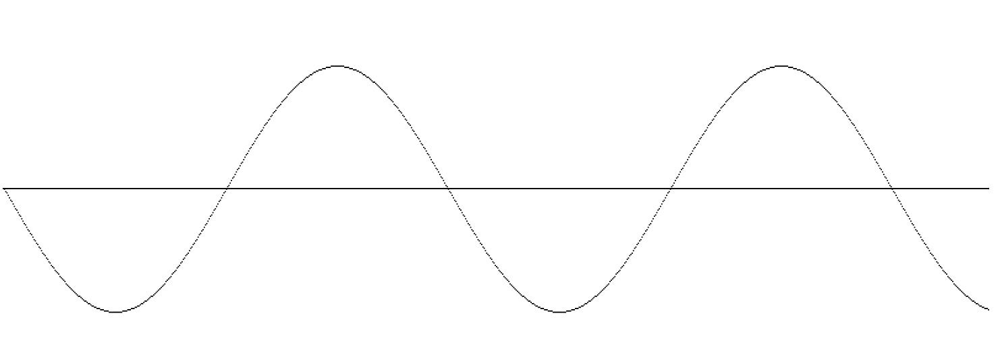

- 基本的には前のコードと同一だが、`draw()`関数内で、`background()`を削除しx座標を1加算する処理を加えた。これにより、時間経過とともに、カーブを描画をできる。
- `theta`に加算する数を増やすとカーブの間隔が狭くなる。逆に減らすと間隔が広くなる。

```javascript
let x = 0;
let y = 0;
let theta = 0;
let r = 100;
let centerY;
let centerX;

function setup(){
  createCanvas(800, 600);
  noFill();
  strokeWeight(1);
  centerY = height / 2;
  centerX = width / 2;
  
}

function draw(){
  line(0, centerY, width, centerY);
  
  y = centerY + r * sin(radians(theta));
  x = centerX + r * cos(radians(theta));
  point(x, y);
  theta += 1;

}
```

- 今度は時間経過で円を描く。

  

- x座標は`r * cos(radians(theta))`で求められる。この値とX軸の中心である`centerX`を加算することで、時間経過とともに円が描画される。

```javascript
let x = 0;
let y = 0;
let theta = 0;
let r = 100;
let centerY;
let centerX;

function setup(){
  createCanvas(800, 600);
  noFill();
  strokeWeight(1);
  centerY = height / 2;
  centerX = width / 2;
  
}

function draw(){
  line(0, centerY, width, centerY);
  
  y = centerY + r * sin(radians(theta));
  x = centerX + r * cos(radians(theta));
  point(x, y);
  theta += 1;

  if (theta > 360){
    theta = 0;
    r += 10;
  }
}
```

- 円を描画し終わったときの処理を追加した。

  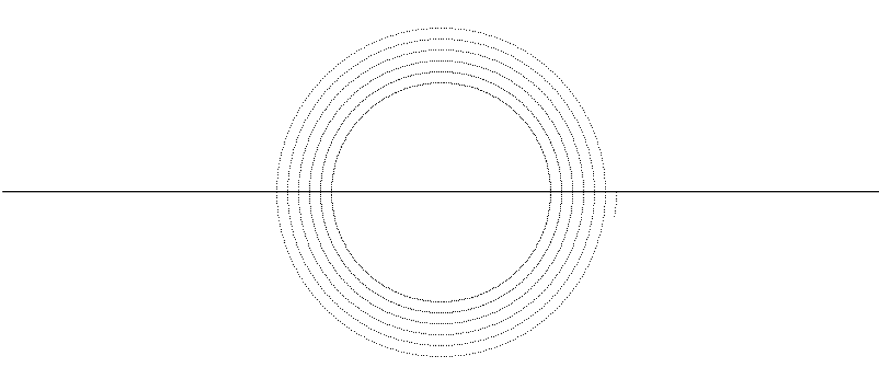

- 1つの円を描画し終わると、`r`に任意の値を加算して、更に円を描画する。ここでは10を加算して、一度描画した円の外側に新しい円を描画する。

**思ったこと**: 

- 三角関数なんてまともにやったの何年ぶりですかね・・・。こういうのって後になって役に立つんだよなぁ。

**リンク**

1. [p5.js point](https://p5js.org/reference/#/p5/point)

### 33日目: 2020年11月3日（火）

**今日の進捗**: 

webアニメーションのメモ。

- [2020年中期のWebアニメーション実装の全容俯瞰](https://qiita.com/ryokkkke/items/42ae2a661d64036285d2)
- webにアニメーションを導入したい際に参照する。

----

[moment.js](https://momentjs.com/)が[メンテナンスモードに入っていた](https://mag.osdn.jp/20/09/18/113400)。新規機能の追加は行わず、バージョン3はなく（現在の最新版は2.29.1）、重要なセキュリティ問題には対処する・・・とのこと。

代替ライブラリはいろいろあるが、スター数が多めなのは下記の2つ。

- [day.js](https://github.com/iamkun/dayjs)
- [date-fns](https://github.com/date-fns/date-fns)

ぱっと見での判断だけど、day.jsの方が可読性が高そうな印象。

----

というわけで、[day.js](https://github.com/iamkun/dayjs)を試してみる。

```JavaScript
const hoge = '2020/4/1';

$ = (hoge) => {
  console.log(hoge);
}

$('--get today--');
$(dayjs().format());
$(dayjs()); // これはオブジェクト扱い

newDate = dayjs(hoge);
$(newDate); // これはオブジェクト扱い
$(newDate.format());

$('--get year--');
$(newDate.year());
$('--get month--');
$(newDate.month());
$('--get day--');
$(newDate.day());
$(newDate.date());
$('--another get date--');
$(dayjs().get('year'));
$(dayjs().get('month'));
$(dayjs().get('date'));
$(dayjs().get('hour'));
$(dayjs().get('minute'));
$(dayjs().get('second'));
$(dayjs().get('milisecond'));

$('--month comperison--');
date3 = new Date(2020, 8, 1);
date4 = new Date('01 Sep 2020');

$(date3.getTime() === date4.getTime());
```

- とりあえずざっくり公式のAPIを見ながら書いてみた。`dayjs()`で取得できるのは今日の日付なんだけど、**オブジェクト扱いになってしまう**ので`format()`を付けて表示すればいい。

```console
--get today--"
"2020-11-02T10:35:24+09:00"
Object {↔}
Object {↔}
"2020-04-01T00:00:00+09:00"
"--get year--"
2020
"--get month--"
3
"--get day--"
3
1
"--another get date--"
2020
10
2
10
35
24
```

- いいところは何もしなくても日本時間になっていること。注意点は相変わらず**月が0から始まること**。

----

JavaScriptの`keys()`について。

- `Object.keys()`じゃなくて`Array.prototype.keys()`の方。こっちは対象の配列が持つインデックスのキーを**イテレータで返す**。インデックスキーをそのまま返すわけではないので注意。

```JavaScript
let num = 10;

console.log(Array(num).keys());

for (const key of Array(num).keys()){
  console.log(key);
}

console.log(...Array(num).keys());
```

- 単純に`Array(num).keys()`とした場合、イテレータが返ってくる。それだけでは使えないが、for文のループを用いてインデックスキーの出力ができる。

```console
[object Array Iterator]
0
1
2
3
4
5
6
7
8
9
0 1 2 3 4 5 6 7 8 9
```

- 上記のように、単純に`Array.prototype.keys()`を実行するだけではイテレータが返ってくるだけだが、ループに入れたり`...`で要素を個別に取得することで内容を参照できる。

```JavaScript
let hoge = ['a', , 'c'];

$ = (fuga) => {
  console.log(fuga);
};

$(hoge);
$(Object.keys(hoge));
$([...hoge.keys()]);
```

- `Object.keys()`は、ある任意のオブジェクトが含むキーを出力するメソッドだったが、`Array.prototype.keys()`は対象の配列が持つインデックスキーをイテレータを出力する。この場合、元の配列が[疎な配列](https://qiita.com/t2kojima/items/0ddaba1f336bfcc1e8cd)である場合、挙動が異なる。

```console
["a", undefined, "c"]
["0", "2"]
[0, 1, 2]
```

- 存在しない要素を無視してインデックスキーを出力する`Object.keys()`に対し、要素の有無に関係なく配列の長さ分インデックスキーを返す`Array.prototype.keys()`。要素に対して何かしらの操作や処理を行う場合、`Object.keys()`を使うのが正解。

----

JavaScriptの「疎な配列」についてメモ。

- 「長さは3なのに要素の数は2」みたいな配列のこと。なんじゃそら。

```JavaScript
let hoge = [, , , ];

$ = (arg) => {
  console.log(arg);
}

$(hoge);
$(hoge.length);
```

- `let hoge = [, , , ];`という**要素を指定せずに配列の形式だけ指定する**ことが可能。Pythonでやるとエラーになる（大抵の言語仕様じゃエラーになるんじゃないか？）が、JSは可能。

```console
[undefined, undefined, undefined]
3
```

- 結果は`undefined`が3つ並ぶわりに、ちゃんと配列の長さを認識している。
- この「疎な配列」をどのように利用するかだが、狙って利用するようなケースがどれだけあるかと言われるとかなり悩ましい。
- ただ、何かしらの都合で配列中の要素が欠落して疎な配列になったときに、本来想定する挙動と異なる動作をすることが予測できる。その際に、知識があるかないかでエラー解消までの時間に差が出てくるのはよくある話。やっぱり知識は無駄にならない。

**思ったこと**: 

- [「震える」動作に特化したjsライブラリ](https://elrumordelaluz.github.io/csshake/)とかすげーニッチじゃん・・・って思ったけど、案外スター付いてて草。
- JSの月の扱い、ホントどうにかなりませんかね・・・いやもうね、コレホントにどうにかなりませんか。直感でわかりにくいのよ。
- 日本人は月を1月、2月、3月・・・と数字で表現するが、欧米人はJan、Feb、Mar・・・と**英単語で表現する**。つまり、JSの設計者たちは月を数字で扱わないので、ゼロからスタートでも全く問題ない、というのをどこかで見た。なるほどなー。
- [JavaScript Primer](https://jsprimer.net/)っていうサイトを見つけた。ECMAScript2015以降のJSで参考にできるオンライン上のテキストとしては、かなりいい出来なのではないか。

**リンク**

1. [2020年中期のWebアニメーション実装の全容俯瞰](https://qiita.com/ryokkkke/items/42ae2a661d64036285d2)
1. [Moment.jsがメンテナンスモードへーー新機能開発は行わず](https://mag.osdn.jp/20/09/18/113400)
1. [Day.jsで簡単に日付処理！](https://www.ultra-noob.com/blog/2020-05-11-Day.js%E3%81%A7%E7%B0%A1%E5%8D%98%E3%81%AB%E6%97%A5%E4%BB%98%E5%87%A6%E7%90%86%EF%BC%81/)
1. [Array.prototype.keys()](https://developer.mozilla.org/ja/docs/Web/JavaScript/Reference/Global_Objects/Array/keys)
1. [疎な配列（Sparse Arrays）](https://qiita.com/t2kojima/items/0ddaba1f336bfcc1e8cd)

### 34日目: 2020年11月4日（水）

**今日の進捗**: 

p5.jsでの`vertex()`を使った描画について。

- `vertex()`は`startShape()`と`endShape()`の間において、指定された分の頂点を結んで点から多角形までを描画する。
- `vertex()`が記述された数が3つなら三角形だし、12個なら十二角形になる。ただし、座標を結んでいるだけなので正三角形にするにはそれなりの座標にしないといけないし、その計算はプログラミングするしかない。

```JavaScript
function setup(){
  createCanvas(800, 600);
  noFill();
  colorMode(HSB);
}

function draw(){
  background(0);
  stroke(255);
  beginShape();
  vertex(0, 0);
  vertex(100, 100);
  endShape();
}
```

- 上記は2点の座標を記述したもの。この場合、直線が描画される。

  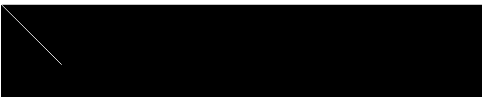

- x座標とy座標を明示的に指定しているところから、直交座標として指定していると言える。

```JavaScript
function setup(){
  createCanvas(800, 600);
  noFill();
  colorMode(HSB);
}

function draw(){
  background(0);
  strokeWeight(2);
  stroke(255);
  beginShape();
  
  let x, y;
  let splitX = 10;
  
  x = 100 * cos(radians(45));
  y = 100 * sin(radians(45));
  
  vertex(0, 0);
  vertex(x, y);
    
  endShape();
}
```

- 上記は弧度法を用いて座標を指定したもの。極座標として指定していると言える。

  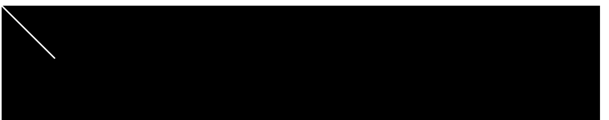

- 直線の長さこそ異なるものの、直線が左上から45度の方向に伸びているのは同じ。直交座標と比べて、極座標はスタートから見て度の方向にどの長さで直線が伸びているかが、コードを読むとすぐわかる。

```JavaScript
function setup(){
  createCanvas(800, 600);
  noFill();
  colorMode(HSB);
}

function draw(){
  background(0);
  strokeWeight(2);
  stroke(255);
  beginShape();
  
  let x, y;
  let splitX = 10;
  
  [...Array(splitX).keys()].forEach(i => {
    x = i / (splitX - 1) * width;
    y = (height / (i + 1));
    vertex(x, y);
  })
    
  endShape();
}
```

- 上記では10本の直線を連続的に描画することで、対数関数のグラフのような線を描画している。

  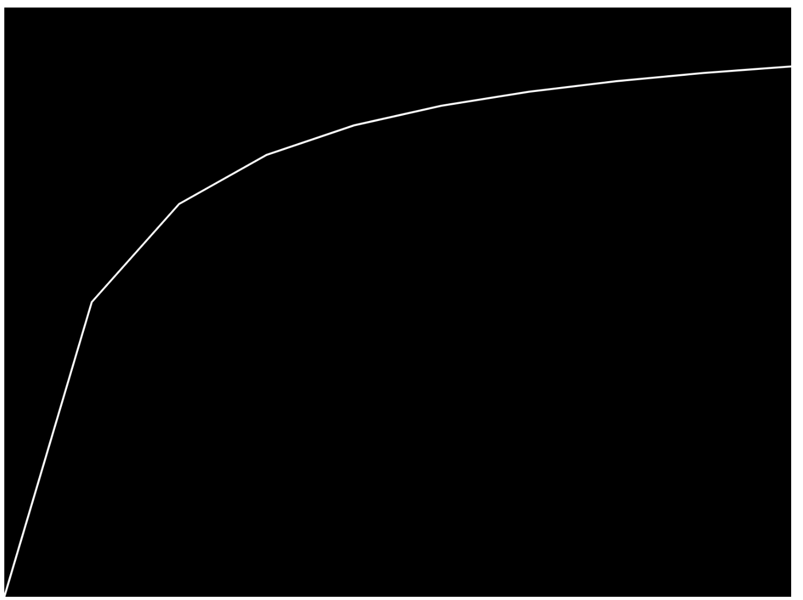

```javascript
let theta = 0;

function setup(){
  createCanvas(800, 600);
  noFill();
  colorMode(HSB);
}

function draw(){
  background(0);
  strokeWeight(2);
  stroke(255);
  beginShape();
  
  let x, y;
  let splitX = 10;
  
  x = 100 * cos(radians(theta)) + width / 2;
  y = 100 * sin(radians(theta)) + height / 2;
  
  vertex(width / 2, height / 2);
  vertex(x, y);
    
  endShape();
  
  theta++;
}
```

- 画面中心を原点とし、時間経過とともに直線が回転する。

  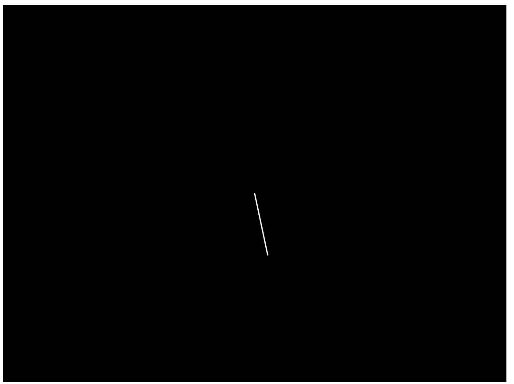

```javascript
let theta = 0;

function setup(){
  createCanvas(800, 600);
  noFill();
  colorMode(HSB);
}

function draw(){
  background(0);
  strokeWeight(2);
  stroke(255);
  beginShape();
  
  let x, y;
  let splitX = 10;

  [...Array(splitX).keys()].forEach(i => {
    x = (i / (splitX - 1)) * width;
    y = 100 * sin(radians(theta + i * 50)) + (height / 2);
    vertex(x, y);
  });
  
  endShape();
 
  theta++;
}
```

- サインカードのような複数の直線を描画する。

  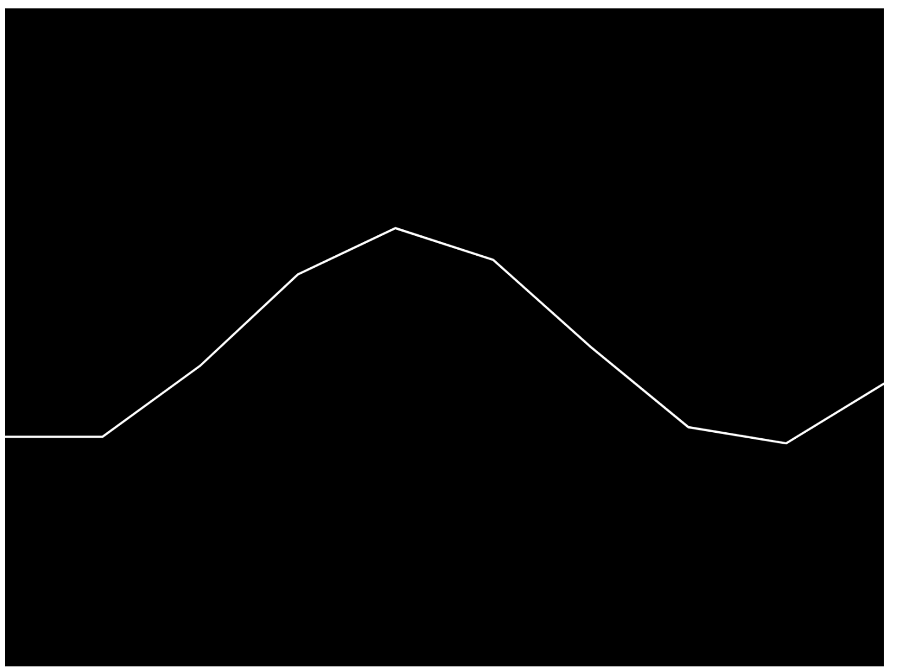

- `y = 100 * sin(radians(theta + i * 50)) + (height / 2);`の50の部分の数字を変えると、描画の滑らかさが変化する。数字が小さいと滑らかに、数字が大きいと角ばった描画になる。
- `splitX`の値を増やすとカーブの間隔が狭くなる。

```javascript
function setup(){
  createCanvas(200, 200);
}

function draw(){
  background(255);
  let date = Date.now() / 1000;

  for (let i = 0; i < width; i++){
    point(i, noise(date++) * height);
  }
}
```

- 蛇足。パーリンノイズを使ってY座標を適当に設定した点を描画する。

  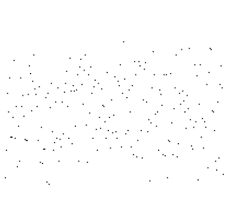

- なぜか奥方向に（X軸を中心として）回転しているように見える。そう見えるだけで、プログラム上では単純に点を描画しているだけ。なのだが、目の錯覚のせいだろうか。

```javascript
let seed = 0;

function setup(){
  frameRate(24);
  createCanvas(200, 200);
}

function draw(){
  background(255);

  let lineNum = 10;
  
  for (let j = 0; j < lineNum; j++){

    for (let i = 0; i < width; i++){
      point(i, noise(seed) * height);
      seed += 0.01;
    }
  } 
}
```

- もう一つ蛇足。ノイズ波形のほうな波を複数生成する。

  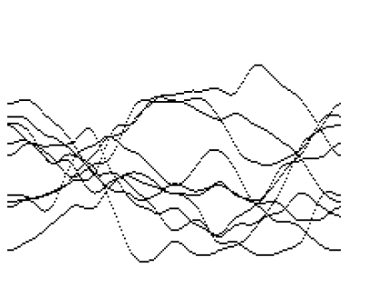

- `lineNum`を増やすと、その分複数の波形を生成する。

```JavaScript
let seed = 0;

function setup(){
  frameRate(24);
  createCanvas(200, 200);
}

function draw(){
  background(255, 70);

  let lineNum = 10;
  
  for (let j = 0; j < lineNum; j++){

    for (let i = 0; i < width; i++){
      point(i, noise(seed) * height);
      seed += 0.01;
    }
  }
}
```

- 上記の派生版。

  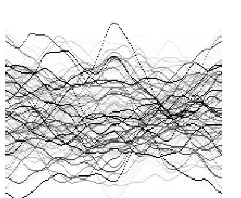

- `background()`でCanvasを初期化する際、透明度を設置することで過去に描画した波形をちょっとだけ残す。

**思ったこと**: 

- p5.js、おもしろいな・・・。

**リンク**

1. [noise](https://p5js.org/reference/#/p5/noise)
2. [7_1：フレーム p5.js JavaScript](https://himco.jp/2019/02/20/7_1%EF%BC%9A%E3%83%95%E3%83%AC%E3%83%BC%E3%83%A0/)

### ３５日目: 2020年11月5日（木）

**今日の進捗**: 

A-Frameを使ったアニメーションの設定方法。

- アニメーションを設定したいエンティティに対して`animation`プロパティを設定する。

```html
<html>

<head>
    <script src="https://aframe.io/releases/1.0.4/aframe.min.js"></script>
    <script src="https://jeromeetienne.github.io/AR.js/aframe/build/aframe-ar.js"></script>
    <script src="https://cdn.jsdelivr.net/gh/donmccurdy/aframe-extras@v6.1.1/dist/aframe-extras.min.js"></script>
</head>

<body>
    <a-scene embedded arjs="debugUIEnabled:false;" renderer="gammaOutput: true;" vr-mode-ui="enabled: false">
        <a-assets>
            <a-asset-item id="persona_lain_waving" src="persona_lain_waving.glb"></a-asset-item>
        </a-assets>

        <a-entity scale="1 1 1" rotaion="0 0 0" position="0 0.4 -3" animation-mixer="clip:*"
            gltf-model="#persona_lain_waving" visible="true"
            animation="property: position; from: 0 0.5 -3; to: 0 0.8 -3; dir: alternate; dur: 1500; easing: easeInOutQuad; loop: true">
        </a-entity>

        <a-light type="ambient" color="#ffffff"></a-light>
        <a-light type="point" intensity="2" position="0 4 0"></a-light>
    </a-scene>
</body>

</html>
```

- 上記で設定している項目は下記の通り。
  - property：アニメーションする対象。今回は`position`なので、3Dモデルの位置が変化する。
  - from：アニメーション開始の`position`。エンティティの初期位置よりY時を下に設定するとモデルの下部分が欠けるため、Y軸の位置は0.4より上に設定している。
  - to：アニメーション終了の`position`。
  - dir：fromからtoの間をどのように移動するかを設定する。`normal`だとfromからtoへの一方通行、`alternate`だとfromとtoと交互に往復する。`reverse`はtoからfromへ一方通行。
  - dur：1回のアニメーションに要する時間。ミリ秒。
  - easing：アニメーションのイージング。[ここ](https://easings.net/ja)がすごい参考になる。
  - loop：アニメーションをループさせるか否か。

**思ったこと**: 

- glTF単体でモーション設定するのもいいけど、A-Frameのアニメーションもね！
- 実際問題、単純な上下運動とかのアニメーションはA-Frameで書いた方が話が早いし、JavaScriptで書き換えられたりするので使い勝手がいい。とはいえ、Mixamo使ってる段階で上下運動みたいな簡単なモーションを付ける理由はないのだが。

**リンク**

1. [Animation](https://aframe.io/docs/1.0.0/components/animation.html#easings)
1. [easing](https://easings.net/ja)

### 36日目: 2020年11月6日（金）

**今日の進捗**: 

p5.jsにおける画像の扱い方について。

- 画像をCanvasに表示する。

```JavaScript
function preload(){
  img = loadImage('https://upload.wikimedia.org/wikipedia/commons/c/c7/Beautiful_Land.jpg');
}

function setup(){
  createCanvas(800, 600);
}

function draw(){
  image(img, 0, 0);
}
```

- 画像は適当に[wikimedia commons](https://commons.wikimedia.org/)から拾ってきた。
- 画像は`preload()`関数内でロードする。この関数は`setup()`の直前に呼び出されて、記述された外部ファイルがロードされるまで`setup()`が実行されない。
- `preload()`関数内には、画像やJSON、フォントなど外部ファイルの読み込み以外には利用すべきでない。
- 画像の読み込みは`loadImage()`関数で行う。引数にはファイルのURLの他に、読み込みが成功あるいは失敗した際のコールバック関数を記述できる。
- 画像は`loadImage()`で読み込んだだけではCanvas内に表示されないので、`image()`関数を使ってCanvasに描画する必要がある。引数には読み込んだ画像を指定し、Canvas上に表示する座標を指定する。座標は`(0, 0)`で左上を指す。

```JavaScript
function preload(){
  img = loadImage('https://upload.wikimedia.org/wikipedia/commons/c/c7/Beautiful_Land.jpg');
}

function setup(){
  createCanvas(800, 600);
}

function draw(){
  background(255);
  image(img, 0, 0, mouseX, mouseY);
}
```

- `image()`関数の第4引数と第5引数は、表示する画像の幅と高さを指定する。この引数をマウスポインターの座標にすると、マウスポインターが動くとともに、表示される画像のサイズの変化する。

```javascript
const addPoint = 50;

function preload(){
  img_sky = loadImage('https://upload.wikimedia.org/wikipedia/commons/c/c7/Beautiful_Land.jpg');
  
  img_tree = loadImage('https://upload.wikimedia.org/wikipedia/commons/5/51/4_Trees_%2867356105%29.jpeg');
  
  img_night = loadImage('https://upload.wikimedia.org/wikipedia/commons/d/da/Amanecer_QJ_Ind..jpg');
}

function setup(){
  createCanvas(800, 600);
}

function draw(){
  background(255);
  
  image(img_sky, 0, 0);
  image(img_night, mouseX - addPoint, mouseY - addPoint, width - mouseX, height - mouseY);
  image(img_tree, 0, 0, mouseX + addPoint, mouseY + addPoint);
  
}
```

- 複数の画像を表示する場合、`preload()`関数内で表示したい画像をそれぞれ読み込む。表示される順番は、`draw()`関数内で`image()`関数を実行した順にCanvas上に描画される。
- マウスポインターを動かすと画像の表示サイズが変化するが、表示される順番は変化しない。

```javascript
const cellSize = 10;
const noiseValue = 100;
let seedNum = 0;

function preload(){
  img_night = loadImage('https://upload.wikimedia.org/wikipedia/commons/d/da/Amanecer_QJ_Ind..jpg');
}

function setup(){
  createCanvas(800, 600);
  noStroke();
  colorMode(HSB, 1, 100, 100, 100);
}

function draw(){

  
  background(255);
  
  image(img_night, 0, 0, width, height);
  
  [...Array(width / cellSize).keys()].forEach(x => {
    [...Array(height / cellSize).keys()].forEach(y => {
      fill(noise(x / noiseValue, y / noiseValue, seedNum), 100, 100, 50);
      rect(x * cellSize, y * cellSize, cellSize, cellSize);
      seedNum += 0.00001;
    });
  });
  
}
```

- 画像の上に、時間経過とともに変化するヒートマップを半透明にして表示している。
- ヒートマップはHSBのHue部分について、パーリンノイズを使って値を変化させている。単純にxとyを使ってパーリンノイズを使うと、変化量が極端すぎてただのノイズになってしまう。そこでxとyは任意の数字（ここでは定数`noiseValue`）で除算して、あるセル付近の変化量を緩やかにさせる。
- これだけだと初回実行でヒートマップの色が固定されてしまうので、パーリンノイズのzに相当する引数部分へ**時間経過とともに増加する数値**を渡してやって、ヒートマップの色がゆらゆらと変化するようにした。

```JavaScript
fill(noise(x / noiseValue * seedNum, y / noiseValue * seedNum * 2), 100, 100, 50);
```

- なお、zの引数を用いず上記のようにxとyに`noiseValue`を積算した場合、「絵を縮小」するような動きになる。これはこれで何かに使えそうな使えなさそうな・・・。

```JavaScript
const cellSize = 10;
const noiseValue = 100;
let seedNum = 0;

function preload(){
  img_night = loadImage('https://upload.wikimedia.org/wikipedia/commons/4/47/PNG_transparency_demonstration_1.png');
}

function setup(){
  createCanvas(800, 600);
  noStroke();
  colorMode(HSB, 1, 100, 100, 100);
}

function draw(){

  
  background(255);
  
  [...Array(width / cellSize).keys()].forEach(x => {
    [...Array(height / cellSize).keys()].forEach(y => {
      fill(noise(x / noiseValue, y / noiseValue, seedNum), 100, 100, 100);
      rect(x * cellSize, y * cellSize, cellSize, cellSize);
      seedNum += 0.00001;
    });
  });
  
  image(img_night, 0, 0, width, height);
  
}
```

- ヒートマップを表示し、その上に透過PNGを表示する。PNGの透過部分だけヒートマップが表示されて、ゆらゆらと変化する。

----

JavaScriptのテンプレートリテラルを使って、オブジェクトのプロパティを指定する方法。

```JavaScript
let hoge = {
  _x: 1,
  _y: 'foo',
  _z: 0.32
};

console.log(hoge['_x']);

['x', 'y', 'z'].forEach(j => {
  console.log(j);
});

['x', 'y', 'z'].forEach(j => {
  console.log(hoge[`_${j}`]);
})
```

- オブジェクトのプロパティを配列の要素などを用いて指定したい場合、ブラケット記法なら指定できる。

```console
1
x
y
z
1
foo
0.32
```
- プレースホルダに変数を指定することで、配列の要素を1つずつ参照する。上記の場合、配列の要素がプロパティ名になっているので、足りないアンダーバーだけ付与してやれば、プロパティ名を指定していることになり、プロパティに相当する値がコンソールに表示される。
- ちなみに、ドット記法だとエラーになるので注意が必要。

**思ったこと**: 

- ヒートマップでゆらゆらさせるのおもしろい・・・。ベースになる画像があれば、ヒートマップをオーバーレイすると楽しそう。

**リンク**

1. [p5.jsで「パーリンノイズ」のスゴさを思い知る](https://infosmith.biz/blog/it/p5js-noise#4)
1. [4_1：経時的変化 Creative Coding p5.js](https://himco.jp/2019/03/16/4_1%EF%BC%9A%E7%B5%8C%E6%99%82%E7%9A%84%E5%A4%89%E5%8C%96-creative-coding-javascript/)

### 37日目: 2020年11月7日（土）

**今日の進捗**: 

DockerでReactの環境を構築する。

- Reactの勉強用コンテナを準備する。

```dockerfile
FROM node:14.15-buster-slim

ENV APP_PATH=/home/workdir

RUN npm install -g create-react-app

ADD . $APP_PATH

WORKDIR $APP_PATH

# COPY ["package.json", "yarn.lock", ${PWD}]

COPY . $APP_PATH

EXPOSE 3000
```

- Node.jsのコンテナはDebianのbusterを採用した。多分メジャーどころはAlpineなんだろうけど、[こういう話](https://medium.com/swlh/alpine-slim-stretch-buster-jessie-bullseye-bookworm-what-are-the-differences-in-docker-62171ed4531d)もあるので、そこまでしてコンテナの容量を削らなくてもいいか、と思ってDebianを採用。
- 調べてみてわかったが、`yarn`はNode.jsのコンテナに**インストール済み**。なんでも[2017年ごろから同梱されている](https://odaryo.hatenablog.com/entry/2020/01/08/211618)らしい。
- 上記のDockerfileを任意のフォルダに保存しておいて、vscodeで「Reopen in container」する。
- ビルドが終わったコンテナにログインすると`create-react-app --version`が実行できるはず。
- ちなみに、vscodeでbashのターミナルを開くと、デフォルトのフォルダがホームではなく「/workspaces/<ローカルのフォルダ名>」になる。`WORKDIR`でコンテナ上のフォルダを指定しているはずなんだが・・・。正直、原因がわからないので放置している。ただし`docker exec -it <コンテナ名> /bin/bash`でコンテナのシェルを起動すると、ちゃんと`WORKDIR`で指定したフォルダにいる。なので、vscode側の問題だと思っている。

----

Dockerコンテナのシェルを起動するメモ。

- WindowsのコマンドプロンプトやMacのシェルなどから、Dockerコンテナのシェルを起動する手順について。

1. `docker ps`で実行中のコンテナを確認する。その中で、シェルを起動したいコンテナのコンテナ名を控えておく。
1. `docker exec -it <コンテナ名> /bin/bash`を実行する。プロンプトが変わったら、コンテナへログインしシェルが起動している。

**思ったこと**: 

- DockerでReact環境を作るっていう記事は、結構ネット上に転がっているものの、`docker-compose`使ったりしてたりして（将来的な拡張性はあるんだろうけど）とりあえずサクッと試したいっていう自分のニーズに合わなかったので、Dockerfileだけで作った。

**リンク**

1. [DockerHubのNodeイメージ一覧](https://hub.docker.com/_/node)
1. [DockerでReactの開発環境を作る](https://qiita.com/tanaka-tt/items/49628cd423e490120eeb)
1. [Reactの開発環境をDockerで構築してみた](https://blog.web.nifty.com/engineer/2714)

### 38日目: 2020年11月8日（日）

**今日の進捗**: 

Reactのアプリ開発について。

- `create-react-app`を使った、Reactのアプリ開発手順について。
- と言ってもそんなに難しいわけでなく、単純に`create-react-app`がインストールされているコンテナ上で`npx create-react-app <任意のアプリ名>`を実行すればいい。必要なパッケージのインストールや、環境構築は`create-react-app`側が勝手にやってくれるので、しばらく放置しておけばいい。そこそこ時間がかかる。

```console
Success! Created my-app at /workspaces/work_docker_react/my-app
Inside that directory, you can run several commands:

  yarn start
    Starts the development server.

  yarn build
    Bundles the app into static files for production.

  yarn test
    Starts the test runner.

  yarn eject
    Removes this tool and copies build dependencies, configuration files
    and scripts into the app directory. If you do this, you can’t go back!

We suggest that you begin by typing:

  cd my-app
  yarn start

Happy hacking!
```

- 処理が終わると上記のようなメッセージが表示される。ここでは、素直に`yarn start`してみる。

```console
cd my-app
yarn start
```

- コマンドを発行するには、一度`create-react-app`で作成したフォルダに移動が必要。

```console
Compiled successfully!

You can now view my-app in the browser.

  Local:            http://localhost:3000
  On Your Network:  http://172.17.0.2:3000

Note that the development build is not optimized.
To create a production build, use yarn build.
```

- 上記のメッセージが表示されたら、ブラウザでアクセスしてみる。

  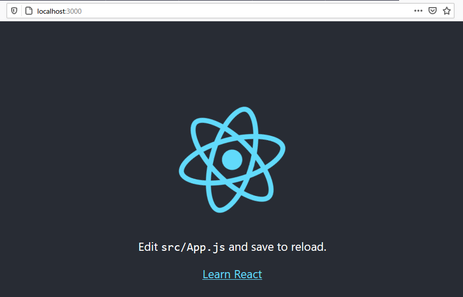
  
- 上記のようなページが表示されたら成功。

**思ったこと**: 

- [Vue.js](https://jp.vuejs.org/index.html)の`vue-cli`のように、環境構築するツールがあるとだいぶ助かる。

**リンク**

1. [新しい React アプリを作る](https://ja.reactjs.org/docs/create-a-new-react-app.html)

### 39日目: 2020年11月9日（月）

**今日の進捗**: 

vscode上でdocker-composeする際の注意点について。

- vscodeでdocker-compose.ymlを使ってコンテナをビルドする際、Remoteの設定のため`.devcontainer`フォルダ内に**新しいdocker-compose.ymlを勝手に作成する**。
- しかも独特の設定を施した上でビルドするので、自分が作ったdocker-compose.ymlの設定と異なる状態でコンテナが立ち上がる。特に`volumes`の設定。

```dockerfile
FROM node:14.15-buster-slim

RUN npm install -g create-react-app

ADD . /home/workdir

# COPY ["package.json", "yarn.lock", ${PWD}]

COPY . /home/workdir
```

- Node.js用のコンテナをビルドするためのDockerfile。

```docker-compose[
version: '3'

services:
  node:
    build:
      context: ./
      dockerfile: Dockerfile
    volumes:
    - ./:/home/workdir
    ports:
    - "3000:3000"
```

- 上記のDockerfileをビルドするためのdocker-compose.yml。`volumes`の設定として、ホストのカレントフォルダをコンテナの`/home/workdir`にマウントしている。

  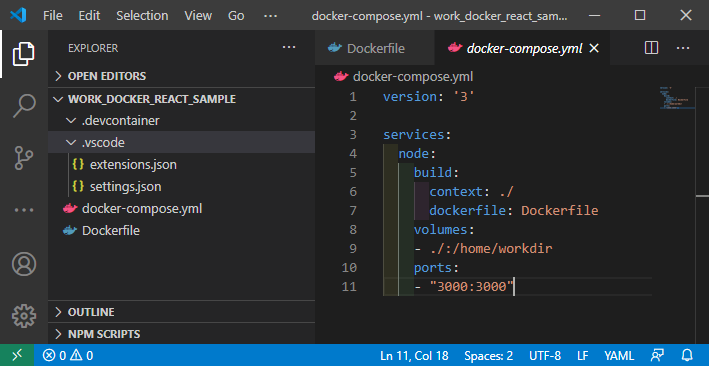

- 上記のように、ファイルを作成しただけでは「.devcontainer」フォルダに影響はない。

  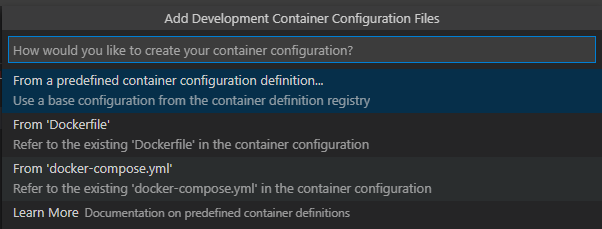

- この状態で**vscodeからビルドを行う**。「Reopen in container」を選択すると、Dockerfileを使うのかdocker-compose.ymlを使うのか聞いてくる。ここではdocker-compose.ymlを利用するよう指定する。

  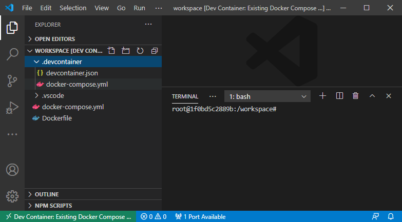
  
- ビルド処理を実行すると、「.devcontainer」フォルダに**新しいdocker-compose.ymlが作成される**。

```docker-compose
version: '3'
services:
  # Update this to the name of the service you want to work with in your docker-compose.yml file
  node_sample:
    # If you want add a non-root user to your Dockerfile, you can use the "remoteUser"
    # property in devcontainer.json to cause VS Code its sub-processes (terminals, tasks, 
    # debugging) to execute as the user. Uncomment the next line if you want the entire 
    # container to run as this user instead. Note that, on Linux, you may need to 
    # ensure the UID and GID of the container user you create matches your local user. 
    # See https://aka.ms/vscode-remote/containers/non-root for details.
    #
    # user: vscode

    # Uncomment if you want to override the service's Dockerfile to one in the .devcontainer 
    # folder. Note that the path of the Dockerfile and context is relative to the *primary* 
    # docker-compose.yml file (the first in the devcontainer.json "dockerComposeFile"
    # array). The sample below assumes your primary file is in the root of your project.
    #
    # build:
    #   context: .
    #   dockerfile: .devcontainer/Dockerfile
    
    volumes:
      # Update this to wherever you want VS Code to mount the folder of your project
      - .:/workspace:cached

      # Uncomment the next line to use Docker from inside the container. See https://aka.ms/vscode-remote/samples/docker-from-docker-compose for details.
      # - /var/run/docker.sock:/var/run/docker.sock 

    # Uncomment the next four lines if you will use a ptrace-based debugger like C++, Go, and Rust.
    # cap_add:
    #   - SYS_PTRACE
    # security_opt:
    #   - seccomp:unconfined

    # Overrides default command so things don't shut down after the process ends.
    command: /bin/sh -c "while sleep 1000; do :; done"
 
```

- ほとんどがコメントアウトされているが、`volumes`の設定が**本来のdocker-compose.ymlで設定されたものと異なったフォルダで設定されてしまっている**。

```console
// If you want to run as a non-root user in the container, see .devcontainer/docker-compose.yml.
{
	"name": "Existing Docker Compose (Extend)",

	// Update the 'dockerComposeFile' list if you have more compose files or use different names.
	// The .devcontainer/docker-compose.yml file contains any overrides you need/want to make.
	"dockerComposeFile": [
		"..\\docker-compose.yml",
		"docker-compose.yml"
	],

	// The 'service' property is the name of the service for the container that VS Code should
	// use. Update this value and .devcontainer/docker-compose.yml to the real service name.
	"service": "node_sample",

	// The optional 'workspaceFolder' property is the path VS Code should open by default when
	// connected. This is typically a file mount in .devcontainer/docker-compose.yml
	"workspaceFolder": "/workspace",

	// Set *default* container specific settings.json values on container create.
	"settings": {
		"terminal.integrated.shell.linux": null
	},

	// Add the IDs of extensions you want installed when the container is created.
	"extensions": []

	// Use 'forwardPorts' to make a list of ports inside the container available locally.
	// "forwardPorts": [],

	// Uncomment the next line if you want start specific services in your Docker Compose config.
	// "runServices": [],

	// Uncomment the next line if you want to keep your containers running after VS Code shuts down.
	// "shutdownAction": "none",

	// Uncomment the next line to run commands after the container is created - for example installing curl.
	// "postCreateCommand": "apt-get update && apt-get install -y curl",

	// Uncomment to connect as a non-root user if you've added one. See https://aka.ms/vscode-remote/containers/non-root.
	// "remoteUser": "vscode"
}

```

- こっちは`devcontainer.json`の中身。特筆すべきは`docker-composeFile`の部分。本来のdocker-compose.ymlの他に**新しいdocker-compose.ymlも読めと書いてある**。

  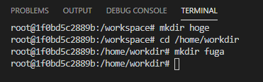

  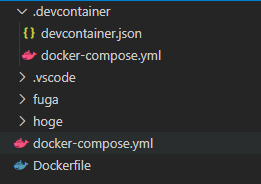

- この設定のため、本来設定しているフォルダとは異なる`workspace`フォルダの変更が、ホスト側に反映されてしまう。
- なお、新しいdocker-compose.ymlはフォルダ内のファイルを削除しても、ビルド処理ごとに再作成されてしまうため意味がない。よって、`workspace`フォルダの変更内容を反映させないためには、この「.devcontainer」内の設定ファイルについて、一度手直しする必要がある。
- ちなみにこの設定に影響を受けているせいか、vscodeのコンソールからコンテナに接続した場合`workspace`がカレントフォルダになるが、コマンドプロンプトなどで`docker exec -it`した場合は`/home/workdir`がカレントフォルダになる。

```docker-compose
    
    volumes:
      # Update this to wherever you want VS Code to mount the folder of your project
      - .:/home/workdir:cached

```

- とりあえず対処法は、まず新しいdocker-compose.ymlの`volumes`の設定を、本来マウントしたい先のフォルダに書き換える。

```console
	// The optional 'workspaceFolder' property is the path VS Code should open by default when
	// connected. This is typically a file mount in .devcontainer/docker-compose.yml
	"workspaceFolder": "/home/workdir",
```

- devcontainer.jsonも`workspaceFolder`の設定をマウントしたいフォルダに変更する。
- 本来は一度ここでリビルドするのだが、キャッシュでも残っているのか「`/workspace`がないんだけど？」というエラーが発生した。よって、リビルドする前に残存するコンテナを一度破棄して（`docker system prune`でもしておく）からリビルドする。

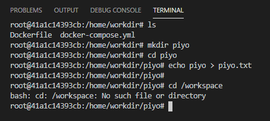

- `/workspace`が存在しなくなっている。

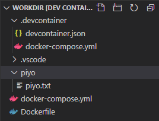

- コンテナの`/home/workdir`で作成したフォルダとファイルが、ローカル側にも反映されている。もちろん、コンテナ側でフォルダを削除すればローカル側のファイルも消える。

**思ったこと**: 

- お節介な・・・。vscodeは「必要に応じて設定内容は変えてね！」って言ってるけど、そもそもdocker-compose.ymlに書いてあるんだからお前が勝手に設定するなよ、とは言いたくなる。

**リンク**

1. [VS Code / Remote - Containers で docker-compose を試す](https://westa.io/@alclimb/remote-containers_docker-compose_sample)

### 40日目: 2020年11月10日（火）

**今日の進捗**: 

`create-react-app`の続き。

- コマンドを実行すると、アプリ開発の環境構築を始める。

```console
│  .gitignore
│  package.json
│  README.md
│  tree.txt
│  yarn.lock
│  
├─node_modules
│              
├─public
│      favicon.ico
│      index.html
│      logo192.png
│      logo512.png
│      manifest.json
│      robots.txt
│      
└─src
        App.css
        App.js
        App.test.js
        index.css
        index.js
        logo.svg
        reportWebVitals.js
        setupTests.js
```

- 環境構築が終わると、上記のような構成になっているはず。「node_modules」の中にはnpmのパッケージが格納されている。
- `yarn start`で開発サーバーを起動しブラウザで`localhost:3000`にアクセスすると、Reactの初期画面が表示される。

```javascript
import logo from './logo.svg';
import './App.css';

function App() {
  return (
    <div className="App">
      <header className="App-header">
        
        <p>
          Edit <code>src/App.js</code> and save to reload.
        </p>
        <p> // ここから
          ほげふがぴよ。
        </p> // ここまで追加
        <a
          className="App-link"
          href="https://reactjs.org"
          target="_blank"
          rel="noopener noreferrer"
        >
          Learn React
        </a>
      </header>
    </div>
  );
}

export default App;

```

- 上記のとおり、JavaScriptのコード中にHTMLソースを記述する[JSX](https://ja.reactjs.org/docs/introducing-jsx.html)で記述されている。
- なお、JSXという名前で上記とは**別の静的型付け言語が存在した**ので注意。なんでも[DeNAが開発してた](https://ja.wikipedia.org/wiki/JSX)とかなんとか。
- ソースコードを変更し保存した**瞬間にブラウザで表示していたページが自動的に更新される**。

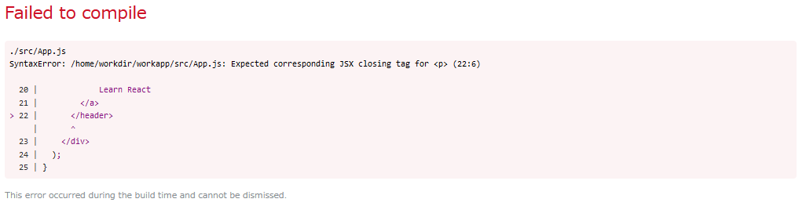

- ちなみにソースコードに問題がある場合、保存したタイミングで同様にコンパイルとレンダリング処理が実行されるが、上記のようなエラー画面を表示する。

----

Reactのチュートリアルに準じて開発してみる。なお、今回はCodepenなどのプレイグラウンドを利用せず、ローカルに準備したNode.jsのDocker環境下で`create-react-app`した状態で開始する。

- [Reactのチュートリアル](https://ja.reactjs.org/tutorial/tutorial.html)をやってみる。
- なんかフロントエンドのチュートリアルってTodoリスト作るイメージがあったけど、Reactのチュートリアルはマルバツゲームだった。
- とりあえず`create-react-app`した直後の状態で、`yarn start`して開発サーバーを立ち上げる。`localhost:3000`にブラウザからアクセスして、参照できることを確認しておく。確認ができたら、サーバーは一度終了してしまってよい。
- その後、srcフォルダ内にあるファイルを**すべて削除**する。
- チュートリアルの手順に従って、[ここ](https://codepen.io/gaearon/pen/oWWQNa?editors=0100)からCSSとJSのソース内容をコピペして、それぞれ「index.css」「index.js」という名前で保存する。
- 再度`yarn start`してサーバーを起動、`localhost:3000`にブラウザでアクセスする。

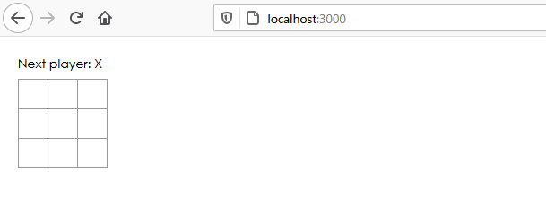

- 上記のように表示されれば成功。

----

スターターコードの中身を確認する。

- インポートしているのはReactのライブラリ。これは毎度記述する。
- 現状でクラスコンポーネントは下記の3つが存在する。
  - `Square`
  - `Board`
  - `Game`

```javascript
class Square extends React.Component {
    render() {
        return (
            <button className="square">
                {/* TODO */}
            </button>
        );
    }
}
```

- `Square`クラスは`<button>`タグをレンダリング処理する。とりあえず中身は記述されていないが、ボタンをレンダリングしてるのはわかるコードになっている。

```javascript
class Board extends React.Component {
    renderSquare(i) {
        return <Square />;
    }

    render() {
        const status = 'Next player: X';

        return (
            <div>
                <div className="status">{status}</div>
                <div className="board-row">
                    {this.renderSquare(0)}
                    {this.renderSquare(1)}
                    {this.renderSquare(2)}
                </div>
                <div className="board-row">
                    {this.renderSquare(3)}
                    {this.renderSquare(4)}
                    {this.renderSquare(5)}
                </div>
                <div className="board-row">
                    {this.renderSquare(6)}
                    {this.renderSquare(7)}
                    {this.renderSquare(8)}
                </div>
            </div>
        );
    }
}
```

- `Board`クラスは、3x3の盤面をレンダリングするクラス。自クラスに`renderSquare(x)`というメソッドを保持しており、`Square`クラスを呼び出している。

```javascript
class Game extends React.Component {
    render() {
        return (
            <div className="game">
                <div className="game-board">
                    <Board />
                </div>
                <div className="game-info">
                    <div>{/* status */}</div>
                    <ol>{/* TODO */}</ol>
                </div>
            </div>
        );
    }
}
```

- `Game`クラスはゲームそのものをレンダリングするクラス。現状では盤面をレンダリングするのみ。

----

`Board`コンポーネントから`Square`コンポーネントへ、データを渡す処理を実装する。コンポーネント間のデータ受け渡しは`props`経由で行う。

```javascript
class Square extends React.Component {
    render() {
        return (
            <button className="square">
                {this.props.value}
            </button>
        );
    }
}

class Board extends React.Component {
    renderSquare(i) {
        return <Square value={i} />;
    }

    render() {
        const status = 'Next player: X';

        return (
            <div>
                <div className="status">{status}</div>
                <div className="board-row">
                    {this.renderSquare(0)}
                    {this.renderSquare(1)}
                    {this.renderSquare(2)}
                </div>
                <div className="board-row">
                    {this.renderSquare(3)}
                    {this.renderSquare(4)}
                    {this.renderSquare(5)}
                </div>
                <div className="board-row">
                    {this.renderSquare(6)}
                    {this.renderSquare(7)}
                    {this.renderSquare(8)}
                </div>
            </div>
        );
    }
}
```

- チュートリアルに従って、`Board`コンポーネントにデータを渡す記述を、`Square`コンポーネントには渡されたデータを表示する記述をそれぞれ追加した。すると、盤面に数字が描画されるようになる。
- Reactでは、このように親から子へデータを受け渡しするにはPropsを用いる。

----

今度は`Square`コンポーネントがクリックされたら「X」を描画するよう変更する。

- まずクリックイベントを捕捉する。

```javascript
<button className="square" onClick={function () { alert('clicked!'); }}>
    {this.props.value}
</button>
```

- 上記のコードを追加すると、盤面の任意の四角部分（現状では数字が表示されている部分）をクリックすると、アラートが表示される。上記では`function()`で記述しているが、アロー関数で記述するほうが可読性が高いかも。あと、`function()`だと`this`の独特な挙動があるので、どうしても`this`を使いたい場面以外はアロー関数にしておくこと。

```javascript
<button className="square" onClick={alert('clicked!')}>
    {this.props.value}
</button>
```

- なお、上記のように記述するのは間違い。「クリックイベントが発生したときにアラートを表示する」機能を上記のように記述してしまうと、（やってみるとわかるが）レンダリングするごとにアラートが実行され無限ループになる。クリックイベント時にonClickへ渡すのは**関数である**ことを覚えておこう。
- これでクリックイベント発生時の挙動を確認できた。

- 次は「X」あるいは数字を表示し、その状態を保持する。コンポーネントがデータを保持するためにはstate（状態管理）を用いる。
- Reactコンポーネントではクラスに`this.state`を設定することで、状態を持つことが可能になる。`this.state`は、それが定義されているクラスにおいて**のみ**有効であると見なす。
- ここではマス目の状態を保持しておく。クリックされたときに、その状態が変更されるようなコードを記述する。

```javascript
class Square extends React.Component {
    constructor(props) {
        super(props);
        this.state = {
            value: null,
        };
    }
    render() {
        return (
            <button className="square" onClick={() => { alert('clicked!'); }}>
                {this.props.value}
            </button>
        );
    }
}
```

- コンストラクタを定義し、`this.state`を初期化する。
- JSではサブクラスのコンストラクタを定義する際は必ず`super()`を実行する必要がある。コンストラクタを持つReactコンポーネントでは、コンストラクタを`super(props)`の呼び出しから始めるべき。

```javascript
class Square extends React.Component {
    constructor(props) {
        super(props);
        this.state = {
            value: null,
        };
    }
    render() {
        return (
            <button className="square" onClick={() => { this.setState({ value: 'X' }) }}>
                {this.state.value}
            </button>
        );
    }
}
```

- `setState()`は状態を設定するメソッド。ここではvalueプロパティに「X」という文字を設定している。一度クリックすると、元の状態（Null）から「X」に変更され、その状態を保持し続ける。
- `{this.state.value}`と記述することで、クリックすると値が設定されるのと一緒にレンダリングも再度実行される。よって、更新された値が画面上にも反映される。
- この動作は同じクラスである9マスすべてで実行可能。

```javascript
    constructor(props) {
        super(props);
        this.state = {
            value: props.value,
        };
    }
```

- 上記のように記述すれば、初期状態では数字が入力されている。各マスをクリックすると、数字が「X」に変更されるのがわかる。
- ここまでで、クリックイベントに反応して値を変更する方法について記述した。

**思ったこと**: 

- ホットリロード楽しいなー、コードの変更がすぐに反映されると作ってる感がある。

**リンク**

1. [チュートリアル：React の導入](https://ja.reactjs.org/tutorial/tutorial.html)

### 41日目: 2020年11月11日（水）

**今日の進捗**: 

Reactのコンポーネントにおけるタイプについて。

- Reactのコンポーネントには2種類ある。「クラスベース」と「ファンクショナルベース」の2つ。それぞれ「クラスコンポーネント」とか「関数コンポーネント（ファンクショナルコンポーネント）」とか言ったりする。そして現状（2020年11月時点で観測できるかぎり）では**関数コンポーネントを使うのがベストプラクティス**である風潮。

```javascript
class Welcome extends React.Component {
  render() {
    return <h1>Hello, {this.props.name}</h1>;
  }
}
```

- 上記のように、ECMAScript2015のクラスで記述するのがクラスコンポーネント。

```javascript
function Welcome(props) {
  return <h1>Hello, {props.name}</h1>;
}
```

- 上記のように、`function()`で記述するのが関数コンポーネント。
- コンポーネント名は、クラスコンポーネントと関数コンポーネントのどちらも**大文字から始める**のが条件。小文字から始めると、組み込みDOMとして判断されるっぽく、コンポーネントとして解釈してくれなくなってしまう。
- どちらも`props`というオブジェクトを引数で受け取って、その中の`name`プロパティを含んだReact要素を返す。
- これだけであれば、ぱっと見でのわかりやすさ、読みやすさでは関数コンポーネントの方が優れているように見える。
- クラスコンポーネントは関数コンポーネントと異なり、state（状態管理）とライフサイクルメソッドを**コンポーネント内で利用できる**。じゃあ、この機能があるからクラスコンポーネントの方がいいのか？という話になるのだが、実際のところでいうと**むしろコンポーネント単位に状態なんか持たせるな**という流れがある。これはなぜかというと、コンポーネント単位にそれぞれ状態管理を行う（「ステートフル」と言ったりする）と、可読性や保守性が低くなるだけでなく、「今どんな状態か？」を把握しにくくなるというデメリットがある。よって、なるべつ状態管理はコンポーネント単位で持ちたくない（「ステートレス」と言ったりする）というニーズがあった。ただし、関数コンポーネントでは状態管理ができなかったため、仕方なくクラスコンポーネントを使っているという側面があった。
- ところが、状態管理がクラスを記述せずに実装できる[Hooks](https://ja.reactjs.org/docs/hooks-intro.html)がReactに追加されたことで、「わざわざ読みにくくて保守性が低いクラスより、関数コンポーネントとHooks使った方がよくね？」という方向に傾いた。以降、Reactでは状態管理をHooksで行うのが主流になっていく。

**思ったこと**: 

- Vue.jsでもそうだったけど、状態管理ってネックなのよねぇ・・・。

**リンク**

1. [state とライフサイクル](https://ja.reactjs.org/docs/state-and-lifecycle.html)
1. [すべてのReact.js初心者が知っておくべき9つのポイント](https://qiita.com/ossan-engineer/items/3622e57ceb70c7f12295)
1. [【React】クラスコンポーネント /関数コンポーネントの違いと使い分け。なぜ 関数コンポーネントが好まれるのか。](https://qiita.com/shane/items/b936550820de9a88ad60)

### 42日目: 2020年11月12日（木）

**今日の進捗**: 

[Reactのチュートリアル](https://ja.reactjs.org/tutorial/tutorial.html)の続き。

- 機能を完成させる。

```javascript
class Board extends React.Component {
    constructor(props) {
        super(props);
        this.state = {
            squares: Array(9).fill(null),
        };
    }
    renderSquare(i) {
        return <Square value={this.state.squares[i]} />;
    }

    render() {
        const status = 'Next player: X';

        return (
            <div>
                <div className="status">{status}</div>
                <div className="board-row">
                    {this.renderSquare(0)}
                    {this.renderSquare(1)}
                    {this.renderSquare(2)}
                </div>
                <div className="board-row">
                    {this.renderSquare(3)}
                    {this.renderSquare(4)}
                    {this.renderSquare(5)}
                </div>
                <div className="board-row">
                    {this.renderSquare(6)}
                    {this.renderSquare(7)}
                    {this.renderSquare(8)}
                </div>
            </div>
        );
    }
}
```

- 三目並べの勝敗を確認するには、`Square`コンポーネントがそれぞれ持っているデータを`Board`コンポーネントで参照する必要がある。このような、親コンポーネントから子コンポーネントの情報を参照することを「リフトアップ」と呼ぶ。
- 子コンポーネントが何の値をそれぞれ保持しているかを確認するより、親コンポーネントが子コンポーネントと同じ値を保持して参照する方が可読性が高まる。よって、ここでは`Board`コンポーネントでコンストラクタを定義して、それぞれの`Square`コンポーネントの値と対応する配列を定義する。

```javascript
class Square extends React.Component {
    constructor(props) {
        super(props);
        this.state = {
            value: props.value,
        };
    }
    render() {
        return (
            <button className="square"
                onClick={() => this.props.onClick()}>
                { this.props.value}
            </ button>
        );
    }
}

class Board extends React.Component {
    constructor(props) {
        super(props);
        this.state = {
            squares: Array(9).fill(null),
        };
    }
    renderSquare(i) {
        return (
            <Square value={this.state.squares[i]} onClick={() => this.handleClick(i)} />
        );
    }

    render() {
        const status = 'Next player: X';

        return (
            <div>
                <div className="status">{status}</div>
                <div className="board-row">
                    {this.renderSquare(0)}
                    {this.renderSquare(1)}
                    {this.renderSquare(2)}
                </div>
                <div className="board-row">
                    {this.renderSquare(3)}
                    {this.renderSquare(4)}
                    {this.renderSquare(5)}
                </div>
                <div className="board-row">
                    {this.renderSquare(6)}
                    {this.renderSquare(7)}
                    {this.renderSquare(8)}
                </div>
            </div>
        );
    }
}
```

- `Square`コンポーネントおよび`Board`コンポーネントをそれぞれ書き換えた。
- これらの変更で、下記のような挙動に変化する。
    1. `<button>`は**組み込みのDOMコンポーネント**（要はHTMLに定義されているタグに対応するもの）は、`onClick`と記述されているとき**クリックに対するイベントリスナをReactが設定する**。
    1. 盤面の任意のマスをクリックすると、設定されたイベントリスナは、`Square`コンポーネントの`render()`に記述された`onClick`のイベントハンドラをコールする。このイベントハンドラは、記述された`this.props.onClick()`を実行する。`props`とある通り、これは渡されたデータ内で定義されたメソッド。どこから渡されれているかというと`Board`コンポーネントから。
    1. データを渡している元の`Board`コンポーネントで定義されている`onClick`プロパティには、`() => this.handleClick(i)`という関数が定義されている。つまり、**この関数が実行される**。
    1. じゃあ`handleClick()`という関数はどこにあるのかというと、まだない。まだ定義してないので、クリックするとエラー画面が表示される。
- ややこしいが、マスをクリックすることで「`Board`コンポーネントが定義して渡した関数を、`Square`コンポーネントのイベントハンドラが実行する」という設計になっているわけだ。

```javascript
class Board extends React.Component {
    constructor(props) {
        super(props);
        this.state = {
            squares: Array(9).fill(null),
        };
    }

    handleClick(i) {
        const squares = this.state.squares.slice();
        squares[i] = 'X';
        this.setState({ squares: squares });
    }

    renderSquare(i) {
        return (
            <Square value={this.state.squares[i]} onClick={() => this.handleClick(i)} />
        );
    }

    render() {
        const status = 'Next player: X';

        return (
            <div>
                <div className="status">{status}</div>
                <div className="board-row">
                    {this.renderSquare(0)}
                    {this.renderSquare(1)}
                    {this.renderSquare(2)}
                </div>
                <div className="board-row">
                    {this.renderSquare(3)}
                    {this.renderSquare(4)}
                    {this.renderSquare(5)}
                </div>
                <div className="board-row">
                    {this.renderSquare(6)}
                    {this.renderSquare(7)}
                    {this.renderSquare(8)}
                </div>
            </div>
        );
    }
}

```

- `handleClick()`メソッドを追加した。これでクリックすると「X」が描画されるようになった。

----

ちょっと補足。

- チュートリアル中で出てくる`onClick`には**2つのパターンがある**。

```javascript
<button className="square"
    onClick={() => this.props.onClick()}>
    { this.props.value}
</ button>
```

- この`onClick`は**buttonに対する属性**。buttonとはHTMLで定義されたタグであるため、そのタグ内に記述されている`onClick`はHTMLが定義している`onClick`属性そのもの。よって、クリックに対して実際に反応しているのはこっち側。

```javascript
<Square 
    value={this.state.squares[i]} 
    onClick={() => this.handleClick(i)}
/>
```

- こっちは`<Square>`というカスタムコンポーネントであり、**HTMLに定義されているタグではない**。よって、同じ`onClick`と記述してあるので間違えそうになるが、こちらは**属性ではない**。よって、`<Square>`に対してクリックに反応するイベントリスナは設定されていない。
- こちらの`onClick`はReactの慣習上この名前になっているだけで、たとえば「hoge」という名前でも問題なく動作する。
- Reactではイベントを表すpropsには`on[Event]`という名前、イベントを処理するメソッドには`handle[Event]`という名前を付けるのが[慣習](https://ja.reactjs.org/tutorial/tutorial.html#lifting-state-up)。

    > イベントを表す props には on[Event] という名前、イベントを処理するメソッドには handle[Event] という名前を付けるのが慣習となっています。

**思ったこと**: 

- そろそろ「Reactのクセ」みたいなのが出てきたぞ・・・。
- 「慣習」みたいに不文律になってるようなことは、早い段階で慣れておかないとあとで困るケースが多いのよねぇ・・・。

**リンク**

1. [Reactチュートリアル](https://ja.reactjs.org/tutorial/tutorial.html)


### 43日目: 2020年11月13日（金）

**今日の進捗**: 

JavaScriptの`slice()`メソッドの挙動について。

- JSの`slice()`は配列の要素を、指定された分抽出する機能。

```javascript
let hoge = ['foo', 'bar', 'baz', 'ham', 'eggs' ,'spam'];

$ = (arg) => {
  console.log(arg);
}

$(hoge.slice(2));
$(hoge.slice(3, 5));
$(hoge.slice(-2));
$(hoge.slice(-4, -1));
$(hoge.slice(-2, -3)); // これは対象なし
```

- マイナスも使える。

```console
(4)
[
"baz" ,
"ham" ,
"eggs" ,
"spam"
]
(2)
[
"ham" ,
"eggs"
]
(2)
[
"eggs" ,
"spam"
]
(3)
[
"baz" ,
"ham" ,
"eggs"
]
(0)
[
] 
```

- 引数を省略した場合は、もともとの配列がそのまま出力される。
- 引数を1つだけ指定した場合、指定したn番目から最後までの要素を抽出する。
- 引数を2つ指定した場合、`(要素の抽出開始位置, 抽出終了位置)`となる。ただし、選択範囲が「以上～未満」となっており、開始位置の要素は抽出対象になるが、**終了位置の要素は抽出対象外**になる。
- なお、`slice()`の出力結果は別オブジェクトとして生成されるため、もともとの配列には影響がない。

----

Reactのチュートリアルの続き。

- 状態を変える際のアプローチについて。

```javascript
    handleClick(i) {
        const squares = this.state.squares.slice();
        squares[i] = 'X';
        this.setState({ squares: squares });
    }
```

- 上記のコードでは、現在の配列を一度`slice()`で別オブジェクトとして抽出してからデータの編集（文字「X」の代入）を行って、編集後のデータを状態の配列にセット（`setState()`の部分）することで、状態を変化させている。つまり、一度別オブジェクトというクッションを経由して編集しており、直接状態の配列を変えているわけではない。
- なんでこんな回りくどい方法を用いるかというと、データを直接編集するのに比べてメリットがあるからだ。
    - 複雑な機能が比較的簡単に実装できる
    - 変更の有無について検出が可能
    - 再レンダリングするタイミングが明確になる
- よって、基本的にはデータを直接書き換えることは避けるような癖を身に着けておくべき。

```javascript
function Square(props) {
    return (
        <button className="square"
            onClick={() => props.onClick()}>
            {props.value}
        </button>
    );
}
```

- `Square`コンポーネントを関数コンポーネントに書き換えた。こうすることで、`Square`コンポーネント自体は状態を持たず、単純にpropsを入力されたらしかるべき処理を行って結果を出力するという、関数としての機能のみ持つことになる。
- なお、関数コンポーネントに書き換えた場合、`onClick={() => { this.props.onClick(); }}`では**動作しない**。マスをクリックするとエラー画面になってしまう。これは、もともとクラスだからこそ持てた`this`をそのままにしているため。関数コンポーネントにすると、`this`はこの場合グローバルオブジェクトを指してしまう。グローバルオブジェクト内には`props`というプロパティないので「undefinedだぞ」というエラーが発生する。
- `this`を削除すれば、純粋にpropsの`onClick()`について参照するのでエラーにはならない。
- このコードは今以上に省略できる。

```javascript
function Square(props) {
    return (
        <button className="square"
            onClick={props.onClick}>
            {props.value}
        </button>
    );
}
```

- アロー関数のかっこは消えてるし、`onClick`側のかっこもないし・・・とこれだけ見ると本当に動作するのか、って感じだがちゃんと動作する。

```javascript
class Board extends React.Component {
    constructor(props) {
        super(props);
        this.state = {
            squares: Array(9).fill(null),
            xIsNext: true,
        };
    }

    handleClick(i) {
        const squares = this.state.squares.slice();
        if (calculateWinner(squares) || squares[i]) {
            return;
        }
        squares[i] = this.state.xIsNext ? 'X' : 'O';
        this.setState({ squares: squares });

        this.setState({ xIsNext: !this.state.xIsNext });

        console.log(this.state.xIsNext);
    }

    renderSquare(i) {
        return (
            <Square value={this.state.squares[i]} onClick={() => this.handleClick(i)} />
        );
    }

    render() {
        const winner = calculateWinner(this.state.squares);

        let status;
        if (winner) {
            status = 'Winner: ' + winner;
        } else {
            status = 'Next player: ' + (this.state.xIsNext ? 'X' : 'O');
        }

        return (
            <div>
                <div className="status">{status}</div>
                <div className="board-row">
                    {this.renderSquare(0)}
                    {this.renderSquare(1)}
                    {this.renderSquare(2)}
                </div>
                <div className="board-row">
                    {this.renderSquare(3)}
                    {this.renderSquare(4)}
                    {this.renderSquare(5)}
                </div>
                <div className="board-row">
                    {this.renderSquare(6)}
                    {this.renderSquare(7)}
                    {this.renderSquare(8)}
                </div>
            </div>
        );
    }
}

function calculateWinner(squares) {
    const lines = [
        [0, 1, 2],
        [3, 4, 5],
        [6, 7, 8],
        [0, 3, 6],
        [1, 4, 7],
        [2, 5, 8],
        [0, 4, 8],
        [2, 4, 6],
    ];
    for (let i = 0; i < lines.length; i++) {
        const [a, b, c] = lines[i];
        if (squares[a] && squares[a] === squares[b] && squares[a] === squares[c]) {
            return squares[a];
        }
    }
    return null;
}
```

- `calculateWinner()`関数を追加し、勝者がわかるようにした。
- `Board`コンポーネントに勝者が存在する、またはすべての盤面が埋まった場合は即`return`するようコードを修正した。
- さらに次のプレイヤーを表示している部分に、勝者が存在する場合はその勝者を表示するようにした。
- ここまでで、いわゆる三目並べが完成した。

----

トップレベルのコンポーネントである`Game`コンポーネント上で状態を管理するため、子コンポーネントである`Board`コンポーネントから必要なコードを移植する。

```javascript
class Board extends React.Component {

    renderSquare(i) {
        return (
            <Square value={this.props.squares[i]} onClick={() => this.props.onClick(i)} />
        );
    }

    render() {

        return (
            <div>
                <div className="board-row">
                    {this.renderSquare(0)}
                    {this.renderSquare(1)}
                    {this.renderSquare(2)}
                </div>
                <div className="board-row">
                    {this.renderSquare(3)}
                    {this.renderSquare(4)}
                    {this.renderSquare(5)}
                </div>
                <div className="board-row">
                    {this.renderSquare(6)}
                    {this.renderSquare(7)}
                    {this.renderSquare(8)}
                </div>
            </div>
        );
    }
}

class Game extends React.Component {
    constructor(props) {
        super(props);
        this.state = {
            history: [{
                squares: Array(9).fill(null),
            }],
            xIsNext: true,
        };
    }
    render() {
        const history = this.state.history;
        const current = history[history.length - 1];
        const winner = calculateWinner(current.squares);
        let status;
        if (winner) {
            status = 'Winner : ' + winner;
        } else {
            status = 'Next player : ' + (this.state.xIsNext ? 'X' : 'O');
        }

        return (
            <div className="game">
                <div className="game-board">
                    <Board
                        squares={current.squares}
                        onClick={i => this.handleClick(i)}
                    />
                </div>
                <div className="game-info">
                    <div>{status}</div>
                    <ol>{/* TODO */}</ol>
                </div>
            </div>
        );
    }

    handleClick(i) {
        const history = this.state.history;
        const current = history[history.length - 1];
        const squares = current.squares.slice();

        if (calculateWinner(squares) || squares[i]) {
            return;
        }
        squares[i] = this.state.xIsNext ? 'X' : 'O';
        this.setState({
            history: history.concat([{
                squares: squares,

            }]),
            xIsNext: !this.state.xIsNext,
        });

    }
}

```

- `history`オブジェクトを`Game`コンポーネントで状態管理するため、それに関連するコードを追記したり`Board`コンポーネントから移植する。
- この状態で、三目並べの機能はそのままにリファクタリングが完了したことになる。

----

過去の履歴を表示、その時点の状態まで戻すボタンを配置する。

-もともと、盤面をコピーして配列を新規作成し盤面に反映させる、というイミュータブルなオブジェクト扱いをしていた。よって、必要があればどうようにコピーして保持しておけばいい。ということは、盤面が変更されたタイミングでその内容をコピーして保存しておく、ということが可能になるわけだ。これは、ミュータブルな扱いをしていては実現できない。

```javascript
import React from 'react';
import ReactDOM from 'react-dom';
import './index.css';

// class Square extends React.Component {
//     constructor(props) {
//         super(props);
//         this.state = {
//             value: props.value,
//         };
//     }
//     render() {
//         return (
//             <button className="square"
//                 onClick={() => this.props.onClick()}>
//                 { this.props.value}
//             </ button>
//         );
//     }
// }

function Square(props) {
    return (
        <button className="square"
            onClick={props.onClick}>
            {props.value}
        </button>
    );
}

class Board extends React.Component {

    renderSquare(i) {
        return (
            <Square value={this.props.squares[i]} onClick={() => this.props.onClick(i)} />
        );
    }

    render() {

        return (
            <div>
                <div className="board-row">
                    {this.renderSquare(0)}
                    {this.renderSquare(1)}
                    {this.renderSquare(2)}
                </div>
                <div className="board-row">
                    {this.renderSquare(3)}
                    {this.renderSquare(4)}
                    {this.renderSquare(5)}
                </div>
                <div className="board-row">
                    {this.renderSquare(6)}
                    {this.renderSquare(7)}
                    {this.renderSquare(8)}
                </div>
            </div>
        );
    }
}

class Game extends React.Component {
    constructor(props) {
        super(props);
        this.state = {
            history: [{
                squares: Array(9).fill(null),
            }],
            xIsNext: true,
            stepNumber: 0,
        };
    }
    render() {
        const history = this.state.history;
        const current = history[this.state.stepNumber];
        const winner = calculateWinner(current.squares);

        const moves = history.map((step, move) => {
            
            const desc = move ? 'Go to move #' + move : 'Go to game start';
            return (
                <li>
                    <button onClick={() => { this.jumpTo(move) }}>{desc}</button>
                </li>
            );
        });

        let status;
        if (winner) {
            status = 'Winner : ' + winner;
        } else {
            status = 'Next player : ' + (this.state.xIsNext ? 'X' : 'O');
        }

        return (
            <div className="game">
                <div className="game-board">
                    <Board
                        squares={current.squares}
                        onClick={i => this.handleClick(i)}
                    />
                </div>
                <div className="game-info">
                    <div>{status}</div>
                    <ol>{moves}</ol>
                </div>
            </div>
        );
    }

    handleClick(i) {
        const history = this.state.history.slice(0, this.state.stepNumber + 1);
        const current = history[history.length - 1];
        const squares = current.squares.slice();

        if (calculateWinner(squares) || squares[i]) {
            return;
        }
        squares[i] = this.state.xIsNext ? 'X' : 'O';
        this.setState({
            history: history.concat([{
                squares: squares,

            }]),
            xIsNext: !this.state.xIsNext,
            stepNumber: history.length,
        });

    }

    jumpTo(step) {
        this.setState({
            stepNumber: step,
            xIsNext: (step % 2) === 0,
        })
    }
}

// ========================================

ReactDOM.render(
    <Game />,
    document.getElementById('root')
);

function calculateWinner(squares) {
    const lines = [
        [0, 1, 2],
        [3, 4, 5],
        [6, 7, 8],
        [0, 3, 6],
        [1, 4, 7],
        [2, 5, 8],
        [0, 4, 8],
        [2, 4, 6],
    ];
    for (let i = 0; i < lines.length; i++) {
        const [a, b, c] = lines[i];
        if (squares[a] && squares[a] === squares[b] && squares[a] === squares[c]) {
            return squares[a];
        }
    }
    return null;
}
```

- ここまで履歴機能が実装できた。
- ただ、現状のコードでは実行時にブラウザのコンソールにワーニングが表示される。

> Warning: Each child in a list should have a unique "key" prop.

- 「リストの項目はそれぞれユニークなキーを持ったほうがいいよ」というワーニングである。ではキーとは何か。
- リストをレンダリングする際、リストの項目にキーと呼ばれる識別子を保持する。これがあることで、リストが再レンダリングされた際に「どの項目が増えたor減ったか」「どの項目の内容が変更されたか」「並び替えはあったか」などがわかるようになる。
- キーがなくてもレンダリングそのものは可能だが、どの項目がどう変わったかまでReactはわからない。よって、Reactに変更内容を識別させるためにキーが必要になる。

> 動的なリストを構築する場合は正しい key を割り当てることが強く推奨されます。

- プログラマーによってキーが指定されなかった場合、Reactは配列のインデックスをキーとして扱う。ただし、基本的にはデータにふさわしいキーを設定するのが望ましい。

```javascript
<li key={move}>
    <button onClick={() => { this.jumpTo(move) }}>{desc}</button>
</li>
```

- リストの項目に対し`key`として任意のデータを設定する。キー自体はなんでもよくて`key={'hoge' + move}`みたいなのでもよい。

```javascript
history.map((step, move) => {})
```

- ちなみに上記の`map()`メソッドだが、匿名関数の中で利用していない`step`という引数を記述している。これは`map()`メソッドの仕様で、第1引数は要素そのものを表すが、[第2引数は要素のインデックスを指す](https://developer.mozilla.org/ja/docs/Web/JavaScript/Reference/Global_Objects/Array/map)からだ。そして今回は要素そのものの値でなくインデックスの値を利用しているため、`step`という引数は記述されているものの、関数の中では利用されていない。


**思ったこと**: 

- JSXってクセはあるけど基本的にはJSの機能だから、純粋にJSを使ってDOM変更するよりJSとHTMLがシームレスにコード上でつながるんで慣れると楽かも。

**リンク**

1. [チュートリアル：React の導入](https://ja.reactjs.org/tutorial/tutorial.html#adding-time-travel)
1. [Array.prototype.slice](https://developer.mozilla.org/ja/docs/Web/JavaScript/Reference/Global_Objects/Array/slice)
1. [Array.prototype.map](https://developer.mozilla.org/ja/docs/Web/JavaScript/Reference/Global_Objects/Array/map)

### 44日目: 2020年11月14日（土）

**今日の進捗**: 

JavaScriptの配列において、特定の値を含むか否かを判断する方法について。

- JSの配列内で特定の値を含むか否かを判定するには`Array.prototype.include()`を利用する。

```javascript
let hoge = [null, null, 'hoge', 'fuga', null, 'piyo'];
let fuga = ['foo', 'bar', 'baz'];

console.log(hoge.includes(null));
console.log(fuga.includes(null));
console.log(hoge.includes('foo'));
console.log(fuga.includes('foo'));

let piyo = [1, 2, 3, 4, 5, 6];

console.log(piyo.includes(1));
console.log(piyo.includes(0));

```

- 上記のように文字列や数値、Nullの有無を判定できる。

```console
true
false
false
true
true
false
```

- 結果は真偽のみ返ってくる。

----

JavaScriptの`map()`メソッドについて。

- `map()`メソッドの仕様上、コールバック関数の各引数は下記のように定義されている。
    - 第1引数：現在処理中の要素の値。
    - 第2引数：現在処理中の要素のインデックス。
    - 第3引数：`map()`メソッドが実行されている配列。

```javascript
let hoge = [9, 8, 6];

const $ = arg => {
  console.log(arg);
};

$(hoge.map((x, y, z) => x));

$(hoge.map((x, y, z) => y));

$(hoge.map((x, y, z) => z));

```

- 上記のように、それぞれの引数をそのまま出力してみる。

```console
(3)
[9 ,8 ,6]
(3)
[0 ,1 ,2]
(3)
[
	(3)[9 ,8 ,6],
	(3)[9 ,8 ,6],
	(3)[9 ,8 ,6]
] 
```

- このようになった。要素そのものやインデックスならともかく、もともとの配列をそのまま出力するのって使えそうなシチュエーションがあまり思いつかないのだが・・・。そもそも、配列そのものじゃなくて要素がほしいから`map()`使ってるわけで。

----

ReactDOMについてメモ。

```html
<div id="root"></div>
```

```javascript
const Func = () => {
  return (
    <div>
      <p>hoge, fuga, piyo.</p>
    </div>
  );
};

ReactDOM.render(
  <Func />,
  document.getElementById('root')
)
```

- 一番簡単なReactのソースだと、多分上記のような感じだと思う。
- ここで`ReactDOM.render()`は`id='root`の要素に`<Func />`という要素を入れ込む、という意味。なので、`document.getElementById()`の記述がないと動作しない。

**思ったこと**: 

- `map()`の引数、最初コード上で見たとき「なんで関数内で使ってないのに引数として宣言してるんだ？」って思ったんだけど、調べてみると上記のような結果で納得。

**リンク**

1. [Array.prototype.includes](https://developer.mozilla.org/ja/docs/Web/JavaScript/Reference/Global_Objects/Array/includes)
1. [Array.prototype.map](https://developer.mozilla.org/ja/docs/Web/JavaScript/Reference/Global_Objects/Array/map)
1. [ここからはじめるReactの基礎の基礎](https://qiita.com/shizuma/items/6392dc55624c80f5503c)

### 45日目: 2020年11月14日（日）

**今日の進捗**: 

[Tweakpane](https://cocopon.github.io/tweakpane/)を使ってみる。

- Tweakpaneとは、[dat.GUI](https://github.com/dataarts/dat.gui)のようにJavaScript上のパラメータをインタラクティブに変化させられるパネルを表示する。
- dat.GUIよりもUIが洗練されていて、XYパッドのような機能があるのも特徴。

```html
<script src="https://cdn.jsdelivr.net/npm/tweakpane@1.5.6/dist/tweakpane.min.js"></script>
```

- 利用するためには上記のコードをHTMLに記述しておく。

```javascript
const cellSize = 10;
const noiseValue = 100;
let seedNum = 0;

function preload(){
  img_night = loadImage('https://upload.wikimedia.org/wikipedia/commons/d/da/Amanecer_QJ_Ind..jpg');
}

const params = {
  HValue: 360,
  S: 100,
  B: 100,
};

function setup(){
  createCanvas(800, 600);
  noStroke();
  colorMode(HSB, 360, 100, 100, 100);
  
  const pane = new Tweakpane();
  Object.keys(params).forEach(arg=>{
    pane.addInput(params, arg, {
      min: 0,
      max: params[arg],
    });
  });
  
}

function draw(){

  background(255);
  
  tint(frameCount * 5 % params.HValue, params.S, params.B, 100);
  
  image(img_night, 0, 0, width, height);
  
}
```

- Tweakpaneを使って、p5.jsで画像表示する際の`tint()`のパラメータを変化させるコード。
- コードを実行すると、Tweakpaneのパネルが画面の右上に表示される。
- パネルの設定時に、`min`または`max`のいずれかを設定しておくと表示されるオブジェクトがテキストフィールドからスライダーに変わる。設定値が数値の場合、テキストフィールドに入力するよりスライダーで変化させるほうが簡単なので、`min:0（あるいは適当な値）`くらいを設定しておくと楽かも。

**思ったこと**: 

- Tweakpaneを使うと若干FPSが落ちる印象を受けるが、パラメータの変更だけしたいのに「コード修正して保存してブラウザで確認してまたコード修正して・・・」というのを繰り返すよりは、ブラウザの画面上で変更できる方がよっぽど楽である。

**リンク**

1. [Tweakpane](https://cocopon.github.io/tweakpane/)
1. [dat.GUI](https://github.com/dataarts/dat.gui)

### 46日目: 2020年11月16日（月）

**今日の進捗**: 

p5.jsで画像をモザイク化する。

- 画像のオブジェクトに対して`get()`を実行すると、色を取得できる。その色で四角を塗りつぶすことでモザイク化する。

```javascript
let img_night;

function preload(){
  img_night = loadImage('https://upload.wikimedia.org/wikipedia/commons/8/8a/Family_Affairs_%28108654829%29.jpeg');
}

function setup(){
  createCanvas(800, 600);
  noStroke();

}

function draw(){

  let step = map(mouseX, 0, width, 1, 100);
   for(let j = 0; j < height; j += step){
     for(let i = 0; i < width; i += step){
       let c = img_night.get(i, j);
       fill(c);
       rect(i, j, step, step);
     }
   }
  
}
```

- モザイクのサイズはマウスポインタの位置で変化する。ただし、サイズが小さい（マウスポインタがかなり左にいる）場合、FPSが極端に低下するのでレスポンスが非常に悪くなる。

----

p5.jsで[`tint()`](https://p5js.org/reference/#/p5/tint)を使う。

- 画像に任意の色をマスキングできる`tint()`を使う。

```javascript
let cellSize = 10;
let img_night;

function preload(){
  img_night = loadImage('https://upload.wikimedia.org/wikipedia/commons/8/8a/Family_Affairs_%28108654829%29.jpeg');
}

const params = {
  HValue: 360,
  S: 100,
  B: 100,
};

function setup(){
  createCanvas(800, 600);
  noStroke();
  colorMode(HSB, 360, 100, 100, 100);
  
  const pane = new Tweakpane();
  Object.keys(params).forEach(arg=>{
    pane.addInput(params, arg, {
      min: 0,
      max: params[arg],
    });
  });
  
  textSize(20);
  
}

function draw(){

  tint(frameCount * 5 % params.HValue, params.S, params.B, 100);
 
  image(img_night, 0, 0);
  
}
```

- ここではカラーモードをHSBにして、フレームカウントが経過するごとに色を変えている。

----

p5.jsでFPSをCanvas上に表示する。

- FPSを取得するには`frameRate()`を引数なしで実行する。

```javascript
function setup(){
  createCanvas(800, 600);
  textSize(20);
}

function draw(){
  background(255);
  
  fill(0);
  text('Current FPS: ' + round(frameRate()), 100, 100); 
}
```

- `frameRate()`を引数なしで実行すると、現在のフレームレートが取得できる。小数を含むので今回は`round()`した。
- ちなみに`frameRate()`に10などの数値で引数を指定し実行すると、指定された数値をFPSにセットする。

----

上記をすべて打ち込んだのが下記のソース。

```javascript
let cellSize = 10;
let img_night;

function preload(){
  img_night = loadImage('https://upload.wikimedia.org/wikipedia/commons/8/8a/Family_Affairs_%28108654829%29.jpeg');
}

const params = {
  HValue: 360,
  S: 100,
  B: 100,
};

function setup(){
  createCanvas(800, 600);
  noStroke();
  colorMode(HSB, 360, 100, 100, 100);
  
  const pane = new Tweakpane();
  Object.keys(params).forEach(arg=>{
    pane.addInput(params, arg, {
      min: 0,
      max: params[arg],
    });
  });
  
  textSize(20);
  
}

function draw(){

  tint(frameCount * 5 % params.HValue, params.S, params.B, 100);
  
  cellSize = map(mouseX, 0, width, 1, 100);
  
  for(let j = 0; j < height; j += cellSize){
    for(let i = 0; i < width; i += cellSize){
      c = img_night.get(i, j);
      fill(c);
      rect(i, j, cellSize, cellSize);
    }
  }
  
  fill(0);
  text('Current FPS: ' + round(frameRate()), 100, 100);
  
}
```

**思ったこと**: 

- ある程度のモザイクサイズまで小さくなると、FPSが極端に下がってしまうのでどこかでサイズの下限を付けたいな。

**リンク**

1. [【p5.js】画像のピクセル情報を取得してモザイク化する ](https://note.com/ttttttttttt/n/nce2a542b2822)
1. [tint](https://p5js.org/reference/#/p5/tint)

### 47日目: 2020年11月17日（火）

**今日の進捗**: 

[React Hooks](https://ja.reactjs.org/docs/hooks-intro.html)について。

- React Hooksは、クラスコンポーネントを書かずに状態管理できるようになる機能。

```javascript
import React, { useState } from 'react';
import ReactDOM from 'react-dom';

function Example() {
    const [count, setCount] = useState(0);

    return (
        <div>
            <p>You clicked {count} times.</p>
            <button onClick={() => setCount(count + 1)}>
                Click me
            </button>
        </div>
    );
}

ReactDOM.render(
    <Example />,
    document.getElementById('root')
);
```

- 多分上記のHooksを使った最小コード。
- `useState`というがHooksにあたる。この名前になる理由は、Hooksの命名規約で`useXXX`と書くことになっているため。上記のように記述することで、関数コンポーネントに状態を持たせることが可能になる。`useState()`以外のHooksも存在する。
- もともと関数コンポーネントは状態を持てず、状態を持つならクラスコンポーネントを利用するしかなかった。ところがHooksを導入するとあたかもクラスコンポーネントのように関数コンポーネントで状態管理ができるようになる。
- Hooksは関数ではなくReact本体にデータを保持する。もう少し正確に言うと、`useState()`フックは、React本体に関数コンポーネント専用の保存領域を確保し、その中にデータを保持する。また、保持したデータに対して読み書きできるよう設定する。
- 保存領域は各コンポーネントで独立しているため、別コンポーネントで同一の`value`を指定したとしても、それはそれぞれ異なる状態を個別に保持する。
- 書き方は`const [value, setValue] = useState(initialValue)`と書く。`value`にはReactから取得した値が入るが、初回はReact側に情報が何もないので初期値を設定する必要がある。また、`setValue`には値を設定するための関数が返ってくる。
- 基本的には、現在の`value`に格納されている値の参照と、`setValue`による値の設定のみ行う。

----

```javascript
import React, { useState } from 'react';
import ReactDOM from 'react-dom';

function Example() {
    const [count, setCount] = useState(0);
    const [value, setValue] = useState(false);
    let output;

    if (value) {
        output = 'hoge';
    } else {
        output = 'fuga';
    }

    return (
        <div>
            <p>You clicked {count} times.</p>
            <button onClick={() => {
                setCount(count + 1);
                setValue(!value);
            }}>
                Click me
            </button>

            <p>{output} {value}</p>
        </div>
    );
}

ReactDOM.render(
    <Example />,
    document.getElementById('root'),
);
```

- 複数のHooksを利用したい場合は、利用したい分を宣言すればいい。

**思ったこと**: 

- Firefoxに[React用のデバッグツール](https://addons.mozilla.org/ja/firefox/addon/react-devtools/)をインストールすると、各コンポーネントのHooksの内容まで表示してくれる。

**リンク**

1. [フック早わかり](https://ja.reactjs.org/docs/hooks-overview.html)
1. [最近Reactを始めた人向けのReact Hooks入門](https://sbfl.net/blog/2019/11/12/react-hooks-introduction/)

### 48日目: 2020年11月18日（水）

**今日の進捗**: 

React Hooksの種類について。

- Hooksにはいくつかの種類があり、それぞれ機能が異なる

----

`useState()`について。

```javascript
import React, { useState } from 'react';
import ReactDOM from 'react-dom';

function Example() {
    const [count, setCount] = useState(0);
    const [value, setValue] = useState(false);
    let output;

    if (value) {
        output = 'hoge';
    } else {
        output = 'fuga';
    }

    return (
        <div>
            <p>You clicked {count} times.</p>
            <button onClick={() => {
                setCount(count + 1);
                setValue(!value);
            }}>
                Click me
            </button>

            <p>{output} {value}</p>
        </div>
    );
}

ReactDOM.render(
    <Example />,
    document.getElementById('root'),
);
```

- コードは昨日アップしたものと同一。
- 関数コンポーネント専用の領域を確保して、そこにデータを読み書きするためのフック。
- 基本的な使い方は、`value`で値を参照し、`setValue()`で値を格納できる。

```javascript
import React, { useState } from 'react';
import ReactDOM from 'react-dom';

function Func1() {
    const [count, setCount] = useState(1);

    return (
        <div>
            <p>{count}</p>
            <Func2 />
            <Func3 />
            <p>{count}</p>
        </div>
    );
}

function Func2() {
    const [count, setCount] = useState(2);

    return (
        <div>
            <p>{count}</p>
        </div>
    );
}

function Func3() {
    const [count, setCount] = useState(3);

    return (
        <div>
            <p>{count}</p>
        </div>
    );
}

ReactDOM.render(
    <Func1 />,
    document.getElementById('root'),
);
```

- `useState()`は各関数コンポーネントごとに領域を確保するため、同一の名前であっても独立した値となる。

----

`useEffect()`は「副作用を含む可能性のあるコード」を受け付ける。

- 上記の説明だと具体的なところがわかりにくいが、関数の実行タイミングをReactのレンダリング後まで遅らせるフック、と考えればいい。

```javascript
import React, { useEffect } from 'react';
import ReactDOM from 'react-dom';

function Message() {
    const elem = document.querySelector('#message');
    console.log(elem);

    useEffect(() => {
        const elem = document.querySelector('#message');
        console.log(elem);
    });

    return <div id="message"></div>
};

function Func1() {

    return (
        <div>
            <Message />
        </div>
    );
}

ReactDOM.render(
    <Func1 />,
    document.getElementById('root'),
);

```

- 上記を実行すると、コンソールには下記のように表示される。

```console
null
<div id="message">
```

- `Message()`が実行されたタイミングでは、まだDOMによる要素の取得ができない。よって、一度nullになる。本来であれば次も同様にnullになるはずだが、`useEffect()`の機能により実行がレンダリング後まで延長されている。よって、本来では取得できない要素が取得できている。
- この機能は、DOM操作やAPIとの通信などの際に活用できる。遅延実行が必要な場合は`useEffect()`を利用することを検討したい。

> DOM の書き換え、データの購読、タイマー、ロギング、あるいはその他の副作用を、関数コンポーネントの本体（React のレンダーフェーズ）で書くことはできません。それを行うと UI にまつわるややこしいバグや非整合性を引き起こします。代わりに useEffect を使ってください。

----

`useMemo()`は、値を保持するフック。`useState()`と異なり更新する関数はない。**キャッシュのような扱い**ができるフックで、「重い処理だけど、何回やっても結果は一緒」という場合に、1度だけ実行してその結果を保持しておくような使い方ができる。また、任意の要素が変化したとき、値を再計算するよう依存関係を指定することも可能。

```javascript
import React, { useState, useMemo } from 'react';
import ReactDOM from 'react-dom';

function Func1(props) {
    const [counter, setCounter] = useState(0);
    const [counter2, setCounter2] = useState(100);
    const memo = useMemo(() => <p>{Date()}</p>, [counter]);

    return (
        <div>
            {memo}
            <button onClick={() => { setCounter(counter + 1) }}>+</button>
            <button onClick={() => { setCounter2(counter2 - 1) }}>-</button>
            <p>{counter}</p>
            <p>{counter2}</p>
        </div>
    );
}

ReactDOM.render(
    <Func1 />,
    document.getElementById('root'),
);
```

- 上記では`counter`が変化した場合のみ、`useMemo()`を再実行して保持している値を更新する。依存関係になり`counter2`が変化しても、`useMemo()`は再実行されない。
- ただし、上記のコードでは下記のようなワーニングメッセージが表示される。

    > React Hook useMemo has an unnecessary dependency: 'counter'. Either exclude it or remove the dependency array

- 「不要な依存関係」がある、ということだが何をもって不要と判断しているかは不明。依存関係を指定する配列を空配列にすればこのエラーは表示されなくなるが、カウンターを変化（再レンダリング）しても`useMemo()`は再実行されなくなる。

    > useMemo に渡した関数はレンダー中に実行されるということを覚えておいてください。レンダー中に通常やらないようなことをこの関数内でやらないようにしましょう。例えば副作用は useMemo ではなく useEffect の仕事です。
    
- `useEffect()`を基本は使え、ってことなんだろうか。

**思ったこと**: 

- いまいち「副作用」って言葉の定義がはっきりしない。こういうものだろうか。

**リンク**

1. [フック API リファレンス](https://ja.reactjs.org/docs/hooks-reference.html#basic-hooks)

### 49日目: 2020年11月19日（木）

**今日の進捗**: 

React Hooksのルールについて。

- フックは関数の**トップレベルで呼び出す**。間違ってもif文の中やループ内で呼び出してはいけない。

```javascript
function Func1() {
    const [count, setCount] = useState(0); // これはOK

    return (
        <div>
            <p>{count}</p>
            <button onClick={() => setCount(count + 1)}>+</button>
            <button onClick={() => setCount(count - 1)}>-</button>
        </div>
    );
}
```

- 上記のように、関数コンポーネントの冒頭部分で呼び出すのが正解。

```javascript
function Func1() {
    const [count, setCount] = useState(0);

    if (count > 1) {
        const [hoge, setHoge] = useState(false);
    }

    return (
        <div>
            <p>{count}</p>
            <button onClick={() => setCount(count + 1)}>+</button>
            <button onClick={() => setCount(count - 1)}>-</button>
        </div>
    );
}
```

- 上記のように、if文の内部で呼び出すとエラーになる。

  > React Hook "useState" is called conditionally. React Hooks must be called in the exact same order in every component render

- フックは**Reactの関数コンポーネント内でのみ呼び出す**こと。[カスタムフック](https://ja.reactjs.org/docs/hooks-custom.html#extracting-a-custom-hook)という例外を除き、通常のJSの関数内では呼び出してはいけない。

```javascript
import React, { useState } from 'react';
import ReactDOM from 'react-dom';

function Func1() {
    const [count, setCount] = useState(0);

    return (
        <div>
            <p>{count}</p>
            <button onClick={() => setCount(count + 1)}>+</button>
            <button onClick={() => setCount(count - 1)}>-</button>
        </div>
    );
}

function hogeFunc() {
    const [hoge, setHoge] = useState('hoge');

    return (hoge + ': returned by function');
}

ReactDOM.render(
    <Func1 />,
    document.getElementById('root'),
);

```

- 上記のように、ただのJSの関数においてフックを呼び出すとエラーになる。

  > React Hook "useState" is called in function "hogeFunc" that is neither a React function component nor a custom React Hook function. React component names must start with an uppercase letter
  
- ちなみに、なぜこのようなルールがあるかを[React Hooksのページ](https://ja.reactjs.org/docs/hooks-rules.html#explanation)で解説している。Reactはフックが**呼ばれる順番に依存している**ので、ifなどで呼び出しの順番が変わるとこの依存関係が破綻する、というものらしい。

**思ったこと**: 

- ルールはとりあえず理解したが、その原因はまだちゃんとは理解できてない・・・順番に依存してるってのは理解したが。

**リンク**

1. [フックのルール](https://ja.reactjs.org/docs/hooks-overview.html#rules-of-hooks)
1. [フックのルール（解説）](https://ja.reactjs.org/docs/hooks-rules.html#explanation)
1. [React Hooksのルールをよく理解しないとハマるエラー対処法](https://qiita.com/tatsumin0206/items/4e1076e2deedf20a9485)

### 50日目: 2020年11月20日（金）

**今日の進捗**: 

JSのワーニングについて。

- `Expected a condtional expression and instead saw an assignment`とワーニングメッセージが表示されたら、比較演算子でなく代入演算子をif文などで利用していないか確認する。

```javascript
let hoge =
  '<!DOCTYPE html><html><head><meta charset="utf-8" /><meta name="viewport" content="width=device-wi';
let reg = /<meta/g;

let result;

while ((result = reg.exec(hoge))) { // ここでワーニング
  console.log('fuga');
  console.log(result.index);
}

```

- 本来比較演算子で判断すべきところに代入演算子が記述されていると、「これ本当に大丈夫？」と聞いてくるのがこのワーニング。

----

JavaScriptでの最短一致させる方法について。

```javascript
let hoge = 'abcdefgabcdefgabcdefgabcdefg';

let reg = /a.*c/g;

let regShort = /a.*?c/g;

console.log(hoge.match(reg));

console.log(hoge.match(regShort));
```

- 正規表現を2パターン用意した。内容はどちらも同一だが、片方にのみ量指定子（ここではアスタリスク）に`?`を付与した。

```console
(1)
[
"abcdefgabcdefgabcdefgabc"
]
(4)
[
"abc" ,
"abc" ,
"abc" ,
"abc"
] 
```

- 実行結果は上記のとおり。`?`を付与した正規表現はマッチした文字列の**最短**を出力する。対して、`?`のない正規表現はマッチした**最長**を返している。
- 量指定子は基本的に「greedy（欲張り）」なマッチを行うようになっており、上記のように何か所も正規表現にマッチするような場合は、可能な限り**マッチするパターンの最長を返す**。
- マッチした最長が欲しいか、最短が欲しいかで正規表現の設定を変更する必要がある。

----

疎な配列を考慮した、要素の有無の判定について。

- 配列に要素が存在しているか否かを判定する際、単純に要素の数だけを見ると疎な配列の場合は狙った挙動をしない。

```javascript
let hoge = [null, , undefined];
let fuga = [, , , ];
let piyo = [];

if (hoge && hoge.length > 0){
  console.log('ok');
} else {
  console.log('ng');
}

if (fuga && fuga.length > 0){
  console.log('ok');
} else {
  console.log('ng');
}

if (piyo && piyo.length > 0){
  console.log('ok');
} else {
  console.log('ng');
}

console.log(Object.keys(hoge));
console.log(Object.keys(fuga));
console.log(Object.keys(piyo));

if (hoge && hoge.length > 0 && Object.keys(hoge).length > 0){
  console.log('ok');
} else {
  console.log('ng');
}

if (fuga && fuga.length > 0 && Object.keys(fuga).length > 0){
  console.log('ok');
} else {
  console.log('ng');
}

if (piyo && piyo.length > 0 && Object.keys(piyo).length > 0){
  console.log('ok');
} else {
  console.log('ng');
}
```

- `fuga`は要素数は0ではないものの、要素そのものは存在しないため「要素がない」と判断したい。

```console
"ok"
"ok"
"ng"
["0", "2"]
[]
[]
"ok"
"ng"
"ng"
```

- `Object.Keys()`の結果を含めて判定すると、空配列でも空じゃないけど要素のない配列でもどうように「要素なし」として判断してくれる。

**思ったこと**: 

-

**リンク**

1. [エラー：”Expected a condtional expression and instead saw an assignment”とは](https://qiita.com/KeiMichell/items/7fe8957d13793ffb1424)
1. [正規表現](https://developer.mozilla.org/ja/docs/Web/JavaScript/Guide/Regular_Expressions#g-different-behaviors)
1. [正規表現：最短一致でマッチさせる表現](https://www-creators.com/archives/1804)

### 51日目: 2020年11月21日（土）

**今日の進捗**: 

HTMLに含まれるSVGを抽出して表示するツールを作った。

- Jupyter notebookで作った資産は、HTMLにコンバートするとグラフがSVGに変換される。HTMLファイルのソース部分とかは不要なんだけどグラフだけ見たいというときに、SVGを抽出して一覧表示するツールが欲しかったので作った。
- ついでにReactを勉強するため、React環境下で作成した。

```javascript
import React, { useState, useEffect } from 'react';
import ReactDOM from 'react-dom';

const splitSvgSource = (html) => {

    let startReg = /<svg.*?\/svg>/sg;

    let result = html.match(startReg);

    if (result) {
        return result;
    } else {
        return;
    }

}

const createMarkup = (html) => {
    return { __html: html };
}

function SvgToPng() {
    const [svg, setSvg] = useState([]);

    useEffect(() => {
        const f = document.getElementById('file');

        if (f === null) {
            return;
        }

        f.addEventListener('change', (e) => {

            let reader = new FileReader();
            reader.readAsText(e.target.files[0]);
            reader.onload = (() => {
                let splitedSVGSource = splitSvgSource(reader.result);
                if (splitedSVGSource) {
                    setSvg([...splitedSVGSource]);
                } else {
                    setSvg([]);
                }
            });
        })

    });

    return (
        <div>
            <form id="fileUpload">
                <input id="file" type="file" name="uploadedFile" />
            </form>

            <CountSVG value={svg} />

            <RenderSVG value={svg} />

        </div>
    );
}

function CountSVG(props) {

    if (Array.isArray(props.value) && Object.keys(props.value).length > 0) {
        return (
            <div id="hoge">
                <p>SVGは{props.value.length}枚です。</p>
            </div>
        );

    } else {
        return (
            <div id="hoge">
                <p>SVGを含んだHTMLを選択してください。</p>
            </div>
        );
    }
}

function RenderSVG(props) {
    let result = '';

    if (Array.isArray(props.value) && Object.keys(props.value).length > 0) {
        props.value.forEach(svg => {
            result += svg
        });

    } else {
        result = '';
    }

    return (
        <div dangerouslySetInnerHTML={createMarkup(result)}></div>
    );

}

ReactDOM.render(
    <SvgToPng />,
    document.getElementById('root'),
);

```

- HTMLを選択すると、HTMLに含まれるSVGをあるだけ表示する。
- もとのHTMLに含まれるSVGをテキストとして抽出するのだが、そのままコンポーネントに貼り付けると**ただのテキスト**として（エスケープされて）表示されてしまいグラフにならない。じゃあどうすればいいかというと、`innerHTML`を用いて**HTMLソースですよ（テキストじゃないですよ）と解釈してもらう**方法がある。
- Reactでは`innerHTML`の代替として`dangerouslySetInnerHTML `があるのだが、[もう名前からして危険だから気をつけろと言わんがばかり](https://ja.reactjs.org/docs/dom-elements.html#dangerouslysetinnerhtml)である。実際、入力された値をそのままHTMLとして出力すると[XSS攻撃](https://ja.wikipedia.org/wiki/%E3%82%AF%E3%83%AD%E3%82%B9%E3%82%B5%E3%82%A4%E3%83%88%E3%82%B9%E3%82%AF%E3%83%AA%E3%83%97%E3%83%86%E3%82%A3%E3%83%B3%E3%82%B0)の危険性があるためあえてこういう名前および仕様になっている。

**思ったこと**: 

- とりあえず表示はできたので、今度はPNGか何かにコンバートする機能でも追加したい。

**リンク**

1. [Convert SVG to PNG using your browser](https://mybyways.com/blog/convert-svg-to-png-using-your-browser)
1. [DOM 要素](https://ja.reactjs.org/docs/dom-elements.html)
1. [ReactでinnerHTMLを実行したい](https://jumbomonaca.hatenablog.com/entry/2019/08/27/151810)

### 52日目: 2020年11月22日（日）

**今日の進捗**: 

JavaScriptのエラーの話

- `ReferenceError: can't access lexical declaration 'hoge' before initialization`というエラーメッセージは、「関数実行したいけどその関数どこにいるのよ？」というエラー。つまり、**関数実行より前**に`hoge`という名前の関数が宣言されてないぞ、ということ。

```javascript
const $=(arg)=>{
  console.log(arg);
};

func1(); // これはエラー
func2(); // これはOK
func3(); // これはエラー
func4(); // これはエラー

const func1 = () => {
  $('func1');
}

function func2(){
  $('func2');
};

let func3 = function(){
  $('func3');
}

let func4 = () => {
  $('func4');
}
```

- これを実行するとエラーになる。
- JSは言語仕様上[巻き上げ](https://developer.mozilla.org/ja/docs/Glossary/Hoisting)が発生するため、関数の実行部分より下に関数を宣言しても実行に問題なかったが、`const`や`let`は巻き上げが発生しない。よって、関数実行より前に関数を宣言しておく必要がある。

```javascript
const $=(arg)=>{
  console.log(arg);
};

const func1 = () => {
  $('func1');
}

function func2(){
  $('func2');
};
//var func2 = function(){}でも同様の挙動

let func3 = function(){
  $('func3');
}

let func4 = () => {
  $('func4');
}

func1();
func2();
func3();
func4();
```

- これで正常に実行できる。

----

JavaScriptでも使用しない引数をアンダーバーで記述することがある。

```javascript
let hoge = [10, 20, 30];

console.log(hoge.map((_, i)=>i));
console.log(hoge.map((_, i)=>_));
```

- `Array.map()`は実行時の引数にそれぞれ役割があり、第2引数を利用したい場合は第1引数も指定しなければならない。
- ところが使わないとはいえ適当な文字列を指定するわけにもいかないので、使用しない引数部分をアンダーバーにして使わないことを暗に表現することがある。
- ただし、これは単純に暗黙の了解でこう記述するだけなので、言語仕様上は利用可能。

```console
(3)
[0 ,1 ,2]
(3)
[10 ,20 ,30] 
```

- 実際、上記のようにアンダーバーを出力するとしっかり値を取得して表示している。

```python
>>> a = [1, 2, 3]
>>> hoge, _, piyo = a
>>> hoge
1
>>> piyo
3
>>> _
2
```

- Pythonでは上記のように戻り値を無視したりするのに使う。JSと同様に、アンダーバー1文字でも一応変数としては利用できる。

----

前に作ったp5.jsの「画像をモザイクにするコード」の改良（？）版。

- 画像の色をピックアップしてモザイク化する際、モザイクのサイズが小さすぎるとFPSが極端に悪くなる。ので、下限値を設定してFPSの低下を抑える。

```javascript
let img_night;
let cellSize = 30;

function preload(){
  img_night = loadImage('https://upload.wikimedia.org/wikipedia/commons/8/8a/Family_Affairs_%28108654829%29.jpeg');
}

function setup(){
  createCanvas(800, 600);
  noStroke();

}

function draw(){

  if (mouseX >= 50){
    cellSize = mouseX;
  } else {
    cellSize = 50;
  }
  
  let step = map(cellSize, 0, width, 1, 100);
   for(let j = 0; j < height; j += step){
     for(let i = 0; i < width; i += step){
       let c = img_night.get(i, j);
       fill(c);
       rect(i, j, step, step);
     }
   }
}
```

- `mouseX`で記述してた部分を下限値設定した変数に変えただけ。

----

画面を録画したmovファイルをアニメーションGIFに変換するには、[ffmpeg](https://ffmpeg.org/)を利用する。

- インストールにはmacOSの場合だと`brew`を使う。

```console
brew install ffmpeg
```

- `-i`で入力のmovファイルを指定し、出力ファイルに任意の名前をつける。

```console
ffmpeg -i hoge.mov foo.gif
```

- `-r`でアニメーションGIFのフレームレートを指定する。

```console
ffmpeg -i fuga.mov -r 12 bar.gif
```

- `-vf`でリサイズできる。`scale=幅:高さ`で指定可能。アスペクト比を変えたくない場合、幅または高さのみを指定して残りに`-1`を指定する。

```console
ffmpeg -i piyo.mov -vf scale=-1:720 baz.gif
```

**思ったこと**: 

- JSってES6以前の書き方で書いてあるコードがまだ散見されて、そのノリで関数を`const`とかで宣言しつつ書くと上のエラーが出てくる。

**リンク**

1. [Hoisting (巻き上げ、ホイスティング)](https://developer.mozilla.org/ja/docs/Glossary/Hoisting)
1. [【JavaScript】 can't access lexical declaration before initializationってなに？](https://affi-sapo-sv.com/note/js-before-initialization.php)
1. [アンダーバーのみの変数の意味](https://ja.stackoverflow.com/questions/65430/%E3%82%A2%E3%83%B3%E3%83%80%E3%83%BC%E3%83%90%E3%83%BC%E3%81%AE%E3%81%BF%E3%81%AE%E5%A4%89%E6%95%B0%E3%81%AE%E6%84%8F%E5%91%B3)
1. [Pythonのアンダースコア( _ )を使いこなそう！](https://medium.com/lsc-psd/pythonic%E8%89%B2%E3%80%85-python%E3%81%AE%E3%82%A2%E3%83%B3%E3%83%80%E3%83%BC%E3%82%B9%E3%82%B3%E3%82%A2-%E3%82%92%E4%BD%BF%E3%81%84%E3%81%93%E3%81%AA%E3%81%9D%E3%81%86-3c132842eeef)
1. [【ffmpeg】動画の解像度を指定してリサイズ、アスペクト比を維持したまま解像度を変更する、回転する](https://qiita.com/riversun/items/d09d8e596a20ec1798f3)
1. [ffmpeg](https://ffmpeg.org/)

### 53日目: 2020年11月23日（月）

**今日の進捗**: 

SVGを表示するReactのページを少し改善。

- 前回SVGを表示する際、`innerHTML`の代替として[dangerouslySetInnerHTML](https://ja.reactjs.org/docs/dom-elements.html#dangerouslysetinnerhtml)を利用した。まぁ名前の通り利用には気をつけろってやつなので、これを使わない方法を模索した。

```javascript
import React, { useState, useEffect } from 'react';
import ReactDOM from 'react-dom';

const splitSvgSource = (html) => {

    let startReg = /<svg.*?\/svg>/sg;

    let result = html.match(startReg);

    if (result) {
        return result;
    } else {
        return;
    }

}

function SvgToPng() {
    const [svg, setSvg] = useState([]);

    useEffect(() => {
        const f = document.getElementById('file');

        if (f === null) {
            return;
        }

        f.addEventListener('change', (e) => {

            let reader = new FileReader();
            reader.readAsText(e.target.files[0]);
            reader.onload = (() => {
                let splitedSVGSource = splitSvgSource(reader.result);
                if (splitedSVGSource) {
                    console.log('hoge');
                    console.log(splitedSVGSource);
                    setSvg([...splitedSVGSource]);
                } else {
                    setSvg([]);
                }
            });
        })

    });

    return (
        <div>
            <form id="fileUpload">
                <input id="file" type="file" name="uploadedFile" />
            </form>

            <CountSVG value={svg} />

            <RenderSVG value={svg} />

            {/* <SerializeSVG value={svg} /> */}

        </div>
    );
}

function CountSVG(props) {

    if (Array.isArray(props.value) && Object.keys(props.value).length > 0) {
        return (
            <div id="hoge">
                <p>SVGは{props.value.length}枚です。</p>
            </div>
        );

    } else {
        return (
            <div id="hoge">
                <p>SVGを含んだHTMLを選択してください。</p>
            </div>
        );
    }
}

function RenderSVG(props) {
    if (Array.isArray(props.value) && Object.keys(props.value).length > 0) {

        let result = [];

        props.value.forEach(svgText => {
            result.push('data:image/svg+xml;charset=utf-8;base64,' + btoa(unescape(encodeURIComponent(svgText))));
        })

        return (
            <div>
                {result.map(url => )}
            </div>
        );
    } else {
        return (
            <div></div>
        );

    }

}

function SerializeSVG(props) {

}

ReactDOM.render(
    <SvgToPng />,
    document.getElementById('root'),
);
```

- 見た目の結果は変わっていないが、強いて言えば`svg`タグで表示していた要素を`img`タグに変えた。それに伴い、要素をbase64でエンコードしている。これにより`innerHTML`を利用しなくて済む。
- ちなみに`img`タグの`alt`属性は、指定しないとワーニングが出力される。

**思ったこと**: 

- ここまで来るの大変だった・・・。`img`タグに出力させるだけならcanvas要らなかったのに、何故か書いてたり・・・。

**リンク**

1. [SVGを画像化する](https://blog.asial.co.jp/1615)
1. [SVGを画像に変換してダウンロードする方法](https://qiita.com/skryoooo/items/a37455bef54321a6195a)
1. [【JavaScript】window.btoa(‘日本語’) する](https://www.softel.co.jp/blogs/tech/archives/4133)

### 54日目: 2020年11月24日（火）

**今日の進捗**: 

p5.jsで音を出す。

- [p5.sound](https://github.com/processing/p5.js-sound)というライブラリを使って、p5.js上で音を扱う。

```html
<script src="https://cdnjs.cloudflare.com/ajax/libs/p5.js/1.1.9/addons/p5.sound.min.js"></script>
```

- HTMLファイルにp5.soundを導入するよう記述しておく。

```javascript
let soundNoise;

function preload() {
    soundNoise = loadSound('music/noise.mp3');
}

function setup() {
    createCanvas(800, 600);
    soundNoise.loop();
}

function draw() {
    background(0);
}
```

- 単純な音の導入例。`preload()`関数内にて利用したいファイルをロードしておいて、`setup()`関数で実行する。
- `loop()`と指定することで該当のオブジェクトをループ再生できる。

**思ったこと**: 

- とりあえずまずは導入。

**リンク**

1. [p5.js sound](https://github.com/processing/p5.js-sound)
1. [3：サウンドの再生 p5.sound.js サウンド](https://himco.jp/2020/01/04/3%EF%BC%9A%E3%82%B5%E3%82%A6%E3%83%B3%E3%83%89%E3%81%AE%E5%86%8D%E7%94%9F-p5-sound-js-%E3%82%B5%E3%82%A6%E3%83%B3%E3%83%89/)

### 55日目: 2020年11月25日（水）

**今日の進捗**: 

Reactの関数コンポーネントを修正。

- if文で異なる`return`を記述した部分を共通化。id付の`<div>`をreturnして、useEffectで書き換える。

```javascript
import React, { useState, useEffect } from 'react';
import ReactDOM from 'react-dom';

const splitSvgSource = (html) => {

    let startReg = /<svg.*?\/svg>/sg;

    let result = html.match(startReg);

    if (result) {
        return result;
    } else {
        return;
    }

}

function SvgToPng() {
    const [svg, setSvg] = useState([]);

    useEffect(() => {
        const f = document.getElementById('file');

        if (f === null) {
            return;
        }

        f.addEventListener('change', (e) => {

            let reader = new FileReader();
            reader.readAsText(e.target.files[0]);
            reader.onload = (() => {
                let splitedSVGSource = splitSvgSource(reader.result);
                if (splitedSVGSource) {
                    setSvg([...splitedSVGSource]);
                } else {
                    setSvg([]);
                }
            });
        })

    });

    return (
        <div>
            <form id="fileUpload">
                <input id="file" type="file" name="uploadedFile" />
            </form>

            <CountSVG key={'count'} value={svg} />

            <RenderSVG key={'render'} value={svg} />

            {/* <SerializeSVG key={'serialize'} value={svg} /> */}

        </div>
    );
}

function CountSVG(props) {

    if (Array.isArray(props.value) && Object.keys(props.value).length > 0) {
        return (
            <div>
                <p>SVGは{props.value.length}枚です。</p>
            </div>
        );

    } else {
        return (
            <div>
                <p>SVGを含んだHTMLを選択してください。</p>
            </div>
        );
    }
}

const generateDownloadURLs = (svgText, key, callback) => {

    console.log('fuga');
    console.log('svgtext: ' + svgText);
    console.log('key: ' + key);

    const canvas = document.createElement('canvas');
    const ctx = canvas.getContext('2d');

    let image = new Image();
    let svg = new Blob([svgText], { type: 'image/svg+xml;charset=utf-8' });
    let url = URL.createObjectURL(svg);
    let imageUrl;

    image.src = url;
    console.log('image load');
    console.log('image.src: ' + image.src);
    image.onload = function () {
        let self = this;
        console.log('loading: ' + self.src);
        ctx.drawImage(self, 0, 0);
        imageUrl = canvas.toDataURL('image/png');

        URL.revokeObjectURL(url);
        console.log('onload');
        callback(imageUrl);

        // const elem = document.querySelector('#urls');
        // elem.insertAdjacentHTML('beforeend', '<a key=' + key + ' href=' + imageUrl + ' download="image.png">download</a>');
    };

}

function RenderSVG(props) {

    useEffect(() => {
        if (Array.isArray(props.value) && Object.keys(props.value).length > 0) {

            let result = [];

            props.value.forEach(svgText => {
                result.push('data:image/svg+xml;charset=utf-8;base64,' + btoa(unescape(encodeURIComponent(svgText))));

            });

            const elem = document.querySelector('#imgs');
            result.map((img, idx) => elem.insertAdjacentHTML('beforeend', '</img>'));

            // return (
            //     <div>
            //         {result.map((img, idx) => </img>)}
            //     </div>
            // );
            console.log('hoge');
            result.map((img, idx) => {
                { console.log('in loop') }
                { console.log('hoge: ' + idx) }
                generateDownloadURLs(img, idx, url => {
                    console.log('result: ' + url);
                });
            });
        }

    });

    return (
        <>
            <div id="imgs">

            </div>
            <div id="urls">

            </div>
        </>

    );

}


function SerializeSVG(props) {

    useEffect(() => {
        if (Array.isArray(props.value) && Object.keys(props.value).length > 0) {
            let urls = [];

            props.value.forEach(svgText => {

                const canvas = document.createElement('canvas');
                const ctx = canvas.getContext('2d');

                let image = new Image();
                let svg = new Blob([svgText], { type: 'image/svg+xml;charset=utf-8' });
                let url = URL.createObjectURL(svg);

                image.src = url;
                image.onload = (() => {
                    ctx.drawImage(image, 0, 0);
                    let imageUrl = canvas.toDataURL('image/png');
                    urls.push(imageUrl);

                    URL.revokeObjectURL(url);
                });

            });

            const elem = document.querySelector('#urls');
            urls.map((url, idx) => elem.insertAdjacentHTML('beforeend', '<a key=' + idx + ' href=' + url + ' download="image.png">download</a>'));
        }
    });

    return (
        <div id='urls'>
            {}
        </div>
    );

}

ReactDOM.render(
    <SvgToPng />,
    document.getElementById('root'),
);

```

- ifで異なるreturnを返していた部分を、特定のidを持つ`<div>`のみを返すように修正。これだけだと空っぽになってしまうので、useEffectで`querySelector()`を使ってidで出力先の`<div>`を選択、`img`タグを追記するよう変更した。
- ちょっとごちゃごちゃしてるのはダウンロード用URLを表示させようとしているため。これがうまくいかない。`image.onload()`の挙動がおかしいので、画像のロードがおかしい（ロードできていない？）せいで、コールバック関数が正常に動作していないものと思われる。

----

上記で出てきた、コールバック関数について。

- コールバック関数とは、[他の関数に引数として渡される関数のこと](https://developer.mozilla.org/ja/docs/Glossary/Callback_function)で外側の関数で何らかの処理を実行する。

```javascript
const func=()=>{
  setInterval(()=>{
    console.log('hoge');
  }, 4000);

  console.log('fuga');
}

func();
```

- コールバック関数の説明でよくあるのが、上記のように`setInterval()`関数の引数に匿名関数を渡して実行してもらう、というもの。

```console
fuga
hoge
```

- `console.log()`の並びとしてはhogeの方が先なのだが、fugaが最初にコンソールに表示される。これは`setInterval()`でhogeの表示処理を4秒間経過してから実行しているため。
- `setInterval()`は、指定されたミリ秒経過した際に、引数にて指定された関数を実行する。この引数に指定する関数は上記のように匿名関数でもいいし、名前の付いた関数でもいい。ただし、名前の付いた関数を渡す際は、**値として渡す必要がある**。これは後述する。

```javascript
const hoge = function(){
  console.log('hoge');
};

const fuga = function(arg){
  setInterval(hoge, 3000);
  console.log(arg);
}

fuga('fuga');
```

- これを実行するとfugaが表示されてから3秒後にhogeが表示される。

```javascript
const hoge = function(){
  console.log('hoge');
};

const fuga = function(arg){
  setInterval(hoge(), 3000); // hogeにカッコをつけるのは間違い！
  console.log(arg);
}

fuga('fuga');
```

- なお、上記のようにhogeにカッコをつけるのは間違いで、カッコをつけると`setInterval()`でタイマーをセットしているにも関わらず、引数に指定した関数が即実行されてしまう。`setInterval()`で引数に関数を渡す際は、**関数を値として渡す必要がある**。hogeにカッコをつけてしまうと、それは「hogeという関数を実行しろよ、そしてその結果を`setInterval()`の引数として扱えよ」という文になってしまう。よって、`setInterval()`の引数に**hogeの実行結果を渡すべくhogeは即実行される**、ということになる。ここでhogeは単純にコンソールに値を表示するだけなので、本来狙った表示の順番とは異なる結果が出てしまったわけだ。
- もともと、JSの関数は「値」としても扱う。つまり、**変数に関数をブチ込むことが可能**。たいていの言語は変数を値として扱う際、プリミティブな型あるいはそれをベースにしたオブジェクトとして扱う。ところが、JSはそれに加えて関数もオブジェクトとして扱うことができる。

```javascript
const hoge = function(arg){
  return arg + 1;
}

console.log(hoge);
console.log(hoge(1));
```

- こんな感じで、`const`で変数宣言しつつ関数を代入できる。そして実行するには変数名にカッコをつけて、必要に応じて引数を指定してやる。

```console
function (arg) { return arg + 1; }
2
```

- `console.log()`の引数にhogeのみ渡す場合と、カッコをつけて`hoge()`とする場合で表示される結果が異なる。これはカッコなしを**値として扱っている**せいで、「この変数はこんな値（ここでは関数）が代入されてるよ」と表示している。カッコつきの方は「この変数を**実行すると**こんな結果になるよ」と表示する。

```javascript
const hoge = 1;

hoge();
```

- じゃあ、変数に関数ではなくただの数字を代入してカッコをつけた場合はどうなるか。

```console
error: TypeError: hoge is not a function
```

- エラーになった。「関数じゃねぇぞこれ」と言っているわけだ。まぁそりゃそうだ、数字だもん。
- コールバック関数に話を戻すと、これまでのように関数に関数を渡して「自分を他の関数に実行してもらう」関数をコールバック関数という。つまり、`hoge()`などと直接実行するのではなく'hoge(fuga)'などとして、自分の実行権を他の関数に委ねた関数のことを指す。
- コールバック関数はこの仕様のせいで、たいてい非同期処理に利用される。非同期処理とは「書かれたコードの順番とは異なる順番で処理される」ことで、「コードは書いた順番で処理される」という手続き型言語の常識を破るもの。
- 外部APIから値を取得してwebに表示する、なんてケースがそれに当たる。本来であればAPIからの結果が来るまで待ってwebに表示すればいいのだが、そうなるとAPIから結果が返ってくるまで真っ白な画面になってしまう。よって、「APIに問い合わせだけはとりあえずしたから、問い合わせ結果が必要なところ以外はどんどん表示しちゃおう」という発想になる。この「問い合わせ結果が必要なところ以外はどんどん表示する」のと「問い合わせ結果が返ってきたら結果を表示する」が、コードに記述してある通りに実行されないので非同期処理と言う。

**思ったこと**: 

- ifで異なるreturnを返すよりは、この方が見た目はReactっぽい。
- コールバック関数はJSのキモだと思うので、よく理解しておきたい。

**リンク**

1. [最近Reactを始めた人向けのReact Hooks入門](https://sbfl.net/blog/2019/11/12/react-hooks-introduction/)
1. [JavaScriptの「コールバック関数」とは一体なんなのか](https://sbfl.net/blog/2019/02/08/javascript-callback-func/)

### 56日目: 2020年11月26日（木）

**今日の進捗**: 

JavaScriptでの`setInterval()`について。

- 何らかの処理を一定時間経過した後に連続実行したい場合、`setInterval()`を利用する。

```html
<div id="hoge">

</div>
```

- 一定時間経過した際、この空っぽのdiv要素の中に任意のHTMLを挿入する。

```javascript
const foo = () =>{
  let int = setInterval(()=>{
    let elem = document.getElementById('hoge');
    elem.insertAdjacentHTML('beforeend', '<p>foobarbaz</p>');
    
    clearInterval(int);
  }, 1000);
}

foo();
```

- JSはこんな感じ。`setInterval()`の第1引数が実行したい関数、第2引数が待機時間。これはミリ秒で設定する。戻り値は設定されたインターバルを一意に識別できるID。このIDを`clearInterval()`に渡すことで、設定したインターバルを解除する。解除しないと延々と実行されてしまう。

```javascript
const bar = () =>{
  let elem = document.getElementById('hoge');
  elem.insertAdjacentHTML('beforeend', '<p>foobarbaz</p>');
  
}

const foo = () => {
  let int = setInterval(bar, 1000);
};
  
foo();
```

- 上記のように書くと延々と関数barが実行される。

```javascript
const bar = () =>{
  let elem = document.getElementById('hoge');
  elem.insertAdjacentHTML('beforeend', '<p>foobarbaz</p>');
  
}

const foo = () => {
  let int = setInterval(bar, 1000);
  clearInterval(int); // setIntervalの直後にclearするとbarが実行されない
};
  
foo();
```

- 対して、上記のように`setInterval()`の直後に`clearInterval()`を実行すると、設定したインターバルを速攻で削除してしまうため関数barが実行されない。

```javascript
let int;

const bar = () =>{
  let elem = document.getElementById('hoge');
  elem.insertAdjacentHTML('beforeend', '<p>foobarbaz</p>');
  clearInterval(int);
}

const foo = () => {
  int = setInterval(bar, 1000);
};
  
foo();
```

- 上記のような書き方ならとりあえず1回だけ実行される。ちょっとコードの見通しが悪い気もするが。

**思ったこと**: 

- インターバルで任意の処理を実行する場合で、`clearInterval()`をしなきゃいけないケースは匿名関数で記述した方が可読性が高いと思う。ただし、その匿名関数にどれだけのコードを書くかにも依るとは思うのだが。

**リンク**

1. [WindowOrWorkerGlobalScope.setInterval()](https://developer.mozilla.org/ja/docs/Web/API/WindowOrWorkerGlobalScope/setInterval)

### 57日目: 2020年11月27日（金）

**今日の進捗**: 

JavaScriptでのHTMLを挿入する方法について。

- JavaScriptで任意のHTMLを挿入したい場合は、`insertAdjacentHTML()`を使う。

```html
```

- HTMLファイルでは空っぽのdivを宣言しておく。

```javascript
const hoge = () => {
  let elem = document.getElementById('hoge');
  elem.insertAdjacentHTML('beforeend', '<p>hogefugapiyo</p>');
};

hoge();
```

- 上記を実行すると、HTMLが挿入され文字が表示される。
- `insertAdjacentHTML()`の第1引数は、HTMLを挿入する場所を指定する。
  - 'beforebegin'：elementの直前に挿入
  - 'afterbegin'：element内部の、最初の子要素の前に挿入
  - 'beforeend'：element内部の、最後の子要素の後に挿入
  - 'afterend'：elementの直後に挿入

```html
<!-- beforebegin -->
<element>
  <!-- afterbegin -->
  <child>Text</child>
  <!-- beforeend -->
</element>
<!-- afterend -->
```

- 第1引数の位置関係は上記のような感じ。
- HTMLを挿入する機能は`innerHTML`でも実現できるが、`insertAdjacentHTML()`の方が高速。なので、基本的にはこっちを使った方がいい。

----

要素を削除したい場合はどうするか。

- 要素を消したい場合、`removeChild()`をすべての子要素に対し使う方法もあるが、単純に要素をまるっと消してしまいたいなら`textContent'に空文字を渡す方法がある。

```html
<div id="hoge">
  <p>hogefugapiyo</p>
  <p>foobarbaz</p>
  <span>hameggsspam</span>
</div>
```

- `hoge`というidのdiv内に存在するすべての要素を削除しようとする。

```javascript
const hoge = () => {
  let elem = document.getElementById('hoge');
  elem.textContent = '';
};

hoge();
```

- これで要素がすべて削除される。

**思ったこと**: 

- ライブラリを利用しないで素のJSで要素の操作するのって、わりとReactでやる気がするので覚えておいて損はない。

**リンク**

1. [element.insertAdjacentHTML](https://developer.mozilla.org/ja/docs/Web/API/Element/insertAdjacentHTML)
1. [ライブラリを使わない素のJavaScriptでDOM操作](ライブラリを使わない素のJavaScriptでDOM操作)

### 58日目: 2020年11月28日（土）

**今日の進捗**: 

`setInterval()`と`setTimeout()`の違いについて。

- `setInterval()`は一度設定すると、`clearInterval()`を実行ない限り延々を実行を繰り返す。`setTimeout()`は1回だけ実行される。

```javascript
const hoge = () => {
  console.log('hoge');
};

setTimeout(hoge, 1000);

let i = 1;

const fuga = () =>{
  console.log('fuga ' + i + ' times');
  i++;
}

setInterval(fuga, 1000);
```

- 上記のようなコードで`setTimeout()`と`setInterval()`の違いを見る。それぞれ1秒で設定している。

```console
hoge
fuga 1 times
fuga 2 times
fuga 3 times
fuga 4 times
fuga 5 times
fuga 6 times
fuga 7 times
...（時間が経過するごとに増えていく）
```

- 出力結果のとおり、`setTimeout()`は1回のみ実行されるが、`setInterval()`は繰り返し実行されている。
- 上記の結果から、1回だけ実行したいなら`setTimeout()`、繰り返し実行するなら`setInterval()`を利用すればいい。

----

`setInterval()`を利用してちょっとしたゲームを作る。

- 任意の数字からカウントダウンしていって、ゼロになる前にボタンを押さないとゲームオーバー、という簡単なもの。

```html
<div id="timer">
</div>

<button id="stopButton" type="button" onclick="stopCount();">stop</button>
```

- ボタンとカウントするための要素を宣言しておく。

```javascript
let time = 10;
let intervalTime = 1000;

const displayTime = () => {
  let elem = document.getElementById('timer');
  
  if (time === 0){
    elem.textContent = '';
    elem.insertAdjacentHTML('beforeend', '<p>Kaboooom!</p>');
    let buttonElem = document.getElementById('stopButton');
    buttonElem.parentNode.removeChild(buttonElem);
    
    // buttonElem.remove();
    
    clearInterval(interval);
  }else{
    
    elem.textContent = '';
    elem.insertAdjacentHTML('beforeend', '<p>' + time + '</p>');
    time--;
    
  }
};

let interval = setInterval(displayTime, intervalTime);

const stopCount = () => {
  clearInterval(interval);
  let elem = document.getElementById('timer');
  elem.textContent = '';
  elem.insertAdjacentHTML('beforeend', '<p>stop!</p>');

};
```

- `setInterval`で繰り返しデクリメントすることでカウントダウンし、カウントがゼロになったらボタンを削除して終わりにする。
- `buttonElem.parentNode.removeChild(buttonElem)`とは、`buttonElem`の親を`parentNode`で取得して、その子要素の`buttonElem`をremoveしてねという意味で、つまり`buttonElem`自身を削除しろ、というコード。`buttonElem.remove();`と同等。

----

p5.jsでレベルメーターっぽいものを作る。

- 音声に反応しているわけではないが、レベルメーターっぽいものをp5.jsの`rect()`を使って作る。

```javascript
let seed = 0;
const cellSize = 20;

function setup(){
  createCanvas(800, 600);
  colorMode(HSB, 1, 100, 100, 100);
}

function draw(){
  background(0, 5);
  
  for (let i = 0; i < width; i++){
    fill(noise(i / 100, i / 100, seed), 100, 100, 100);
    
    let rectLength = noise(i / 100, (i * i) / 100, seed) * 550;
    
    rect(i * cellSize, rectLength, cellSize, height - rectLength); // この指定方法だと下から上に向けてバーが伸びる
    seed += 0.000015;
  }
  
}
```

- 時間経過で上下に動くカラーバーを表示する。動き方がそれぞれ**適度にランダム**であるほど「それっぽく」見える。ここでは、パーリンノイズを使って`rectLength`という変数にカラーバーの長さを代入している。
- `rect()`は、本来左上からの座標を指定するので何も考えないで指定すると、上から下方向にカラーバーが伸びる。これはこれでいいのだが、今回の目的は音声のレベルメーターっぽくすることなので、下から上方向に伸びる方が良い。よって、長方形のY軸における描画開始地点を**長方形の長さ**とし、長方形の長さを**キャンバスの高さから長方形の長さを引いた差**とした。これで「パーリンノイズで生成したY軸の任意の座標からキャンバスの高さの最大値まで伸びる長方形」を描画したことになる。

```javascript
let seed = 0;
const cellSize = 20;

function setup(){
  createCanvas(800, 600);
  colorMode(HSB, 1, 100, 100, 100);
}

function draw(){
  background(0, 5);
  
  for (let i = 0; i < width; i++){
    fill(noise(i / 100, i / 100, seed), 100, 100, 100);
    let rectLength = noise(i / 100, (i * i) / 100, seed) * 550;
    rect(i * cellSize, 0, cellSize, rectLength); // この指定方法だと上から下に向けてバーが伸びる
    seed += 0.000015;
  }
  
}
```

- `rect()`の引数におけるY軸の設定を上記のようにすると、カラーバーが上から下に伸びる。

**思ったこと**: 

- p5.jsって、こういうのが書けるようになると俄然おもしろくなる。

**リンク**

1. [スケジューリング: setTimeout と setInterval](https://ja.javascript.info/settimeout-setinterval)

### 59日目: 2020年11月29日（日）

**今日の進捗**: 

p5.jsで円運動をするオブジェクトを描画する。

- 三角関数を用いることで任意の角度からX座標およびY座標を取得できる。その値と原点からの距離ラジアンrの乗算を行うことで、極座標による座標指定が可能になる。

```javascript
let angle = 0;
let speed = 0.01;
let centerX, centerY;

function setup(){
  createCanvas(800, 600);
  noStroke();
  
  centerX = width / 2;
  centerY = height / 2;
}

function draw(){
  background(0, 30);
  
  let r = 100;
  
  let x = centerX + cos(angle) * r;
  let y = centerY + sin(angle) * r;
  
  ellipse(x, y, 10, 10);
  
  angle += speed;
}
```

- `centerX`は幅の半分、`centerY`は高さの半分を設定する。これにより、キャンバスの中心を取得できる。
- 角度`angle`は時間経過で増加するので、その分X軸およびY軸の座標が変化する。よって、時間経過によりオブジェクトの位置が変わることになる。

```javascript
let angle = 0;
let speed = 0.01;
let centerX, centerY;
let seed = 0;

function setup(){
  createCanvas(800, 600);
  noStroke();
  
  centerX = width / 2;
  centerY = height / 2;
}

function draw(){
  background(0, 30);
  
  let r = 100;
  
  let noiseValue = noise(cos(angle) * cos(angle), sin(angle) * sin(angle), seed) * 100;
  
  let x = centerX + cos(angle) * r - noiseValue;
  let y = centerY + sin(angle) * r - noiseValue;
  
  ellipse(x, y, 10, 10);
  
  angle += speed;
  seed += 0.0001;
}
```

- パーリンノイズを用いたパターン。

**思ったこと**: 

- 1回書いたの消しちゃったよ・・・。

**リンク**

1. [7_6：円運動 p5.js JavaScript](https://himco.jp/2019/02/23/7_6%EF%BC%9A%E5%86%86%E9%81%8B%E5%8B%95-p5-js-javascript/)

### 60日目: 2020年11月30日（月）

**今日の進捗**: 

p5.jsを使って雪を降らせる。

- JSのクラスを使って雪のオブジェクトを複数作成する。雪のオブジェクトそれぞれに値を設定して一定間隔でY座標を加算すれば、雪がだんだん降ってくるように描画できる。

```javascript
let snowflake = [];
let fallSpeed = 0.6;

function setup(){
  createCanvas(800, 600);
  noStroke();
  
}

function draw(){
  background(0, 40);
  let time = frameCount / 2525;
  
  for (let i = 0; i < random(2); i++){
    snowflake.push(new Snow());
  }
  
  snowflake.forEach(s=>{
    s.update(time);
    s.display();    
  });
}

class Snow {
  constructor(){
    this.positionX = random(width);
    this.positionY = 0;
    this.r = random(100) / 600;
    this.size = random(5);
  }
  
  update(time){
    this.positionX += this.r * cos(noise(time / 50, time / 400, time ** time / 4) * 30);
    this.positionY += fallSpeed;
  }
  
  display(){
    ellipse(this.positionX, this.positionY, this.size, this.size);
  }
}
```

- 雪のサイズ、ラジアン、cos関数でX軸を算出する際の角度、雪の降り始める位置などはランダムで設定する。
- p5.jsの`random()`関数を利用すると、0から引数に設定した値nまでのうち、任意の数値を返す。マイナスの値も取得したい場合、第1引数に負の数、第2引数に正の数を設定する。
- オブジェクトを複数作成する場合は、クラスを宣言して配列に入れ込む。クラス名は**大文字から**始める。配列に格納した各要素について、それぞれメソッドを実行してやることにより、オブジェクトがそれぞれ持つ値に基づいて処理を実行する。

**思ったこと**: 

- 雪が降るスピードは0.6くらいにするのが、見た目で早すぎず遅すぎずでいいと思う。

**リンク**

1. [Snowflakes](https://p5js.org/examples/simulate-snowflakes.html)
1. [random()](https://p5js.org/reference/#/p5/random)

### 61日目: 2020年12月1日（火）

**今日の進捗**: 

JavaScriptのクラスについて。

- JavaScriptのクラスはES6での実装。JSのクラスは実際は[特別な関数](https://developer.mozilla.org/ja/docs/Web/JavaScript/Reference/Classes)で、JavaやPythonなどのクラスの概念とは多少異なる。
- クラスの定義には**クラス式**と**クラス宣言**の2パターンがある。ES6以降でいわゆるクラスを定義する際に用いられるのは、クラス宣言だと思われる。
- JSはクラス式での記述を名前なしで書ける。**関数と同様で名前なしのオブジェクトとしてクラスが作成できる**のが特色で、これも「特別な関数」に繋がる仕様。

```javascriptclass Hoge{
  constructor(a, b){
    this.a = a;
    this.b = b;
  }

  foo(arg){
    console.log('Hoge is ' + arg);
  }
}

class Fuga extends Hoge{
  constructor(a, b, c){
    super(a, b);
    this.c = c;
    this.d = c ** 2;
  }

  bar(arg){
    console.log('Fuga is ' + arg);
  }
}

class Piyo extends Hoge{
  constructor(a, b){
    super(a, b);
  }

  foo(arg){
    console.log('piyo is ' + arg)
  }
}

class Hogera extends Hoge{
  constructor(){
    super(9, 99);
    this.f = 999;
  }
  
  foofoo(){
    super.foo('foobarbaz');
  }
  
  barbar(arg){
    super.foo(arg);
  }
}

let hoge = new Hoge(1, 2);
console.log(hoge.a, hoge.b);
hoge.foo('foo');

let fuga = new Fuga(3, 4, 5);
console.log(fuga.a, fuga.b, fuga.c, fuga.d);
fuga.foo('foo');
fuga.bar('bar');

let piyo = new Piyo(6, 7);
console.log(piyo.a, piyo.b);
piyo.foo('foo');

let hogera = new Hogera();
console.log(hogera.a, hogera.b, hogera.f);
hogera.foofoo();
hogera.barbar('barbar');
```

- 上記のように`class 名前 {}`で記述するタイプがクラス宣言。
- `extend`を用いることでクラスの継承が可能。

```console
1 2
"Hoge is foo"
3 4 5 25
"Hoge is foo"
"Fuga is bar"
6 7
"piyo is foo"
9 99 999
"Hoge is foobarbaz"
"Hoge is barbar"
```

- 

```javascript

```

**思ったこと**: 

-

**リンク**

1. [hoge]()

### x日目: 2020年12月y日（z）

**今日の進捗**: 

-

**思ったこと**: 

-

**リンク**

1. [hoge]()


