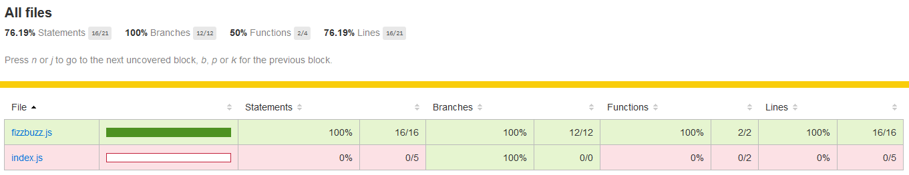

# 100 Days Of Code - 学習ログ

## 2020年12月分

### 61日目: 2020年12月1日（火）

**今日の進捗**: 

JavaScriptのクラスについて。

- JavaScriptのクラスはES6での実装。JSのクラスは実際は[特別な関数](https://developer.mozilla.org/ja/docs/Web/JavaScript/Reference/Classes)で、JavaやPythonなどのクラスの概念とは多少異なる。
- クラスの定義には**クラス式**と**クラス宣言**の2パターンがある。ES6以降でいわゆるクラスを定義する際に用いられるのは、クラス宣言だと思われる。
- JSはクラス式での記述を名前なしで書ける。**関数と同様で名前なしのオブジェクトとしてクラスが作成できる**のが特色で、これも「特別な関数」に繋がる仕様。

```javascriptclass Hoge{
  constructor(a, b){
    this.a = a;
    this.b = b;
  }

  foo(arg){
    console.log('Hoge is ' + arg);
  }
}

class Fuga extends Hoge{
  constructor(a, b, c){
    super(a, b);
    this.c = c;
    this.d = c ** 2;
  }

  bar(arg){
    console.log('Fuga is ' + arg);
  }
}

class Piyo extends Hoge{
  constructor(a, b){
    super(a, b);
  }

  foo(arg){
    console.log('piyo is ' + arg)
  }
}

class Hogera extends Hoge{
  constructor(){
    super(9, 99);
    this.f = 999;
  }
  
  foofoo(){
    super.foo('foobarbaz');
  }
  
  barbar(arg){
    super.foo(arg);
  }
}

let hoge = new Hoge(1, 2);
console.log(hoge.a, hoge.b);
hoge.foo('foo');

let fuga = new Fuga(3, 4, 5);
console.log(fuga.a, fuga.b, fuga.c, fuga.d);
fuga.foo('foo');
fuga.bar('bar');

let piyo = new Piyo(6, 7);
console.log(piyo.a, piyo.b);
piyo.foo('foo');

let hogera = new Hogera();
console.log(hogera.a, hogera.b, hogera.f);
hogera.foofoo();
hogera.barbar('barbar');
```

- 上記のように`class 名前 {}`で記述するタイプがクラス宣言。
- `extend`を用いることでクラスの継承が可能。

```console
1 2
"Hoge is foo"
3 4 5 25
"Hoge is foo"
"Fuga is bar"
6 7
"piyo is foo"
9 99 999
"Hoge is foobarbaz"
"Hoge is barbar"
```

- 継承しつつメソッドを改変することで、メソッドのオーバーライドも可能。

```javascript
let Hoge = class{
  constructor(a, b){
    this.a = a;
    this.b = b;
  }

  foo(arg){
    console.log('hoge is ' + arg);
  }
}

let Fuga = class Hogehoge {
  constructor(a, b, c){
    this.aa = a;
    this.bb = b;
    this.cc = c;
  }

  foo(arg){
    console.log('fuga is ' + arg);
  }
}

let hoge = new Hoge(1, 2);
console.log(hoge.a, hoge.b);
hoge.foo('foo');

console.log(Hoge.name);

let fuga = new Fuga(3, 4, 5);
console.log(fuga.aa, fuga.bb, fuga.cc);
fuga.foo('foo');

console.log(Fuga.name);
```

- `=`を使って任意の変数に代入する形式で宣言するのがクラス式。
- 1つ目の宣言では匿名で、2つ目の宣言では名前付きでクラスを定義している（`class`の後が名前）。ここの名前は**インスタンス生成時には関係がない**。なぜなら、`new`する際は変数で宣言した方の名前を利用する（ここでは`Hoge`あるいは`Fuga`）ため、クラスの代入時に記述していた名前はこれと言った効力を持たない。じゃあ何のためにあるかというと、`name`プロパティで特定の名前を取得する必要がある場合に、名前を記述する。逆に言えば、その必要がないなら匿名クラスで宣言してしまえばいい、ということになる。

```console
12
hoge is foo
Hoge
345
fuga is foo
Hogehoge
```

- 匿名で代入した場合と、名前をつけてから代入した場合で、`name`プロパティを表示してみたときの挙動が異なっていることがわかる。

----

p5.jsでクリックされたときの処理を記述する方法。

- 「マウスがクリックされている間」と「マウスがクリックされた瞬間」で異なるコードを記述する必要がある。

```javascript
let color = 255;

function setup(){
  createCanvas(800, 600);
  fill(color);
}

function draw(){
  background(0);
  
  fill(color);
  
  if (mouseIsPressed){
    rect(mouseX, mouseY, 100, 100);
  }
}

function mousePressed(){
  color = random(200);
}
```

- システム変数である`mousePressed`と関数である`mousePressed()`は、マウスのクリックに反応する点では共通しているが、`mousePressed`は「クリックしている間」、`mousePressed()`は「クリックされた瞬間」で、それぞれ役割が異なる。
- 上記だとマウスがクリックされた瞬間にランダムで値を取得、描画処理の中でその取得された値を用いて長方形を塗りつぶす。クリックされた瞬間に値が変化するが、クリックされている間は長方形を描画するだけなので、塗りつぶす色が変化するようなことはない。

**思ったこと**: 

- p5.jsで任意のオブジェクトを複数定義する必要がある場合、このクラスを宣言しインスタンスを生成する。生成したインスタンスそれぞれについて、クラスのプロパティを更新するようなメソッドを実行してやれば、複数のオブジェクトを操作できる。

**リンク**

1. [クラス](https://developer.mozilla.org/ja/docs/Web/JavaScript/Reference/Classes)
1. [JavaScriptのclass](https://qiita.com/jooex/items/981824f9fb494b448a08#%E7%B6%99%E6%89%BF)
1. [p5.jsで楽しもうマウス&カーソルインタラクション](http://blog.livedoor.jp/reona396/archives/55826829.html)

### 62日目: 2020年12月2日（水）

**今日の進捗**: 

`create-react-app`は、いつの間にかnpmのグローバルインストールをサポートしなくなっていた。

- npmによりグローバルインストールして`create-react-app`を単体で実行するのではなく、`npx create-react-app app-name`とnpmのタスクランナーを使って`create-react-app`する方式に変わっている。

```console
You are running create-react-app 4.0.0, which is behind the latest release (4.0.1).
We no longer support global installation of Create React App.
```

- [ここ](https://stackoverflow.com/questions/64963796/create-react-app-is-not-working-since-version-4-0-1)と同様に、npmでグローバルインストールしている環境（dockerコンテナ内）において`npx create-react-app app-name`しようとしたところ上記のエラーが表示された。
- メッセージにはグローバルインストールされてる`create-react-app`は削除しろ、とご丁寧にもコマンド付きでメッセージが表示される。
- 上記を実行したのがdockerコンテナ内だったため、コマンドで`create-react-app`を削除するのではなく、Dockerfile内に記述していたnpmによるグローバルインストールするコマンド部分を削除した。
- ちなみに、じゃあReactのアプリを新規作成するにはどうすればいいかというと、単純にNode.js環境において任意のフォルダで`npx create-react-app app-name`を実行すればいい。Node.jsがあればnpmもnpxもあるだろうから、作成のためのプログラム（`create-react-app`のこと）は**実行時点の最新版を使ってアプリ作成をしようね**ということらしい。

----

[Jest](https://jestjs.io/ja/)の[Getting Started](https://jestjs.io/docs/ja/getting-started)をやってみる。

- まずはNode.js環境において`npx create-react-app work-jest`を実行して開発環境を構築する。この時点でJestも同梱されているので、個別にインストールする必要はない。

```console
yarn add --dev react-test-renderer
```

- 次に`react-test-renderer`をインストールする。`react-test-renderer`とはFacebook謹製のテストライブラリ。
- 他にはAirbnb製の[enzyme](https://github.com/airbnb/enzyme)あたりが有名らしいが、[React Hooksと相性が悪い](https://kumaaaaa.com/react-testing/)らしいので今回は利用しなかった。
- 他にenzymeと似たような使い方ができる[react-testing-library](https://github.com/testing-library/react-testing-library)というのもある。`create-react-app`した時点でインストールされ利用できるようになり、`create-react-app`直後の`src`フォルダを見ると`App.test.js`という名前でテスト用スクリプトが作成されている。
- [Reactのチュートリアル](https://ja.reactjs.org/tutorial/tutorial.html)と同様に、`src`フォルダ内のファイルは全て削除しておく。

```javascript
function sum(a, b) {
    return a + b;
}

module.exports = sum;
```

- `src`フォルダに`sum.js`という名前でJSファイルを作成する。内容は上記の通り。


```javascript
const sum = require('./sum');

test('adds 1 + 2 to equal 3', () => {
    expect(sum(1, 2)).toBe(3);
});
```

- 同じフォルダに`sum.test.js`という名前でファイルを作る。内容は上記の通り。
- [Getting Started](https://jestjs.io/docs/ja/getting-started)では上記の2ファイルを作成したらpackage.jsonを変更しろと書いてあるが、`create-react-app`経由で開発環境を作成した場合は不要。
- コンソールで`yarn test`を実行する。

```console
PASS  src/sum.test.js (10.242 s)
  ✓ adds 1 + 2 to equal 3 (2 ms)

Test Suites: 1 passed, 1 total
Tests:       1 passed, 1 total
Snapshots:   0 total
Time:        14.312 s
Ran all test suites.

Watch Usage
 › Press f to run only failed tests.
 › Press o to only run tests related to changed files.
 › Press q to quit watch mode.
 › Press p to filter by a filename regex pattern.
 › Press t to filter by a test name regex pattern.
 › Press Enter to trigger a test run.
```

- しばらく放置していると、上記のような結果が表示される。「PASS」となっていることから、テストが正常に終了したことがわかる。ちなみにコンソールに戻るにはqを押す。
- 上記のように、コンポーネントを作成し、そのコンポーネント用のテストファイルを作成し、テストを実行しその結果を確認する。この一連の流れをJestで行える。今回はコンポーネントが返す結果がテストで予想される結果と一致しているか、`expect`と`toBe`を使って確認した。つまり、`expect`でコンポーネントを任意の値で実行し、その結果が`toBe`で指定した結果と一致していることを確認している。

```javascript
function sum(a, b) {
    return a - b; // +から-に変更
}

module.exports = sum;
```

- ここで`sum.js`を上記のように変更する。加算を減算に変更している。この状態で、先ほどと同様にテストを実行してみる。

```console
FAIL  src/sum.test.js (9.161 s)
  ✕ adds 1 + 2 to equal 3 (3 ms)

  ● adds 1 + 2 to equal 3

    expect(received).toBe(expected) // Object.is equality

    Expected: 3
    Received: -1

      2 | 
      3 | test('adds 1 + 2 to equal 3', () => {
    > 4 |     expect(sum(1, 2)).toBe(3);
        |                       ^
      5 | });

      at Object.<anonymous> (src/sum.test.js:4:23)

Test Suites: 1 failed, 1 total
Tests:       1 failed, 1 total
Snapshots:   0 total
Time:        14.087 s
Ran all test suites.

Watch Usage
 › Press f to run only failed tests.
 › Press o to only run tests related to changed files.
 › Press q to quit watch mode.
 › Press p to filter by a filename regex pattern.
 › Press t to filter by a test name regex pattern.
 › Press Enter to trigger a test run.
```

- 実行したテストが、テストスクリプトのどの部分で失敗したかの結果が表示される。
- qを押すとテストプログラムが終了するが、ここで何も押さないまま`sum.js`を元の加算に修正し保存すると**再テストが自動的に実行される**。

```console
 PASS  src/sum.test.js
  ✓ adds 1 + 2 to equal 3 (2 ms)

Test Suites: 1 passed, 1 total
Tests:       1 passed, 1 total
Snapshots:   0 total
Time:        8.05 s, estimated 10 s
Ran all test suites.

Watch Usage: Press w to show more.
```

- テスト結果が「PASS」に戻って、正常にテストが終了したことがわかる。

**思ったこと**: 

- 去年に変わっていたとか全然気付かなかった・・・。

**リンク**

1. [Quick Start](https://create-react-app.dev/docs/getting-started/#quick-start)
1. [Reactの初期テンプレが作成出来なかった時の対処メモ](https://qiita.com/10mi8o/items/ec12ccf25270626a948b)
1. [新しい React アプリを作る](https://ja.reactjs.org/docs/create-a-new-react-app.html)

### 63日目: 2020年12月3日（木）

**今日の進捗**: 

Jestのインテリセンスを有効にする方法について。

- vscodeのデフォルト設定だと、Jestのテスト用コードを書こうと思ってもインテリセンスが働かない。有効にするには`jsconfig.json`ファイルを用意する必要がある。

```json
{
    "typeAcquisition": {
        "include": [
            "jest"
        ]
    }
}
```

- 上記の内容を記述した`jsconfig.json`を、JSファイルがあるフォルダに格納する。
- たとえばサーバー側コードとクライアント側コードが別に存在する場合は、それぞれを別フォルダに格納し上記のjsonファイルを**それぞれのフォルダに格納する**。
- 一度ファイルを作成したら、vscodeを再起動しなくてもJestのインテリセンスが有効になる。

----

JavaScriptで数値判定を行う`Number.isInteger()`について。

- `Number.isInteger()`は整数に対してtrueを返す。小数などはfalseになるので注意。

```javascript
let $ =(arg)=>{
  console.log(arg);
}

let hoge = (arg)=>{
  if(Number.isInteger(arg)){
    $(arg + ' is number.');
  } else {
    $('Not number: ' + arg + ' type: ' + typeof(arg));
  }
}

hoge(0);
hoge(1);
hoge(0.1);
hoge(-0);
hoge(-1);
hoge(-0.1);
hoge('0');
hoge('1');
hoge('str');
hoge(0x1);
hoge(0b1);
hoge('0x1');
hoge(true);
hoge(false);
hoge(NaN);
hoge(undefined);

```

- 0x1は16進数、0b1は2進数でそれぞれ1を表す。

```console
0 is number.
1 is number.
Not number: 0.1 type: number
0 is number.
-1 is number.
Not number: -0.1 type: number
Not number: 0 type: string
Not number: 1 type: string
Not number: str type: string
1 is number.
1 is number.
Not number: 0x1 type: string
Not number: true type: boolean
Not number: false type: boolean
Not number: NaN type: number
Not number: undefined type: undefined
```

- `0`が整数とかならまぁ妥当だけど、`-0`なんかも整数扱い。負の数も同様に整数扱い。小数は整数じゃないのでfalse。
- `true`や`false`なんかは順当に整数じゃないのでfalse。

----

Jestでのユニットテストをチュートリアル以外のテーマでやってみる。今回は[FizzBuzzでテストするこれ](https://qiita.com/jintz/items/61af86a12b53b24ef121)がちょうどよかったので参考に。

- その前に補足。前回はテスト対象のJSファイルとテスト用のJSファイルを同一のフォルダに格納していたが、今回以降テスト用JSファイルは`__test__`という名前のフォルダに格納する。
- FizzBuzzの機能をJestを使ってテストする。連番を入力にした際、入力が3の倍数のときは「Fizz」、5の倍数のときは「Buzz」、3の倍数かつ5の倍数（つまり15の倍数）のときは「FizzBuzz」を表示する。それ以外の入力は入力された値をそのまま表示する。
- 正の整数以外が入力された場合はエラーにする（文字列はダメだし、負の数もダメ。小数もダメ。）。

- 第1段階として、メインの実行プログラムと入力値を判別して値を返すプログラムをそれぞれ作成する。

```javascript
const calFizzBuzz = require('./fizzbuzz');

const app = () => {
    [...Array(100).keys()].forEach(num => {
        console.log(calFizzBuzz(num));
    });
}
```

- メインは0から99までの数値でそれぞれFizzBuzzの判定を行う。

```javascript
function fizzbuzz(num) {

    let result = num;

    if (num > 0) {
        if (num % 15 === 0) {
            result = 'FizzBuzz';
        } else if (num % 3 === 0) {
            result = 'Fizz';
        } else if (num % 5 === 0) {
            result = 'Buzz';
        }
    }

    return result;

}

module.exports = fizzbuzz;
```

- FizzBuzzの判定は別だしのスクリプトにて行う。その際、`module.exports`を記述して、どの関数を他ファイルで参照可能にするか指定しておく。

```javascript
const fizzbuzz = require('../fizzbuzz');

test('unit test for fizzbuzz', () => {
    expect(fizzbuzz(6)).toBe('Fizz');
    expect(fizzbuzz(10)).toBe('Buzz');
    expect(fizzbuzz(30)).toBe('FizzBuzz');
    expect(fizzbuzz(1)).toBe(1);
    expect(fizzbuzz(1111)).toBe(1111);
});

test('unit error test for fizzbuzz', () => {
    expect(fizzbuzz('hoge')).toThrow(RangeError);
    expect(fizzbuzz(0)).toThrow(RangeError);
    expect(fizzbuzz(-1)).toThrow(RangeError);
}) 
```

- テスト用スクリプトの内容は上記の通り。正常ケースと異常ケースに分けており、異常ケースでは`toThrow()`を使って、関数が例外を投げるかテストしている。

```console
 FAIL  src/__test__/fizzbuzz.test.js (10.506 s)
  ✓ unit test for fizzbuzz (2 ms)
  ✕ unit error test for fizzbuzz (2 ms)

  ● unit error test for fizzbuzz

    expect(received).toThrow(expected)

    Matcher error: received value must be a function

    Received has type:  string
    Received has value: "hoge"

      10 | 
      11 | test('unit error test for fizzbuzz', () => {
    > 12 |     expect(fizzbuzz('hoge')).toThrow(RangeError);
         |                              ^
      13 |     expect(fizzbuzz(0)).toThrow(RangeError);
      14 |     expect(fizzbuzz(-1)).toThrow(RangeError);
      15 | })

      at Object.<anonymous> (src/__test__/fizzbuzz.test.js:12:30)

Test Suites: 1 failed, 1 total
Tests:       1 failed, 1 passed, 2 total
Snapshots:   0 total
Time:        16.474 s
Ran all test suites.
```

- Failとなった。まぁそれはその通りで、テスト対象のコードで例外処理をしていないから。

```javascript
const fizzbuzz = num => {
    let result;

    if (isIntoRange(num)) {
        result = num;
    } else {
        throw new RangeError('invalid arg');
    }

    if (num % 15 === 0) {
        result = 'FizzBuzz';
    } else if (num % 3 === 0) {
        result = 'Fizz';
    } else if (num % 5 === 0) {
        result = 'Buzz';
    }

    return result;
}

const isIntoRange = num => {
    if ((Number.isInteger(num)) && (num > 0)) {
        return true;
    } else {
        return false;
    }
}

module.exports = fizzbuzz;
```

- じゃあ・・・というわけでFizzBuzzの内容を書き直し、範囲内かどうかを判定するコードを追加した。また、範囲外の場合はエラーをthrowするコードも同様に追加した。
- 保存すると`yarn test`を実行したままにしていれば、自動的にテストしてくれる。

```console
 FAIL  src/__test__/fizzbuzz.test.js (9.677 s)
  ✓ unit test for fizzbuzz (3 ms)
  ✕ unit error test for fizzbuzz

  ● unit error test for fizzbuzz

    RangeError: invalid arg

       5 |         result = num;
       6 |     } else {
    >  7 |         throw new RangeError("invalid arg");
         |               ^
       8 |     }
       9 | 
      10 |     if (num % 15 === 0) {

      at fizzbuzz (src/fizzbuzz.js:7:15)
      at Object.<anonymous> (src/__test__/fizzbuzz.test.js:12:12)

Test Suites: 1 failed, 1 total
Tests:       1 failed, 1 passed, 2 total
Snapshots:   0 total
Time:        14.616 s
Ran all test suites.
```

- **エラーになったじゃねーか**。これはテストコードの書き方に問題がある。

```javascript
test('unit error test for fizzbuzz', () => {
    expect(fizzbuzz('hoge')).toThrow(RangeError);
    expect(fizzbuzz(0)).toThrow(RangeError);
    expect(fizzbuzz(-1)).toThrow(RangeError);
}) 
```

- 上記のように`expect(関数())`と書いてしまうと、**expectが実行される前に引数に指定されている関数が実行されてしまう**。
- 引数に`fizzbuzz('hoge')`を指定している場合、`expect()`という関数を実行する前に実行してしまう（`hoge(fuga(piyo()))`と記述されていれば`piyo()`＞`fuga()`＞`hoge()`の順に実行されるのと同等）。そのため、`expect().toThrow()`による実行結果評価の前に`fizzbuzz('hoge')`において例外が発生してしまい処理が異常終了するため、実行結果評価が行えず上記のようなエラーになる。
- じゃあどうすればいいかというと、**関数を渡す**ことで回避できる。

```javascript
test('unit error test for fizzbuzz', () => {
    expect(() => fizzbuzz('hoge')).toThrow(RangeError);
    expect(() => fizzbuzz(0)).toThrow(RangeError);
    expect(() => fizzbuzz(-1)).toThrow(RangeError);
}) 
```

- 上記のようにテスト用スクリプトに記述する。

```console
 PASS  src/__test__/fizzbuzz.test.js (9.612 s)
  ✓ unit test for fizzbuzz (3 ms)
  ✓ unit error test for fizzbuzz (22 ms)

Test Suites: 1 passed, 1 total
Tests:       2 passed, 2 total
Snapshots:   0 total
Time:        14.609 s
Ran all test suites.
```

- エラーケースを含め、正常終了した。

```javascript
test('unit error test for fizzbuzz', () => {

    const hoge = () => fizzbuzz('hoge');

    expect(hoge()).toThrow(RangeError);
}) 
```

- ちなみに上記のように関数を任意の変数に格納しておく場合、`expect()`の引数に指定した変数に**カッコをつけてはいけない**。

```console
 FAIL  src/__test__/fizzbuzz.test.js (10.972 s)
  ✓ unit test for fizzbuzz (3 ms)
  ✕ unit error test for fizzbuzz (1 ms)

  ● unit error test for fizzbuzz

    RangeError: invalid arg

       5 |         result = num;
       6 |     } else {
    >  7 |         throw new RangeError("invalid arg");
         |               ^
       8 |     }
       9 | 
      10 |     if (num % 15 === 0) {

      at fizzbuzz (src/fizzbuzz.js:7:15)
      at hoge (src/__test__/fizzbuzz.test.js:13:24)
      at Object.<anonymous> (src/__test__/fizzbuzz.test.js:15:12)

Test Suites: 1 failed, 1 total
Tests:       1 failed, 1 passed, 2 total
Snapshots:   0 total
Time:        16.755 s
Ran all test suites.
```

- このようにエラーになる。これも先ほどの現象と同様で、`expect()`における評価が行われる前に`hoge()`が実行されてしまい、その時点で例外エラーとして異常終了してしまうため。

```javascript
test('unit error test for fizzbuzz', () => {

    const hoge = () => fizzbuzz('hoge');

    expect(hoge).toThrow(RangeError);
}) 
```

- 回避策は**引数の変数にカッコを付けず値として渡す**こと。

```console
 PASS  src/__test__/fizzbuzz.test.js (9.51 s)
  ✓ unit test for fizzbuzz (3 ms)
  ✓ unit error test for fizzbuzz (21 ms)

Test Suites: 1 passed, 1 total
Tests:       2 passed, 2 total
Snapshots:   0 total
Time:        14.479 s
Ran all test suites.
```

- カッコを付けないと、上記のようにエラーケース含めて正常終了した。

**思ったこと**: 

- 本当にファイルを作っただけでインテリセンスが有効になった。スゲー。
- エラーケースのテストには関数を渡さないとダメなの、[オフィシャルだと事前に関数を準備してる](https://jestjs.io/docs/ja/expect#tothrowerror)のに気付かなかった。しかもちゃんと注意書きまでされていたのに、ググってやっとわかった。

> 注意： 関数の中のコードはラップしてください。そうしなければエラーが補足されず、アサーションは失敗します。

- つまり`expect()`は[高階関数](https://www.javadrive.jp/javascript/function/index16.html)なんだな。

**リンク**

1. [jsconfig.json](https://code.visualstudio.com/docs/languages/jsconfig)
1. [Intellisense for Jest not working in VS code](https://stackoverflow.com/questions/57874114/intellisense-for-jest-not-working-in-vs-code)
1. [toThrow](https://jestjs.io/docs/ja/expect#tothrowerror)
1. [Jestでの例外処理テストtoThrow](https://teratail.com/questions/259723)

### 64日目: 2020年12月4日（金）

**今日の進捗**: 

Jestのテストカバレッジについて。

- テスト実行時にオプションを付けることで、テストカバレッジをHTML形式で出力できる。

```console
$ yarn test --covarage
 PASS  src/__test__/fizzbuzz.test.js (10.093 s)
  ✓ unit test for fizzbuzz (3 ms)
  ✓ unit error test for fizzbuzz (23 ms)

-------------|---------|----------|---------|---------|-------------------
| File          | % Stmts   | % Branch   | % Funcs   | % Lines   | Uncovered Line #s   |
| ------------- | --------- | ---------- | --------- | --------- | ------------------- |
| All files     | 76.19     | 100        | 50        | 76.19     |
| fizzbuzz.js   | 100       | 100        | 100       | 100       |
| index.js      | 0         | 100        | 0         | 0         | 1-9                 |
| ------------- | --------- | ---------- | --------- | --------- | ------------------- |
Test Suites: 1 passed, 1 total
Tests:       2 passed, 2 total
Snapshots:   0 total
Time:        24.715 s
Ran all test suites.
```

- 上記のように`--coverage`を指定すると、出力結果に各ファイルごとのカバレッジが表示される。
- さらに、「coverage」という名前のフォルダが生成され、カバレッジがHTML形式で保存される。



- それぞれのJSファイルについて結果を確認できる。


- 赤くなっている部分が「ここテストしてねぇぞ」という意味。

----

Jestを使ってテストをする際に、値のテストをするための「マッチャー（Matcher）」が用意されている。

- 値をテストする際に**等価であるか否か**を判定する`toBe()`。

```javascript
test('unit test for fizzbuzz', () => {
    expect(fizzbuzz(6)).toBe('Fizz');
    expect(fizzbuzz(10)).toBe('Buzz');
    expect(fizzbuzz(30)).toBe('FizzBuzz');
    expect(fizzbuzz(1)).toBe(1);
    expect(fizzbuzz(1111)).toBe(1111);
});
```

- これらは`fizzbuzz()`という関数において、その戻り値が`toBe()`に設定した値と一致することをテストする。

```javascript
test('object assignment', () => {
  const data = {one: 1};
  data['two'] = 2;
  expect(data).toEqual({one: 1, two: 2});
});
```

- オブジェクトの要素について値のテストする場合は、`toEqual()`を利用する。
- `toEqual()`は、オブジェクトまたは配列のすべての要素について、再帰的にチェックする。

```javascript
test('adding positive numbers is not zero', () => {
  for (let a = 1; a < 10; a++) {
    for (let b = 1; b < 10; b++) {
      expect(a + b).not.toBe(0);
    }
  }
});
```

- `not`を付与することで、計算結果が`toBe()`で指定した値**ではない**テストを行うことも可能。

----

- 真偽値や`undefined`、`null`などについてテストする場合は、それぞれ別個にマッチャーが用意されている。

```javascript
test('null', () => {
  const n = null;
  expect(n).toBeNull();
  expect(n).toBeDefined();
  expect(n).not.toBeUndefined();
  expect(n).not.toBeTruthy();
  expect(n).toBeFalsy();
});

test('zero', () => {
  const z = 0;
  expect(z).not.toBeNull();
  expect(z).toBeDefined();
  expect(z).not.toBeUndefined();
  expect(z).not.toBeTruthy();
  expect(z).toBeFalsy();
});
```

- こいつらも`not`が使える。それぞれのマッチャーの解説は[ここ](https://jestjs.io/docs/ja/using-matchers)を見た方が早い。

----

- 値について一致ではなく大小を確認したい場合は`toBe()`だとできないので、別のマッチャーを利用する。

```javascript
test('two plus two', () => {
  const value = 2 + 2;
  expect(value).toBeGreaterThan(3);
  expect(value).toBeGreaterThanOrEqual(3.5);
  expect(value).toBeLessThan(5);
  expect(value).toBeLessThanOrEqual(4.5);

  // toBe and toEqual are equivalent for numbers
  expect(value).toBe(4);
  expect(value).toEqual(4);
});
```

- 名前を見ればわかるが一応。
    - toBeGreaterThan()：ある値より大きい
    - toBeGreaterThanOrEqual()：ある値以上
    - toBeLessThan()：ある値未満
    - toBeLessThanOrEqual()：ある値以下

```javascript
test('adding floating point numbers', () => {
  const value = 0.1 + 0.2;
  //expect(value).toBe(0.3);         このように書くと、丸め込み誤差が原因で期待通りに動作しない
  expect(value).toBeCloseTo(0.3); // これならば正しく動く
});
```

- 丸め誤差を意識しないといけない場合は、上記のように`toBeCloseTo()`を利用する。

----

文字列を等価ではなく**正規表現でチェックしたい**場合は`toMatch()`を利用する。

```javascript
test('there is no I in team', () => {
  expect('team').not.toMatch(/I/);
});

test('but there is a "stop" in Christoph', () => {
  expect('Christoph').toMatch(/stop/);
});
```

- `toMatch()`の引数に正規表現を記述することで、その正規表現を満たすか否かをテストする。

----

- 配列や反復可能なオブジェクトの要素に、特定の値が含まれているかをテストするには`toContain()`を利用する。

```javascript
const shoppingList = [
  'diapers',
  'kleenex',
  'trash bags',
  'paper towels',
  'beer',
];

test('the shopping list has beer on it', () => {
  expect(shoppingList).toContain('beer');
  expect(new Set(shoppingList)).toContain('beer');
});
```

----

投げられる例外を確認するには`toThrow()`を利用する。そして`toThrow()`を利用する場合、`expect()`に指定する関数はアロー関数などで**ラップする必要がある**。

```javascript
function compileAndroidCode() {
  throw new Error('you are using the wrong JDK');
}

test('compiling android goes as expected', () => {
  expect(() => compileAndroidCode()).toThrow();
  expect(() => compileAndroidCode()).toThrow(Error);

  // You can also use the exact error message or a regexp
  expect(() => compileAndroidCode()).toThrow('you are using the wrong JDK');
  expect(() => compileAndroidCode()).toThrow(/JDK/);
});
```

- `toThrow()`の引数は、文字列やエラーの種類など様々な値を設定可能。

----

非同期処理のJestによるテストについてメモ。

```javascript
const returnMessage = () => {
    let promise = new Promise((resolve, reject) => {
        setTimeout(() => {
            resolve('hoge');
        }, 1000);
    });

    return promise;
};

module.exports = {
    returnMessage: returnMessage,
};
```

- 上記のような、resolveしたときに文字列`hoge`を返す関数についてテストを行う場合を考える。

```javascript
const fizzbuzz = require('../fizzbuzz');

test('test for asynchronous function', () => {
    return fizzbuzz.returnMessage().then(data => {
        expect(data).not.toBe('fuga');
        expect(data).toBe('hoge');
        expect(data).not.toMatch(/.*ug.*/);
        expect(data).toMatch(/.*og.*/);
    });
})
```

- `return`を**必ず記述した状態で**目的の関数を実行する。結果は`then()`のハンドラー関数によりPromiseが返されるので、その返ってきた値の内容をチェックする。
- 今回は`hoge`という文字列がresolveで返ってくる仕様なので、結果が`fuga`でない・`hoge`である、あるいは正規表現の条件を満たす・満たさないなどのテストを実行している。
- ここで`return`を記述しないと、テスト目的の関数が実行されresolveが返ってきてコールバック関数が実行される**前に**テストが終了してしまう。すると本来**FAILになるケースでもPASSしてしまう**ため、テストを実行する意味がなくなってしまう。

> もしこの return 文を省略した場合、あなたのテストは、fetchDataがresolveされpromiseが返ってくる前に実行され、then() 内のコールバックが実行される前に完了してしまいます。

**思ったこと**: 

- ちなみにカバレッジとは網羅率のこと。

**リンク**

1. [Jest CLI Options](https://jestjs.io/docs/ja/cli#--coverageboolean)
1. [jestでテストカバレッジを見る](https://qiita.com/monisoi/items/44931e36c5f7b1f4e683)
1. [Promise.prototype.then()](https://developer.mozilla.org/ja/docs/Web/JavaScript/Reference/Global_Objects/Promise/then)
1. [Testing Asynchronous Code](https://jestjs.io/docs/ja/asynchronous#promises)
1. [jest で非同期関数をテストするときの注意点](https://qiita.com/ef81sp/items/178ed17982b13535ad59)
1. [Get return value from setTimeout [duplicate]](https://stackoverflow.com/questions/24928846/get-return-value-from-settimeout)

### 65日目: 2020年12月5日（土）

**今日の進捗**: 

JavaScriptのオブジェクトリテラルを関数の引数に指定する方法について。

- オブジェクトリテラルを関数の引数に指定することができる。

```javascript
const $ = (arg) =>{
  console.log(arg);
}

const hoge = ({foo, bar}) =>{
  $('hoge: ' + foo);
  $('hoge: ' + bar);
};

hoge({foo:'eggs', bar:'ham'});
hoge({bar:'ham', foo:'eggs'});
```

- 上記のように`({foo, bar})`と引数にオブジェクトリテラル記法で指定することで、関数実行時に引数の順番を意識することなく値の設定が可能。

```console
hoge: eggs
hoge: ham
hoge: eggs
hoge: ham
```

- 記述方法は異なるが、実行結果は一致している。

----

オブジェクトリテラルとは、オブジェクトを定義する記述方法。オブジェクト初期化子とか言ったりするらしい。

- オブジェクトを記述する際に書いている、波かっこで囲う書き方のこと。

```javascript
let hoge = {
  'foo': 1,
  'bar': 2,
  'baz': 3,
};

let fuga = {};
```

- 上記のように、プロパティと値が設定してあってもいいし、空のオブジェクトであっても問題ない。

```javascript
let piyo = new Object(); // let piyo = {};と同等
```

- 上記のようにJavaScriptのObjectクラスを用いてnewする方法もあるが、波かっこで囲うほうが早いのでわざわざ書くことはあまりない。

----

JSの分割代入について。

- JSのオブジェクトについて分割代入をする場合、分割代入**される側にイコールが存在する書き方がある**。

```javascript
let {hoge=1, fuga=2} = {hoge: 3};

console.log(hoge);
console.log(fuga);
```

- もうパッと見で何やってるかさっぱりわからないが、とりあえずコンソールへの出力結果はどうなるか。

```console
3
2
```

- プロパティ名の一致する`hoge`のみ値が書き換わり、代入元（右辺のオブジェクト）に存在しなかった`fuga`はもともと設定されていた値が出力される。
- オブジェクトの分割代入において、オブジェクトから取り出した値が`undefined`であった場合の**規定値を左辺側で定義できる**。今回はそれぞれ1と2を規定値として記述したが、値の取り出し元である右辺のオブジェクトからは`hoge`プロパティの値のみが取り出せたため、`hoge`の値が右辺のものになり、`fuga`の値は規定値を採用した、ということ。

```javascript
const func = ({hoge=1, fuga=2} = {}) => {
  console.log(hoge);
  console.log(fuga);
};

func();
func({hoge:99});
func({hoge:100, fuga:200});
```

- この特性を利用して、関数の引数に上記の分割代入を適用する方法がある。

```console
1
2
99
2
100
200
```

オブジェクトによる引数の指定が1つもない場合、任意のプロパティのみ指定した場合、全てのプロパティを指定した場合でそれぞれ挙動が異なる。このように指定される可能性がある引数が可変である想定の場合、オブジェクトとして渡した方がよい場合がある。

```javascript
const func = ({hoge=1, fuga=2}) => { // これはダメ
  console.log(hoge);
  console.log(fuga);
};

func(); // ここでエラー
func({hoge:99});
func({hoge:100, fuga:200});
```

- なお、上記のように`={}`を削除してしまうと、関数実行時にエラーになってしまう。

```javascript
const func = ({hoge=1, fuga=2}) => {
  console.log(hoge);
  console.log(fuga);
};

func({hoge:99});
func({hoge:100, fuga:200});
```

- `func()`を削除して最低1つでも引数を指定すれば一応実行は可能。

```console
99
2
100
200
```

**思ったこと**: 

- 分割代入の規定値設定って、パッと見で解釈しにくいが引数のオブジェクトにどんなものが入ってくるかわからないケースなんかだと割と使えそうな感じがして悩ましい。
- `={}`を削除するとエラーになるけど、引数なしでの関数実行をやめれば（必ず何かしら引数を指定すれば）実行可能になるのも、まぁなんというかなんだかなぁという感じ。

**リンク**

1. [javascript 関数の引数にオブジェクトリテラルを使用する](https://mebee.info/2020/11/09/post-21564/)
1. [アロー関数(Arrow function)の書き方色々](https://ushumpei.hatenablog.com/entry/2016/09/06/235336)
1. [オブジェクト初期化子](https://developer.mozilla.org/ja/docs/Web/JavaScript/Reference/Operators/Object_initializer)
1. [オブジェクトリテラルの記述方法](https://www.javadrive.jp/javascript/object/index2.html#section1)
1. [分割代入](https://developer.mozilla.org/ja/docs/Web/JavaScript/Reference/Operators/Destructuring_assignment)

### 66日目: 2020年12月6日（日）

**今日の進捗**: 

Dockerで複数のコンテナを同時に立ち上げる際の注意について。

- docker-compose.ymlの`ports`で既存のコンテナと同じポートを指定している場合、「もうそのポート使用されてるぞ」とエラーになる。

```console
Bind for 0.0.0.0:3000 failed: port is already allocated
ERROR: Encountered errors while bringing up the project.
```

- 別のReact用コンテナのdocker-compose.ymlで同一のポートを指定し先にコンテナを起動していたため、すでのそのポートが利用されており新規に使えなかったため上記のエラーが表示された。
- 回避方法としては、別のポートを指定すればいい。たとえば`4000:4000`に変更して問題なければ変更してしまえばいい・・・のだが、Reactは`yarn start`を実行するとデフォルト設定ではポート3000を利用する。docker-compose.yml側でコンテナが利用するポートを3000から変更していた場合、`yarn start`する際に何も指定しないとデフォルトの3000ポートでアプリケーションを起動してしまう。コンテナが準備しているポートとコンテナ内で実行されているアプリケーションが利用するポートが異なるため、ブラウザなどからアクセスできなくなってしまう。よって、アプリケーションが利用するポートをdocker-compose.ymlに記述してあるポートと一致させる必要がある。

```console
PORT=4000 yarn start
```

-そのためには環境変数として`yarn start`時にポートを指定する方法がある。

```console
export PORT=4000
```

- あるいは、他のアプリケーションに影響がなければそのコンテナの環境変数に登録してしまってもいい。
- さらにプロジェクトのルートフォルダ（docker-compose.ymlがいるのと同じフォルダ）に`.env`ファイルを作成し、その中にポートを指定する方法もある。これについては[リンク](https://qiita.com/urouro_net/items/dd7166f9728d08bc933b)を参照。ちなみに、`.env`ファイルを作成した場合は、そのファイルを参照するようにdocker-compose.ymlを修正する必要がある。

```console
version: '3'

services:
  node:
    build:
      context: ./
      dockerfile: Dockerfile
    volumes:
    - ./:/home/workdir
    ports:
    - "4000:4000"
    env_file: .env # こんな感じ
```

- なお、`.env`ファイルはこういう名前のファイルを作成する。`任意の名前.env`というような拡張子ではなく、`.env`という名前の設定ファイルとして作成すること。

----

JavaScriptでの三項演算子について。

- JSで唯一、3つのオペランドを取るのが三項演算子。

```javascript
let hoge = true;

let fuga = hoge ? 'hoge':'fuga';

let piyo = hoge ? arg=>console.log('piyo: ' + arg): ()=>console.log('ng');

console.log(hoge);
console.log(fuga);
piyo('foo');

const ham = (arg) => arg ? 'egg': 'spam';

console.log(ham(1));
```

- `condition ? exprIfTrue : exprIfFalse`が構文で、要はif文をもっと簡略化した感じ。ただJSならではなのは戻り値に関数を仕込めることか。

```console
true
hoge
piyo: foo
egg
```

- 実行結果はこんな感じ。

```javascript
let hoge = false;

let fuga = hoge ? 'hoge':'fuga';

let piyo = hoge ? arg=>console.log('piyo: ' + arg): ()=>console.log('ng');

console.log(hoge);
console.log(fuga);
piyo('foo');

const ham = (arg) => arg ? 'egg': 'spam';

console.log(ham(0));
```

- ちなみに、`false`のパターンは上記の通り。

```console
false
fuga
ng
spam
```

- 実行結果はこんな感じ。

```javascript
const greeting = (name) => {
  person = name ? name : 'stranger';
  return 'Hi, ' + person + '.';
}

console.log(greeting('Chris'));
console.log(greeting());
```

- その他の使い方に、入力値がNullだった場合の条件分岐が考えられる。

```console
Hi, Chris.
Hi, stranger.
```

- 上記では、名前が入力されていればそのまま出力し、名前がなかった場合（Nullだった場合「）は任意の文字列を付与する。

```javascript
let hoge = (foo, bar, baz) => {
  return foo ? 'hoge' : bar ? 'fuga' : baz ? 'piyo' : 'nothing';
}

console.log(hoge());

[...Array(2).keys()].forEach(i => {
  [...Array(2).keys()].forEach(j => {
    [...Array(2).keys()].forEach(k => {
      console.log('i:' + i + ', j:' + j + ', k:' + k);
      console.log(hoge(i, j, k));
    })
  })
})
```

- `if ... else if ... else`のように、条件を連結することもできる。

```console
nothing
i:0, j:0, k:0
nothing
i:0, j:0, k:1
piyo
i:0, j:1, k:0
fuga
i:0, j:1, k:1
fuga
i:1, j:0, k:0
hoge
i:1, j:0, k:1
hoge
i:1, j:1, k:0
hoge
i:1, j:1, k:1
hoge
```

- 実行結果はこんな感じ。

----

p5.jsでガウスぼかしをかける。

```javascript
let img;
let blurVal = 0;

function preload(){
  img = loadImage('https://upload.wikimedia.org/wikipedia/commons/d/dc/Colorful_neon_street_signs_in_Kabukich%C5%8D%2C_Shinjuku%2C_Tokyo.jpg');
}

function setup(){
  createCanvas(800, 600);
  
}

function draw(){
  background(0);
  
  image(img, 0, 0, width, height);
  filter(BLUR, blurVal);
  
  blurVal += 1;
}
```

- `filter(BLUR, value);`で簡単にガウスぼかしを適用できる。値を大きくすればぼかし具合も大きくなる。

**思ったこと**: 

- 相変わらず見慣れたころに、また新しい記述方法を見かけるのでJSってホントに飽きないなー（棒

**リンク**

1. [create-react-app の npm start のポート番号を変える](https://qiita.com/urouro_net/items/dd7166f9728d08bc933b)
1. [Environment variables in Compose](https://docs.docker.com/compose/environment-variables/#the-env-file)
1. [条件 (三項) 演算子](https://developer.mozilla.org/ja/docs/Web/JavaScript/Reference/Operators/Conditional_Operator)
1. [【p5.js】画像にガウスぼかしをかける](https://note.com/ttttttttttt/n/n0d93f04db8b7)

### 67日目: 2020年12月7日（月）

**今日の進捗**: 

[pandas](https://pandas.pydata.org/)で欠損値を含む行や列を削除する方法。

- pandasの`dropna()`を使って、欠損値を含む行や列を削除する。

```python
>>> import pandas as pd
>>> import io
>>> s = '''a,b,c
... 1,2,3
... foo,bar,
... ,,
... ham,,spam
... hoge,fuga,piyo
... ,5,6
... ,,
... '''
>>> df = pd.read_csv(io.StringIO(s))
>>> df
      a     b     c
0     1     2     3
1   foo   bar   NaN
2   NaN   NaN   NaN
3   ham   NaN  spam
4  hoge  fuga  piyo
5   NaN     5     6
6   NaN   NaN   NaN
```

- データフレームの内容はこんな感じ。

```python
>>> df.dropna()
      a     b     c
0     1     2     3
4  hoge  fuga  piyo
```

- 欠損値が1つ以上含まれている行を削除するときは、何も引数に指定しない。正確には`how='any'`という指定がデフォルトの引数に指定されている。

```python
>>> df['d'] = 99
>>> df
      a     b     c   d
0     1     2     3  99
1   foo   bar   NaN  99
2   NaN   NaN   NaN  99
3   ham   NaN  spam  99
4  hoge  fuga  piyo  99
5   NaN     5     6  99
6   NaN   NaN   NaN  99
>>> df.dropna(axis=1)
    d
0  99
1  99
2  99
3  99
4  99
5  99
6  99
```

- 欠損値が1つ以上含まれている列を削除するときは、`axis=1`とする。

```python
>>> df = df.drop('d', axis=1)
>>> df
      a     b     c
0     1     2     3
1   foo   bar   NaN
2   NaN   NaN   NaN
3   ham   NaN  spam
4  hoge  fuga  piyo
5   NaN     5     6
6   NaN   NaN   NaN
>>> df.dropna(how='all')
      a     b     c
0     1     2     3
1   foo   bar   NaN
3   ham   NaN  spam
4  hoge  fuga  piyo
5   NaN     5     6
```

- 全ての項目列が欠損値である行を削除する場合は、引数に`how='all'`と指定する。

```python
>>> df['d'] = pd.Series()
<stdin>:1: DeprecationWarning: The default dtype for empty Series will be 'object' instead of 'float64' in a future version. Specify a dtype explicitly to silence this warning.
>>> df
      a     b     c   d
0     1     2     3 NaN
1   foo   bar   NaN NaN
2   NaN   NaN   NaN NaN
3   ham   NaN  spam NaN
4  hoge  fuga  piyo NaN
5   NaN     5     6 NaN
6   NaN   NaN   NaN NaN
>>> df.dropna(how='all', axis=1)
      a     b     c
0     1     2     3
1   foo   bar   NaN
2   NaN   NaN   NaN
3   ham   NaN  spam
4  hoge  fuga  piyo
5   NaN     5     6
6   NaN   NaN   NaN
```

- 全ての行が欠損値である列を削除する場合は、引数に`how='all', axis=1`を指定する。

```python
>>> df = df.drop('d', axis=1)
>>> df
      a     b     c
0     1     2     3
1   foo   bar   NaN
2   NaN   NaN   NaN
3   ham   NaN  spam
4  hoge  fuga  piyo
5   NaN     5     6
6   NaN   NaN   NaN
>>> df['d'] = pd.Series()
<stdin>:1: DeprecationWarning: The default dtype for empty Series will be 'object' instead of 'float64' in a future version. Specify a dtype explicitly to silence this warning.
>>> df
      a     b     c   d
0     1     2     3 NaN
1   foo   bar   NaN NaN
2   NaN   NaN   NaN NaN
3   ham   NaN  spam NaN
4  hoge  fuga  piyo NaN
5   NaN     5     6 NaN
6   NaN   NaN   NaN NaN
>>> import numpy as np
>>> df['e'] = [10, 11, np.nan, 13, 14, 15, 16]
>>> df
      a     b     c   d     e
0     1     2     3 NaN  10.0
1   foo   bar   NaN NaN  11.0
2   NaN   NaN   NaN NaN   NaN
3   ham   NaN  spam NaN  13.0
4  hoge  fuga  piyo NaN  14.0
5   NaN     5     6 NaN  15.0
6   NaN   NaN   NaN NaN  16.0
>>> df.dropna(how='all').dropna(how='all', axis=1)
      a     b     c     e
0     1     2     3  10.0
1   foo   bar   NaN  11.0
3   ham   NaN  spam  13.0
4  hoge  fuga  piyo  14.0
5   NaN     5     6  15.0
6   NaN   NaN   NaN  16.0
```

- 欠損値しかない行と列を1度に削除したい場合、チェーンさせればいい。

**思ったこと**: 

- しばらくやってないと忘れる・・・。特に`axis=1`の記述忘れて「そんな名前の列はねぇよ」と怒られる・・・。

**リンク**

1. [pandasで欠損値NaNを除外（削除）・置換（穴埋め）・抽出](https://note.nkmk.me/python-pandas-nan-dropna-fillna/)


### 68日目: 2020年12月8日（火）

**今日の進捗**: 

データフレームに欠損値`NaN`を追加する方法について。

- 使いそうなシチュエーションがあまり思い浮かばないが、必要になったときに困るのでメモ。
- 欠損値`NaN`は、CSVを読み込んだデータフレームに含まれたりもするが、自分で追加もできる。ここでは「`NaN`しかない列」「`NaN`を含む列」それぞれの追加方法をメモしておく。

```python
>>> import pandas as pd
>>> import numpy as np
>>> import io
>>> s = '''a,b,c
... 1,2,3
... ,4,
... 5,,6
... ,,
... '''
>>> df = pd.read_csv(io.StringIO(s))
>>> df
     a    b    c
0  1.0  2.0  3.0
1  NaN  4.0  NaN
2  5.0  NaN  6.0
3  NaN  NaN  NaN
```

- このデータフレームに列を追加してみる。

```python
>>> df['d'] = np.nan
>>> df
     a    b    c   d
0  1.0  2.0  3.0 NaN
1  NaN  4.0  NaN NaN
2  5.0  NaN  6.0 NaN
3  NaN  NaN  NaN NaN
```

- numpyを利用してスカラー値で追加する方法。指定された列に含まれるデータは全て`NaN`になる。

```python
>>> df['e'] = pd.Series()
<stdin>:1: DeprecationWarning: The default dtype for empty Series will be 'object' instead of 'float64' in a future version. Specify a dtype explicitly to silence this warning.
>>> df
     a    b    c   d   e
0  1.0  2.0  3.0 NaN NaN
1  NaN  4.0  NaN NaN NaN
2  5.0  NaN  6.0 NaN NaN
3  NaN  NaN  NaN NaN NaN
```

- pandasのSeriesを利用する方法。空っぽのSeriesを渡してやることで、全データが`NaN`の列を追加する。

```python
>>> df['f'] = [7, 8, 9, np.nan]
>>> df
     a    b    c   d   e    f
0  1.0  2.0  3.0 NaN NaN  7.0
1  NaN  4.0  NaN NaN NaN  8.0
2  5.0  NaN  6.0 NaN NaN  9.0
3  NaN  NaN  NaN NaN NaN  NaN
>>> 
```

- 配列を使って、任意の行だけ`NaN`にする方法。ここではnumpyを利用して明示的に`NaN`を格納している。

```python
>>> df.loc['4'] = np.nan
>>> df
     a    b    c   d   e    f
0  1.0  2.0  3.0 NaN NaN  7.0
1  NaN  4.0  NaN NaN NaN  8.0
2  5.0  NaN  6.0 NaN NaN  9.0
3  NaN  NaN  NaN NaN NaN  NaN
4  NaN  NaN  NaN NaN NaN  NaN
>>> df.loc['5'] = pd.Series()
<stdin>:1: DeprecationWarning: The default dtype for empty Series will be 'object' instead of 'float64' in a future version. Specify a dtype explicitly to silence this warning.
>>> df
     a    b    c   d   e    f
0  1.0  2.0  3.0 NaN NaN  7.0
1  NaN  4.0  NaN NaN NaN  8.0
2  5.0  NaN  6.0 NaN NaN  9.0
3  NaN  NaN  NaN NaN NaN  NaN
4  NaN  NaN  NaN NaN NaN  NaN
5  NaN  NaN  NaN NaN NaN  NaN
>>> df.loc['6'] = ['foo', np.nan, 'bar', np.nan, 'baz', np.nan]
>>> df
     a    b    c   d    e    f
0    1  2.0    3 NaN  NaN  7.0
1  NaN  4.0  NaN NaN  NaN  8.0
2    5  NaN    6 NaN  NaN  9.0
3  NaN  NaN  NaN NaN  NaN  NaN
4  NaN  NaN  NaN NaN  NaN  NaN
5  NaN  NaN  NaN NaN  NaN  NaN
6  foo  NaN  bar NaN  baz  NaN
>>> 
```

- 列だけではなく、行に対しても同様の方法で追加できる。

**思ったこと**: 

- 正直、いつこんな方法使うんだろうって感じだけど、知らないのと知ってるけど使わないのは違うからね。

**リンク**

1. [Pandas DataFrame で空の列を作成する方法](https://www.delftstack.com/ja/howto/python-pandas/how-to-create-an-empty-column-in-pandas-dataframe/)
1. [pandas.DataFrameに列や行を追加（assign, appendなど）](https://note.nkmk.me/python-pandas-assign-append/)

### 69日目: 2020年12月9日（水）

**今日の進捗**: 

pandasのデータフレームにおいて、正規表現でデータ抽出を行う方法について。

- 正規表現でデータ抽出を行う場合、`str.match()`を利用する。

```python
>>> import pandas as pd
>>> import io
>>> s = '''a,b,c
... hoge,fuga,piyo
... foo,bar,baz
... ham,eggs,spam
... '''
>>> df = pd.read_csv(io.StringIO(s))
>>> df
      a     b     c
0  hoge  fuga  piyo
1   foo   bar   baz
2   ham  eggs  spam
>>> df['a'].str.match('.o.*')
0     True
1     True
2    False
Name: a, dtype: bool
>>> df[df['a'].str.match('.o.*')]
      a     b     c
0  hoge  fuga  piyo
1   foo   bar   baz
>>> df['a'].str.match('(?!.o.*)')
0    False
1    False
2     True
Name: a, dtype: bool
>>> df[df['a'].str.match('(?!.o.*)')]
     a     b     c
2  ham  eggs  spam
>>> df['b'].str.match('.*g')
0     True
1    False
2     True
Name: b, dtype: bool
>>> df['b'].str.match('(?!.*g)')
0    False
1     True
2    False
Name: b, dtype: bool
>>> 
```

- `df.str.match()`だけ実行した場合は、その条件に合致しているかの真偽値のみが返ってくる。
- 返ってきた真偽値をもとに、ブールインデックスで行の抽出が可能になる。

```python
>>> df.query("a.str.match('.o.*')")
      a     b     c
0  hoge  fuga  piyo
1   foo   bar   baz
>>> df.query("a.str.match('(?!.o.*)')")
     a     b     c
2  ham  eggs  spam
```

- ブールインデックスだとちょっと可読性に欠ける場合、`query()`を用いた方法で行の抽出が可能。書き方は`df.query("列名.str.match(正規表現)")`とする。`query()`の引数は必ず文字列で渡す。

----

Pythonで正規表現を用いる際の「～ではない」を表現する。

- 「hogeという文字列を**含まない**」というような、notを正規表現で用いる際には**否定的先読み**を使う。
- 否定的先読みとは、`(?!条件)`のように「?!」を丸カッコで囲って表現する方法。なお、「?!」という並びで書かないといけない。

```python
>>> df['a'].str.match('.o.*')
0     True
1     True
2    False
Name: a, dtype: bool
>>> df['a'].str.match('(?!.o.*)')
0    False
1    False
2     True
```

- 結果の真偽値が逆転している（notが付与されたのと同じ）のがわかる。

**思ったこと**: 

- ブールインデックスの書き方より`query()`の方が読みやすいので、そっちに慣れたい。

**リンク**

1. [pandas.Series.str.match](https://pandas.pydata.org/pandas-docs/stable/reference/api/pandas.Series.str.match.html)
1. [pandas.DataFrame.query](https://pandas.pydata.org/docs/reference/api/pandas.DataFrame.query.html)
1. [pandas.DataFrameの行を条件で抽出するquery](https://note.nkmk.me/python-pandas-query/)
1. [re --- 正規表現操作](https://docs.python.org/ja/3/library/re.html)
1. [正規表現で文字列を含まない、否定の記述](https://uxmilk.jp/50674)

### 70日目: 2020年12月10日（木）

**今日の進捗**: 

vscodeで[mermaid](https://github.com/mermaid-js/mermaid)を使ってフローチャートを記述する方法についてメモ。

- mermaidは独特の記法でフローチャートやクラス図を記述するJavaScriptのライブラリ。
- フローチャートに限らず、画像はGitによるバージョン管理がイマイチで、差分を取るのも[WinMerge](https://winmerge.org/)などのソフトウェアが必要で面倒。そこで、「文字列で図形をマークアップすれば差分取るのもバージョン管理するのも楽じゃん」という理由で[PlantUML](https://plantuml.com/ja/)などのライブラリが存在する。
- ここではJSベースのmermaidを利用する。理由は「パッと見の良さ」「内部的にはHTML形式なので必要ならCSSなどで編集が可能」「導入がまあまあ楽」などの点から選択した。
- ガッツリチャートを書く人はワイヤーフレームまで書ける[PlantUML](https://plantuml.com/ja/)の方がいいかもしれない。

----

導入手順は下記の通り。

1. vscodeはすでにインストールされているものとする。
1. 下記の拡張機能をインストールする。
  - Markdown Preview Mermaid Support（Markdown中のmermaid記法を解釈してプレビューしてくれる。）
  - Mermaid Markdown Syntax Highlighting（シンタックスハイライトしてくれる。なくてもいいけどあるととても良い。）
1. 任意のMarkdownファイルに下記のコードをコピペして保存し、プレビューしてみる。

````markdown
  ```mermaid
  stateDiagram
    [*] --> 待機
    待機 --> [*]
    待機 --> 索敵
    索敵 --> 待機
    索敵 --> 威嚇射撃
    威嚇射撃 --> [*]
  ```
````

- 状態遷移図がプレビューされれば成功。

----

Markdownでインラインコードの中にバッククォートを書く方法についてメモ。

- Markdownでコードを記述する場合、バッククォートを3つ並べて書く。ではそのコードの中にバッククォートを含めたい場合はどうするか。その場合は、**最も長いバッククォートより1つ多いバッククォートでコードを囲う**。

````

````

- 上記のようにバッククォートが最大で3つある場合は、**4つのバッククォートで囲うとインラインコードとして扱われる**。

`````
````markdown

````
`````

- シンタックスハイライト用の言語指定は、いつも通りバッククォート後に記述すればいい。

**思ったこと**: 

- インラインコードでバッククォートを書く機会ってあんまりなかったけど、こんな書き方するのか・・・。

**リンク**

1. [作図系ツール・ライブラリまとめ](https://gist.github.com/hashrock/208b84c61558663e40bb)
1. [Markdown でバッククオートを含むインラインコードを書くには](https://qiita.com/uasi/items/251f4e66ceb95c043b3d)
1. [mermaid.js で上流工程を好きになろう](https://qiita.com/caesar_cat/items/e8a116a585863633d15a)

### 71日目: 2020年12月11日（金）

**今日の進捗**: 

p5.jsでベジェ曲線を描画するサンプル。

- [bezierVertex](https://p5js.org/reference/#/p5/bezierVertex)を使ったベジェ曲線は始点と終点の間に任意の制御点を指定することで、それらの点で構成されるベジェ曲線を描画できる。
- 頂点のみを指定する[vertex](https://p5js.org/reference/#/p5/vertex)と比較すると、直感的な理解のしやすさ（あるいは、出力される結果のイメージのしやすさ）に劣るが、始点・終点と途中の制御点を指定すれば曲線を描画できるため、記述するコード量は少なくできる。
- ちなみに出力結果がイメージしにくいのは、始点と終点を覗いた途中の制御点を出力結果の曲線が**通過しないこと**が原因だと思われる。

```javascript
const startX = 100, startY = 100;
const endX = 700, endY = 500;
let seed = 0;
const lineNum = 100;

function setup(){
  createCanvas(800, 600);
  noFill();
  // setPoints();
  background(0, 0, 30);
}

const drawLine = (num) => {
  let noiseVal = noise(num / 1000, num / 1000, seed) * 1000;
  
  beginShape();
  vertex(startX, startY);
  bezierVertex(noiseVal, noiseVal + num, noiseVal, noiseVal, endX, endY);
  endShape();
  
  seed += 0.00003;
}

function draw(){
  background(0, 0, 30);
  
  [...Array(lineNum).keys()].forEach(i => {
    stroke(255, 255, 255, 30);
    strokeWeight(1);
    drawLine(i + (frameCount / 20));
  });
  
  if (frameCount > 600){
    frameCount = 0;
  }
}
```

- 始点と終点のあいだでウロウロする曲線を描画するサンプル。
- 透明度の高い曲線を複数描画することで、「薄い幅広の曲線」を表現できる。

**思ったこと**: 

- たまに制御点が大きくハズレて画面を飛び出すせいか、描画された曲線がCanvas外に出てしまう。ある上限値以上にはならないような制御が必要かもしれない。

**リンク**

1. [p5.jsで「パーリンノイズ」のスゴさを思い知る](https://infosmith.biz/blog/it/p5js-noise)

### 72日目: 2020年12月12日（土）

**今日の進捗**: 

mermaid.jsのグラフを含むMarkdownから、グラフだけを一覧表示するReactアプリを作った。

- [mermaid.js](https://github.com/mermaid-js/mermaid)は、クラス図やフローチャートなどをテキストでマークアップできるJavaScriptのライブラリ。
- テキストからチャートを生成するので、修正が楽だしGitでのバージョン管理も楽。vscodeなんかのIDEで書けるので、Markdown文書だけIDEで書いて他のアプリケーションでチャートを書くなんてことをしなくてもいい。
- たまたま、Markdownの中に含まれるグラフを一覧表示したかったので、Reactでサクッと作った。

```javascript
import React, { useState, useEffect } from 'react';
import ReactDOM from 'react-dom';
import mermaidAPI from 'mermaid';

const splitMermaidSource = (mdFile) => {

    let startReg = /```mermaid.*?```/sg;

    let result = mdFile.match(startReg);

    if (result) {
        return result;
    } else {
        return;
    }

}

function MermaidToPng() {
    const [mmd, setMmd] = useState([]);

    useEffect(() => {
        const f = document.getElementById('file');

        if (f === null) {
            return;
        }

        f.addEventListener('change', (e) => {

            let reader = new FileReader();
            reader.readAsText(e.target.files[0]);
            reader.onload = (() => {
                let splitMMDSource = splitMermaidSource(reader.result);
                if (splitMMDSource) {
                    setMmd([...splitMMDSource]);
                } else {
                    setMmd([]);
                }
            });
        })

    });

    return (
        <div>
            <form id="fileUpload">
                <input id="file" type="file" name="uploadedFile" />
            </form>

            <CountMMD key={'count'} value={mmd} />

            <RenderMMD key={'render'} value={mmd} />

        </div>
    );
}

function CountMMD(props) {

    if (Array.isArray(props.value) && Object.keys(props.value).length > 0) {
        return (
            <div>
                <p>mermaid.jsで書かれたグラフは{props.value.length}枚です。</p>
            </div>
        );

    } else {
        return (
            <div>
                <p>mermaid.jsで書かれたグラフを含んだMarkdownファイルを選択してください。</p>
            </div>
        );
    }
}

function RenderMMD(props) {

    useEffect(() => {
        if (Array.isArray(props.value) && Object.keys(props.value).length > 0) {

            let result = [];
            let svgs = [];

            props.value.forEach(mmdText => {
                let replaced = mmdText.replace(/```mermaid/, '');
                replaced = replaced.replace(/```/, '');
                result.push(replaced);

            });

            console.log('hoge: ' + result);

            mermaidAPI.initialize({
                startOnLoad: true,
            });

            result.map((mmd, idx) => {
                svgs.push(mermaidAPI.render('api_id' + idx, mmd));
            });

            const elem = document.querySelector('#mmds');
            svgs.forEach(svg => {
                elem.insertAdjacentHTML('beforeend', svg);
            });

        }

    });

    return (
        <>
            <div id="mmds">

            </div>
        </>
    );

}

ReactDOM.render(
    <MermaidToPng />,
    document.getElementById('root'),
);

```

- 大したことはまったくしていなくて、Markdown中からmermaid.jsの文法部分を切り出し、mermaid.jsのAPIを使ってSVG化、そのSVGを全て出力する。
- 出力位置の調整とか一切していないので、横にどんどん出力されるのが若干鬱陶しい。要修正。

**思ったこと**: 

- これ、SVG以外にもレンダリングできると良かったんだけどなぁ、PNGとか。

**リンク**

1. [mermaid.js](https://github.com/mermaid-js/mermaid)
1. [mermaid.js document](https://mermaid-js.github.io/mermaid/#/)
1. [mermaid.js で上流工程を好きになろう](https://qiita.com/caesar_cat/items/e8a116a585863633d15a#comments)

### 73日目: 2020年12月13日（日）

**今日の進捗**: 

JavaScriptで`map()`関数を利用した際のwarningメッセージについて。

- JavaScriptで`map()`関数を使ったらワーニングが出た。

```console
Array.prototype.map() expects a return value from arrow function
```

- `map()`関数はアロー関数から値を返すんじゃないの？というメッセージ。

```javascript
let hoge = ['foo', 'bar', 'baz'];

hoge.map((val, idx) => {
  console.log('item ' + idx + ': ' + val);
})
```

- ソースはこんな感じ。

```console
item 0: foo
item 1: bar
item 2: baz
```

- 結果は一応出力される。
- ワーニングが出力される理由は、`map()`関数の中のアロー関数が値を返しておらず、コンソール出力処理のみを行っているため。上記のような処理をするだけなら、`forEach`を利用するほうがいい。

```javascript
let hoge = ['foo', 'bar', 'baz'];

hoge.forEach((val, idx) => {
  console.log('item ' + idx + ': ' + val);
})
```

- `forEach`も同様に値やインデックスを引数として指定できるので、値を返さず単純に処理をするのなら`forEach`を利用する。

> map() を使用すべきではない場合:
> map は新しい配列を作成するので、返された配列を使わない場合、map を使うのはパターンに合いません。代わりに forEach または for-of を使用してください。

[mapのMDNのページ](https://developer.mozilla.org/ja/docs/Web/JavaScript/Reference/Global_Objects/Array/map)にも上記のように書かれている。

----

jsの`setAttribute()`について。

- 任意の要素に対し新たに属性を設定したい場合は、`setAttribute()`を利用する。
- なお、以下のコードはCodepenなどのプレイグラウンドで実行することを想定している。

```html
<div id="hoge">
  
</div>
```

- HTML側は空っぽ。

```javascript
const elem = document.getElementById('hoge');

const aLink = document.createElement('a');
aLink.setAttribute('id', 'g');
aLink.setAttribute('href', 'https://www.google.co.jp');
aLink.textContent = 'go to google';

elem.appendChild(aLink);

```

- JS側でリンクを生成する。この際、作成した要素に対し値を設定するのが`setAttribute()`。
- 複数の属性を一度に設定することは不可能。なので、[適当な関数を作ってループ処理する](https://stackoverflow.com/questions/12274748/setting-multiple-attributes-for-an-element-at-once-with-javascript)のが早い。

**思ったこと**: 

- `forEach`でもインデックスって取得できるのね・・・。

**リンク**

1. [Array.prototype.map()](https://developer.mozilla.org/ja/docs/Web/JavaScript/Reference/Global_Objects/Array/map)
1. [element.setAttribute](https://developer.mozilla.org/ja/docs/Web/API/Element/setAttribute)

### 74日目: 2020年12月14日（月）

**今日の進捗**: 

以前作ったmermaid.jsのグラフを一覧表示するツールを多少改良。

- `img`タグに出力することでコピペしやすくした。それと周りのコードを多少きれいにした。

```javascript
import React, { useState, useEffect } from 'react';
import ReactDOM from 'react-dom';
import mermaidAPI from 'mermaid';

const splitMermaidSource = (mdFile) => {

    let startReg = /```mermaid.*?```/sg;

    let result = mdFile.match(startReg);

    if (result) {
        return result;
    } else {
        return;
    }

}

function MermaidToPng() {
    const [mmd, setMmd] = useState([]);

    useEffect(() => {
        const f = document.getElementById('file');

        if (f === null) {
            return;
        }

        f.addEventListener('change', (e) => {

            let reader = new FileReader();
            reader.readAsText(e.target.files[0]);
            reader.onload = (() => {
                let splitMMDSource = splitMermaidSource(reader.result);
                if (splitMMDSource) {
                    setMmd([...splitMMDSource]);
                } else {
                    setMmd([]);
                }
            });
        })

    });

    return (
        <div>
            <form id="fileUpload">
                <input id="file" type="file" name="uploadedFile" />
            </form>

            <CountMMD key={'count'} value={mmd} />

            <RenderMMD key={'render'} value={mmd} />

        </div>
    );
}

function CountMMD(props) {
    let countResult;

    if (Array.isArray(props.value) && Object.keys(props.value).length > 0) {
        countResult = 'mermaid.jsで書かれたグラフは' + props.value.length + '枚です。';
    } else {
        countResult = 'mermaid.jsで書かれたグラフを含んだMarkdownファイルを選択してください。';
    }

    return (
        <div id="countmmd">
            <p>{countResult}</p>
        </div>
    );

}

function RenderMMD(props) {

    useEffect(() => {
        if (Array.isArray(props.value) && Object.keys(props.value).length > 0) {

            let result = [];
            let svgs = [];

            props.value.forEach(mmdText => {
                let replaced = mmdText.replace(/```mermaid/, '');
                replaced = replaced.replace(/```/, '');
                result.push(replaced);

            });

            console.log('hoge: ' + result);

            mermaidAPI.initialize({
                startOnLoad: true,
            });

            result.forEach((mmd, idx) => {
                svgs.push(mermaidAPI.render('api_id' + idx, mmd));
            });

            const elem = document.getElementById('mmds');
            svgs.forEach(async (svg, idx) => {
                // elem.insertAdjacentHTML('beforeend', svg); // SVGを直接描画するバージョン
                let encodedImage = 'data:image/svg+xml;charset=utf-8;base64,' + btoa(unescape(encodeURIComponent(svg)));
                const imgElem = document.createElement('img');
                imgElem.setAttribute('key', 'png_' + idx);
                imgElem.setAttribute('src', encodedImage);
                elem.appendChild(imgElem);
            });

        }

    });

    return (
        <>
            <div id="mmds">

            </div>
        </>
    );

}

ReactDOM.render(
    <MermaidToPng />,
    document.getElementById('root'),
);

```

- ~~SVGのままだと面倒だが、`img`タグで描画された画像は右クリックメニューの「画像をコピー」を実行することで、パワポなどの別資料にコピペしやすくなる。~~
- 右クリックで「画像をコピー」を選んでもクリップボードにこぴーされないため、パワポなどに対してペーストができない。理由はイマイチちゃんとわかってないが、SVGを`img`タグで「エセ画像」として表示しているだけなので実際の「画像」ではないから、という理由だろうか。

**思ったこと**: 

- ダウンロードリンクを作ることも考えたが毎回クリックして保存先選んでDLしてDL先のフォルダを開いてファイル選択してパワポに貼り付けて・・・ってやりたくなかった。
- 相変わらずSVGをCanvasに描画する方法に苦戦している。本当に[これ](https://kotubu.xsrv.jp/blog/archives/94)できるのかよ。
- [canvg](https://github.com/canvg/canvg)使えばいいらしいけど・・・本当かな。
- どうもmermaid.jsのグラフのSVGは、ただ表示するだけなら可能だが、PNG変換などを行うのが無理っぽい。というのが「SVGからPNGにするwebアプリケーション」上でもSVGが変換できないといわれたり、そもそもSVGの表示ができなかったりしたから。詳細の原因は不明だが、SVGのせいなら「SVGをCanvasに投影してCanvas経由でPNG化する」という方法ができないことになる。

**リンク**

1. [canvg](https://github.com/canvg/canvg)

### 75日目: 2020年12月15日（火）

**今日の進捗**: 

JSで、正規表現を使って文字列を抽出する方法。

- JSで正規表現を使って文字列を抽出する際、「条件に合致するけど抽出結果には出力したくない」部分を削る方法について下記に示す。

```javascript
let s = 'foobarbazhogefugapiyo';

const reg1 = /(?<=oo)\D{1,3}/g;
const reg2 = /oo\D{1,3}/g;
const reg3 = /(?:oo)\D{1,3}/g;

console.log(s.match(reg1));
console.log(s.match(reg2));
console.log(s.match(reg3));
```

- `{min,max}`を指定すると、1つ前の文字（ここでは数字以外を表す`\D`）がminからmaxの間で出現することを示す。
- `(?<=hoge)fuga`を指定すると、「文字列fugaの前に文字列hogeがある箇所」を示す。この場合、[hogeは条件ではあるが結果には出力されない](https://developer.mozilla.org/ja/docs/Web/JavaScript/Guide/Regular_Expressions#special-lookbehind)。

```console
(1)
["bar"]
(1)
["oobar"]
(1)
["oobar"] 
```

----

SVGをPNG化する件、うまくいかない。

- どうもSVGの形式でCanvasへの書き出しが上手くいったりダメだったりするらしい。文字の有無だったり日本語の有無だったりで、原因がはっきりとはしないが現状ではmermaid.jsのグラフのSVGはダメ。

```javascript
import React, { useState, useEffect } from 'react';
import ReactDOM from 'react-dom';
import mermaidAPI from 'mermaid';
import html2canvas from 'html2canvas';

const splitMermaidSource = (mdFile) => {

    let startReg = /```mermaid.*?```/sg;

    let result = mdFile.match(startReg);

    if (result) {
        return result;
    } else {
        return;
    }

}

function MermaidToPng() {
    const [mmd, setMmd] = useState([]);

    useEffect(() => {
        const f = document.getElementById('file');

        if (f === null) {
            return;
        }

        f.addEventListener('change', (e) => {

            let reader = new FileReader();
            reader.readAsText(e.target.files[0]);
            reader.onload = (() => {
                let splitMMDSource = splitMermaidSource(reader.result);
                if (splitMMDSource) {
                    setMmd([...splitMMDSource]);
                } else {
                    setMmd([]);
                }
            });
        })

    });

    return (
        <div>
            <form id="fileUpload">
                <input id="file" type="file" name="uploadedFile" />
            </form>

            <CountMMD key={'count'} value={mmd} />

            <RenderMMD key={'render'} value={mmd} />

        </div>
    );
}

function CountMMD(props) {
    let countResult;

    if (Array.isArray(props.value) && Object.keys(props.value).length > 0) {
        countResult = 'mermaid.jsで書かれたグラフは' + props.value.length + '枚です。';
    } else {
        countResult = 'mermaid.jsで書かれたグラフを含んだMarkdownファイルを選択してください。';
    }

    return (
        <div id="countmmd">
            <p>{countResult}</p>
        </div>
    );

}

function loadImage(src) {
    const reg = /(?<=<svg.+viewBox=")\d{1,}\s\d{1,}\s[0-9.]{1,}\s[0-9.]{1,}/;

    let width, height;
    let result = src.match(reg);
    [, , width, height] = result[0].split(' ');

    console.log('svg: ' + src);
    console.log('width: ' + width);
    console.log('height: ' + height);

    return new Promise((resolve, reject) => {
        const canvas = document.createElement('canvas');
        canvas.width = width;
        canvas.height = height;

        const ctx = canvas.getContext('2d');
        const img = new Image();

        let encoded = 'data:image/svg+xml;charset=utf-8;base64,' + btoa(unescape(encodeURIComponent(src)));
        console.log('encode: ' + encoded);
        img.src = encoded;

        img.crossOrigin = 'Anonymous';

        img.onload = () => {
            ctx.drawImage(img, 0, 0, img.width, img.height);

            let url = canvas.toDataURL();
            setTimeout(() => resolve(canvas), 3000);

        };
        img.onerror = (e) => reject(e);


    });
}

function RenderMMD(props) {

    useEffect(() => {
        if (Array.isArray(props.value) && Object.keys(props.value).length > 0) {

            let result = [];
            let svgs = [];


            props.value.forEach(mmdText => {
                let replaced = mmdText.replace(/```mermaid/, '');
                replaced = replaced.replace(/```/, '');
                result.push(replaced);

            });

            mermaidAPI.initialize({
                startOnLoad: true,
            });

            result.forEach((mmd, idx) => {
                svgs.push(mermaidAPI.render('api_id' + idx, mmd));
            });

            const elem = document.getElementById('mmds');
            // svgs.forEach(async (svg, idx) => {
            //     // elem.insertAdjacentHTML('beforeend', svg);
            //     // const canvas = document.createElement('canvas');
            //     // elem.appendChild(canvas);
            //     // canvas.setAttribute('key', 'png_' + idx);
            //     // const ctx = canvas.getContext('2d');

            //     // let v = await Canvg.from(ctx, svg);
            //     // v.start();
            //     // let encodedImage = 'data:image/svg+xml;charset=utf-8;base64,' + btoa(unescape(encodeURIComponent(svg)));
            //     // const imgElem = document.createElement('img');
            //     // imgElem.setAttribute('key', 'png_' + idx);
            //     // imgElem.setAttribute('src', encodedImage);
            //     // imgElem.setAttribute('style', 'border:solid 2px #ff2222');
            //     // elem.appendChild(imgElem);

            //     const url = await loadImage(svg);
            //     const imageDLLink = document.createElement('a');
            //     imageDLLink.setAttribute('href', url);
            //     imageDLLink.setAttribute('download', 'image_' + idx + '.png');
            //     imageDLLink.textContent = 'download';

            // });
            loadImage(svgs[1]).then(res => {
                // const imageDLLink = document.createElement('a');
                // imageDLLink.setAttribute('href', res);
                // imageDLLink.setAttribute('download', 'image.png');
                // imageDLLink.textContent = 'download';
                // elem.appendChild(imageDLLink);
                elem.appendChild(res);
            }).catch(e => {
                console.log(e);
            });

        }

    });

    return (
        <>
            <div id="mmds">

            </div>
        </>
    );

}

ReactDOM.render(
    <MermaidToPng />,
    document.getElementById('root'),
);
```

- 上手くはいかないが、一応ソースは載せておく。`onload`の非同期処理部分が発火しないか、上手く動作していないのかと思ったのだが、どうも違うらしい。となると、SVG側が原因と考えられるが果たして。

**思ったこと**: 

- 正規表現って奥が深すぎて・・・。

**リンク**

1. [正規表現](https://developer.mozilla.org/ja/docs/Web/JavaScript/Guide/Regular_Expressions)


### 76日目: 2020年12月16日（水）

**今日の進捗**: 

SVGのPNG化。結論から言うと実現できなかったが、[html2canvas](https://html2canvas.hertzen.com/)を使ったラスタライズをやってみた。

- html2canvasはDOMを独自にレンダリングしてCanvasへ描画するライブラリ。これを使ってSVGタグ部分をCanvasにレンダリングできないか試した。

```html
<script src="https://cdn.jsdelivr.net/npm/html2canvas@1.0.0-rc.5/dist/html2canvas.min.js"></script>
<div class="box">
<div id="src">
 
  <svg id="api_id1" width="100%" xmlns="http://www.w3.org/2000/svg" xmlns:xlink="http://www.w3.org/1999/xlink" height="116.80000305175781" style="max-width: 575.7999877929688px;" viewBox="0 0 575.7999877929688 116.80000305175781"><style>#api_id1{font-family:"trebuchet ms",verdana,arial,sans-serif;font-size:16px;fill:#333;}#api_id1 .error-icon{fill:#552222;}#api_id1 .error-text{fill:#552222;stroke:#552222;}#api_id1 .edge-thickness-normal{stroke-width:2px;}#api_id1 .edge-thickness-thick{stroke-width:3.5px;}#api_id1 .edge-pattern-solid{stroke-dasharray:0;}#api_id1 .edge-pattern-dashed{stroke-dasharray:3;}#api_id1 .edge-pattern-dotted{stroke-dasharray:2;}#api_id1 .marker{fill:#333333;}#api_id1 .marker.cross{stroke:#333333;}#api_id1 svg{font-family:"trebuchet ms",verdana,arial,sans-serif;font-size:16px;}#api_id1 .label{font-family:"trebuchet ms",verdana,arial,sans-serif;color:#333;}#api_id1 .label text{fill:#333;}#api_id1 .node rect,#api_id1 .node circle,#api_id1 .node ellipse,#api_id1 .node polygon,#api_id1 .node path{fill:#ECECFF;stroke:#9370DB;stroke-width:1px;}#api_id1 .node .label{text-align:center;}#api_id1 .node.clickable{cursor:pointer;}#api_id1 .arrowheadPath{fill:#333333;}#api_id1 .edgePath .path{stroke:#333333;stroke-width:1.5px;}#api_id1 .flowchart-link{stroke:#333333;fill:none;}#api_id1 .edgeLabel{background-color:#e8e8e8;text-align:center;}#api_id1 .edgeLabel rect{opacity:0.5;background-color:#e8e8e8;fill:#e8e8e8;}#api_id1 .cluster rect{fill:#ffffde;stroke:#aaaa33;stroke-width:1px;}#api_id1 .cluster text{fill:#333;}#api_id1 div.mermaidTooltip{position:absolute;text-align:center;max-width:200px;padding:2px;font-family:"trebuchet ms",verdana,arial,sans-serif;font-size:12px;background:hsl(80,100%,96.2745098039%);border:1px solid #aaaa33;border-radius:2px;pointer-events:none;z-index:100;}#api_id1:root{--mermaid-font-family:"trebuchet ms",verdana,arial,sans-serif;}#api_id1 flowchart{fill:apa;}</style><g><g class="output"><g class="clusters"></g><g class="edgePaths"></g><g class="edgeLabels"></g><g class="nodes"><g class="node default" style="opacity: 1;" id="flowchart-id1-13" transform="translate(34,58.400001525878906)"><rect rx="0" ry="0" x="-26" y="-22" width="52" height="44" class="label-container"></rect><g class="label" transform="translate(0,0)"><g transform="translate(-16,-12)"><foreignObject width="32" height="24"><div xmlns="http://www.w3.org/1999/xhtml" style="display: inline-block; white-space: nowrap;">四角</div></foreignObject></g></g></g><g class="node default" style="opacity: 1;" id="flowchart-id2-14" transform="translate(132,58.400001525878906)"><circle x="-18" y="-22" r="22" class="label-container"></circle><g class="label" transform="translate(0,0)"><g transform="translate(-8,-12)"><foreignObject width="16" height="24"><div xmlns="http://www.w3.org/1999/xhtml" style="display: inline-block; white-space: nowrap;">丸</div></foreignObject></g></g></g><g class="node default" style="opacity: 1;" id="flowchart-id3-15" transform="translate(246,58.400001525878906)"><rect rx="5" ry="5" x="-42" y="-22" width="84" height="44" class="label-container"></rect><g class="label" transform="translate(0,0)"><g transform="translate(-32,-12)"><foreignObject width="64" height="24"><div xmlns="http://www.w3.org/1999/xhtml" style="display: inline-block; white-space: nowrap;">角丸四角</div></foreignObject></g></g></g><g class="node default" style="opacity: 1;" id="flowchart-id4-16" transform="translate(388.4000015258789,58.400001525878906)"><polygon points="50.4,0 100.8,-50.4 50.4,-100.8 0,-50.4" transform="translate(-50.4,50.4)" class="label-container"></polygon><g class="label" transform="translate(0,0)"><g transform="translate(-24,-12)"><foreignObject width="48" height="24"><div xmlns="http://www.w3.org/1999/xhtml" style="display: inline-block; white-space: nowrap;">ひし形</div></foreignObject></g></g></g><g class="node default" style="opacity: 1;" id="flowchart-id5-17" transform="translate(533.8000030517578,58.400001525878906)"><polygon points="-22,0 68,0 68,-44 -22,-44 0,-22" transform="translate(-34,22)" class="label-container"></polygon><g class="label" transform="translate(0,0)"><g transform="translate(-24,-12)"><foreignObject width="48" height="24"><div xmlns="http://www.w3.org/1999/xhtml" style="display: inline-block; white-space: nowrap;">リボン</div></foreignObject></g></g></g></g></g></g></svg>
  
</div>
</div>
<div class="box" id="dst">
</div>
```

- mermaid.jsのグラフのSVGを含んでいる。これを出力しようとした。

```css
.box {
  display: inline-block;
  vertical-align: top;
  border: 1px solid black;
}
#src {
  width: 300px;
}

```

- CSSは枠線の設定。

```javascript
(async () => {
  dst.appendChild(await html2canvas(src));
})();
```

- async・awaitでレンダリングが終わったら要素を追加するよう記述。**ダメだったんだけどさ**。

**思ったこと**: 

- やっぱりどうもSVGの中に解釈できない文字列がいるっぽい。ただ、それがどれなのかは不明。すべてmermaid.jsが出力してるものだから、原因はコイツなんだろうけど。

**リンク**

1. [html2canvas](https://html2canvas.hertzen.com/)

### 77日目: 2020年12月17日（木）

**今日の進捗**: 

JavaScriptでのミュータブル、イミュータブルについて。

- ミュータブルとは**変更が可能な値の型**のこと。JSではオブジェクトと配列だけがミュータブル。
- 逆にイミュータブルとは**変更が不可能な値の型**のこと。上記のオブジェクトと配列以外はイミュータブル。
-`let`で宣言された変数に対して格納する値を変更すること自体は可能だが、それは**変数が指し示す先を変えただけ**であって、**指し示す先の値自体が変わったわけではない**ことに注意。この辺りはPythonと同じ解釈でいいと思う。

----

JavaScriptの引数に対する操作について。

- JSの関数に渡された引数に対してなんらかの処理を行う場合、その引数がミュータブルかイミュータブルかによって挙動が異なる。

```javascript
const $ = arg => console.log(arg);

// 1. イミュータブルな値を引数に指定
const hoge = n => {
  n = n * 2;
};

let num = 1;
$(num);
hoge(num);
$(num);

// 2. ミュータブルな値を引数に指定して引数に再代入
const fuga = arr => {
  arr = [];
};

let a = [1, 2, 3];
$(a);
fuga(a);
$(a);

// 3. ミュータブルな値を引数に指定して引数の値が変わるようなメソッドを実行
const piyo = arr => {
  arr.fill(9)
};

let b = [4, 5, 6];
$(b);
piyo(b);
$(b);

```

ｰ 1のケースはイミュータブルな引数に新しい値を再代入している。2のケースはミュータブルな引数に対して再代入している。3のケースはミュータブルなデータの内容が変更されるようなメソッドを実行している。
- `Array.prototype.fill()`は静的な値に変更した配列を返す。`map()`などと異なり、新しい配列を返すのではなく、もともとの配列自身を変更して返す。そのため、`fil()`が実行されるともともとのデータは変更（上書き）されてしまうので注意。
- 上記のようなコードの場合、引数に指定したデータが変更されるのはどのパターンか。

```console
1
1
[1 ,2 ,3]
[1 ,2 ,3]
[4 ,5 ,6]
[9 ,9 ,9] 
```

- 1と2のケースでは、引数の変数に値を再代入しても、呼び出し元（ここでは変数`num`や`a`）には影響しない。
- ところが3のケースにおいてのみ、**引数に指定したデータに影響が出る**。つまり、ミュータブルな型のデータを引数に指定して、変数の内部の値が変更されるようなメソッドを実行したり、オブジェクトであればプロパティを変更したりすると、**呼び出し元の変数に影響が出る**。

**思ったこと**: 

- 狙ってこれをやるべきか？って言われると、可読性が下がりそうだしJestなんかのテストもやりにくくなるので、素直に処理した新しい値を`return`するのがいいんじゃなかろうか、と思う。

**リンク**

1. [Mutable](https://developer.mozilla.org/ja/docs/Glossary/Mutable)
1. [Immutable](https://developer.mozilla.org/ja/docs/Glossary/Immutable)
1. [Array.prototype.fill()](https://developer.mozilla.org/ja/docs/Web/JavaScript/Reference/Global_Objects/Array/fill)
1. [引数の渡し方を理解しよう](https://qiita.com/makotoo2/items/50c6ee98c18f35688b17)

### x日目: 2020年12月y日（z）

**今日の進捗**: 

-

**思ったこと**: 

-

**リンク**

1. [hoge]()

