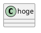

# 100 Days Of Code - 学習ログ

## 2021年1月分

### 92日目: 2021年1月2日（土）

**今日の進捗**:

JavaScriptのクロージャについて。

- ちょっとイマイチよく理解しきってないが、とりあえずjsでは関数が作成されるたびにクロージャが作成される。

> クロージャは、組み合わされた（囲まれた）関数と、その周囲の状態（レキシカル環境）への参照の組み合わせです。言い換えれば、クロージャは内側の関数から外側の関数スコープへのアクセスを提供します。JavaScript では、関数が作成されるたびにクロージャが作成されます。

```javascript
function hoge (x){
  return function(y){
    return x + y;
  };
}

const add3 = hoge(3);
const add7 = hoge(7);

console.log(add3(10));
console.log(add7(10));
```

- この場合、`add3`と`add7`はそれぞれクロージャである。それぞれ**同じ定義の関数**を保有しているが、**異なる環境**を保持している。ここでいう環境とは`x`のことで、`add3`では`x`は3であり、`add7`では`x`は7である。ただし、関数の定義は`x+y`であるので`add3`と`add7`は同じ定義であると言える。

```console
13
17
```

- 同じ定義の関数を保有しており同じ引数を指定されたとしても、**保有する環境が異なるため**実行結果が異なる。

```javascript
const createCounter = function(){
  let cnt = 0;

  const displayCounter = function(){
    cnt += 1;
    console.log(cnt);
  }

  return displayCounter;
};

const counter = createCounter();

[...Array(10).keys()].forEach(i => {
  console.log('i=' + i)
  counter();
});

const counter2 = createCounter();

console.log('counter2');
counter2();
```

- 今度は上記のような関数を考える。関数内のスコープに存在するローカル変数`cnt`に対し、インクリメントして結果を返す関数を宣言したがこの実行結果はどのようになるか？

```console
i=0
1
i=1
2
i=2
3
i=3
4
i=4
5
i=5
6
i=6
7
i=7
8
i=8
9
i=9
10
counter2
1
```

- **ローカル変数でありながら複数回実行されるとカウントが増加している**ことがわかる。
- 本来、ローカル変数はその関数が実行し終われば内容が揮発してしまうため、ループ処理の回数に関わらず「1」が表示されるように思える。が、実際に動作させてみるとローカル変数（ここでは`cnt`）の内容は保持されインクリメントされていることがわかる。つまり、**ローカル変数でありながらグローバル変数のような挙動をしている**ことになる。
- クロージャを実装するメリットはまさにそこで、グローバル変数を利用しなくても状態を保持しながら処理が可能になる。
- 上記では、インクリメントする関数の定義は保持しているものの、変数`counter`は無名関数のインスタンスへの参照であり、関数`displayCounter`のインスタンスを含んでいる。関数`displayCounter`はレキシカルスコープへの参照を保持していて、変数`cnt`に対してアクセス可能。
- そんなわけで、変数`counter`はクロージャであり、変数`cnt`はクロージャ内に保持されているため参照し続けることが可能ということになる。

```javascript
class Count {
  constructor(n=0){
    this.cnt = n;
  }

  increment(){
    this.cnt += 1;
    return this.cnt;
  }

  decrement(){
    this.cnt -= 1;
    return this.cnt;

  }
}

const counter = new Count();

[...Array(10).keys()].forEach(i => {
  console.log('i=' + i);
  console.log(counter.increment());
});
```

- カウントのような動作なら、同様の挙動はクラスでも再現できる。

```console
i=0
1
i=1
2
i=2
3
i=3
4
i=4
5
i=5
6
i=6
7
i=7
8
i=8
9
i=9
10
```

- クロージャの挙動と比較すると、クラスでの実装はインスタンスで保持している変数について処理を行っているため、インクリメントすれば変数の値が増加するのは比較的理解しやすい。

**思ったこと**:

- 正直、カウンターのような挙動ならクロージャよりクラスで定義した方が個人的には比較的理解しやすい。ただ、クラスはプロパティをプライベートにできないので、疑似的にせよプライベートな変数を実装したいシチュエーションではクロージャを利用するのはアリだと思う。
- 関数ファクトリーとして利用する場合は有用なように思えるが、上記で挙げた例だと関数に渡す引数を増やせばいいんじゃない？わざわざクロージャを使う？っていう気もするので、クラスを利用したくないし引数も増やしたくないシチュエーションでクロージャを利用することになると思うが・・・そんなシチュエーションがどれだけあるかな。
- ただ、グローバル変数をなるべく書きたくないってのは実際あるし、jsは仕様上プライベート変数を実装できないので、それらを実現するためにクロージャを使うのはアリだと思う。
- returnにfunctionが含まれていたらクロージャを疑ってみてもいいかもしれない。

**リンク**:

1. [クロージャ](https://developer.mozilla.org/ja/docs/Web/JavaScript/Closures)
1. [クラス](https://developer.mozilla.org/ja/docs/Web/JavaScript/Reference/Classes)
1. [関数を理解すればクロージャは難しくない！](https://analogic.jp/closure/)
1. [ちょっと高度にJavaScript／クロージャの基礎](https://dev.classmethod.jp/articles/javascript-closure-basic/)

### 93日目: 2021年1月3日（日）

**今日の進捗**:

TypeScriptのチュートリアル。

- TypeScriptのオフィシャルにある[TypeScript Tooling in 5 minutes](https://www.typescriptlang.org/docs/handbook/typescript-tooling-in-5-minutes.html)を少し改変しつつ、TypeScriptをちょっとだけ触ってみる。
- なお、環境は`npx create-react-app my-app --template typescript`で構築している。

```tsx
import React from 'react';
import ReactDOM from 'react-dom';

function greeter(person) {
    return 'Hello, ' + person;
}

function greetWithName(user = 'John Doe') {

    return greeter(user);
}

function App() {
    return (
        <>
            <h2>{greetWithName()}</h2>
        </>
    );
}

ReactDOM.render(
    <App />,
    document.getElementById('root'),
);

```

- チュートリアルにあるコードを拡張してTSX形式で書いた。実際は上記のコードは`yarn start`するとエラーを吐く。

```console
TypeScript error in /workspace/my-app/src/index.tsx(4,18):
Parameter 'person' implicitly has an 'any' type.  TS7006

    2 | import ReactDOM from 'react-dom';
    3 | 
  > 4 | function greeter(person) {
```

- この場合、`person`の型を明示的に指定する必要がある。

```tsx
function greeter(person: string) {
    return 'Hello, ' + person;
}
```

- 型の指定方法は`変数: 型`で指定できる。上記では`person`は文字列だよ、と指定していることになる。
- 上記の内容で変更したら`yarn start`すると正常に動作するようになる。
- このように、TypeScriptでは変数に型を指定することが求められる。

```tsx
function App() {
    return (
        <>
            <h2>{greetWithName([0, 1, 2])}</h2>
        </>
    );
}
```

- 逆に文字列ですよと指定されているにもかかわらず配列などを指定した場合は、想定している型が異なるためエラーになる。

```console
TypeScript error in /workspace/my-app/src/index.tsx(16,33):
Type 'number' is not assignable to type 'string'.  TS2322

    14 |     return (
    15 |         <>
  > 16 |             <h2>{greetWithName([0, 1, 2])}</h2>
```

- 文字列を想定しているのに数値（の配列）なんてアサインできねーよ、とエラーになった。

```tsx
import React from 'react';
import ReactDOM from 'react-dom';

interface Person {
    firstName: string;
    lastName: string;
}

function greeter(person: Person) {
    return 'Hello, ' + person.firstName + ' ' + person.lastName;
}

function greetWithName(user = { firstName: 'Jane', lastName: 'Doe' }) {

    return greeter(user);
}

function App() {
    return (
        <>
            <h2>{greetWithName()}</h2>
        </>
    );
}

ReactDOM.render(
    <App />,
    document.getElementById('root'),
);

```

- `interface`を利用すると、オブジェクトのプロパティに対しそれぞれの型が指定できる。

```tsx
import React from 'react';
import ReactDOM from 'react-dom';

class Student {
    fullName: string;
    constructor(
        public firstName: string,
        public middleInitial: string,
        public lastName: string
    ) {
        this.fullName = firstName + ' ' + middleInitial + ' ' + lastName;
    }
}

interface Person {
    firstName: string;
    lastName: string;
}

function greeter(person: Person) {
    return 'Hello, ' + person.firstName + ' ' + person.lastName;
}

function greetWithName(user = { firstName: 'Jane', lastName: 'Doe' }) {

    let student = new Student('John', 'M.', 'Doe');

    return greeter(student);
}

function App() {
    return (
        <>
            <h2>{greetWithName()}</h2>
        </>
    );
}

ReactDOM.render(
    <App />,
    document.getElementById('root'),
);

```

- クラスを実装してみる。
- クラスも基本的には`interface`と同様で、プロパティに対し型を設定する。
- コンストラクタの引数に`public`が付与されているが、これは**アクセス修飾子**。それと同時に、コンストラクタの引数にアクセス修飾子を付与することで、**メンバを自動的にクラス内に定義し、コンストラクタの引数によって初期化されるまでを省略することが可能**になっている。

```tsx
class Foo {
    constructor(public x:number) {
    }
}
```

- 上記のようにコンストラクタの引数にアクセス修飾子を付与した場合を考える。この場合、メンバの宣言や初期化は記述しなくても動作する。

```tsx
class Foo {
    x: number;
    constructor(x:number) {
        this.x = x;
    }
}
```

- アクセス修飾子を付与しない場合、メンバの宣言とコンストラクタの引数による初期化を記述する必要がある。これらについては前述のとおり、コンストラクタの宣言時に引数にアクセス修飾子を付与することで省略が可能。
- アクセス修飾子を省略した場合は`public`扱いとなる。なので上記は`public x: number;`と記述しているのと同じ。

**思ったこと**:

- クラスにはアクセサを記述できるがそれは次回。

**リンク**:

1. [TypeScript Tooling in 5 minutes](https://www.typescriptlang.org/docs/handbook/typescript-tooling-in-5-minutes.html)
1. [コンストラクタを定義する](https://typescript-jp.gitbook.io/deep-dive/future-javascript/classes#konsutorakutawosuru)
1. [コンストラクタの引数を使ってプロパティを宣言](https://future-architect.github.io/typescript-guide/class.html#id4)
1. [クラス宣言](https://docs.solab.jp/typescript/class/declaration/)

### 94日目: 2021年1月4日（月）

**今日の進捗**:

TypeScriptのアクセサについて。

- TypeScriptは、オブジェクトのメンバに対するgetter/setterを提供している。

```tsx
import React from 'react';
import ReactDOM from 'react-dom';

class Student {
    private _fullName: string;
    constructor(
        public firstName: string,
        public middleInitial: string,
        public lastName: string
    ) {
        this._fullName = firstName + ' ' + middleInitial + ' ' + lastName;
    }

    get fullName(): string {
        return this._fullName;
    }

    set fullName(newName: string) {
        this._fullName = newName;
    }
}

interface Person {
    firstName: string;
    lastName: string;
}

function greeter(person: Person) {
    return 'Hello, ' + person.firstName + ' ' + person.lastName;
}

function greetWithName(user = { firstName: 'Jane', lastName: 'Doe' }) {

    let student = new Student('John', 'M.', 'Doe');

    console.log(student.fullName);
    student.fullName = 'hoge fuga piyo';
    console.log(student.fullName);
    console.log(student);

    return greeter(student);
}

function App() {
    return (
        <>
            <h2>{greetWithName()}</h2>
        </>
    );
}

ReactDOM.render(
    <App />,
    document.getElementById('root'),
);

```

- `get fullName()`と記述するとgetter。
- `set fullName()`と記述するとsetter。値の設定時に何らかの処理を入れたい（パスワードを要求するとか）場合、setterに記述する。

```console
John M. Doe index.tsx:36
hoge fuga piyo index.tsx:38
{...}
_fullName: "hoge fuga piyo"
firstName: "John"
lastName: "Doe"
middleInitial: "M."
<prototype>: Object { … }
```

- setterによってメンバ`_fullName`は書き換わっているが、その他のメンバは元のまま。
- ちなみに他のメンバは個別に宣言していないが、コンストラクタの引数にアクセス修飾子を付与したため、メンバの宣言や初期値設定を省略している（前日の内容を参照）。

**思ったこと**:

- `get`や`set`とだけ記述すればいいのでわかりやすい。

**リンク**:

1. [クラス](http://js.studio-kingdom.com/typescript/handbook/classes#accessors)

### 95日目: 2021年1月5日（火）

**今日の進捗**:

SVGをPNG化するwebアプリの実装。

- いつだったか実装をあきらめていたやつが解決した。`Promise`を使って非同期処理を行うと上手くいった。

```jsx
import React, { useState, useEffect } from 'react';
import ReactDOM from 'react-dom';

const splitSvgSource = (html) => {
    // SVGだけを抽出する関数

    let startReg = /<svg.*?\/svg>/sg;

    let result = html.match(startReg);

    if (result) {
        return result;
    } else {
        return;
    }

}

function SvgToPng() {
    // HTMLファイルの読み込みを行うコンポーネント
    // 選択されたHTMLはSVGのみ抽出し、フックに格納する。

    const [svg, setSvg] = useState([]);

    useEffect(() => {
        const f = document.getElementById('file');

        if (f === null) {
            return;
        }

        f.addEventListener('change', (e) => {

            let reader = new FileReader();
            reader.readAsText(e.target.files[0]);
            reader.onload = (() => {
                let splitedSVGSource = splitSvgSource(reader.result);
                if (splitedSVGSource) {
                    setSvg([...splitedSVGSource]);
                } else {
                    setSvg([]);
                }
            });
        })

    });

    return (
        <div>
            <form id="fileUpload">
                <input id="file" type="file" name="uploadedFile" />
            </form>

            <CountSVG key={'count'} value={svg} />

            <RenderSVG key={'render'} value={svg} />

        </div>
    );
}

function CountSVG(props) {
    // アナウンス文を表示するコンポーネント
    // HTMLがロードされていないか、SVGの含まれないHTMLがロードされた場合は、
    // SVGの含まれるHTMLのロードを要求する文面にする。

    if (Array.isArray(props.value) && Object.keys(props.value).length > 0) {
        return (
            <div>
                <p>SVGは{props.value.length}枚です。</p>
            </div>
        );

    } else {
        return (
            <div>
                <p>SVGを含んだHTMLを選択してください。</p>
            </div>
        );
    }
}

function loadImage(src) {
    // SVGをCanvasへ描画した結果をPNGで返す関数

    const imageMagnification = 1.34;

    const reg = /(?<=<svg.+viewBox=")\d{1,}\s\d{1,}\s[0-9.]{1,}\s[0-9.]{1,}/;

    let width, height;
    let result = src.match(reg);
    [, , width, height] = result[0].split(' ');

    return new Promise((resolve, reject) => {
        const canvas = document.createElement('canvas');
        canvas.width = width * imageMagnification;
        canvas.height = height * imageMagnification;

        const ctx = canvas.getContext('2d');
        const img = new Image();

        let encoded = 'data:image/svg+xml;charset=utf-8;base64,' + btoa(unescape(encodeURIComponent(src)));

        img.src = encoded;

        img.crossOrigin = 'Anonymous';

        img.onload = () => {
            ctx.drawImage(img, 0, 0, img.width, img.height);

            let url = canvas.toDataURL();
            resolve(url);

        };
        img.onerror = (e) => reject(e);


    });
}

function RenderSVG(props) {
    // SVGとPNGをそれぞれ描画するコンポーネント

    useEffect(() => {
        if (Array.isArray(props.value) && Object.keys(props.value).length > 0) {

            let result = [];

            const elemSvgs = document.getElementById('svgs');
            const elemPngs = document.getElementById('pngs');

            props.value.forEach((svgText, idx) => {

                loadImage(svgText).then(res => {
                    result.push(res);

                    // SVGの追加
                    elemSvgs.insertAdjacentHTML('beforeend', '</img>');

                    // PNGの追加
                    elemPngs.insertAdjacentHTML('beforeend', '</img>');
                }).catch(e => {
                    console.log('error: ' + e);
                });

            });

            elemSvgs.insertAdjacentHTML('beforebegin', '<h3>SVGs</h3>');
            elemPngs.insertAdjacentHTML('beforebegin', '<h3>PNGs</h3>');

        }

    });

    return (
        <>
            <div id="pngs">

            </div>

            <div id="svgs">

            </div>
        </>

    );

}

ReactDOM.render(
    <SvgToPng />,
    document.getElementById('root'),
);

```

- 今回は`Promise`を使ったが、async/awaitを利用した方がより可読性が向上すると思われる。
- 関数の戻り値が配列だったりするので、TypeScriptで実装した方が最終的にはいいかもしれない。

**思ったこと**:

- TypeScript、勉強しなきゃ・・・。

**リンク**:

1. 特になし。

### 96日目: 2021年1月6日（水）

**今日の進捗**:

昨日のSVGをPNG化するプログラムに機能追加した。

- PNG化した際にダウンロード**リンク**:を追加出力する。

```jsx
import React, { useState, useEffect } from 'react';
import ReactDOM from 'react-dom';

const splitSvgSource = (html) => {
    // SVGだけを抽出する関数

    let startReg = /<svg.*?\/svg>/sg;

    let result = html.match(startReg);

    if (result) {
        return result;
    } else {
        return;
    }

}

function SvgToPng() {
    // HTMLファイルの読み込みを行うコンポーネント
    // 選択されたHTMLはSVGのみ抽出し、フックに格納する。

    const [svg, setSvg] = useState([]);

    useEffect(() => {
        const f = document.getElementById('file');

        if (f === null) {
            return;
        }

        f.addEventListener('change', (e) => {

            let reader = new FileReader();
            reader.readAsText(e.target.files[0]);
            reader.onload = (() => {

                let splitedSVGSource = splitSvgSource(reader.result);
                if (splitedSVGSource) {
                    setSvg([...splitedSVGSource]);
                } else {
                    setSvg([]);
                }
            });

            const fileUploaderElem = document.getElementById('fileUpload');
            fileUploaderElem.remove();
        })

    });

    return (
        <>
            <form id="fileUpload">
                <input id="file" type="file" name="uploadedFile" />
            </form>

            <CountSVG key={'count'} value={svg} />

            <RenderSVG key={'render'} value={svg} />

        </>
    );
}

function CountSVG(props) {
    // アナウンス文を表示するコンポーネント
    // HTMLがロードされていないか、SVGの含まれないHTMLがロードされた場合は、
    // SVGの含まれるHTMLのロードを要求する文面にする。

    let notice = 'SVGを含んだHTMLを選択してください。';

    if (Array.isArray(props.value) && Object.keys(props.value).length > 0) {
        notice = 'SVGは' + props.value.length + '枚です。';
    }

    return (
        <>
            <p>{notice}</p>
        </>
    );

}

function loadImage(src) {
    // SVGをCanvasへ描画した結果をPNGで返す関数

    const imageMagnification = 1.34;

    const reg = /(?<=<svg.+viewBox=")\d{1,}\s\d{1,}\s[0-9.]{1,}\s[0-9.]{1,}/;

    let width, height;
    let result = src.match(reg);
    [, , width, height] = result[0].split(' ');

    return new Promise((resolve, reject) => {
        const canvas = document.createElement('canvas');
        canvas.width = width * imageMagnification;
        canvas.height = height * imageMagnification;

        const ctx = canvas.getContext('2d');
        const img = new Image();

        let encoded = 'data:image/svg+xml;charset=utf-8;base64,' + btoa(unescape(encodeURIComponent(src)));

        img.src = encoded;

        img.crossOrigin = 'Anonymous';

        img.onload = () => {
            ctx.drawImage(img, 0, 0, img.width, img.height);

            let url = canvas.toDataURL();
            resolve(url);

        };

        img.onerror = (e) => reject(e);

    });
}

function RenderSVG(props) {
    // SVGとPNGをそれぞれ描画するコンポーネント

    useEffect(() => {

        const elemSvgs = document.getElementById('svgs');
        const elemPngs = document.getElementById('pngs');

        if (Array.isArray(props.value) && Object.keys(props.value).length > 0) {

            let result = [];

            props.value.forEach((svgText, idx) => {

                loadImage(svgText).then(res => {
                    result.push(res);

                    // SVGの追加
                    elemSvgs.insertAdjacentHTML('beforeend', '</img>');

                    // PNGの追加
                    elemPngs.insertAdjacentHTML('beforeend', '</img>');
                    // ダウンロード**リンク**:を追加
                    elemPngs.insertAdjacentHTML('beforeend', '<a key=url_' + idx + ' href=' + res + ' download="image.png">download</a>');
                }).catch(e => {
                    console.log('error: ' + e);
                });

            });

            elemSvgs.insertAdjacentHTML('afterbegin', '<h3>SVGs</h3>');
            elemPngs.insertAdjacentHTML('afterbegin', '<h3>PNGs</h3>');

        } else {
            while (elemPngs.firstChild) {
                elemPngs.removeChild(elemPngs.firstChild);
            }
            while (elemSvgs.firstChild) {
                elemSvgs.removeChild(elemSvgs.firstChild);
            }

        }

    });

    return (
        <>
            <div id="pngs">

            </div>

            <div id="svgs">

            </div>
        </>

    );

}

ReactDOM.render(
    <SvgToPng />,
    document.getElementById('root'),
);

```

- PNG化した際にimgタグに利用しているURLを、ダウンロード**リンク**:としてaタグで表示する。これにより、右クリックメニューからコピーする場合と個別に画像ファイルだけダウンロードする場合で、使い分けができる。まぁ、大抵は右クリックメニューからコピーする方が話が早いだろうが。
- 上記の機能追加とともに、ところどころのコードを修正した。`CountSVG`コンポーネントの部分で、`return`を一本化して変数出力するようなコードのみに修正し、状態が変わったら変数の内容だけ変更するようなコードとした。
- 一度ファイルを読み込んだら、ファイルのローダーを削除するよう修正した。これは、ファイルを読み込んだ後に別のファイルを読み込もうとすると、もともと表示されている内容が残ったまま新しい内容を描画しようとしたり、「PNGs」「SVGs」などの文言が複数出現したり、重複して表示したりとバグった挙動をしていたため。本来は、一度表示されている内容を削除するなどして初期化してから、新しく読み込まれたファイルについて処理すればいいのだが、その場合の再レンダリング方法がちょっと調べただけだと出てこなかった。そのため、ちょっと乱暴だが対処療法としてファイルローダー機能を削除することで、2度目以降のファイル読み込みを実行させないようにした。

**思ったこと**:

- ファイル読み込みを複数回行っても、正常に行えるような実装はどうすればいいんだろう。とりあえず今は、対症療法でどうにかしているが・・・。

**リンク**:

1. [Node.removeChild](https://developer.mozilla.org/ja/docs/Web/API/Node/removeChild)
1. [ChildNode.remove](https://developer.mozilla.org/ja/docs/Web/API/ChildNode/remove)

### 97日目: 2021年1月7日（木）

**今日の進捗**:

p5.jsで作ったCanvasについて、画面サイズが変更された場合でも追随するような実装。

- `windowWidth`と`windowHeight`を使ってウィンドウサイズを取得し、そのサイズでCanvasを生成する。
- ウィンドウサイズが変更されると、`windowResized()`という関数が実行される。リファレンスは[ここ](https://p5js.org/reference/#/p5/resizeCanvas)。

```javascript
let halfWidth, halfHeight;

setup=()=>{
  createCanvas(windowWidth, windowHeight);
}

draw=()=>{
  background(0);

  halfWidth = windowWidth / 2;
  halfHeight = windowHeight / 2;

  fill(255);
  rect(halfWidth, halfHeight, 100, 100);
  
}

windowResized=()=>{
  resizeCanvas(windowWidth, windowHeight);
}
```

- `draw()`内で画面サイズを逐次取得し、その半分の値を使ってオブジェクトを描画する。ウィンドウサイズが変更されても、都度Canvasごとレンダリングされオブジェクトも指定の位置に存在し続ける。

**思ったこと**:

- 画面サイズいっぱいに出力することはあっても、スマートフォンなんかだと顕著だがそもそも「ウィンドウサイズを変更する」という前提がないデバイスもあるので、あくまでPC用ということになる。

**リンク**:

1. [resizeCanvas](https://p5js.org/reference/#/p5/resizeCanvas)
2. [windowResized](https://p5js.org/reference/#/p5/windowResized)
3. [【Canvas/p5.js】解決。canvas要素を可変(window幅やwindowの50%,中央寄せ)などに動的にする方法](https://kenjimorita.jp/canvas_windowresize_window_center/)

### 98日目: 2021年1月8日（金）

**今日の進捗**:

p5.jsでphotoshopの「雲模様」みないなテクスチャを作る。

- photoshopには、「雲模様」という雲とか湯気っぽいモヤを生成できるフィルターがある。テクスチャのでき具合から察するに、パーリンノイズからパターンを生成しているような気がしたので「p5.jsでも似たようなのできるんじゃね？」と思って作ってみた。

```javascript
let seed = 0;
let cellSize = 5;

setup=()=>{
  createCanvas(400, 400);
  
  colorMode(HSB, 100, 100, 100, 100);
  strokeWeight(cellSize * 10);
}

draw=()=>{
  background(0, 0, 0, 30);
  
    for (let w=0; w<=width; w+=cellSize){ 
      for (let h=0; h<=height; h+=cellSize){
      let n = noise(w * 0.015 + seed, h * 0.01 + seed, seed);
      let brightness = round(n * 45);
      
      stroke(95, 100, brightness, 100);
      if (brightness % 3 === 0){
        point(w, h);  
      }
      
    };
  };
  
  seed += 0.01;
}
```

- カラーモードをHSBにしているのは、brightnessを調節したかったため。単純にグレースケールで雲模様を生成するなら、RGBのままでいい。
- パーリンノイズを生成する部分のリテラルは、「黒地に赤いモヤがかかる」ようなテクスチャを生成したかったためで、赤分を多くするにはここのリテラルを調節する必要がある。
- `seed`に加算する値を変化させると、雲模様の変化する速度が変わる。

**思ったこと**:

- 案外簡単にできたが、やっぱりちょっと処理が重め。

**リンク**:

1. [point](https://p5js.org/reference/#/p5/point)
1. [パーリンノイズでマーブル模様](http://30min-processing.hatenablog.com/entry/2016/07/24/000000)

### 99日目: 2021年1月9日（土）

**今日の進捗**:

SVGをPNG化するJavaScriptについて、`insertAdjacentHTML`を使わずReactの関数コンポーネントでレンダーするよう修正してみた。

- `insertAdjacentHTML`を使わない理由は、SVGが含まれたHTMLを読み込んだ後にSVGのないHTMLを読み込んだときの処理が面倒だったため。一度`insertAdjacentHTML`で追加したDOM要素を削除するくらいなら、stateとして連動させればいいと思ったのだ。

```javascript
import React, { useState, useEffect } from 'react';
import ReactDOM from 'react-dom';

const splitSvgSource = (html) => {
    // SVGだけを抽出する関数

    let startReg = /<svg.*?\/svg>/sg;

    let result = html.match(startReg);

    return new Promise((resolve, reject) => {
        if (result) {
            resolve(result);
        } else {
            resolve([]);
        }
    });

}

function SvgToPng() {
    // HTMLファイルの読み込みを行うコンポーネント
    // 選択されたHTMLはSVGのみ抽出し、フックに格納する。

    const [svg, setSvg] = useState([]);

    useEffect(() => {
        const f = document.getElementById('file');

        if (f === null) {
            return;
        }

        f.addEventListener('change', (e) => {

            let reader = new FileReader();
            reader.readAsText(e.target.files[0]);
            reader.onload = (async () => {

                let splitedSVGSource = await splitSvgSource(reader.result);

                if (splitedSVGSource) {
                    setSvg([...splitedSVGSource]);
                } else {
                    setSvg([]);
                }

            });

        })

    }, [svg]);

    return (
        <>
            <form id="fileUpload">
                <input id="file" type="file" name="uploadedFile" />
            </form>

            <CountSVG value={svg} />

            <RenderImage value={svg} />

        </>
    );
}

function CountSVG(props) {
    // アナウンス文を表示するコンポーネント
    // HTMLがロードされていないか、SVGの含まれないHTMLがロードされた場合は、
    // SVGの含まれるHTMLのロードを要求する文面にする。

    let notice;

    if (Array.isArray(props.value) && Object.keys(props.value).length > 0) {
        notice = 'SVGは' + props.value.length + '枚です。';
    } else {
        notice = 'SVGを含んだHTMLを選択してください。';
    }

    return (
        <>
            <p>{notice}</p>
        </>
    );

}

function loadImage(src) {
    // SVGをCanvasへ描画した結果をPNGで返す関数

    const imageMagnification = 1.34;

    const reg = /(?<=<svg.+viewBox=")\d{1,}\s\d{1,}\s[0-9.]{1,}\s[0-9.]{1,}/;

    let width, height;
    let result = src.match(reg);
    [, , width, height] = result[0].split(' ');

    return new Promise((resolve, reject) => {
        const canvas = document.createElement('canvas');
        canvas.width = width * imageMagnification;
        canvas.height = height * imageMagnification;

        const ctx = canvas.getContext('2d');
        const img = new Image();

        let encoded = 'data:image/svg+xml;charset=utf-8;base64,' + btoa(unescape(encodeURIComponent(src)));

        img.src = encoded;

        img.crossOrigin = 'Anonymous';

        img.onload = () => {
            ctx.drawImage(img, 0, 0, img.width, img.height);

            let url = canvas.toDataURL();
            resolve(url);

            canvas.remove();

        };

        img.onerror = (e) => reject(e);

    });
}

const RenderPngAndDownloadLink = (props) => {

    let pngIndex = props.id + 1
    let fileName = 'image_' + pngIndex + '.png';

    return (
        <>
            <h4>{pngIndex}.</h4>
            </img>
            <a href={props.png} download={fileName}>download</a>
        </>
    );
}

function RenderImage(props) {
    const [pngs, setPngs] = useState([]);
    // SVGとPNGをそれぞれ描画するコンポーネント

    useEffect(() => {

        if (Array.isArray(props.value) && Object.keys(props.value).length > 0) {

            Promise.all(props.value.map(svgText => loadImage(svgText))
            ).then(pngs => {
                let pngsWithImageTag = pngs.map((png, idx) => {
                    const RenderPngIndex = 'png_index_' + idx;
                    return (<RenderPngAndDownloadLink key={RenderPngIndex} id={idx} png={png} />);
                });

                setPngs([...pngsWithImageTag]);
            });

        } else {

            setPngs([]);
        }

        return () => console.log('clean up');

    }, [props.value]);

    return (
        <>
            <div id="pngs">
                {pngs}
            </div>

            <div id="svgs">

            </div>
        </>

    );

}

ReactDOM.render(
    <SvgToPng />,
    document.getElementById('root'),
);


```

- PNG化したSVGはダウンロード**リンク**:とともに表示するため、見た目には前回と変わっていない。
- stateを利用し、stateの内容をそのままレンダリングするようなロジックにしたため、プログラムの見通しは良くなったかと思う。記述量も減っている。
- 反面、`useEffect()`などで第2引数を指定しないと、レンダリングがループするようなこともあった。

**思ったこと**:

- まあまあ難産だった。特に、レンダリングがループするところとか苦労した。`useEffect()`の第2引数にオブジェクトを指定することで、レンダリングがループする現象は回避した。
- `map()`は返す値の順番は保証しても、コールバック関数の実行の順序は保証しないそうだ。

**リンク**:

1. [ステートフックの利用法](https://ja.reactjs.org/docs/hooks-state.html)
1. [フック API リファレンス](https://ja.reactjs.org/docs/hooks-reference.html)
1. [React Hooks useState の setStateの反映タイミング](https://teratail.com/questions/204921)
1. [Promise.all()](https://developer.mozilla.org/ja/docs/Web/JavaScript/Reference/Global_Objects/Promise/all)
1. [関数型Reactコンポーネントでレンダリングと副作用Hookが実行されるタイミング](https://www.hypertextcandy.com/when-hook-is-called)
1. [JavaScriptでPromiseの配列を直列に実行する](https://www.koheiando.com/tech/node-js/35)
1. [Array.prototype.map()](https://developer.mozilla.org/ja/docs/Web/JavaScript/Reference/Global_Objects/Array/map)

### 100日目: 2021年1月10日（日）

**今日の進捗**:

vscodeでの正規表現指定について。

- vscodeで検索や置換を行う際に利用できる、正規表現について記述する。

| 表記方法 | 意味                                      | 例                                               | 備考                                                 |
| -------- | ----------------------------------------- | ------------------------------------------------ | ---------------------------------------------------- |
| `.`      | 任意の文字1文字                           | `^.$`                                            | スペースを含める。                                   |
| `*`      | 直前の文字の0回以上の繰り返し             | `.*`                                             | 0文字以上なので空文字でもヒットする。                |
| `+`      | 直前の文字の1回以上の繰り返し             | `hoge+`                                          | `hoge`や`hogeeee`などがヒットする。                  |
| `^`      | 行頭                                      | `^hoge.+`                                        |                                                      |
| `$`      | 行末                                      | `hoge$`                                          |                                                      |
| `[]`     | 角カッコで囲われた中の1文字               | `[0-9]`、`[ABC]`、`[a-zA-Z]`                     | ハイフンを使用すると「XXXからXXXまで」の指定が可能。 |
| `{}`     | 直前の文字が出現する回数                  | `hoge{3}`                                        | `hogeee`にヒットする。                               |
| `()`     | マッチした文字列を`$1,$2,$3...`で指定可能 | 'ho(ge{3})`|`$1`と記述すると`geee`に置き換わる。 |

- `{}`の繰り返し数は、`{1}`の場合だと`{}`の指定がない場合と同一。
- `()`に関しては検索より置換で威力を発揮する。マッチした一部はそのまま流用し、それ以外の部分を置き換える場合などだ。

```javascript
let s = 'hogeeeeee';

console.log(s.match(/ge{3}/g));

let t = 'fugabcdef';
let reg = /g[a-z]{3}([a-z]{3})/g;

console.log(t.match(reg));
console.log(t.replace(reg, 'foo$1'));
```

- ちなみに、JavaScriptでも同様の挙動で動作する。

```console
(1)["geee"]
(1)["gabcdef"]
fufoodef
```

- 上記のように、「もともと存在する文字列を活かしつつ置換したい」場合に利用できる。

```
`ho(ge)fu(ga)pi(yo)`
```

- 上記のような検索条件を設定した場合、丸カッコで囲った部分が左から`$1,$2,$3`に該当する。

```
`foo$1bar$2baz$3`
```

- 置換条件を上記のように設定した場合、置換結果は`foogebargabazyo`となる。

----

メモ。

Pythonでベン図を書くには[matplotlib-venn](https://github.com/konstantint/matplotlib-venn)が必要。matplotlibでは描画できない。

**思ったこと**:

- 100日目！

**リンク**:

1. [Visual Studio Codeを用いた簡単な正規表現検索](https://qiita.com/kgsi/items/a88662c6e43fa5311288)
1. [matplotlib-venn](https://github.com/konstantint/matplotlib-venn)
1. [String.prototype.match](https://developer.mozilla.org/ja/docs/Web/JavaScript/Reference/Global_Objects/String/match)
1. [String.prototype.replace](https://developer.mozilla.org/ja/docs/Web/JavaScript/Reference/Global_Objects/String/replace)

### 101日目: 2021年1月11日（月）

**今日の進捗**:

Pythonの「集合」について。

- 「集合」とは、リストやタプルといったコレクション型のうちの1つ。ミュータブルで値の追加や削除が可能。
- イミュータブルな集合である`frozenset`というオブジェクトもある。

```python
>>> h = {'hoge', 'fuga', 'piyo'}
>>> h
{'fuga', 'hoge', 'piyo'}
>>> type(h)
<class 'set'>
```

- 上記のように、`set`は波かっこ`{}`で囲って宣言する。

```python
>>> {'foo', 'bar', 'baz'}
{'bar', 'foo', 'baz'}
>>> {'foo', 'foo', 'foo'}
{'foo'}
>>> {'foo', 'bar', 'baz', 'foo', 'foo'}
{'bar', 'foo', 'baz'}
```

- 数学の集合のように、ある集合の要素は必ずそれぞれユニークであり、同一の値を複数保持することはできない。
- リストやタプルとは異なり、順番の概念を持たない。

```python
>>> set_hoge = set([1, 2, 3, 4, 3, 2, 1, 1, 2])
>>> set_hoge
{1, 2, 3, 4}
```

- 集合を波かっこで作成する以外に、コンストラクタ`set()`の引数にリストやタプルなどのイミュータブルなオブジェクトを指定することでも集合を作成できる。この場合、重複している要素は自動的に除外され、ユニークな値のみ残る。
- ちなみに、上記の例だとなんとなく昇順にソートされているように見えるが、これはたまたまそうなっただけ。集合は順番を保持しない。

```python
>>> set_fuga = set()
>>> set_fuga
set()
>>> type(set_fuga)
<class 'set'>
```

- コンストラクタの引数を省略した場合、空集合が作成される。

```python
>>> set_piyo = {i * 2 for i in range(5)}
>>> set_piyo
{0, 2, 4, 6, 8}
```

- リストと同様に、集合にも内包表記が存在する。記述方法はリスト内包表記の角カッコ`[]`を波かっこ`{}`に変更するだけ。

```python
>>> set_hoge
{1, 2, 3, 4}
>>> len(set_hoge)
4
>>> set_fuga
set()
>>> len(set_fuga)
0
>>> set_piyo
{0, 2, 4, 6, 8}
>>> len(set_piyo)
5
```

- 要素数を見たい場合は`len()`で参照可能。空集合は0。

```python
>>> list_hoge = list(set_hoge)
>>> list_hoge
[1, 2, 3, 4]
>>> type(list_hoge)
<class 'list'>
>>> tuple_piyo = tuple(set_piyo)
>>> tuple_piyo
(0, 2, 4, 6, 8)
>>> type(tuple_piyo)
<class 'tuple'>
```

- 集合はリストやタプルに変換できる。

```python
>>> hoge = {'foo', 'bar', 'baz'}
>>> hoge.add(1)
>>> hoge
{'baz', 'bar', 'foo', 1}
>>> hoge.add(9, 8, 7)
Traceback (most recent call last):
  File "<stdin>", line 1, in <module>
TypeError: add() takes exactly one argument (3 given)
>>> hoge.add({9, 8, 7})
Traceback (most recent call last):
  File "<stdin>", line 1, in <module>
TypeError: unhashable type: 'set'
>>> hoge.add([9, 8, 7])
Traceback (most recent call last):
  File "<stdin>", line 1, in <module>
TypeError: unhashable type: 'list'
```

- `add()`を使って要素の追加が可能。ただし、引数は1つしか指定できない（引数自体は2つまで指定可能だが、要素として指定できる引数は1つまで）。

**思ったこと**:

- ユニークな要素を操作したいシチュエーションで使えそう。

**リンク**:

1. [setオブジェクト](https://docs.python.org/ja/3/c-api/set.html)
1. [Python, set型で集合演算（和集合、積集合や部分集合の判定など）](https://note.nkmk.me/python-set/)
1. [4. Pythonのデータ型（コレクション編）](https://pycamp.pycon.jp/textbook/4_collections.html)

### 102日目: 2021年1月12日（火）

**今日の進捗**:

Pythonの集合の続き。

```python
>>> hoge = {1, 2, 3, 4, 5}
>>> hoge.discard(1)
>>> hoge
{2, 3, 4, 5}
>>> hoge.discard(9)
>>> hoge
{2, 3, 4, 5}
```

- 集合の要素を削除するにはいくつか方法がある。`discard()`は、引数で指定された要素を削除する。集合内に存在しない値が引数に指定された場合、特にエラーなどは出力せず終了する。
- 指定できる引数は1つのみ。

```python
>>> hoge.remove(2)
>>> hoge
{3, 4, 5}
>>> hoge.remove(9)
Traceback (most recent call last):
  File "<stdin>", line 1, in <module>
KeyError: 9
```

- `remove()`も`discard()`と同様に、引数に指定された要素を削除する。`discard()`と異なるのは、集合内に存在しない値が引数に指定された場合、エラーとするところ。
- こちらも指定できる引数は1つまで。

```python
>>> hoge.pop()
3
>>> hoge
{4, 5}
>>> hoge.pop()
4
>>> hoge
{5}
>>> hoge.pop()
5
>>> hoge
set()
>>> hoge.pop()
Traceback (most recent call last):
  File "<stdin>", line 1, in <module>
KeyError: 'pop from an empty set'
```

- `pop()`は、厳密には削除ではなく集合から任意の値を取り出す。取り出された値は、集合から消える。引数は指定できない。
- 空集合から取り出そうとするとエラーになる。

```python
>>> hoge = {3, 1, 2, 0}
>>> hoge.pop()
0
>>> hoge.pop()
1
>>> hoge.pop()
2
>>> hoge.pop()
3
>>> hoge.pop()
Traceback (most recent call last):
  File "<stdin>", line 1, in <module>
KeyError: 'pop from an empty set'
>>> hoge = {'z', 'A', 'a', 'Z', '0'}
>>> hoge.pop()
'0'
>>> hoge.pop()
'A'
>>> hoge.pop()
'z'
>>> hoge.pop()
'a'
>>> hoge.pop()
'Z'
>>> hoge.pop()
Traceback (most recent call last):
  File "<stdin>", line 1, in <module>
KeyError: 'pop from an empty set'
```

- こうして見ると、取り出す順番があるようなないような・・・。もともと集合には順番の概念がないので、あくまで「任意の要素を取り出す」ものだと思っておいたほうがいい。

```python
>>> hoge = {3, 2, 1}
>>> hoge.clear()
>>> hoge
set()
>>> 
```

- `clear()`は要素全てを削除し、空集合にする。

----

集合なので、和集合や積集合も取れる。

```python
>>> hoge = {1, 2, 3, 4, 5}
>>> fuga = {4, 5, 6, 7, 8}
>>> hoge | fuga
{1, 2, 3, 4, 5, 6, 7, 8}
>>> hoge.union(fuga)
{1, 2, 3, 4, 5, 6, 7, 8}
>>> fuga.union(hoge)
{1, 2, 3, 4, 5, 6, 7, 8}
```

- `|`で接続するか`union()`で和集合を取得できる。

```python
>>> hoge & fuga
{4, 5}
>>> hoge.intersection(fuga)
{4, 5}
>>> fuga.intersection(hoge)
{4, 5}
>>> 
```

- `&`で接続するか`intersection()`で積集合を取得できる。

```python
>>> hoge = {1, 2, 3, 4, 5}
>>> fuga = {4, 5, 6, 7, 8}
>>> hoge - fuga
{1, 2, 3}
>>> hoge.difference(fuga)
{1, 2, 3}
>>> fuga - hoge
{8, 6, 7}
>>> fuga.difference(hoge)
{8, 6, 7}
```

- `-`で集合から集合を引く、あるいは`difference()`を使って差集合を取得できる。

```python
>>> hoge ^ fuga
{1, 2, 3, 6, 7, 8}
>>> hoge.symmetric_difference(fuga)
{1, 2, 3, 6, 7, 8}
>>> fuga.symmetric_difference(hoge)
{1, 2, 3, 6, 7, 8}
```

- `^`か`symmetric_defference()`で対象差集合が取得できる。対象差集合とはXORに相当し、どちらか一方にのみ含まれる要素を取得する。

```python
>>> hoge = {0, 1, 2, 3, 4, 5}
>>> fuga = {0, 1, 2}
>>> hoge <= fuga
False
>>> fuga <= hoge
True
>>> hoge.issubset(fuga)
False
>>> fuga.issubset(hoge)
True
>>> hoge < fuga
False
>>> fuga < hoge
True
```

- 部分集合か判定するメソッドが存在する。`<=`または`issubset()`を実行するとTrueまたはFalseが返ってくる。

```python
>>> hoge >= fuga
True
>>> fuga >= hoge
False
>>> hoge.issuperset(fuga)
True
>>> fuga.issuperset(hoge)
False
>>> hoge > hoge
False
>>> hoge > fuga
True
```

- 上位集合か判定するメソッドが存在する。`>=`または`issuperset()`を実行するとTrueまたはFalseが返ってくる。

```python
>>> hoge = {1, 2, 3}
>>> fuga = {4, 5, 6}
>>> piyo = {1, 4}
>>> hoge.isdisjoint(fuga)
True
>>> hoge.isdisjoint(piyo)
False
>>> fuga.isdisjoint(piyo)
False
>>> fuga.isdisjoint(hoge)
True
```

- `isdisjoint()`を使って、集合が互いに素かどうか判定可能。

**思ったこと**:

- `add()`もそうだが、集合に関しては複数の要素の操作を想定してないんだろうか。

**リンク**:

1. [setオブジェクト](https://docs.python.org/ja/3/c-api/set.html)
1. [Python, set型で集合演算（和集合、積集合や部分集合の判定など）](https://note.nkmk.me/python-set/)

### 103日目: 2021年1月13日（水）

**今日の進捗**:

集合に複数の要素を足したいときについて。

- 集合に要素を追加する`add()`は、1つの引数しか指定できない。
- そこで複数の要素を一度に追加するためには和集合を用いることにする。

```python
>>> hoge = {1, 2}
>>> hoge |= set([3, 4])
>>> hoge
{1, 2, 3, 4}
```

- ぱっと見だと、何やってるかイマイチわからない。が、理屈が分かれば腹落ちする。

```python
>>> a = 1
>>> a += 2
>>> a
3
```

- つまり上記の和集合版である。本来は`hoge = hoge | set([3, 4])`を記述するところ、省略して書いている。
- これを使えば複数の要素を追加することが可能になる。

**思ったこと**:

- 簡にして要を得るとはこのことか。

**リンク**:

1. [Python: setにlistやtupleを追加する](https://ohke.hateblo.jp/entry/2018/06/23/230000)

### 104日目: 2021年1月14日（木）

**今日の進捗**:

Pythonのデコレータについて。

- Pythonのコードで、たまに`@hoge`のようにアットマークがついたコードを見ることがある。これはデコレータといって、関数を引数にとって新しい関数を返す機能のこと。
- なんかどっかで聞いたような・・・と思ったらJSのクロージャだった。実際、記述はともかく機能としては近い。

[Pythonのデコレータを理解するための12Step](https://qiita.com/_rdtr/items/d3bc1a8d4b7eb375c368)の記事がとても参考になったので、これを元に記述していく。

----

1. 関数

    ```python
    >>> def hoge():
    ...   return 'hoge'
    ... 
    >>> hoge()
    'hoge'
    >>> def fuga(foo, bar=10):
    ...   return foo + bar
    ... 
    >>> fuga(1, 2)
    3
    >>> fuga(9)
    19
    ```

    - おなじみの`def`で宣言し関数名や引数などを指定するやつ。引数にはデフォルト値の設定が可能。
  
1. 関数のスコープ

    ```python
    >>> def hoge(foo):
    ...   x = 1
    ...   y = 2
    ...   z = 3
    ...   print(locals())
    ... 
    >>> hoge(99)
    {'foo': 99, 'x': 1, 'y': 2, 'z': 3}
    ```

    - Pythonでは関数を作成すると、新しいスコープが設定される。各関数のスコープは`locals()`という関数で確認が可能で、自分自身が持つローカルな変数の名前を値を辞書形式で表示してくれる。

    ```python
    >>> fuga = 'bar'
    >>> globals()
    {'__name__': '__main__', '__doc__': None, '__package__': None, '__loader__': <class '_frozen_importlib.BuiltinImporter'>, '__spec__': None, '__annotations__': {}, '__builtins__': <module 'builtins' (built-in)>, 'hoge': <function hoge at 0x7f753bf2e4c0>, 'fuga': 'bar'}
    ```

    - グローバルなスコープで確認したい場合は`globals()`を利用する。上記のように処理系がもともと準備しているグローバル変数が表示されているが、人間が記述したグローバル変数も表示されている。

1. 変数の解決規則

    ```python
    >>> x = 1
    >>> def hoge():
    ...   x = 9
    ...   return x
    ... 
    >>> hoge()
    9
    >>> x
    1
    ```

    - Pythonにおいて、変数は常にその名前空間の中に作成される。上記のように、グローバルと同名の変数について代入すると、それはローカル変数の生成を意味している。そのため、関数内ではグローバル変数に対する値のセットはできない。
    - 変数を参照する際は、ローカルを先に検索し、次に外を検索する。よって、同じ名前がローカルとグローバルにそれぞれ存在した場合、ローカルの変数が優先される。

1. 変数のライフタイム

    ```python
    >>> def hoge():
    ...   x = 1
    ... 
    >>> hoge()
    >>> x
    Traceback (most recent call last):
      File "<stdin>", line 1, in <module>
    NameError: name 'x' is not defined
    ```

    - ローカル変数はその変数を持つ関数が実行される際に生成され、関数の終了とともに破棄される。よってグローバルな名前空間においてローカル変数（上記では`x`）を参照しても、その時点ではすでにその変数は存在しないことになる。
    - グローバル変数はPythonの処理系が終了した時点で破棄される。よって、処理系が動作している間は参照が可能である。
  
1. 関数の引数とパラメータ

    ```python
    >>> def hoge(foo):
    ...   print(locals())
    ... 
    >>> hoge(1)
    {'foo': 1}
    ```

    - Pythonでは関数に引数を設定できるが、引数を設定した際の名前でローカル変数が宣言される。そして関数を実行する際に指定された引数の値を、ローカル変数に代入する。上記の場合、引数に1を設定しところ、ローカル変数`foo`に1が設定されている。
  
1. 関数のネスト

    ```python
    >>> def hoge():
    ...   def fuga():
    ...     print('fuga')
    ...   fuga()
    ... 
    >>> hoge()
    fuga
    >>> fuga()
    Traceback (most recent call last):
      File "<stdin>", line 1, in <module>
    NameError: name 'fuga' is not defined
    ```
    
    - 関数の中に別の関数を定義し実行できる。変数と同様で、関数にもスコープがある。実際、関数`hoge`の外で関数`fuga`を実行しても「そんな関数定義されてねーよ」とエラーになる。
  
1. 関数はオブジェクト

  ```python
  >>> def hoge():
  ...   return 1
  ... 
  >>> hoge.__class__
  <class 'function'>
  >>> type(hoge)
  <class 'function'>
  >>> issubclass(hoge.__class__, object)
  True
  ```
  
  - Pythonでは関数はオブジェクトである。なんか、どっかで聞いたような（見たような）文章だが、とにかくオブジェクトである。オブジェクトなので、**関数を関数の引数や戻り値に設定することも可能**である。
  
  ```python
  >>> def hoge(x, y):
  ...   return x + y
  ... 
  >>> def fuga(func, x, y):
  ...   return func(x, y)
  ... 
  >>> fuga(hoge, 1, 2)
  3
  ```
 
  - 関数を引数に指定する例。丸カッコはつけない。
  
  ```python
  >>> def add(x, y):
  ...   return x + y
  ... 
  >>> def sub(x, y):
  ...   return x - y
  ... 
  >>> def hoge(func, x, y):
  ...   return func(x, y)
  ... 
  >>> hoge(add, 3, 4)
  7
  >>> hoge(sub 1, 3)
    File "<stdin>", line 1
      hoge(sub 1, 3)
               ^
  SyntaxError: invalid syntax
  >>> hoge(sub, 1, 3)
  -2
  >>> hoge(add, 4, 5)
  9
  >>>   
  ```
  
  - 上記のように、処理対象が異なるものの処理内容が似ているものに関しては、引数に関数を指定できるようにして処理を変更できるようにすると楽。
  
1. クロージャ

    ```python
    >>> def hoge():
    ...   def fuga():
    ...     print('fuga')
    ...   return fuga
    ... 
    >>> foo = hoge()
    >>> foo
    <function hoge.<locals>.fuga at 0x7f9b51e8f5e0>
    >>> foo()
    fuga
    >>> foo = hoge
    >>> foo
    <function hoge at 0x7f9b51e8f4c0>
    >>> foo()
    <function hoge.<locals>.fuga at 0x7f9b51e8f550>
    >>> foo()()
    fuga
    ```
    
    - 関数はオブジェクトなので、引数にも戻り値にも設定できる。さっきは引数に関数を指定したが、戻り値に関数を指定するには上記のように記述すればいい。
    - JSと同様に変数に代入可能（`foo = hoge()`の部分のこと）。代入できてしまえば、代入先の名前で関数が実行できる。
    
    ```python
    >>> def hoge(x):
    ...   def fuga(y):
    ...     return x ** y
    ...   return fuga
    ... 
    >>> hoge(2)(3)
    8
    >>> foo = hoge(2)
    >>> foo(3)
    8
    >>> bar = hoge(3)
    >>> foo(3)
    8
    >>> bar(3)
    27
    >>> baz = hoge(4)
    >>> baz(3)
    64
    ```
    
    - 引数があるパターンも上記のように記述できる。`foo = hoge(2)`のように、グローバルスコープ以外で定義した関数（'fuga'のこと）時点で情報を保持しており`foo(3)`と実行できるのがクロージャのいいところ。
    - 本来であれば、`hoge(2)`という処理が終了した時点でローカルスコープに存在する関数`fuga()`は揮発するが、別の変数に代入することで関数としての機能と定義した時点（ここでは`hoge(2)`とか`hoge(3)`とかのこと）での自分（`fuga()`のこと）のスコープ情報を保持している。
    
    ```python
    >>> foo.__closure__
    (<cell at 0x7fbd85bfb670: int object at 0x7fbd865bb120>,)
    >>> hoge(2).__closure__
    (<cell at 0x7fbd85d77790: int object at 0x7fbd865bb120>,)
    ```
    
    - ちなみに`__closure__`プロパティで、そのクロージャの情報が参照できる。詳細は[ここ](https://docs.python.org/ja/3.9/reference/datamodel.html)。
    
    > `None`または関数の個々の自由変数 (引数以外の変数) に対して値を結び付けているセル (cell) 群からなるタプルになります。
  
1. デコレータ

    ```python
    >>> def hoge(foo):
    ...   def fuga():
    ...     print('inner func start')
    ...     return foo()
    ...   return fuga
    ... 
    >>> def foo():
    ...   print('foo')
    ... 
    >>> f = hoge(foo)
    >>> f()
    inner func start
    foo
    ```

    - 乱暴に要約して言うと、「関数を引数に取り、新たな関数を返す」オブジェクトのこと。
    - ちなみに混乱しやすいが、デコレータとはあくまでも上記の記述を指すのであって、**@を使って記述しているのはデコレータとは言わない**。@はシンタックスシュガーだからだ。
    - 上記の例では、関数`hoge`は引数に関数`foo`を取り、関数`fuga`そのものを返している。その戻り値は変数`f`に代入され実行される。
  
1. `@`シンボルの適用

    ```python
    >>> def hoge(func):
    ...   def checker(a, b):
    ...     if a >= 0:
    ...       a += 1
    ...     else:
    ...       a = 0
    ...     if b > 0:
    ...       b += 2
    ...     else:
    ...       b = 9999
    ...     return func(a, b)
    ...   return checker
    ... 
    >>> @hoge
    ... def add(a, b):
    ...   return a + b
    ... 
    >>> def add_w(a, b):
    ...   return a + b
    ... 
    >>> add(1, 0)
    10001
    >>> add_w(1, 0)
    1
    >>> add(1, 1)
    5
    >>> add_w(1, 1)
    2
    ```

    - 先ほどは`f = hoge(foo)`として、新たに作成した変数`f`にデコレータを代入している。ところが実際は新たに変数を作成したりせず**引数に指定される関数をそのまま置き換えてしまう**ことが多い。つまり`foo = hoge(foo)`と記述する。この記述をシンタックスシュガーとして表記したのが@であり、この場合は`@hoge`を記述する。
    - ここでやって@の出番。@はデコレータのシンタックスシュガー。`@hoge`と記述し次から関数宣言をすることで、関数宣言しつつ`add = hoge(add)`を記述しているのと同じ挙動をするようになる。

1. 引数が不定の場合

    - 今までは引数が予め設定されていたが、引数の数が不定の場合は`args`と`kwargs`を使うことになる。
    - 関数宣言時に引数が`*args`のようにアスタリスク1個で指定されていればリスト形式に対応し、`**kwargs`のようにアスタリスク2つで指定されていれば辞書形式に対応する。

    ```python
    >>> def func(*args):
    ...   print(args)
    ... 
    >>> func('foo', 'bar', 'baz', 1, 2, 3)
    ('foo', 'bar', 'baz', 1, 2, 3)
    >>> func(*[1, 2, 3, 'foo', 'bar', 'baz'])
    (1, 2, 3, 'foo', 'bar', 'baz')
    >>> def func2(a, b):
    ...   print(a, b)
    ... 
    >>> func2('foo', 'bar')
    foo bar
    >>> func2(*['foo', 'bar'])
    foo bar
    >>> def func3(**kwargs):
    ...   print(kwargs)
    ... 
    >>> func3(x=1, y='hoge', z='123')
    {'x': 1, 'y': 'hoge', 'z': '123'}
    >>> def func4(a, b, c):
    ...   print(a, b, c)
    ... 
    >>> d = {'a': 2, 'b': 'fuga', 'c': '456'}
    >>> func4(**d)
    2 fuga 456
    >>> def func5(**hogehoge):
    ...   print(hogehoge)
    ... 
    >>> func5(**d)
    {'a': 2, 'b': 'fuga', 'c': '456'}
    ```
    
    - 関数呼び出し時に、リストならアスタリスク1つ、辞書ならアスタリスク2つを引数に指定することで、リストや辞書をアンパックして関数に渡せる。
    - ちなみに`args`とか`kwargs`とかは変数の名称なのでここは本来なんでもよいが、慣例でリスト形式の引数は`args`、辞書形式の引数は`kwargs`で記述することが多い。
    
    ```python
    >>> def func(*args, **kwargs):
    ...   print(args, kwargs)
    ... 
    >>> func(1, 2, 3, x=11, y=12, z=13)
    (1, 2, 3) {'x': 11, 'y': 12, 'z': 13}
    >>> func(*['foo', 'bar'], **{'abc': 9999, 'def': 1234})
    ('foo', 'bar') {'abc': 9999, 'def': 1234}
    >>> func(*[9, 8, 7], *[6, 5, 4], **{'x': 3, 'y': 2, 'z': 1})
    (9, 8, 7, 6, 5, 4) {'x': 3, 'y': 2, 'z': 1}
    >>> func(*[9, 8, 7], **{'x': 3, 'y': 2, 'z': 1}, *[6, 5, 4])
      File "<stdin>", line 1
    SyntaxError: iterable argument unpacking follows keyword argument unpacking
    ```
    
    - そして、これらは同時に利用できる。
    - ただし、関数呼び出し時に指定した引数の形式や順番と、関数宣言時に指定したそれらに合致していない場合はエラーになる。
  
1. 引数が不定の場合のデコレータ

    - 引数の形式が決まっている場合に使えるデコレータは、引数が不定の場合でも同様に利用できる。

    ```python
    >>> def print_args(func):
    ...   def display_args(*args, **kwargs):
    ...     print(args, kwargs)
    ...     return func(*args, **kwargs)
    ...   return display_args
    ... 
    >>> @print_args
    ... def hoge(*args):
    ...   result = 0
    ...   for i in args:
    ...     result += i
    ...   return result
    ... 
    >>> hoge(1, 2, 3, 4, 5, 6, 7)
    (1, 2, 3, 4, 5, 6, 7) {}
    28
    >>> hoge(*[1, 2, 3])
    (1, 2, 3) {}
    6
    >>> @print_args
    ... def fuga(x, y, z):
    ...   return x * y * z
    ... 
    >>> fuga(1, 2, 3)
    (1, 2, 3) {}
    6
    >>> fuga(**{'x': 10, 'y': 11, 'z': 12})
    () {'x': 10, 'y': 11, 'z': 12}
    1320
    >>> @print_args
    ... def piyo(*args, **kwargs):
    ...   for i in args:
    ...     print(str(i) + ' is in list.')
    ...   for v in (kwargs.values()):
    ...     print(str(v) + ' is in dict.')
    ... 
    >>> piyo(*[9, 8, 7], **{'a':654, 'b': 321, 'c': 999})
    (9, 8, 7) {'a': 654, 'b': 321, 'c': 999}
    9 is in list.
    8 is in list.
    7 is in list.
    654 is in dict.
    321 is in dict.
    999 is in dict.
    >>> piyo(9, 8, 7, a=654, b=321, c=999)
    (9, 8, 7) {'a': 654, 'b': 321, 'c': 999}
    9 is in list.
    8 is in list.
    7 is in list.
    654 is in dict.
    321 is in dict.
    999 is in dict.
    ```
    
    - ここでは、指定された引数を標準出力に表示しつつ何らかの処理を行うような関数を作成してみた。
    - こんな感じで、リストと辞書が混在したような関数でもデコレータを適用できる。

**思ったこと**:

- なんか「クロージャ」の部分は**カリー化**って言ったりするらしい。

  > 既存の関数の引数を部分的に適用した、新しい関数を作ることをカリー化と言う。

- 関数を戻り値にして引数をある程度自由に設定できるのも、**部分適用**って言ったりするらしい。

**リンク**:

1. [3.データモデル](https://docs.python.org/ja/3.9/reference/datamodel.html)
1. [関数を定義する](https://docs.python.org/ja/3/tutorial/controlflow.html#defining-functions)
1. [Pythonのデコレータを理解するための12Step](https://qiita.com/_rdtr/items/d3bc1a8d4b7eb375c368)
1. [クロージャと nonlocal](https://python.ms/closure-and-nonlocal/)
1. [関数内関数を積極的に使うシチュエーションがわからない・意義がいまいち理解できない](https://teratail.com/questions/188056)
1. [Python関数のカリー化とジェネレータ](https://chusotsu-program.com/python-function-03/)
1. [カリー化](https://ja.wikipedia.org/wiki/%E3%82%AB%E3%83%AA%E3%83%BC%E5%8C%96)

### 105日目: 2021年1月15日（金）

**今日の進捗**:

Pythonのジェネレータについて。

- Pythonのリスト内包表記という記述方法がある。

```python
>>> hoge = [x for x in range(10)]
>>> hoge
[0, 1, 2, 3, 4, 5, 6, 7, 8, 9]
>>> fuga = [x ** 2 for x in range(10)]
>>> fuga
[0, 1, 4, 9, 16, 25, 36, 49, 64, 81]
>>> piyo = ['piyo_' + x for x in 'foobarbaz']
>>> piyo
['piyo_f', 'piyo_o', 'piyo_o', 'piyo_b', 'piyo_a', 'piyo_r', 'piyo_b', 'piyo_a', 'piyo_z']
```

- このリスト内包表記は、`[]`を丸カッコ`()`に変更することでジェネレータ式として記述できる。
- じゃあジェネレータとは何なのかというと、リストを返す関数**のようなもの**と言える。あと、メモリ消費量がリストに比べて少ない。

```python
>>> def make_list():
...   l = []
...   for x in range(10):
...     l.append(x)
...   return l
... 
>>> hoge = make_list()
>>> hoge
[0, 1, 2, 3, 4, 5, 6, 7, 8, 9]
>>> type(hoge)
<class 'list'>
>>> def make_generate_iterator():
...   for x in range(10):
...     yield x
... 
>>> fuga = make_generate_iterator()
>>> fuga
<generator object make_generate_iterator at 0x7fe85113f510>
>>> for i in fuga:
...   print(i)
... 
0
1
2
3
4
5
6
7
8
9
```

- リストを返す関数とジェネレータ関数（上の例でいうと`make_generate_iterator()`）を、それぞれ記述してみた。ぱっと見で違いがわかるところがあって、それは`return`しているか`yield`しているかの違いだ。
- `return`は、その間数の処理が全て終わったところで指定されたオブジェクトを返す。ところが`yield`は**1つずつオブジェクトを返す**。そのため、返されたオブジェクトはリストやタプルなどではなく**ジェネレータオブジェクト**というイテレータとして扱われる。よって、単純に変数を指定した場合、リストはその内容が表示されるがジェネレータオブジェクトはオブジェクトとして表示される。
- ジェネレータがメモリ消費量を抑制するというのはここから来ていて、リストのように全て値をメモリ上に保持しておく場合に比べ、ジェネレータオブジェクトは`for`などでイテレータとして指定された場合に要素を1つずつ生成するためメモリ上に値を保持しておく必要がない。

```python
>>> def hoge():
...   for x in range(10):
...     yield x
... 
>>> h = hoge()
>>> for i in h:
...   print(i)
... 
0
1
2
3
4
5
6
7
8
9
>>> for i in h:
...   print(i)
... 
>>>
```

- ジェネレータオブジェクトの注意点は、**一度最後まで回すと次回以降は参照できない**というデメリットがある。上記では、生成したジェネレータオブジェクトを`for`で最後まで回したあと、もう一度同じジェネレータオブジェクトを回そうとしているが、何も表示されないまま終了している。
- 「空っぽだよー」とかエラーを返してくれればいいものの、何の反応もないまま終了するので注意が必要。
- 複数回回す必要がある場合、リストとしてオブジェクトを生成しておくか、都度新しくジェネレータ式を実行して新しいオブジェクトを生成するかのいずれかになる。

```python
>>> def func():
...   for x in range(10):
...     yield x ** 2
... 
>>> hoge = func()
>>> for h in hoge:
...   print(h + 1)
... 
1
2
5
10
17
26
37
50
65
82
```

- 使い方としては、リストをそのまま生成するとメモリを無駄に消費する場合や、1度しかイテレータとして利用しないことが明らかな場合など。

**思ったこと**:

- 1度最後まで使ったら2度は使えないことを注意しておけば、少量のメモリ消費量で済むのは大きい。

**リンク**:

1. [ジェネレータオブジェクト](https://docs.python.org/ja/3/c-api/gen.html)
1. [Python の yield, ジェネレータってなに？](https://python.ms/generator/)

### 106日目: 2021年1月16日（土）

**今日の進捗**:

Pythonでカレントディレクトリを調べる、変える方法について。

```python
>>> import subprocess
>>> import os
>>> subprocess.run(['ls', '-l'])
total 6
-rwxr-xr-x 1 root root  763 Oct  8 00:38 Dockerfile
-rwxr-xr-x 1 root root   92 Jan 13 04:07 requirements.txt
drwxrwxrwx 1 root root 4096 Jan 14 01:15 src
CompletedProcess(args=['ls', '-l'], returncode=0)
>>> subprocess.run(['pwd'])
/workspaces/work_docker_work_ipynb_env
CompletedProcess(args=['pwd'], returncode=0)
>>> os.getcwd()
'/workspaces/work_docker_work_ipynb_env'
>>> os.chdir('./src')
>>> os.getcwd()
'/workspaces/work_docker_work_ipynb_env/src'
```

- カレントディレクトリを取得するには`os.getcwd()`、ディレクトリを変更するには`os.chdir()`を利用する。

----

Pythonの環境内でUNIXのコマンドを使う方法について。

- `subprocess.run()`を使う。

```python
>>> import subprocess
>>> subprocess.run(['ls'])
Dockerfile  requirements.txt  src
CompletedProcess(args=['ls'], returncode=0)
>>> subprocess.run(['ls', '-al'])
total 14
drwxrwxrwx 1 root root 4096 Jan 13 04:05 .
drwxr-xr-x 3 root root 4096 Jan 13 04:09 ..
drwxrwxrwx 1 root root    0 Jan 13 04:05 .devcontainer
drwxrwxrwx 1 root root    0 Jan 13 04:05 .vscode
-rwxr-xr-x 1 root root  763 Oct  8 00:38 Dockerfile
-rwxr-xr-x 1 root root   92 Jan 13 04:07 requirements.txt
drwxrwxrwx 1 root root 4096 Jan 14 01:15 src
CompletedProcess(args=['ls', '-al'], returncode=0)
>>> subprocess.run(['pwd'])
/hoge/hoge
CompletedProcess(args=['pwd'], returncode=0)
```

- `subprocess.run()`で実行する。引数は上記のようにリスト形式で渡す。

```python
>>> subprocess.run(['cd', 'src'])
Traceback (most recent call last):
  File "<stdin>", line 1, in <module>
  File "/usr/local/lib/python3.8/subprocess.py", line 489, in run
    with Popen(*popenargs, **kwargs) as process:
  File "/usr/local/lib/python3.8/subprocess.py", line 854, in __init__
    self._execute_child(args, executable, preexec_fn, close_fds,
  File "/usr/local/lib/python3.8/subprocess.py", line 1702, in _execute_child
    raise child_exception_type(errno_num, err_msg, err_filename)
FileNotFoundError: [Errno 2] No such file or directory: 'cd'
```

- 注意点として、`subprocess.run()`が実行できるのは**実行ファイルが/binなどに存在するコマンドのみ**であること。`cd`などは`/usr/bin`に存在するコマンドなので、実行できない。`which`でコマンドの在り処を調べて判断する。


**思ったこと**:

- Pythonスクリプトの中で何かするよりもインタプリタで使うことの方が多そう。

**リンク**:

1. [os --- 雑多なオペレーティングシステムインタフェース](https://docs.python.org/ja/3/library/os.html)
1. [Pythonでカレントディレクトリを取得、変更（移動）](https://note.nkmk.me/python-os-getcwd-chdir/)
1. [subprocess --- サブプロセス管理](https://docs.python.org/ja/3/library/subprocess.html)
1. [Python の subprocess](https://qiita.com/tanabe13f/items/8d5e4e5350d217dec8f5)
1. [python 　import subprocess　CDで移動できない](https://teratail.com/questions/183558)

### 107日目: 2021年1月17日（日）

**今日の進捗**:

vscodeでPlantUMLを使ってMarkdownにクラス図などを記述する方法について。

- mermaid.jsの方がクラス図なんかは書けるし環境を用意するのが楽なんだけど、HTML出力した際にSVGがなんかおかしなことになっててCanvasへの描画ができずにPNG化できない持病があった。これがどうにも解決できないので、PlantUMLを試してみることにした。

#### インストール手順

1. vscodeはすでにインストールされているものとする。
1. Javaをインストールする。今回はもともとOpenJDK8がインストールされていたので、これを流用した。
1. [PlantUML](https://plantuml.com/ja/)のjarをダウンロードする。ダウンロード後、任意のフォルダに格納しておく。
1. [Graphviz](https://graphviz.org/)から環境に合ったインストーラーをダウンロードして、インストールする。
1. Graphvizに含まれているdot.exeのフルアドレスを、環境変数として設定する。これをしないとPlantUMLがGraphvizを探せないからだ。環境変数の名前は`GRAPHVIZ_DOT`とする。
1. vscodeに以下の拡張機能をインストールする。
  - [PlantUML](https://marketplace.visualstudio.com/items?itemName=jebbs.plantuml)
  - [Markdown Preview Enhanced](https://marketplace.visualstudio.com/items?itemName=shd101wyy.markdown-preview-enhanced)

これで完了。

#### 確認手順

任意のMarkdownファイルを作成する。

````markdown
# work env



````

- 「Ctrl+K(Ctrlを離して)V」のショートカットで、Markdownファイルのプレビューが表示されたら成功。

#### エクスポート

- エクスポートは**プレビュー画面側で右クリックして**、メニューからエクスポートしたいファイル形式を選択する。
- HTMLで出力すると、PlantUMLの図はSVGで出力される。
- 上記のMarkdownファイルをHTMLにエクスポートしたファイルは、JSによるCanvasへの描画が可能らしく、PNG化に成功した。

**思ったこと**:

- やった、これでJupyter Notebookのエクスポート結果だけじゃなくて、Markdownのエクスポート結果もPNG化できるようになった。

**リンク**:

1. [PlantUML使い方メモ](https://qiita.com/opengl-8080/items/98c510b8ca060bdd2ea3)
1. [VSCodeのMarkdown Preview EnhancedでPlantUMLが描画されない](https://qiita.com/kira4845/items/5405d5b6127e7c892dce)
1. [VsCodeとPlantUMLでMarkdown+UML](https://armageddooon.hatenablog.com/entry/2019/08/26/003045)

### 108日目: 2021年1月18日（月）

**今日の進捗**:

Firefoxがフリーズする現象とその回避策について。

#### 現象

- Firefoxを起動ししばらく使っていると、突然反応が遅くなり最終的には強制終了するしかなくなる。
- Windowsのタスクマネージャーを見るとCPUを50%近く占有している。数値だけ見ると「なんだ、半分じゃん」と思うかもしれないが、Core i7-8550Uの全4コアの50%なので大分でかい。コア別に見てみると、Firefoxが100%占有しているコアもあるほど。
- Firefoxを強制終了するなどして再起動しても効果がない。しばらくすると、また遅くなる。
- 遅くなる経過時間は都度異なるうえ、特定のwebを見ていると遅くなるわけでもない。

#### 環境

- Windows10 1909
- Firefox 84.0.2 (64 ビット)

#### 回避策

アドオンのCisco Webex Extensionを無効にした。

1. Firefoxの「三」をクリックしてメニューを表示し、その中の「アドオン」メニューを選択する。
1. アドオンマネージャーでCisco Webex Extensionを探す。

  ![2021-01-25-16-47-00.png]

1. トグルボタンをOFFにして、アドオンを無効化する。

  ![2021-01-25-16-48-00.png]
  
1. 無効化されたことを確認して、アドオンマネージャーを閉じる。

この手順で無効化したところ、フリーズする現象がピタッと収まった。

- Firefoxのタスクマネージャー（Windowsのタスクマネージャーではない）を使うと、どのタブやアドインがどのくらいリソースを食っているかがわかる。
- 確認したところ、React Developer Toolsなどが対してリソースを食っていないのに比べ、Webexのアドオンはなぜか「ただテキトーなwebを見ているだけ」でもリソースを食っている。
- webページの描画もリソースを食う処理だが、描画し終われば徐々にリソースを解放していくので、最終的には落ち着くことが多い。ところが、WebExのアドインは延々と一定のリソースを食い続ける。
- バックグラウンドで何か処理をやっているのでは？と考えアドオンを無効化した。

**思ったこと**:

- ネットで探しても同様の現象がなく、Firefoxのオフィシャルは「フリーズしたらFirefoxを再起動」「システムを再起動」とか言ってきて、あんまり役に立たなかった。まぁ、環境が特殊（？）だから仕方ないのかもしれないけど。
- （追記）どうもこれが原因ではないらしく、アドオンが無効の場合でもFirefoxが極端に重くなる事象が発生した。Version85にアップデートしたら今のところ落ち着いているが・・・。試しにWebexのアドオンを有効に戻したがフリーズしていない。まぁ、相変わらず若干リソースを食っているが・・・。
- （追記2）相変わらずCPUを食ったりするが、とりあえずキャッシュを消しておいたらなんか落ち着いている。しばらく様子見ー。

**リンク**:

1. [Firefox がハングアップまたは応答なしになる](https://support.mozilla.org/ja/kb/firefox-hangs-or-not-responding)

### 109日目: 2021年1月19日（火）

**今日の進捗**:

分散処理とHadoop、Sparkについて生まれた背景から。

- 分散処理の生まれた背景
  - 今日では、企業や個人の活動がインターネット上に展開されることが格段に多くなり、その結果ビッグデータと呼ばれるほどの巨大なデータを活用する機会が増えた。
  - ただ、ビッグと呼ばれるだけあってとにかくサイズが巨大であるため、従来のRDBなどのデータ管理方法ではデータ活用が処理時間やハード資産などの制限から難しかった。
  - そこで登場したのが、ネットワークで接続された複数のコンピューターを使ってデータ処理を行う分散処理である。
- Googleの分散処理
  - 分散処理については、そのフレームワークをGoogleが論文で発表し公になった。
  - が、この論文にはソフトウェアの実装が書かれていなかった。つまり、手法は記述されていたのだが、肝心の実装であるソースコードは公にされなかった。
- [Hadoop](https://hadoop.apache.org/)の登場
  - この論文に触発されてJavaで実装されたものがHadoopであり、Apache Hadoopとしてオープンソースで公開されている。
  - ただ、Hadoopはリアルタイムでの高速処理に弱いという欠点があった。これは処理対象のデータをHDFS（Hadoop Distributed File System）というファイルシステムで構成されたストレージ上で保持するためで、データ処理のI/Oでオーバーヘッドが嵩むのが理由。
- [Spark](https://spark.apache.org/)の登場
  - これは、処理対象データをメモリ上に展開することでHadoopより大幅に高速なデータ処理を実現した。
  - ただ、メモリ上に展開できないくらい巨大なデータはHadoop MapReduceによる処理が勝る。
  - 現状では「リアルタイム性の高いデータ処理はSpark、それ以外はHadoop MapReduceのバッチ処理」と棲み分けされている。

----

じゃあこのHadoopって使えるの？

- オープンソースだから使おうと思えば使える。Dockerでコンテナとして展開すれば後始末も簡単。
- ただ、Docker Hubで検索してもオフィシャルや認証済みユーザーによるHadoopやSparkのコンテナは現状（2021年1月）では存在しないようだ。
- よって、ベースのコンテナイメージからHadoopなど必要なパッケージをインストールして構築することになる。
- [Bitnami](https://bitnami.com/)の[GitHub](https://github.com/bitnami/bitnami-docker-spark)にSparkが含まれたリポジトリがあるので、これを利用するのもいいだろう。あ、Bitnamiのオフィシャルページにあるものではない。あれは、HadoopのインストーラーでDockerコンテナではないので注意。
  - ちなみに、BitnamiとはWordPressなどのアプリケーションをまるごとオールインワンパッケージ化して提供する企業。

**思ったこと**:

- Dockerだから後始末とかが楽ってだけで、実装するのが楽とは言ってない。

**リンク**:

1. [Apache Hadoop](https://hadoop.apache.org/)
1. [Apache Spark](https://spark.apache.org/)
1. [分散処理に入門してみた（Hadoop+Spark）](https://www.casleyconsulting.co.jp/blog/engineer/150/)
1. [ABOUT Hadoop](https://oss.nttdata.com/hadoop/hadoop.html)
1. [Apache HadoopとSparkの違いとは？ 分散処理フレームワークを基礎からわかりやすく解説！](https://data.wingarc.com/hadoop_spark-20912/2)
1. [pache Sparkとは？：Hadoopに続く分散処理のフレームワーク｜データ分析用語を解説](https://www.gixo.jp/blog/12503/)
1. [Docker でお試し Spark クラスタを構築する](https://qiita.com/hoto17296/items/12366c9f9965ce28a780)
1. [Apache Sparkとは？Apache Sparkの基本と使い方を徹底解説！Apache Hadoopとの違いも紹介](https://agency-star.co.jp/column/apache-spark/)

### 110日目: 2021年1月20日（水）

**今日の進捗**:

Markdownでプレゼン資料を作る[Marp](https://marp.app/)について。

- Markdownをいい感じのプレゼン資料にコンバートしてくれるのが[Marp](https://marp.app/)。
- vscodeに拡張機能があるため、vscodeで書いたMarkdownをvscode内でプレビューすることが可能で、そのままpptxやPDFにエクスポートすることもできる。HTMLに出力も可能だが、この場合**webブラウザでみられるプレゼン資料としてエクスポートしてくれる**のが嬉しい。ちゃんとページ遷移できる。すげぇ。
- 画像は独自の方法で配置場所を指定可能。
- 準備できるなら独自のCSSを読み込むこともできる。
- 弱点を言えばPlantUMLなどのスクリプトを埋め込んでも、フローを描画してはくれずコードとして扱われるのがちょっと残念。まぁ、そこはvscode版Draw.ioを使ってSVGを作り、それを表示させれば何の問題もない。

----

環境構築にはvscodeに[Marpの拡張機能](https://marketplace.visualstudio.com/items?itemName=marp-team.marp-vscode)をインストールする必要がある。逆に言えばこれだけ。

```markdown
---
marp: true
---
```

- Markdownファイルの冒頭に上記を記述しておく。ちなみに`marp: false`になっている場合、普通のMarkdownファイルとして扱われる。

```markdown
----
```

- Markdownでは区切り線を意味するが、Marpではページ切り替えを表す。

```markdown
# hoge
```

- シャープが1つの場合、それはスライドタイトルとして利用される。

----

Marpのアイコンをクリックすると、エクスポートするファイル形式を選択できる。Marpのプレビュー画面で、右クリックした際に表示されるメニューからでもエクスポートの実行が可能。

ただし、エクスポートされるpptxは一度HTMLか何かにエクスポートしたものを**画像形式でpptxにしている**らしく、エクスポートされたpptxを開いても文字やレイアウトの編集などが行えない。HTMLやPDFは文字列の選択ができるので、これらはテキストについてテキスト形式として出力されているようだ。編集の必要がないなら構わないが、何らかの修正を加えることが事前にわかっている場合はpptxで出力しない方がいい。

----

vscodeには[Draw.io](https://draw.io/)の拡張機能がある。[こちら](https://marketplace.visualstudio.com/items?itemName=hediet.vscode-drawio)がそれ。

Draw.ioを利用するのに事前準備が必要。

```json
"workbench.editorAssociations": [
    {
        "viewType": "hediet.vscode-drawio-text",
        "filenamePattern": "*.svg"
    }
]
```

`setting.json`に上記の項目を追加する。でないと、SVGファイルをクリックしてもテキストエディタとなってしまい、Draw.ioでの編集ができない。

**思ったこと**:

- 軽く試してみたが、分量を書かないプレゼン資料にはピッタリかもしれない。
- ただpptx形式でエクスポートした際の再編集できない問題は結構大きくて、だったら最初からパワポで作るよということになりがち。

**リンク**:

1. [Draw.io](https://draw.io/)
1. [Marp](https://marp.app/)
1. [【VS Code + Marp】Markdownから爆速・自由自在なデザインで、プレゼンスライドを作る](https://qiita.com/tomo_makes/items/aafae4021986553ae1d8)
1. [Marp for VS Codeの使い方](https://snowsaber.dip.jp/page/etc/marp.html)
1. [VSCodeの使い方-Markdownでパワポ編-](https://www.premium-tsubu-hero.net/technology/programming/visualstudiocode-slide/)

### 111日目: 2021年1月21日（木）

**今日の進捗**:

パワポファイルからMarkdownファイルを生成する[pptx2md](https://github.com/ssine/pptx2md)について。

- たまたまMarkdownファイルをpptx形式に変換するMarpをこの前使ったが、この逆はないものかと調べてみたらあった。
- まぁ元ファイルがpptx形式なだけにMarkdownで完全再現というわけにはいかないけど、結構いい感じに変換できた。
- ただ、変換した際ファイルはとりあえずできたもののエラーが出たので、安定して変換できるというわけではないらしい。

----

とりあえずは使い方。

Python3.6以上の環境で`pip`を使ってインストールする。

```console
pip install pptx2md
```

インストールが完了したら、下記のように変換したいpptxファイルを指定する。

```console
pptx2md hoge.pptx 
```

実行後、同じフォルダ内に`out.md`というMarkdownファイルが生成される。元のパワポファイルに画像が含まれていた場合、`img`フォルダを新たに作成して保存する。

**思ったこと**:

- やっぱり同じことを考える人はいる。
- 図形を挿入している場合、これらは抽出されないようだ。そのため、図形を駆使しているスライドなどはタイトルと（入力されていれば）テキストが抽出されるだけなので、出力されたMarkdownファイルを見ているだけだと何だかよくわからない。基本的に画像ファイルとテキストで構成されたパワポ資料に強い感じ。
- 箇条書きが`span`タグを含んだり含まなかったりして謎。多分フォント的なところなんだろうけど。

**リンク**:

1. [pptx2md](https://github.com/ssine/pptx2md)

### 112日目: 2021年1月22日（金）

**今日の進捗**:

Pythonのインスタンス変数とクラス変数について。

- インスタンスに動的にプロパティを宣言して値を設定した際、それはインスタンス変数として扱われる。

```python
>>> class Hoge():
...   def __init__(self):
...     pass
... 
>>> h = Hoge()
>>> h.foo = 'foo'
>>> h.bar = 1
>>> h.baz = [10, 'fuga', 99]
>>> print(h.foo)
foo
>>> print(h.__dict__.items())
dict_items([('foo', 'foo'), ('bar', 1), ('baz', [10, 'fuga', 99])])
>>> for key, value in h.__dict__.items():
...   print(key, ' : ', value)
... 
foo  :  foo
bar  :  1
baz  :  [10, 'fuga', 99]
```

- 上記のように空っぽのクラスを宣言しインスタンスを生成してから、任意のプロパティ名で値を設定する。すると設定された値はインスタンス変数として扱われ、インスタンスに紐づく。
- `インスタンス.__dict__.items()`を利用するとインスタンス変数を参照できる。

```python
>>> h2 = Hoge()
>>> for key, value in h2.__dict__.items():
...   print(key, ' : ', value)
... 
>>> h2.foo = 'hogefugapiyo'
>>> h2.bar = (1, 2, 3, 4, 5, 6)
>>> h2.baz = 999
>>> h2.eggs = 'foobarbaz'
>>> h2.ham = 1234567890
>>> h2.spam = [9, 8, 7]
>>> print(h2.__dict__.items())
dict_items([('foo', 'hogefugapiyo'), ('bar', (1, 2, 3, 4, 5, 6)), ('baz', 999), ('eggs', 'foobarbaz'), ('ham', 1234567890), ('spam', [9, 8, 7])])
>>> 
```

- 同じクラスを用いて別のインスタンスを作成し、同様に任意のプロパティ名で値を設定する。すると、設定された値はインスタンスに紐づくので、もともと生成されていたインスタンスとは無関係に値を設定できるし、新しいプロパティを作ったりもできる。


```python
>>> class Fuga():
...   def __init__(self, hoge):
...     self.foo = hoge
...     self.bar = 1
...     self.baz = ['foo', 'bar', 'baz']
... 
>>> f = Fuga('fuga')
>>> print(f.__dict__.items())
dict_items([('foo', 'fuga'), ('bar', 1), ('baz', ['foo', 'bar', 'baz'])])
>>> f2 = Fuga('piyo')
>>> print(f2.__dict__.items())
dict_items([('foo', 'piyo'), ('bar', 1), ('baz', ['foo', 'bar', 'baz'])])
```

- クラス宣言時にインスタンス変数を設定することも可能。上記のようにリテラルで設定することも可能だし、コンストラクタにて指定された値を格納することも可能。

----

インスタンス変数はインスタンスに紐づく。じゃあ、クラスに紐づく変数はあるのかというと、ある。それをクラス変数という。クラス変数はクラスに紐づくので、あるクラスから生成されたインスタンスは全てこれらの変数を保持する。

```python
>>> class Piyo():
...   def __init__(self, hoge):
...     Piyo.foo = hoge
...     Piyo.bar = 1
...     Piyo.baz = ['foo', 'bar', 'baz']
... 
>>> p = Piyo('eggs')
>>> print(p.__dict__.items())
dict_items([])
>>> print(p.foo)
eggs
>>> print(p.bar)
1
>>> print(p.baz)
['foo', 'bar', 'baz']
```

- `インスタンス.__dict__.items()`を利用すると参照できるのはインスタンス変数なので、クラス変数は出力されない。ただし、クラス変数を直接参照した場合は、その値が出力される。

```python
>>> class Piyo():
...   val = 'hoge'
...   def __init__(self, fuga):
...     Piyo.foo = fuga
...     self.bar = fuga + fuga
...     self.baz = 1
... 
>>> p = Piyo()
Traceback (most recent call last):
  File "<stdin>", line 1, in <module>
TypeError: __init__() missing 1 required positional argument: 'fuga'
>>> p = Piyo('eggs')
>>> p.__dict__.items()
dict_items([('bar', 'eggseggs'), ('baz', 1)])
>>> p.val
'hoge'
>>> p.foo
'eggs'
>>> p.baz
1
>>> Piyo.val
'hoge'
>>> Piyo.foo
'eggs'
>>> Piyo.baz
Traceback (most recent call last):
  File "<stdin>", line 1, in <module>
AttributeError: type object 'Piyo' has no attribute 'baz'
>>> 
```

- 上記のように、インスタンス変数とクラス変数をそれぞれ設定することができる。
- クラス変数は**クラスに紐づく**変数なので、`Piyo.foo`のようにインスタンスを生成しなくてもアクセスできる。他方、インスタンス変数は**インスタンスに紐づく**ので、`Piyo.baz`のようにインスタンスが生成されていない状態ではアクセスできない。
- 上記の宣言でわかるかと思うが、以下のような違いがある。
  - インスタンス変数は、クラス宣言時に`self.プロパティ名`で宣言し値を設定する。インスタンス生成後に個別に設定する場合は、`インスタンス名.プロパティ名`に値を設定する。
  - クラス変数は、クラス宣言時に`クラス名.プロパティ名`で宣言し値を設定する。インスタンス生成後にクラス変数を追加することはできない。また、クラス変数と同じ名前でインスタンス変数を設定することが可能なので、**もともと存在するクラス変数を隠蔽してしまう**。
  
----

クラス変数の注意点として、意図せずクラス変数をインスタンス変数で隠蔽してしまうことがある。
  
```python
>>> class Piyo():
...   val = 'hoge'
... 
>>> p = Piyo()
>>> p.__dict__.items()
dict_items([])
>>> p.val
'hoge'
>>> p.val = 'foo'
>>> p.__dict__.items()
dict_items([('val', 'foo')])
>>> p.val
'foo'
>>> Piyo.val
'hoge'
```

- 上記の例ではクラス変数`p.val`が、新たに宣言されたインスタンス変数`p.val`によって隠蔽されてしまい、クラス変数にアクセスできなくなってしまった。
- なお、`クラス名.プロパティ名`ではクラス変数にアクセスできる。

**思ったこと**:

- 隠蔽すると`インスタンス変数.プロパティ名`でのアクセスができなくなるの、恐ろしいねぇ・・・。

**リンク**:

1. [Pythonのクラス変数とインスタンス変数](https://uxmilk.jp/41600)
1. [Pythonではインスタンス変数をクラス定義直下に書いてはいけない(戒め)](https://qiita.com/kxphotographer/items/60588b7c747094eba9f1)

### 113日目: 2021年1月23日（土）

**今日の進捗**:

[DOMPurify](https://github.com/cure53/DOMPurify)は、XSSの防止に使えるJSのライブラリ。

- ユーザーによって入力されたデータを使ってwebの描画を行う場合、入力されたデータがセキュリティ上安全であることを確認しないと、XSSなどの各種攻撃を仕掛けられる可能性がある。
- 正規表現などを使ってタグやSQLなどをエスケープする方法もあるが、「一部のHTMLタグは有効にしたい」場合などもあって場合分けがやや面倒。
- そこでDOMPurifyなどのライブラリを使って「安全に配慮しつつ利便性も確保」する。

----

ReactでPhaser.jsが動作するかどうか試してみる。

1. Reactの環境はDockerで用意する。資産は前に自分で作った[これ](https://github.com/ysko909/docker_for_react_sample)を使う。
2. `git clone`してvscodeでそのフォルダを開いたら「Reopen in Container」を実行する。
3. コンテナが立ち上がったら`create-react-app 任意のアプリ名`を実行する。TypeScriptを利用する場合、`--template typescript`のオプションをつける。
4. しばらく待つ。
5. 実行が終わったらアプリ名のフォルダに移動してから`yarn start`を実行する。
6. ブラウザで`localhost:3000`にアクセスするとテンプレートのスタートページが表示されるはず。とりあえず、これでReact側の準備は完了。
7. `npm i phaser`を実行して、Phaser.jsを環境にインストールする。ちょっと時間がかかる。
8. `src`フォルダの中身をすべて削除する。
9. `touch index.tsx`で`index.tsx`を作る。
10. `import * as React from 'react';`と入力する。多分赤い波線とかで**エラーが表示される**はず。エラーが出ないなら問題ない。

    > Could not find a declaration file for module ‘react’.

    エラーメッセージはこれ。このメッセージで調べてみるとtsconfig.jsonに、`“noImplicitAny”: false,`と書けばいいと言っているブログの記事があったりする。このオプションがTrueだと、型定義のない変数を暗黙の`any`扱いすることを禁止する。つまり`any`を使いたいなら明示的に`any`を書かなければいけない、という制約を課すオプション。逆に言えばFalseではこの制約が働かない。ということは素のJavaScriptを書いているのと大差ないわけで、TypeScriptを使っている意味がなくなってしまう。

    じゃあどうするかというと、**型情報をインストールする必要がある**。

    ```console
    yarn add -D @types/react
    ```

    「型情報のインストールってなんのこっちゃ」という感じだが、JSはもともと動的型付けだから型を明記することはないし、ReactはもともとTypeScriptで記述されておらず、`create-react-app`しただけでは型情報が提供されない。よって、別途型情報を用意してやる必要がある。
    
    なお、型情報が必要なのはあくまで開発中だけ。型情報があろうとなかろうと、リリースするパッケージに含める必要はないので`-D`オプションをつけて開発用の依存関係としてインストールする。

    なお、このインストールはそこそこ時間がかかる。

1. 改めて`index.tsx`に以下のコードを記述する。

    ```typescript
    import * as React from 'react';
    import * as ReactDOM from 'react-dom';

    const Func = () => {
    return (
        <div>
        <p>hoge, fuga, piyo.</p>
        </div>
    );
    };

    ReactDOM.render(
    <Func />,
    document.getElementById('root')
    )
    ```

    保存したらまた`yarn start`して`localhost:3000`にアクセスする。そっけない画面で「hoge, fuga, piyo.」とだけ描画されていればOK。

1. ここまで来てやっとPhaser.jsを使う。

    ```typescript
    import * as React from 'react';
    import * as ReactDOM from 'react-dom';
    import * as Phaser from 'phaser';

    class GameScene extends Phaser.Scene {
        constructor() {
            super('GameScene');
        }

        preload() {

        }

        create() {

            let r1 = this.add.rectangle(200, 200, 100, 150, 0x6666ff);

            this.tweens.add({
            targets: r1,
            scaleX: 0.25,
            scaleY: 0.5,
            yoyo: true,
            repeat: -1,
            ease: 'Sine.easeInOut',
            })

        }
    }

    let gameScene = new GameScene();

    let config = {
        type: Phaser.AUTO,
        width: 800,
        height: 600,
        backgroundColor: '#e0e0e0'
    };

    let game = new Phaser.Game(config);

    game.scene.add('GameScene', gameScene);

    game.scene.start('GameScene');

    const Func = () => {
        return (
            <div>
            <p>hoge, fuga, piyo</p>
            </div>
        );
    };

    ReactDOM.render(
        <Func />,
        document.getElementById('root')
    )
    ```

    とりあえずこれだけ書いて実行し、ブラウザで確認してみる。薄いグレーの背景に青い長方形が縮小と拡大を繰り返していれば成功。

**思ったこと**:

- こういうライブラリを待っていた・・・って言いたいところだけど、結構昔からあるみたいで単純に自分が知らないだけでした（恥

**リンク**:

1. [DOMPurify](https://github.com/cure53/DOMPurify)
2. [React における XSS](https://zenn.dev/yuuhu04/books/xss-anti-pattern-of-react-and-vue/viewer/xss-over-react)
3. [DOMPurifyを使って安全にDOMを表示しよう!](https://developer.cybozu.io/hc/ja/articles/360001038846-DOMPurify%E3%82%92%E4%BD%BF%E3%81%A3%E3%81%A6%E5%AE%89%E5%85%A8%E3%81%ABDOM%E3%82%92%E8%A1%A8%E7%A4%BA%E3%81%97%E3%82%88%E3%81%86-)
4. [【TypeScript】【React】Could not find a declaration file for module ‘react’.の対処について](https://qiita.com/waniwaninowani/items/7ea8b4eacab296758c19)
5. [Integrating React and Phaser 3 Tutorial](https://tnodes.medium.com/integrating-react-and-phaser-3-tutorial-eb96717d4a9d)

### 114日目: 2021年1月24日（日）

**今日の進捗**:

PhaserでCanvasを任意のid配下に設置する方法について。

- PhaserのGameオブジェクトを生成する際に設定するconfigのプロパティに、`parent`というプロパティがある。このプロパティにidを設定することで、そのidを持つ要素の子要素としてCanvasを生成するようになる。
- webページ上の特定の場所にPhaserで生成したCanvasを設置したい場合は、この`parent`プロパティを使って親要素を指定する。
- これを設定しないとdocumentの配下にCanvasを生成する。
- CSSで何かを設定したい場合はこれを使って特定の要素の子要素とすることで、CSSの設定を適用できる。

----

Phaserで画面サイズにフィットさせる方法について。

- config設定時に画面にフィットするよう、プロパティを設定する。

```typescript
const config: Phaser.Types.Core.GameConfig = {
  type: Phaser.AUTO,
  parent: 'root',
  width: 800,
  height: 600,
  backgroundColor: '#e0e0e0',
  scale: {
    mode: Phaser.Scale.FIT,
    autoCenter: Phaser.Scale.CENTER_HORIZONTALLY,
  },
};
```

- `scale`の`mode`に`Phaser.Scale.FIT`、`autoCenter`には`Phaser.Scale.CENTER_HORIZONTALLY`を設定する。こうすることで、水平方向を基準とし画面サイズにフィットする。垂直方向は上部に合わせる。
- `autoCenter`には`Phaser.Scale.CENTER_BOTH`を設定すると、水平方向および垂直方向の両方について中心を取る。場合によっては、こっちのほうがいいかもしれない。特にゲームの画面サイズが16:9である場合は、iPadの画面サイズである4:3と一致しないため、`Phaser.Scale.CENTER_HORIZONTALLY`を設定していると、画面下部に空白ができてしまう。
- なお、完全なフルスクリーンは（多分PC版のブラウザでしか動作しないと思うが）[Phaser3のこのサンプル](https://phaser.io/examples/v3/view/scalemanager/full-screen-game)が参考になるかもしれない。

**思ったこと**:

- なくても大丈夫だけど、あれば便利。

**リンク**:

1. [config.parent](https://photonstorm.github.io/phaser3-docs/Phaser.Core.Config.html#parent)
2. [Phaser.Core. Config](https://photonstorm.github.io/phaser3-docs/Phaser.Core.Config.html)
3. [Phaser 3 | サンプルコードで利用している基本構造](https://1-notes.com/phaser-3-basic-structure/)
4. [Full screen game](https://phaser.io/examples/v3/view/scalemanager/full-screen-game)

### 115日目: 2021年1月25日（月）

**今日の進捗**:

TypeScriptでのオブジェクトの型定義について。

- 以前、TypeScriptのチュートリアルをやった際は`interface`を使ってオブジェクトの定義を記述した。

```typescript
interface Person {
    firstName: string;
    lastName: string;
}
```

- これと似たような機能を持つ`type`というものが存在する。

```typescript
type Person = {
    firstName: string;
    lastName: string;
}
```

- `interface`がクラスやオブジェクトの規格を定義するのに対し、`type`は型や型の組み合わせに名前をつけている。
- 見た目だけだとイコールが付いている以外はどっちも一緒じゃねーか、と思うが実際の挙動は多少異なる。

1. `interface`は宣言マージが可能。宣言マージとは、同じファイルやモジュール内に複数の同じ名前を持つ`interface`が存在した場合、自動的にまとめられて（マージされて）1つの`interface`として扱う機能。
2. `interface`は`extends`が可能。
3. `type`はあくまで型に名前をつける、という機能を提供しているに過ぎないので、比較的記述方法がバリエーションに富んでいる。Union型が宣言できるのも`type`の特徴。まあ、バリエーションに富んでいるというのは、裏を返すと選択肢が多いのでどれを選ぶか取捨選択が必要になる、という意味でもあるが。

- 他にもあるが大きな違いがこのあたり。
- じゃあ、どっちを使えばいいのだろうか。考え方はいくつかある。ただ、基本的には`type`を使ったほうがいいんじゃないだろうか。

1. 大前提として、チームでの開発ではチーム標準に準拠する。
2. 宣言マージが必要なら`interface`を選ぶ。
3. `type`は様々な型の定義ができるため、`interface`では記述できなくても`type`で統一が可能。

- 上記の例ではオブジェクトの型の組み合わせに名前をつけているだけなので、`interface`も`type`も対して違いはない。が、Union型などの宣言は`interface`で実装できない。よって、`type`を基本的に使って、どうしてもというシチュエーションでのみ`interface`を使う運用がいいと思われる。

**思ったこと**:

- `type`を使う。覚えた。

**リンク**:

1. [基本的な型付け](https://future-architect.github.io/typescript-guide/typing.html)
2. [【翻訳】TypeScriptにおけるInterfaceとType aliasの違い](https://freelance-jak.com/technology/typescript/1988/)
3. [【TypeScript】type の使いどころが知りたい話](https://mslgt.hatenablog.com/entry/2019/12/06/063526)

### 116日目: 2021年1月26日（火）

**今日の進捗**:

Pythonで型情報をつける。

- Python3.5以降、変数や戻り値などに型情報を付与できるようになった。[PEP484](https://www.python.org/dev/peps/pep-0484/)を参照する。

```python
>>> def hoge(name: str) -> str:
...   return 'hoge: ' + name
```

- TypeScriptのように`変数: 型情報`の形式で記述する。
- 関数の戻り値は`-> 戻り値の型情報`を追記する。
- なお、これらの型情報は記述しなくても（従来通りの記述で）問題ない。というか、**型情報と異なる型が格納されたとしても動作する**。これは、Python上の型情報の記述が、処理系から見るとコメント扱いされているため。[mypy](https://github.com/python/mypy)を導入すると、静的な型情報のチェックを行うようになる。

**思ったこと**:

- 型情報が書いてあってもチェックされないんじゃ意味がないので、型情報を書くならmypyを導入しよう、というのが基本的なスタンス。

**リンク**:

1. [PEP484](https://www.python.org/dev/peps/pep-0484/)
1. [実践！！Python型入門(Type Hints)](https://qiita.com/papi_tokei/items/2a309d313bc6fc5661c3)
1. [Pythonではじまる、型のある世界](https://qiita.com/icoxfog417/items/c17eb042f4735b7924a3)

### x日目: 2021年1月x日（x）

**今日の進捗**:

- 

**思ったこと**:

- 

**リンク**:

1. []()
